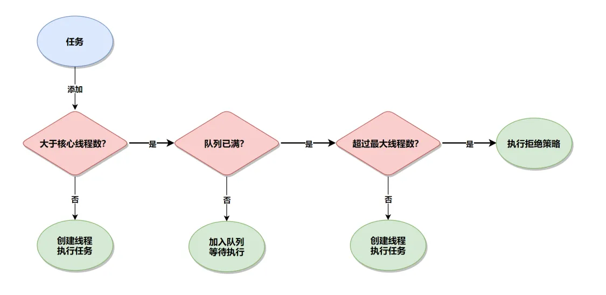

# 线程安全

## 线程的实现

实现线程主要有三种方式：使用内核线程实现（1：1实现），使用用户线程实现（1：N实现），使用用户线程加轻量级进程混合实现（N：M实现）。

1.内核线程实现

使用内核线程实现的方式也被称为1：1实现。内核线程（Kernel-Level Thread，KLT）就是直接由操作系统内核（Kernel，下称内核）支持的线程，这种线程由内核来完成线程切换，内核通过操纵调度器（Scheduler）对线程进行调度，并负责将线程的任务映射到各个处理器上。每个内核线程可以视为内核的一个分身，这样操作系统就有能力同时处理多件事情，支持多线程的内核就称为多线程内核（Multi-Threads Kernel）。

程序一般不会直接使用内核线程，而是使用内核线程的一种高级接口——轻量级进程（Light Weight Process，LWP），轻量级进程就是我们通常意义上所讲的线程，由于每个轻量级进程都由一个内核线程支持，因此只有先支持内核线程，才能有轻量级进程。这种轻量级进程与内核线程之间1：1的关系称为一对一的线程模型。

于内核线程的支持，每个轻量级进程都成为一个独立的调度单元，即使其中某一个轻量级进程在系统调用中被阻塞了，也不会影响整个进程继续工作。轻量级进程也具有它的局限性：首先，由于是基于内核线程实现的，所以各种线程操作，如创建、析构及同步，都需要进行系统调用。而系统调用的代价相对较高，需要在用户态（User Mode）和内核态（Kernel Mode）中来回切换。其次，每个轻量级进程都需要有一个内核线程的支持，因此轻量级进程要消耗一定的内核资源（如内核线程的栈空间），因此一个系统支持轻量级进程的数量是有限的。

这种映射到操作系统上的线程天然的缺陷是切换、调度成本高昂，系统能容纳的线程数量也很有限。

2.用户线程实现

使用用户线程实现的方式被称为1：N实现。广义上来讲，一个线程只要不是内核线程，都可以认为是用户线程（User Thread，UT）的一种，因此从这个定义上看，轻量级进程也属于用户线程，但轻量级进程的实现始终是建立在内核之上的，许多操作都要进行系统调用，因此效率会受到限制，并不具备通常意义上的用户线程的优点。

而狭义上的用户线程指的是完全建立在用户空间的线程库上，系统内核不能感知到用户线程的存在及如何实现的。用户线程的建立、同步、销毁和调度完全在用户态中完成，不需要内核的帮助。如果程序实现得当，这种线程不需要切换到内核态，因此操作可以是非常快速且低消耗的，也能够支持规模更大的线程数量，部分高性能数据库中的多线程就是由用户线程实现的。这种进程与用户线程之间1：N的关系称为一对多的线程模型。

用户线程的优势在于不需要系统内核支援，劣势也在于没有系统内核的支援，所有的线程操作都需要由用户程序自己去处理。线程的创建、销毁、切换和调度都是用户必须考虑的问题，而且由于操作系统只把处理器资源分配到进程，那诸如“阻塞如何处理”“多处理器系统中如何将线程映射到其他处理器上”这类问题解决起来将会异常困难，甚至有些是不可能实现的。因为使用用户线程实现的程序通常都比较复杂，除了有明确的需求外（譬如以前在不支持多线程的操作系统中的多线程程序、需要支持大规模线程数量的应用），一般的应用程序都不倾向使用用户线程。Java、Ruby等语言都曾经使用过用户线程，最终又都放弃了使用它。但是近年来许多新的、以高并发为卖点的编程语言又普遍支持了用户线程，譬如Golang、Erlang等，使得用户线程的使用率有所回升。

3.混合实现

线程除了依赖内核线程实现和完全由用户程序自己实现之外，还有一种将内核线程与用户线程一起使用的实现方式，被称为N：M实现。在这种混合实现下，既存在用户线程，也存在轻量级进程。

用户线程还是完全建立在用户空间中，因此用户线程的创建、切换、析构等操作依然廉价，并且可以支持大规模的用户线程并发。而操作系统支持的轻量级进程则作为用户线程和内核线程之间的桥梁，这样可以使用内核提供的线程调度功能及处理器映射，并且用户线程的系统调用要通过轻量级进程来完成，这大大降低了整个进程被完全阻塞的风险。在这种混合模式中，用户线程与轻量级进程的数量比是不定的，是N：M的关系。

4.Java线程的实现

以HotSpot为例，它的每一个Java线程都是直接映射到一个操作系统原生线程来实现的，而且中间没有额外的间接结构，所以HotSpot自己是不会去干涉线程调度的（可以设置线程优先级给操作系统提供调度建议），全权交给底下的操作系统去处理，所以何时冻结或唤醒线程、该给线程分配多少处理器执行时间、该把线程安排给哪个处理器核心去执行等，都是由操作系统完成的，也都是由操作系统全权决定的。

### Java线程调度

线程调度是指系统为线程分配处理器使用权的过程，调度主要方式有两种，分别是协同式（Cooperative Threads-Scheduling）线程调度和抢占式（Preemptive Threads-Scheduling）线程调度。如果使用协同式调度的多线程系统，线程的执行时间由线程本身来控制，线程把自己的工作执行完了之后，要主动通知系统切换到另外一个线程上去。协同式多线程的最大好处是实现简单，而且由于线程要把自己的事情干完后才会进行线程切换，切换操作对线程自己是可知的，所以一般没有什么线程同步的问题。Lua语言中的“协同例程”就是这类实现。它的坏处也很明显：线程执行时间不可控制，甚至如果一个线程的代码编写有问题，一直不告知系统进行线程切换，那么程序就会一直阻塞在那里。

如果使用抢占式调度的多线程系统，那么每个线程将由系统来分配执行时间，线程的切换不由线程本身来决定。譬如在Java中，有Thread::yield()方法可以主动让出执行时间，但是如果想要主动获取执行时间，线程本身是没有什么办法的。在这种实现线程调度的方式下，线程的执行时间是系统可控的，也不会有一个线程导致整个进程甚至整个系统阻塞的问题。Java使用的线程调度方式就是抢占式调度。

Java语言一共设置了10个级别的线程优先级。在两个线程同时处于Ready状态时，优先级越高的线程越容易被系统选择执行。

不过，线程优先级并不是一项稳定的调节手段，很显然因为主流虚拟机上的Java线程是被映射到系统的原生线程上来实现的，所以线程调度最终还是由操作系统说了算。

### Java与协程

内核线程的调度成本主要来自于用户态与核心态之间的状态转换，而这两种状态转换的开销主要来自于响应中断、保护和恢复执行现场的成本。

由于最初多数的用户线程是被设计成协同式调度（Cooperative Scheduling）的，所以它有了一个别名——“协程”（Coroutine）。又由于这时候的协程会完整地做调用栈的保护、恢复工作，所以今天也被称为“有栈协程”（Stackfull Coroutine），起这样的名字是为了便于跟后来的“无栈协程”（Stackless Coroutine）区分开。

协程的主要优势是轻量，无论是有栈协程还是无栈协程，都要比传统内核线程要轻量得多。

协程当然也有它的局限，需要在应用层面实现的内容（调用栈、调度器这些）特别多。

### 虚拟线程

Java 中的虚拟线程，也叫做协程或“轻量级线程”，它诞生于 JDK 19（预览 API），正式发布于 JDK 21，它是一种在 Java 虚拟机（JVM）层面实现的逻辑线程，不直接和操作系统的物理线程一一对应，因此它可以减少上下文切换所带来的性能开销。

操作系统线程、普通线程（Java 线程）和虚拟线程的关系如下：


虚拟线程的创建方式，主要有以下 4 种：

1. Thread.startVirtualThread(Runnable task)：创建虚拟线程，并直接启动执行任务
2. Thread.ofVirtual().unstarted(Runnable task)：只创建虚拟线程，但不直接启动
3. Thread.ofVirtual().factory()：先创建虚拟线程工厂，然后再使用工厂创建虚拟线程，之后再调用 start() 方法进行执行
4. Executors.newVirtualThreadPerTaskExecutor()：使用线程池的方式创建虚拟线程

虚拟线程和普通线程的区别主要体现在以下几点：

1. 普通线程是和操作系统的物理线程是一一对应的，而虚拟线程是 JVM 层面的逻辑线程，并不和操作系统的物理线程一一对应，它可以看作是轻量级的线程。
2. 普通线程默认创建的是用户线程（守护线程），而虚拟线程是守护线程，并且其守护线程的属性不能被修改，如果修改就会报错。
3. 虚拟线程由 JVM 调度和使用，避免了普通线程频繁切换的性能开销，所以相比于普通的线程来说，运行效率更高。

Java进程中每一个线程都对应着一个Thread实例。线程的描述信息在Thread的实例属性中得到保存，供JVM进行线程管理和调度时使用。

> 虽然一个进程有很多个线程，但是在一个CPU内核上，同一时刻只能有一个线程是正在执行的，该线程也被叫作当前线程。

线程创建方法：

- 继承 Thread 类创建线程类
- 实现 Runnable 接口创建线程目标类
- 使用 Callable 和 FutureTask 创建线程
- 通过线程池创建线程

### 线程安全

什么是线程安全呢？当多个线程并发访问某个Java对象（Object）时，无论系统如何调度这些线程， 也不论这些线程如何交替操作， 这个对象都能表现出一致的、 正确的行为， 那么对这个对象的操作是线程安全的。 如果这个对象表现出不一致的、 错误的行为， 那么对这个对象的操作不是线程安全的，发生了线程的安全问题。

- 自增运算不是线程安全的。实际上，一个自增运算符是一个复合操作，至少包括三个JVM指令：“内存取值”“寄存器增加1”“存值到内存”。这三个指令在JVM内部是独立进行的，中间完全可能会出现多个线程并发进行。
- 临界区资源与临界区代码段。临界区资源表示一种可以被多个线程使用的公共资源或共享数据，但是每一次只能有一个线程使用它。一旦临界区资源被占用，想使用该资源的其他线程则必须等待。

如果多个线程在临界区代码段的并发执行结果可能因为代码的执行顺序不同而出现不同的结果，我们就说这时在临界区出现了**竞态条件**问题。

为了避免竞态条件的问题，我们必须保证临界区代码段操作必须具备排他性。这就意味着当一个线程进入Critical Section执行时，其他线程不能进入临界区代码段执行。

在Java中，我们可以使用synchronized关键字同步代码块，对临界区代码段进行排他性保护。此外，还可以使用Lock显式锁实例，或者使用原子变量（Atomic Variables）对临界区代码段进行排他性保护。 

#### Java语言中的线程安全

我们可以将Java语言中各种操作共享的数据分为以下五类：不可变、绝对线程安全、相对线程安全、线程兼容和线程对立。

#### 线程安全的实现方法

1.互斥同步

**synchronized**

synchronized关键字经过Javac编译之后，会在同步块的前后分别形成monitorenter和monitorexit这两个字节码指令。这两个字节码指令都需要一个reference类型的参数来指明要锁定和解锁的对象。如果Java源码中的synchronized明确指定了对象参数，那就以这个对象的引用作为reference；如果没有明确指定，那将根据synchronized修饰的方法类型（如实例方法或类方法），来决定是取代码所在的对象实例还是取类型对应的Class对象来作为线程要持有的锁。

根据《Java虚拟机规范》的要求，在执行monitorenter指令时，首先要去尝试获取对象的锁。如果这个对象没被锁定，或者当前线程已经持有了那个对象的锁，就把锁的计数器的值增加一，而在执行monitorexit指令时会将锁计数器的值减一。

一旦计数器的值为零，锁随即就被释放了。如果获取对象锁失败，那当前线程就应当被阻塞等待，直到请求锁定的对象被持有它的线程释放为止。

根据以上《Java虚拟机规范》对monitorenter和monitorexit的行为描述，我们可以得出两个关于synchronized的直接推论

- 被synchronized修饰的同步块对同一条线程来说是可重入的。这意味着同一线程反复进入同步块也不会出现自己把自己锁死的情况。
- 被synchronized修饰的同步块在持有锁的线程执行完毕并释放锁之前，会无条件地阻塞后面其他线程的进入。这意味着无法像处理某些数据库中的锁那样，强制已获取锁的线程释放锁；也无法强制正在等待锁的线程中断等待或超时退出。

从执行成本的角度看，持有锁是一个重量级（Heavy-Weight）的操作。虚拟机本身也会进行一些优化，譬如在通知操作系统阻塞线程之前加入一段自旋等待过程，以避免频繁地切入核心态之中。


**ReentrantLock**

与synchronized相比增加了一些高级功能，主要有以下三项：等待可中断、可实现公平锁及锁可以绑定多个条件。

当JDK 6中加入了大量针对synchronized锁的优化措施，相同的测试中就发现synchronized与ReentrantLock的性能基本上能够持平。

推荐在synchronized与ReentrantLock都可满足需要时优先使用synchronized：

- synchronized是在Java语法层面的同步，足够清晰，也足够简单。每个Java程序员都熟悉synchronized，但J.U.C中的Lock接口则并非如此。因此在只需要基础的同步功能时，更推荐synchronized。
- Lock应该确保在finally块中释放锁，否则一旦受同步保护的代码块中抛出异常，则有可能永远不会释放持有的锁。这一点必须由程序员自己来保证，而使用synchronized的话则可以由Java虚拟机来确保即使出现异常，锁也能被自动释放。
- 尽管在JDK 5时代ReentrantLock曾经在性能上领先过synchronized，但这已经是十多年之前的胜利了。从长远来看，Java虚拟机更容易针对synchronized来进行优化，因为Java虚拟机可以在线程和对象的元数据中记录synchronized中锁的相关信息，而使用J.U.C中的Lock的话，Java虚拟机是很难得知具体哪些锁对象是由特定线程锁持有的。

**synchronized 和 Lock 区别**

synchronized 可用来修饰普通方法、静态方法和代码块，当一个线程访问一个被 synchronized 修饰的方法或者代码块时，会自动获取该对象的锁，其他线程将会被阻塞，直到该线程执行完毕并释放锁。这样就保证了多个线程对共享资源的操作的互斥性，从而避免了数据的不一致性和线程安全问题。

Lock 是一种线程同步的机制，它与 synchronized 相似，可以用于控制对共享资源的访问。相比于 synchronized，Lock 的特点在于更加灵活，支持更多的操作。 

相比于 synchronized，Lock 的优点在于：

- 粒度更细：synchronized 关键字只能对整个方法或代码块进行同步，而 Lock 可以对单个变量或对象进行同步。
- 支持公平锁：synchronized 不支持公平锁，而 Lock 可以通过构造函数指定锁是否是公平锁。
- 支持多个条件变量：Lock 可以创建多个条件变量，即多个等待队列。

synchronized 和 Lock 主要的区别有以下几个方面：

1. 锁的获取方式：synchronized 是隐式获取锁的，即在进入 synchronized 代码块或方法时自动获取锁，退出时自动释放锁；而 Lock 需要程序显式地获取锁和释放锁，即需要调用 lock() 方法获取锁，调用 unlock() 方法释放锁。
2. 锁的性质：synchronized 是可重入的互斥锁，即同一个线程可以多次获得同一把锁，而且锁的释放也只能由获得锁的线程来释放；Lock 可以是可重入的互斥锁，也可以是非可重入的互斥锁，还可以是读写锁。
3. 锁的粒度：synchronized 是以代码块和方法为单位进行加锁和解锁，而 Lock 可以精确地控制锁的范围，可以支持多个条件变量。
4. 性能：在低并发的情况下，synchronized 的性能优于 Lock，因为 Lock 需要显式地获取和释放锁，而 synchronized 是在 JVM 层面实现的；在高并发的情况下，Lock 的性能可能优于 synchronized，因为 Lock 可以更好地支持高并发和读写分离的场景。

总的来说，synchronized 的使用更加简单，但是在某些场景下会受到性能的限制；而 Lock 则更加灵活，可以更精确地控制锁的范围和条件变量，但是使用起来比较繁琐。需要根据具体的业务场景和性能需求来选择使用哪种锁机制。

2.非阻塞同步

互斥同步面临的主要问题是进行线程阻塞和唤醒所带来的性能开销，因此这种同步也被称为阻塞同步。

解决问题的方式上看，互斥同步属于一种悲观的并发策略，其总是认为只要不去做正确的同步措施（例如加锁），那就肯定会出现问题，无论共享的数据是否真的会出现竞争，它都会进行加锁（这里讨论的是概念模型，实际上虚拟机会优化掉很大一部分不必要的加锁），这将会导致用户态到核心态转换、维护锁计数器和检查是否有被阻塞的线程需要被唤醒等开销。


随着硬件指令集的发展，我们已经有了另外一个选择：基于冲突检测的乐观并发策略，通俗地说就是不管风险，先进行操作，如果没有其他线程争用共享数据，那操作就直接成功了；如果共享的数据的确被争用，产生了冲突，那再进行其他的补偿措施，最常用的补偿措施是不断地重试，直到出现没有竞争的共享数据为止。这种乐观并发策略的实现不再需要把线程阻塞挂起，因此这种同步操作被称为非阻塞同步（Non-Blocking Synchronization），使用这种措施的代码也常被称为无锁（Lock-Free）编程。


为什么笔者说使用乐观并发策略需要“硬件指令集的发展”？因为我们必须要求操作和冲突检测这两个步骤具备原子性。靠什么来保证原子性？如果这里再使用互斥同步来保证就完全失去意义了，所以我们只能靠硬件来实现这件事情，硬件保证某些从语义上看起来需要多次操作的行为可以只通过一条处理器指令就能完成，这类指令常用的有：

- 测试并设置（Test-and-Set）；
- 获取并增加（Fetch-and-Increment）；
- 交换（Swap）；
- 比较并交换（Compare-and-Swap，下文称CAS）；
- 加载链接/条件储存（Load-Linked/Store-Conditional，下文称LL/SC）。

**CAS**

Java里最终暴露出来的是CAS操作。在JDK 5之后，Java类库中才开始使用CAS操作，该操作由sun.misc.Unsafe类里面的compareAndSwapInt()和compareAndSwapLong()等几个方法包装提供。HotSpot虚拟机在内部对这些方法做了特殊处理，即时编译出来的结果就是一条平台相关的处理器CAS指令，没有方法调用的过程，或者可以认为是无条件内联进去了


**ABA 问题**

存在一个逻辑漏洞：如果一个变量V初次读取的时候是A值，并且在准备赋值的时候检查到它仍然为A值，那就能说明它的值没有被其他线程改变过了吗？这是不能的，因为如果在这段期间它的值曾经被改成B，后来又被改回为A，那CAS操作就会误认为它从来没有被改变过。这个漏洞称为CAS操作的“ABA问题”。J.U.C包为了解决这个问题，提供了一个带有标记的原子引用类AtomicStampedReference，它可以通过控制变量值的版本来保证CAS的正确性。不过目前来说这个类处于相当鸡肋的位置，大部分情况下ABA问题不会影响程序并发的正确性，如果需要解决ABA问题，改用传统的互斥同步可能会比原子类更为高效。

3.无同步方案

要保证线程安全，也并非一定要进行阻塞或非阻塞同步，同步与线程安全两者没有必然的联系。同步只是保障存在共享数据争用时正确性的手段，如果能让一个方法本来就不涉及共享数据，那它自然就不需要任何同步措施去保证其正确性，因此会有一些代码天生就是线程安全的。

- 可重入代码（Reentrant Code）：不依赖全局变量、存储在堆上的数据和公用的系统资源，用到的状态量都由参数中传入，不调用非可重入的方法等。如果一个方法的返回结果是可以预测的，只要输入了相同的数据，就都能返回相同的结果，那它就满足可重入性的要求，当然也就是线程安全的。
- 线程本地存储（Thread Local Storage）：如果一段代码中所需要的数据必须与其他代码共享，那就看看这些共享数据的代码是否能保证在同一个线程中执行。如果能保证，我们就可以把共享数据的可见范围限制在同一个线程之内，这样，无须同步也能保证线程之间不出现数据争用的问题。Java 中使用 ThreadLocal。


**ThreadLocal**

### 死锁

死锁（Dead Lock）指的是两个或两个以上的运算单元（进程、线程或协程），互相持有对方所需的资源，导致它们都无法向前推进，从而导致永久阻塞的问题就是死锁。

比如线程 1 拥有了锁 A 的情况下试图获取锁 B，而线程 2 又在拥有了锁 B 的情况下试图获取锁 A，这样双方就进入相互阻塞等待的情况。

死锁的产生需要满足以下 4 个条件：

1. **互斥条件**：指运算单元（进程、线程或协程）对所分配到的资源具有排它性，也就是说在一段时间内某个锁资源只能被一个运算单元所占用。
2. **请求和保持条件**：指运算单元已经保持至少一个资源，但又提出了新的资源请求，而该资源已被其它运算单元占有，此时请求运算单元阻塞，但又对自己已获得的其它资源保持不放。
3. **不可剥夺条件**：指运算单元已获得的资源，在未使用完之前，不能被剥夺。
4. **环路等待条件**：指在发生死锁时，必然存在运算单元和资源的环形链，即运算单元正在等待另一个运算单元占用的资源，而对方又在等待自己占用的资源，从而造成环路等待的情况。

只有以上 4 个条件同时满足，才会造成死锁。

死锁的常用解决方案有以下两个：

1. 按照顺序加锁：尝试让所有线程按照同一顺序获取锁，从而避免死锁。
2. 设置获取锁的超时时间：尝试获取锁的线程在规定时间内没有获取到锁，就放弃获取锁，避免因为长时间等待锁而引起的死锁。

有一些工具可以帮助排查死锁问题，常见的工具有以下几个：

1. jstack：可以查看 Java 应用程序的线程状态和调用堆栈，可用于发现死锁线程的状态。
2. jconsole 和 JVisualVM：这些是 Java 自带的监视工具，可以用于监视线程、内存、CPU 使用率等信息，从而帮助排查死锁问题。
3. Thread Dump Analyzer（TDA）：是一个开源的线程转储分析器，可用于分析和诊断 Java 应用程序中的死锁问题。
4. Eclipse TPTP：是一个开源的性能测试工具平台，其中包含了一个名为 Thread Profiler 的工具，可以用于跟踪线程运行时的信息，从而诊断死锁问题。

### 锁优化

高效并发是从JDK 5升级到JDK 6后一项重要的改进项，HotSpot虚拟机开发团队在这个版本上花费了大量的资源去实现各种锁优化技术，如适应性自旋（Adaptive Spinning）、锁消除（Lock Elimination）、锁膨胀（Lock Coarsening）、轻量级锁（Lightweight Locking）、偏向锁（Biased Locking）等，这些技术都是为了在线程之间更高效地共享数据及解决竞争问题，从而提高程序的执行效率。

所以， 在JDK 1.6版本里内置锁一共有4种状态： 无锁状态、偏向锁状态、 轻量级锁状态和重量级锁状态， 这些状态随着竞争情况逐渐升级。 内置锁可以升级但不能降级， 意味着偏向锁升级成轻量级锁后不能降级成偏向锁。 这种能升级却不能降级的策略， 其目的是为了提高获得锁和释放锁的效率。


#### 自旋锁与自适应自旋

互斥同步对性能最大的影响是阻塞的实现，挂起线程和恢复线程的操作都需要转入内核态中完成，这些操作给Java虚拟机的并发性能带来了很大的压力。

如果物理机器有一个以上的处理器或者处理器核心，能让两个或以上的线程同时并行执行，我们就可以让后面请求锁的那个线程“稍等一会”，但不放弃处理器的执行时间，看看持有锁的线程是否很快就会释放锁。为了让线程等待，我们只须让线程执行一个忙循环（自旋），这项技术就是所谓的自旋锁。

自旋等待的时间必须有一定的限度，如果自旋超过了限定的次数仍然没有成功获得锁，就应当使用传统的方式去挂起线程。自旋次数的默认值是十次，用户也可以使用参数-XX：PreBlockSpin来自行更改。

在JDK 6中对自旋锁的优化，引入了自适应的自旋。自适应意味着自旋的时间不再是固定的了，而是由前一次在同一个锁上的自旋时间及锁的拥有者的状态来决定的。

#### 锁消除

锁消除是指虚拟机即时编译器在运行时，对一些代码要求同步，但是对被检测到不可能存在共享数据竞争的锁进行消除。锁消除的主要判定依据来源于逃逸分析的数据支持，如果判断到一段代码中，在堆上的所有数据都不会逃逸出去被其他线程访问到，那就可以把它们当作栈上数据对待，认为它们是线程私有的，同步加锁自然就无须再进行。

```java
public String concatString(String s1, String s2, String s3) {
		return s1 + s2 + s3;
}
```

在JDK 5之前，字符串加法会转化为StringBuffer对象的连续append()操作，在JDK 5及以后的版本中，会转化为StringBuilder对象的连续append()操作。

```java
public String concatString(String s1, String s2, String s3) {
    StringBuffer sb = new StringBuffer();
    sb.append(s1);
    sb.append(s2);
    sb.append(s3);
    return sb.toString();
}
```

每个StringBuffer.append()方法中都有一个同步块，锁就是sb对象。虚拟机观察变量sb，经过逃逸分析后会发现它的动态作用域被限制在concatString()方法内部。也就是sb的所有引用都永远不会逃逸到concatString()方法之外，其他线程无法访问到它，所以这里虽然有锁，但是可以被安全地消除掉。在解释执行时这里仍然会加锁，但在经过服务端编译器的即时编译之后，这段代码就会忽略所有的同步措施而直接执行。这就是为什么在JDK 5及以后的版本中，会转化为StringBuilder对象的连续append()操作。

#### 锁膨胀

原则上，我们在编写代码的时候，总是推荐将同步块的作用范围限制得尽量小——只在共享数据的实际作用域中才进行同步，这样是为了使得需要同步的操作数量尽可能变少，即使存在锁竞争，等待锁的线程也能尽可能快地拿到锁。

大多数情况下，上面的原则都是正确的，但是如果一系列的连续操作都对同一个对象反复加锁和解锁，甚至加锁操作是出现在循环体之中的，那即使没有线程竞争，频繁地进行互斥同步操作也会导致不必要的性能损耗。

如果虚拟机探测到有这样一串零碎的操作都对同一个对象加锁，将会把加锁同步的范围扩展（粗化）到整个操作序列的外部，这样只需要加锁一次就可以了。

#### 偏向锁

偏向锁是指一段同步代码一直被同一个线程所访问，那么该线程会自动获取锁，永远不需要再进行同步。 如果内置锁处于偏向状态，一旦出现另外一个线程去尝试获取这个锁的情况，偏向模式就马上宣告结束。

JDK 6起HotSpot虚拟机默认启用偏向锁。

当锁对象第一次被线程获取的时候，虚拟机将会把对象头中的标志位设置为“01”、把偏向模式设置为“1”，表示进入偏向模式。同时使用CAS操作把获取到这个锁的线程的ID记录在对象的Mark Word之中。如果CAS操作成功，持有偏向锁的线程以后每次进入这个锁相关的同步块时，虚拟机都可以不再进行任何同步操作。

如果程序中大多数的锁都总是被多个不同的线程访问，那偏向模式就是多余的。在具体问题具体分析的前提下，有时候使用参数 `-XX：-UseBiasedLocking`来禁止偏向锁优化反而可以提升性能。

#### 轻量级锁

当有两个线程开始竞争这个锁对象时，情况发生变化了，不再是偏向（独占）锁了，锁会升级为轻量级锁，两个线程公平竞争，哪个线程先占有锁对象，锁对象的Mark Word就指向哪个线程的栈帧中的锁记录。

当锁处于偏向锁又被另一个线程所企图抢占时，偏向锁就会升级为轻量级锁。企图抢占的线程会通过自旋的形式尝试获取锁，不会阻塞抢锁线程，以便提高性能。

**自旋原理**非常简单，如果持有锁的线程能在很短时间内释放锁资源，那么那些等待竞争锁的线程就不需要做内核态和用户态之间的切换进入阻塞挂起状态， 它们只需要等一等 （自旋） ， 等持有锁的线程释放锁后即可立即获取锁，这样就避免用户线程和内核切换的消耗。

但是，线程自旋是需要消耗 CPU的，如果一直获取不到锁，那线程也不能一直占用CPU自旋做无用功，所以需要设定一个自旋等待的最大时间。JVM对于自旋周期的选择，JDK 1.6之后引入了适应性自旋锁， 适应性自旋锁意味着自旋的时间不是固定的， 而是由前一次在同一个锁上的自旋时间以及锁的拥有者的状态来决定的。 线程如果自旋成功了， 下次自旋的次数就会更多， 如果自旋失败了，自旋的次数就会减少。

如果持有锁的线程执行的时间超过自旋等待的最大时间仍没有释放锁，就会导致其他争用锁的线程在最大等待时间内还是获取不到锁， 自旋不会一直持续下去， 这时争用线程会停止自旋进入阻塞状态，该锁膨胀为重量级锁。

轻量级锁能提升程序同步性能的依据是“对于绝大部分的锁，在整个同步周期内都是不存在竞争的”这一经验法则。如果没有竞争，轻量级锁便通过CAS操作成功避免了使用互斥量的开销；但如果确实存在锁竞争，除了互斥量的本身开销外，还额外发生了CAS操作的开销。因此在有竞争的情况下，轻量级锁反而会比传统的重量级锁更慢。

#### 重量级锁

重量级锁会让其他申请的线程之间进入阻塞，性能降低。重量级锁也就叫同步锁，这个锁对象Mark Word再次发生变化，会指向一个监视器对象，该监视器对象用集合的形式来登记和管理排队的线程。

###锁原理

#### 偏向锁的原理与实战

##### 偏向锁的核心原理

在实际场景中，如果一个同步块（或方法）没有多个线程竞争，而且总是由同一个线程多次重入获取锁， 如果每次还有阻塞线程， 唤醒CPU从用户态转核心态， 那么对于CPU是一种资源的浪费，为了解决这类问题，就引入了偏向锁的概念。

偏向锁的核心原理是：如果不存在线程竞争的一个线程获得了锁，那么锁就进入偏向状态，此 时 Mark Word的 结 构变 为 偏 向 锁结 构 ， 锁 对象 的 锁 标 志位 （ lock） 被 改为 01， 偏 向标 志 位（biased_lock）被改为1，然后线程的ID记录在锁对象的Mark Word中（使用CAS操作完成）。以后该线程获取锁的时候判断一下线程ID和标志位， 就可以直接进入同步块， 连CAS操作都不需要， 这样就省去了大量有关锁申请的操作，从而也就提升了程序的性能。

偏向锁的核心思想是， 如果一个线程获得了锁， 那么锁就进入偏向模式， 此时Mark Word的结构也变为偏向锁结构。 当这个线程再次请求锁时， 无需再作任何同步操作， 即获取锁的过程， 这样就省去了大量有关锁申请的操作，从而也就提升了程序的性能。经过研究发现，在大多数情况下，锁不仅不存在多线程竞争， 而且总是由同一线程多次获得锁， 因此， 在大多数情况下偏向锁是能提升性能的。

> 从JDK 1.6开始，虽然JVM默认开启偏向锁，但是默认延时4秒开启。也就是说，程序刚启动创建的对象是不会开启偏向锁的，4秒后创建的对象才会开启偏向锁的。

偏向锁的主要作用是消除无竞争情况下的系统底层的同步操作，进一步提升程序性能，所以在没有锁竞争的场合， 偏向锁有很好的优化效果。 但是，一旦有第二个线程需要竞争锁， 那么偏向模式立即结束，进入轻量级锁的状态。

假如在大部分情况同步块是没有竞争的，那么可以通过偏向来提高性能。即在无竞争时，之前获得锁的线程再次获得锁时会判断偏向锁的线程ID是否指向自己，如果是，那么该线程将不用再次获得锁， 直接就可以进入同步块； 如果未指向当前线程， 当前线程会采用CAS操作将Mark Word中线程ID设置为当前线程ID，如果CAS操作成功，那么获取偏向锁成功，去执行同步代码块，如果CAS操作失败， 那么表示有竞争， 抢锁线程被挂起， 撤销占锁线程的偏向锁， 然后将偏向锁膨胀为轻量级锁。

偏向锁的缺点：如果锁对象时常被多条线程竞争，偏向锁就是多余的，并且其撤销的过程会带来一些性能开销。


偏向锁的加锁过程为： 新线程只需要判断内置锁对象的Mark Word中的线程ID是不是自己的ID，如果是就直接使用这个锁， 而不用作CAS交换； 如果不是， 比如在第一次获得此锁时内置锁的线程ID为空，就使用CAS交换，新线程将自己的线程ID交换到内置锁的Mark Word中，如果交换成功，就加锁成功。

每执行一轮抢占，JVM内部都会比较内置锁的偏向线程ID与当前线程ID，如果匹配，就表明当前线程已经获得了偏向锁，当前线程可以快速进入临界区。所以，偏向锁的效率是非常高的。 总之， 偏向锁是针对一个线程而言的， 线程获得锁之后就不会再有解锁等操作了，这样可以省略很多开销。

虽然抢锁的线程已经结束， 但是ObjectLock实例的对象结构仍然记录了其之前的偏向线程ID，其锁状态还是偏向锁状态101。

##### 偏向锁的膨胀和撤销

假如有多个线程来竞争偏向锁，此对象锁已经有所偏向，其他的线程发现偏向锁并不是偏向自己，就说明存在了竞争，尝试撤销偏向锁（很可能引入安全点），然后膨胀到轻量级锁。

撤销偏向锁的条件：

1）多个线程竞争偏向锁。

2）调用偏向锁对象obj.的obj.hashCode()方法或者System.identityHashCode()方法计算对象的哈希码之后，偏向锁将被撤销。

为什么计算对象的哈希码时会撤销对象的偏向锁呢？因为偏向锁没有存储Mark Word备份信息的地方。换句话说，因为对于一个对象其哈希码只会生成一次并保存在Mark Word中，偏向锁对象的Mark Word已经保存了线程ID， 没有地方再保存哈希码时， 所以只能撤销偏向锁， 将Mark Word用于存放对象的哈希码。

偏向锁撤销的开销花费还是挺大的，其大概的过程如下：

1）JVM需要等待一个全局安全点（global safe point），当JVM到达全局安全点后，所有的用户线程都是暂停的，当然，此时持有偏向锁的用户线程也被暂停了。

2）遍历线程的栈帧，检查是否存在锁记录。如果存在锁记录，就需要清空锁记录，使其变成无锁状态，并修复锁记录指向的Mark Word，清除其线程ID。

3）将当前锁升级（或碰撞）成轻量级锁。少数场景直接升级为重量级锁。

4）唤醒当前线程。

所以，如果某些临界区存在两个及两个以上的线程竞争，那么偏向锁反而会降低性能。在这种情况下，可以在启动JVM时就把偏向锁的默认功能关闭。


**偏向锁的膨胀：**

如果偏向锁被占据，一旦有第二个线程争抢这个对象，因为偏向锁不会主动释放，所以第二个线程可以看到内置锁偏向状态， 这时表明在这个对象锁上已经存在竞争了。 JVM检查原来持有该对象锁的占有线程是否依然存活， 如果挂了， 就可以将对象变为无锁状态， 然后进行重新偏向， 偏向为抢锁线程。

如果JVM检查到原来的线程依然存活，就表明原来的线程还在使用偏执锁，发生锁竞争，撤销原来的偏向锁，将偏向锁膨胀（INFLATING）为轻量级锁。

经验表明，其实大部分情况下进入一个同步代码块的线程都会是同一个线程。这也是为什么JDK会引入偏向锁出现的原因。 所以， 总体来说， 使用偏向锁带来的好处还是大于偏向锁撤销和膨胀的所带来的代价。

**全局安全点原理和偏向锁撤销的性能问题**

有哪些场景需要让JVM进入到全局安全点呢？主要的场景如下：

- 垃圾回收。

- 偏向锁解除（Biased lock revocation）。

- 由于代码优化所引起的指令重排。

- 类重新定义（Class redefinition），如hot swap热部署、AOP的代码植入。

- Dump一个或者全部线程（threadDump）。

- Dump堆（heapDump）。

**偏向锁的撤销操作需要依赖JVM的全局安全点，从而会带来STW停顿**。如果偏向锁撤销操作发生频繁，会招来频繁的STW，从而导致严重的性能问题。

所以，**对于高并发应用来说，一般建议关闭偏向锁**。具体的方式：可以在启动命令中加上以下JVM参数：

-XX:-UseBiasedLocking

关闭偏向锁之后，Java内置锁默认会进入轻量级锁状态。


#### 轻量级锁的原理与实战

引入轻量级锁的主要目的是在多线程竞争不激烈的情况下，**通过CAS机制竞争锁减少重量级锁产生的性能损耗**。 重量级锁使用了操作系统底层的互斥锁（Mutex Lock） ， 会导致线程在用户态和核心态之间频繁切换，从而带来较大的性能损耗。

轻量锁存在的目的是尽可能不用动用操作系统层面的互斥锁，因为其性能会比较差。线程的阻塞和唤醒需要CPU从用户态转为核心态，频繁地阻塞和唤醒对CPU来说是一件负担很重的工作。同时我们可以发现， 很多对象锁的锁定状态只会持续很短的一段时间， 例如整数的自加操作， 在很短的时间内阻塞并唤醒线程显然不值得， 为此引入了轻量级锁。 轻量级锁是一种自旋锁， 因为JVM本身就是一个应用，所以希望在应用层面上通过自旋解决线程同步问题。

轻量级锁的执行过程：在抢锁线程进入临界区之前，如果内置锁（临界区的同步对象）没有被锁定， JVM首先将在抢锁线程的栈帧中建立一个锁记录 （Lock Record） ， 用于存储对象目前Mark Word的拷贝。

轻量级锁主要有两种：普通自旋锁和自适应自旋锁。

1。普通自旋锁

所谓普通自旋锁，就是指当有线程来竞争锁时，抢锁线程会在原地循环等待，而不是被阻塞，直到那个占有锁的线程释放锁之后，这个抢锁线程才可以获得锁。

默认情况下，自旋的次数为10次，用户可以通过-XX:PreBlockSpin选项来进行更改。

2. 自适应自旋锁

所谓自适应自旋锁，就是等待线程空循环的自旋次数并非是固定的，而是会动态地根据实际情况来改变自旋等待的次数， 自旋次数由前一次在同一个锁上的自旋时间及锁的拥有者的状态来决定。

> JDK 1.6的轻量级锁使用的是普通自旋锁，且需要使用-XX:+UseSpinning选项手工开启。
>
> JDK1.7后， 轻量级锁使用自适应自旋锁， JVM启动时自动开启， 且自旋时间由JVM自动控制。

轻量级锁也被称为非阻塞同步、乐观锁，因为这个过程并没有把线程阻塞挂起，而是让线程空循环等待。

轻量级锁的问题在哪里呢？虽然大部分临界区代码的执行时间都是很短的，但是也会存在执行得很慢的临界区代码。 临界区代码执行耗时较长， 在其执行期间其他线程都在原地自旋等待， 会空消耗CPU。 因此， 如果竞争这个同步锁的线程很多， 就会有多个线程在原地等待继续空循环消耗CPU（空自旋），这会带来很大的性能损耗。

轻量级锁本意是为了减少多线程进入操作系统底层的互斥锁（Mutex Lock）的概率，并不是要替代操作系统互斥锁。 所以， 在争用激烈的场景下， 轻量级锁会膨胀为基于操作系统内核互斥锁实现的重量级锁。

#### 重量级锁的原理与实战

在JVM中， 每个对象都关联一个监视器， 这里的对象包含了Object实例和Class实例。 监视器是一个同步工具， 相当于一个许可证， 拿到许可证的线程即可以进入临界区进行操作， 没有拿到则需要阻塞等待。 重量级锁通过监视器的方式保障了任何时间只允许一个线程通过受到监视器保护的临界区代码。

由于JVM轻量级锁使用CAS进行自旋抢锁，这些CAS操作都处于用户态下，进程不存在用户态和内核态之间的运行切换，因此JVM轻量级锁开销较小。而JVM重量级锁使用了Linux内核态下的互斥锁（Mutex），这是重量级锁开销很大的原因。

#### 偏向锁、轻量级锁与重量级锁的对比

总结一下synchronized的执行过程，大致如下：

1）线程抢锁时，JVM首先检测内置锁对象Mark Word中biased_lock（偏向锁标识）是否设置成1，lock（锁标志位）是否为01，如果都满足，确认内置锁对象为可偏向状态。

2）在内置锁对象确认为可偏向状态之后，JVM检查Mark Word中线程ID是否为抢锁线程ID，如果是，就表示抢锁线程处于偏向锁状态，抢锁线程快速获得锁，开始执行临界区代码。

3）如果Mark Word中线程ID并未指向抢锁线程，就通过CAS操作竞争锁。如果竞争成功，就将Mark Word中线程ID设置为抢锁线程，偏向标志位设置为1，锁标志位设置为01，然后执行临界区代码，此时内置锁对象处于偏向锁状态。

4）如果CAS操作竞争失败，就说明发生了竞争，撤销偏向锁，进而升级为轻量级锁。

5）JVM使用CAS将锁对象的Mark Word替换为抢锁线程的锁记录指针，如果成功，抢锁线程就获得锁。 如果替换失败， 就表示其他线程竞争锁， JVM尝试使用CAS自旋替换抢锁线程的锁记录指针，如果自旋成功（抢锁成功），那么锁对象依然处于轻量级锁状态。

6）如果JVM的CAS替换锁记录指针自旋失败，轻量级锁膨胀为重量级锁，后面等待锁的线程也要进入阻塞状态。

总体来说，偏向锁是在没有发生锁争用的情况下使用；一旦有了第二个线程的争用锁，偏向锁就会升级为轻量级锁； 如果锁争用很激烈， 轻量级锁的CAS自旋到达阈值后， 轻量级锁就会升级为重量级锁。


## 进程与线程

么是进程呢？简单来说，进程是程序的一次启动执行。什么是程序呢？程序是存放在硬盘中的可执行文件， 主要包括代码指令和数据。一个进程是一个程序的一次启动和执行， 是操作系统将程序装入内存，给程序分配必要的系统资源，并且开始运行程序的指令。

**进程与程序是什么关系呢？**同一个程序可以多次启动， 对应多个进程。

一个进程由程序段、数据段和进程控制块三部分组成。

- 程序段一般也被称为代码段。代码段是进程的程序指令在内存中的位置，包含需要执行的指令集合；
-  数据段是进程的操作数据在内存中的位置， 包含需要操作的数据集合； 
- 程序控制块 （Program Control Block，PCB）包含进程的描述信息和控制信息，是进程存在的唯一标志。
  - 1）进程的描述信息。主要包括：进程ID和进程名称，进程ID是唯一的，代表进程的身份；进程的状态，比如运行、就绪、阻塞；进程优先级，是进程调度的重要依据。
  - 2）进程的调度信息。主要包括：程序起始地址，程序的第一行指令的内存地址，从这里开始程序的执行；通信信息，进程间通信时的消息队列。
  - 3）进程的资源信息。主要包括：内存信息，内存占用情况和内存管理所用的数据结构；I/O 设备信息，所用的I/O设备编号及相应数据结构；文件句柄，所打开文件的信息。
  - 4）进程上下文。主要包括执行时各种CPU寄存器的值、当前的程序计数器（PC）的值以及各种栈的值等， 即进程的环境。 在操作系统切换进程时， 当前进程被迫让出CPU， 当前进程的上下文就保存在PCB结构中，供下次恢复运行时使用。

现代操作系统中，进程是并发执行的，任何进程都可以同其他进程一起进行。在进程内部，代码段和数据段有自己的独立地址空间，不同进程的地址空间是相互隔离的。


线程可以看作是轻量级的进程，一个进程中包含了多个线程，因此多个线程间可以共享进程资源，线程和进程的关系如下图所示：


其中，堆和方法区是可以共享的区域，而程序计数器和栈是每个线程私有的。

- 程序计数器是一块内存区域，用来记录线程当前要执行的指令地址。
- 栈是用来记录每个线程自己的局部变量的。
- 堆中存放的是当前程序创建的所有对象。
- 方法区存放的是常量和静态变量等信息。

总的来说，进程和线程的区别主要有以下几点：

1. 进程是系统分配资源的基本单位；线程是程序执行的基本单位；
2. 进程拥有独立的内存空间和资源；而线程则共享进程的内存和资源；
3. 进程之间是相互独立，通信比较复杂；而线程之间可以直接共享数据；
4. 进程的切换代价比较大，需要保存上下文和状态；而线程的切换代价比较小，因为它们共享进程的资源。


## 线程的基本原理

线程是指“进程代码段”的一次的顺序执行流程。线程是CPU调度的最小单位。

一个进程可以有一个或多个线程， 各个线程之间共享进程的内存空间、 系统资源， 进程仍然是操作系统资源分配的最小单位。

Java程序的进程执行过程就是标准的多线程的执行过程。 每当使用Java命令执行一个class类时，实际上就是启动了一个JVM进程。理论上，在该进程的内部至少会启动两个线程，一个main线程，另一个是GC（垃圾回收）线程。实际上，执行一个Java程序后，通过Process Explorer来观察，线程数量远远不止两个，达到了18个之多。

一个标准的线程主要由三部分组成：

- 线程描述信息
  - 线程ID
  - 线程名称
  - 线程优先级
  - 线程状态
  - 其他。例如是否为守护线程等
- 程序计数器（Program Counter，PC）：它记录着线程下一条指令的代码段内存地址

- 栈内存。是代码段中局部变量的存储空间，为线程所独立拥有，在线程之间不共享。在JDK 1.8中，每个线程在创建时默认被分配1MB大小的栈内存。栈内存和堆内存不同，栈内存不受垃圾回收器管理。

在Java中，执行程序流程的重要单位是“方法”，而栈内存的分配的单位是“**栈帧**” （或者叫“方法帧”）。方法的每一次执行都需要为其分配一个栈帧（方法帧），栈帧主要保存该方法中的局部变量、 方法的返回地址以及其他方法的相关信息。 当线程的执行流程进入方法时， JVM就会为方法分配一个对应的栈帧压入栈内存； 当线程的执行流程跳出方法时， JVM就从栈内存弹出该方法的栈帧，此时方法栈帧的内存空间就会被回收，栈帧中的变量就会被销毁。

正是由于栈帧（方法帧）的操作是后进先出的模式，这也是标准的栈操作模式，所以存放方法帧的内存也被叫作**栈内存**。

## 线程的核心原理

### 线程的调度模型

目前操作系统中主流的线程调度方式是：基于CPU时间片方式进行线程调度。线程只有得到CPU时间片才能执行指令， 处于执行状态， 没有得到时间片的线程处于就绪状态， 等待系统分配下一个CPU时间片。 由于时间片非常短， 在各个线程之间快速地切换， 因此表现出来的特征是很多个线程在“同时执行”或者“并发执行”。

线程的调度模型目前主要分为两种：分时调度模型和抢占式调度模型。

1）**分时调度模型**：系统平均分配CPU的时间片，所有线程轮流占用CPU。分时调度模型在时间片调度的分配上，所有线程“人人平等”。

2）**抢占式调度模型**：系统按照线程优先级分配CPU时间片。优先级高的线程，优先分配CPU时间片， 如果所有就绪线程的优先级相同， 那么会随机选择一个， 优先级高的线程获取的CPU时间片相对多一些。

由于目前大部分操作系统都是使用抢占式调度模型进行线程调度， Java的线程管理和调度是委托给操作系统完成的，与之相对应，**Java的线程调度也是使用抢占式调度模型，因此Java的线程都有优先级**。


### 线程的优先级

1）整体而言，高优先级的线程获得的执行机会更多。在实例中可以看到：优先级在6级以上的线程和4级以下的线程执行机会明显偏多，整体对比非常明显。

2）执行机会的获取具有随机性，优先级高的不一定获得的机会多。

### 线程的生命周期

Java中的线程的生命周期分为6种状态。

```java
public static enum State {
  NEW, //新建
  RUNNABLE, //可执行：包含操作系统的就绪、运行两种状态
  BLOCKED, //阻塞
  WAITING, //等待
  TIMED
  WAITING, //计时等待
  TERMINATED; //终止
}
```

- NEW 状态：创建成功但是没有调用start()方法启动的Thread线程实例都处于NEW状态。当然，并不是Thread线程实例的start()方法一经调用，其状态就从NEW状态到RUNNABLE状态， 此时并不意味着线程立即获取CPU时间片并且立即执行， 中间需要一系列的操作系统内部操作。
- RUNNABLE 状态：Java把Ready（就绪）和Running（执行）两种状态合并为一种状态：RUNNABLE（可执行）状态（或者可运行状态）。NEW状态的Thread实例调用了start()方法后，线程的状态将变成RUNNABLE状态。尽管如此， 线程的run()方法不一定会马上被并发执行， 需要在线程获取了CPU时间片之后， 才会真正启动并发执行。
- TERMINATED 状态：处于RUNNABLE状态的线程在run()方法执行完成之后就变成终止状态TERMINATED了。当然， 如果在run()方法执行过程中发生了运行时异常而没有被捕获， run()方法将被异常终止， 线程也会变成TERMINATED状态。
- TIMED WAITING 限时等待状态：
  - 1）Thread.sleep(int n)：使得当前线程进入限时等待状态，等待时间为n毫秒。
  - 2）Object.wait()：带时限的抢占对象的monitor锁。
  - 3）Thread.join()：带时限的线程合并。
  - 4）LockSupport.parkNanos()：让线程等待，时间以纳秒为单位。
  - 5）LockSupport.parkUntil()：让线程等待，时间可以灵活设置。

## 线程基本操作

### 线程的 sleep 操作

sleep的作用是让目前正在执行的线程休眠，让CPU去执行其他的任务。从线程状态来说，就是从执行状态变成限时阻塞状态。

sleep()方法会有InterruptException受检异常抛出，如果调用了sleep()方法，就必须进行异常审查，捕获InterruptedException异常，或者再次通过方法声明存在InterruptedException异常。

当线程睡眠时间满后，线程不一定会立即得到执行，因为此时CPU可能正在执行其他的任务，线程首先是进入就绪状态，等待分配CPU时间片以便有机会执行。

### 线程的 interrupt 操作

Java将Thread的stop()方法设置为过时。在程序中， 我们是不能随便中断一个线程的， 我们无法知道这个线程正运行在什么状态， 它可能持有某把锁， 强行中断线程可能导致锁不能被释放的问题； 或者线程可能在操作数据库，强行中断线程可能导致数据不一致的问题。正是由于使用stop()方法来终止线程可能会产生不可预料的结果，因此并不推荐调用stop()方法。

Thread的interrupt()方法，此方法本质不是用来中断一个线程，而是将线程设置为中断状态。

当我们调用线程的interrupt()方法时，它有两个作用：

- 1）如果此线程处于阻塞状态（如调用了Object.wait()方法），就会立马退出阻塞，并抛出 InterruptedException异常， 线程就可以通过捕获InterruptedException来做一定的处理， 然后让线程退出。更确切地说，如果线程被Object.wait()、Thread.join()和Thread.sleep()三种方法之一阻塞，此时调用该线程的interrupt()方法，该线程将抛出一个InterruptedException中断异常（该线程必须事先预备好处理此异常），从而过早终结被阻塞状态。

- 2）如果此线程正处于运行中，线程就不受任何影响，继续运行，仅仅是线程的中断标记被设置为true。所以，程序可以在适当的位置通过调用isInterrupted()方法来查看自己是否被中断，并执行退出操作。

> 如果线程的interrupt()方法先被调用， 然后线程开始调用阻塞方法进入阻塞状态，InterruptedException异常依旧会抛出。 如果线程捕获InterruptedException异常后， 继续调用阻塞方法，将不再触发InterruptedException异常。

Thread.interrupt()方法并不像Thread.stop()方法那样中止一个正在运行的线程， 其作用是设置线程的中断状态位（为true），至于线程是死亡、等待新的任务还是继续运行至下一步，就取决于这个程序本身。 线程可以不时地检测这个中断标示位， 以判断线程是否应该被中断 （中断标示值是否为true）。总之，Thread.interrupt()方法只是改变中断状态，不会中断一个正在运行的线程，线程是否停止执行，需要用户程序去监视线程的isInterrupted()状态，并进行相应的处理。

### 线程的 join 操作

线程A需要线程B的执行流程合并到自己的执行流程中（至少表面如此），这就是线程合并，被动方线程B可以叫作被合并线程。这个例子中线程A合并线程B的伪代码大致为：

```java
class ThreadA extends Thread{
  void run(){
    Thread threadb = new Thread("thread-b");
    threadb.join();
  }
}
```

Join()方法是Thread类的一个实例方法，有三个重载版本：

```java
//重载版本1：此方法会把当前线程变为WAITING，直到被合并线程执行结束
public final void join() throws InterruptedException：

//重载版本2： 此方法会把当前线程变为TIMED WAITING， 直到被合并线程结束， 或者等待被合并线程执行millis的时间
public final synchronized void join(long millis) throws InterruptedException：

//重载版本3：此方法会把当前线程变为TIMED WAITING，直到被合并线程结束，或者等待被合并线程执行 millis+nanos的时间
public final synchronized void join(long millis, int nanos) throws InterruptedException
```

调用join()方法的要点：

1）join()方法是实例方法，需要使用被合并线程的句柄（或者指针、变量）去调用，如threadb.join()。 执行threadb.join()这行代码的当前线程为合并线程 （甲方） ， 进入TIMED WAITING 等待状态，让出CPU。

2）如果设置了被合并线程的执行时间millis（或者millis+nanos），并不能保证当前线程一定 会在millis时间后变为RUNNABLE。

3）如果主动方合并线程在等待时被中断，就会抛出InterruptedException受检异常。


线程的WAITING （等待） 状态表示线程在等待被唤醒。 处于WAITING状态的线程不会被分配CPU时间片。执行以下两个操作，当前线程将处于WAITING状态：

1） 执行没有时限 （timeout） 参数的thread.join()调用： 在线程合并场景中， 若线程A调用B.join()去合入B线程，则在B执行期间线程A处于WAITING状态，一直等线程B执行完成。

2）执行没有时限参数的object.wait()调用：指一个拥有object对象锁的线程，进入到相应的代码临界区后， 调用相应的object的wait()方法去等待其 “对象锁” （Object Monitor） 上的信号， 若 “对象锁”上没有信号，则当前线程处于WAITING状态


线程的TIMEDWAITING状态表示在等待唤醒。处于TIMEDWAITING状态的线程不会被分配CPU时间片，它们要等待被唤醒，或者直到等待的时限到期。

在线程合入场景中，若线程A在调用B.join()操作时加入了时限参数，则在B执行期间线程A处与 WAITING状态。 若B在等待时限内没有返回， 则线程A结束等待TIMED WAITING状态，恢复成RUNNABLE状态。

### 线程的 yield 操作

线程的yield（让步）操作的作用是让目前正在执行的线程放弃当前的执行，让出CPU的执行权限， 使得CPU去执行其他的线程。 处于让步状态的JVM层面的线程状态仍然是RUNNABLE状态，但是该线程所对应的操作系统层面的线程从状态上来说会从执行状态变成就绪状态。线程在yield时，线程放弃和重占CPU的时间是不确定的，可能是刚刚放弃CPU，马上又获得CPU执行权限，重新开始执行。

yield()方法是Thread类提供的一个静态方法，它可以让当前正在执行的线程暂停，但它不会阻塞该线程， 只是让线程转入就绪状态。 yield只是让当前线程暂停一下， 让系统的线程调度器重新调度一次。

总结起来，Thread.yield()方法有以下特点：

1）yield仅能使一个线程从运行状态转到就绪状态，而不是阻塞状态。

2）yield不能保证使得当前正在运行的线程迅速转换到就绪状态。

3）即使完成了迅速切换，系统通过线程调度机制从所有就绪线程中挑选下一个执行线程时，就绪的线程有可能被选中，也有可能不被选中，其调度的过程受到其他因素（如优先级）的影响。

### 线程的 daemon 操作

Java中的线程分为两类： 守护线程与用户线程。 守护线程也称为后台线程， 专门指在程序进程运行过程中， 在后台提供某种通用服务的线程。 比如， 每启动一个JVM进程， 都会在后台运行着一系列的GC （垃圾回收） 线程， 这些GC线程就是守护线程， 提供幕后的垃圾回收服务。


main线程在创建和启动了daemonThread和userThread后，就提前结束了。虽然main线程结束了，但是两条线程还在继续执行，其中就有一个用户线程，所以进程还不能结束。当剩下的一个用户线程userThread的run()方法执行完成后，userThread线程执行结束。这时，所有的用户线程执行已经完成，JVM进程就随之退出了。

在JVM退出时，守护线程daemonThread远远没有结束，还在死循环的执行中。但是JVM不管这些，强行终止了所有守护线程的执行。


守护线程与用户线程的关系：

从是否为守护线程的角度， 对Java线程进行分类， 分为用户线程和守护线程。 守护线程和用户线程的本质区别： 二者与JVM虚拟机进程终止的方向不同。 用户线程和JVM进程是主动关系， 如果用户线程全部终止， JVM虚拟机进程也随之终止； 守护线程和JVM进程是被动关系， 如果JVM进程终止，所有的守护线程也随之终止。

换个角度来理解，守护线程提供服务，是守护者，用户线程享受服务，是被守护者。只有全部的用户线程终止了， 相当于没有了被守护者， 守护线程也就没有工作可做了， 也就可以全部终止了。 当然， 用户线程全部终止， JVM进程也就没有继续的必要了。 反过来说， 只要有一个用户线程没有终止，JVM进程也不会退出。但是在终止维度上，守护线程和JVM进程没有主动关系。也就是说，哪怕是守护线程全部被终止，JVM虚拟机也不一定终止。


使用守护线程时，有以下几点需要特别注意：

1）**守护线程必须在启动前将其守护状态设置为true，启动之后不能再将用户线程设置为守护线程，否则JVM会抛出一个InterruptedException异常**。具体来说，如果线程为守护线程，就必须在线程实例的start()方法调用之前调用线程实例的setDaemon（true），设置其daemon实例属性值为true。

2）**守护线程存在被JVM强行终止的风险**，所以在守护线程中尽量不去访问系统资源，如文件句柄、 数据库连接等。 守护线程被强行终止时， 可能会引发系统资源操作不负责任的中断， 从而导致资源不可逆的损坏。

3）**守护线程创建的线程也是守护线程**。在守护线程中创建的线程， 新的线程都是守护线程。 在创建之后， 如果通过调用setDaemon(false)将新的线程显式地设置为用户线程，新的线程可以调整成用户线程。

### 线程状态总结

1. **NEW 状态**

通过new Thread(...)已经创建线程， 但尚未调用start()启动线程， 该线程处于NEW （新建） 状态。虽然前面介绍了4种方式创建线程， 但是其中的其他三种方式本质上都是通过new Thread()创建的线程，仅仅是创建了不同的target执行目标实例（如Runnable实例）。

2. **RUNNABLE 状态**

Java把Ready（就绪）和Running（执行）两种状态合并为一种状态：RUNNABLE（可执行）状态（或者可运行状态）。调用了线程的start()实例方法后，线程就处于就绪状态。此线程获取到CPU时间片后，开始执行run()方法中的业务代码，线程处于执行状态。

**（1）就绪状态**

就绪状态仅仅表示线程具备运行资格，如果没有被操作系统的调度程序选中，线程就永远是就绪状态；当前线程进入就绪状态的条件大致包括以下几种：

- 调用线程的start()方法，此线程进入就绪状态。

- 当前线程的执行时间片用完。
- 线程睡眠（sleep）操作结束。
- 对其他线程合入（join）操作结束。
- 等待用户输入结束。
- 线程争抢到对象锁（Object Monitor）。
- 当前线程调用了yield()方法出让CPU执行权限。

**（2）执行状态**

线程调度程序从就绪状态的线程中选择一个线程，被选中的线程状态将变成执行状态。这也是线程进入执行状态的唯一方式。

3. **BLOCKED 状态**

处于BLOCKED（阻塞）状态的线程并不会占用CPU资源，以下情况会让线程进入阻塞状态：

（1）线程等待获取锁

等待获取一个锁，而该锁被其他线程持有，则该线程进入阻塞状态。当其他线程释放了该锁，并且线程调度器允许该线程持有该锁时，该线程退出阻塞状态。

（2）IO阻塞

线程发起了一个阻塞式IO操作后，如果不具备IO操作的条件，线程就会进入阻塞状态。IO包括磁盘IO、网络IO等。IO阻塞的一个简单例子：线程等待用户输入内容后继续执行。

4. **WAITING 状态**

处于WAITING（无限期等待）状态的线程不会被分配CPU时间片，需要被其他线程显式地唤醒，才会进入就绪状态。线程调用以下3种方法让自己进入无限等待状态：

- Object.wait()方法，对应的唤醒方式为：Object.notify() / Object.notifyAll()。

- Thread.join()方法，对应的唤醒方式为：被合入的线程执行完毕。

- LockSupport.park()方法，对应的唤醒方式为：LockSupport.unpark(Thread)。

5. **TIMED WAITING 状态**

处于TIMED WAITING（限时等待）状态的线程不会被分配CPU时间片，如果指定时间之内没有被唤醒，限时等待的线程会被系统自动唤醒，进入就绪状态。以下3种方法会让线程进入限时等待状态：

- Thread.sleep(time)方法，对应的唤醒方式为：sleep睡眠时间结束。

- Object.wait(time)方法， 对应的唤醒方式为： 调用Object.notify() / Object.notifyAll()去主动唤醒，或者限时结束。

- LockSupport.parkNanos(time)/parkUntil(time)方法，对应的唤醒方式为：线程调用配套的LockSupport.unpark(Thread)方法结束，或者线程停止（park）时限结束。

进入BLOCKED状态、 WAITING状态、 TIMEDWAITING状态的线程都会让出CPU的使用权；另外，等待或者阻塞状态的线程被唤醒后，进入Ready状态，需要重新获取时间片才能接着运行。

6. **TERMINATED 状态**

线程结束任务之后，将会正常进入TERMINATED（死亡）状态；或者说在线程执行过程中发生了异常（而没有被处理），也会导致线程进入死亡状态。

### 线程等待和唤醒有几种实现方式

在 Java 中，线程等待和唤醒的实现手段有以下几种方式：

1. Object 类下的

   - wait()：让当前线程处于等待状态，并释放当前拥有的锁；
   - notify() ：随机唤醒等待该锁的其他线程，重新获取锁，并执行后续的流程，只能唤醒一个线程；
   - notifyAll()：唤醒所有等待该锁的线程（锁只有一把，虽然所有线程被唤醒，但所有线程需要排队执行）。

2. Condition 类下的

   - await()：对应 Object 的 wait() 方法，线程等待；

   - signal()：对应 Object 的 notify() 方法，随机唤醒一个线程；

   - signalAll()：对应 Object 的 notifyAll() 方法，唤醒所有线程。

3. LockSupport 类下的。LockSupport 无需配合锁（synchronized 或 Lock）一起使用。

   - park() ：休眠当前线程。
   - unpark()：唤醒某一个指定的线程。

为什么一个线程等待和唤醒的功能需要这么多的实现呢？

1. **LockSupport 存在的必要性**：前两种方法 notify 方法以及 signal 方法都是随机唤醒，如果存在多个等待线程的话，可能会唤醒不应该唤醒的线程，因此有 LockSupport 类下的 park 和 unpark 方法指定唤醒线程是非常有必要的。

2. **Condition 存在的必要性**：Condition 相比于 Object 类的 wait 和 notify/notifyAll 方法，前者可以创建多个等待集，例如，我们可以创建一个生产者等待唤醒对象，和一个消费者等待唤醒对象，这样我们就能实现生产者只能唤醒消费者，而消费者只能唤醒生产者的业务逻辑

## 线程通信

线程通讯的实现方式主要有以下两种：

- 共享内存：多个线程可以访问同一个共享内存区域，通过读取和写入内存中的数据来进行通讯和同步。 

- 消息传递：多个线程之间通过消息队列、管道、信号量等机制来传递信息和同步状态。

线程通讯的实现方法有以下几种：

1. 等待和通知机制：使用 Object 类的 wait() 和 notify() 方法来实现线程之间的通讯。当一个线程需要等待另一个线程执行完某个操作时，它可以调用 wait() 方法使自己进入等待状态，同时释放占有的锁，等待其他线程调用 notify() 或 notifyAll() 方法来唤醒它。被唤醒的线程会重新尝试获取锁并继续执行。
2. 信号量机制：使用 Java 中的 Semaphore 类来实现线程之间的同步和互斥。Semaphore 是一个计数器，用来控制同时访问某个资源的线程数。当某个线程需要访问共享资源时，它必须先从 Semaphore 中获取一个许可证，如果已经没有许可证可用，线程就会被阻塞，直到其他线程释放了许可证。
3. 栅栏机制：使用 Java 中的 CyclicBarrier 类来实现多个线程之间的同步，它允许多个线程在指定的屏障处等待，并在所有线程都达到屏障时继续执行。
4. 锁机制：使用 Java 中的 Lock 接口和 Condition 接口来实现线程之间的同步和互斥。Lock 是一种更高级的互斥机制，它允许多个条件变量（Condition）并支持在同一个锁上等待和唤醒。

## 线程池原理

Java线程的创建非常昂贵，需要JVM和OS（操作系统）配合完成大量的工作：

1）必须为线程堆栈分配和初始化大量内存块，其中包含至少1MB的栈内存。

2）需要进行系统调用，以便在OS（操作系统）中创建和注册本地线程。


线程池主要解决了以下两个问题：

1）提升性能：线程池能独立负责线程的创建、维护和分配。在执行大量异步任务时，可以不需要自己创建线程， 而是将任务交给线程池去调度。 线程池能尽可能使用空闲的线程去执行异步任务，最大限度地对已经创建的线程进行复用，使得性能提升明显。

2）线程管理：每个Java线程池会保持一些基本的线程统计信息，例如完成的任务数量、空闲时间等，以便对线程进行有效管理，使得能对所接收到的异步任务进行高效调度。


### JUC 的线程池架构

```java
Executor
	ExecutorService
		AbstractExecutorService
			ThreadPoolExecutor
		ScheduledExecutorService
			ScheduledThreadPoolExecutor

Executors
​	newSingleThreadExecutor() 
​	newFixedThreadPool(int nThreads) 
​	newCachedThreadPool()
​	newScheduledThreadPool()
```

### 线程池参数

1. 核心和最大线程数量

   参数corePoolSize用于设置核心 （Core） 线程池数量， 参数maximumPoolSize用于设置最大线程数量。 线程池执行器将会根据corePoolSize和maximumPoolSize自动地维护线程池中的工作线程， 大

   致的规则为：

   1） 当在线程池接收到的新任务， 并且当前工作线程数少于corePoolSize时， 即使其他工作线程处于空闲状态，也会创建一个新线程来处理该请求，直到线程数达到corePoolSize。

   2）**如果当前工作线程数多于corePoolSize数量，但小于maximumPoolSize数量，那么仅当任务排队队列已满时才会创建新线程**。 通过设置corePoolSize和maximumPoolSize相同， 可以创建一个固定大小的线程池。

   3）当maximumPoolSize被设置为无界值（如Integer.MAXVALUE）时，线程池可以接收任意数量的并发任务。

   4）corePoolSize和maximumPoolSize不仅能在线程池构造时设置， 也可以调用setCorePoolSize() 和setMaximumPoolSize()两个方法进行动态更改。

2. BlockingQueue

​	BlockingQueue（阻塞队列）的实例用于暂时接收到的异步任务，如果线程池的核心线程都在忙，那么所接收到的目标任务缓存在阻塞队列中。

3. keepAliveTime

   线程构造器的keepAliveTime（空闲线程存活时间） 参数用于设置池内线程最大Idle（空闲） 时长或者说保活时长，如果超过这个时间，默认情况下Idle、非Core线程会被回收。如果池在使用过程中提交任务的频率变高， 也可以调用方法setKeepAliveTime(long， TimeUnit)进行线程存活时间的动态调整，可以将时长延长。如果需要防止Idle线程被终止，可以将Idle时间设置为无限大，具体如下：

   setKeepAliveTime(Long.MAXVALUE，TimeUnit.NANOSECONDS);

   默认情况下，Idle超时策略仅适用于存在超过corePoolSize线程的情况。 但是如果调用了 allowCoreThreadTimeOut(boolean)方法，并且传入了参数true，则keepAliveTime参数所设置的Idle超时策略也将被应用于核心线程。

### 向线程池提交任务的两种方式

```java
//Executor 接口中的方法
void execute(Runnable command);

//ExecutorService 接口中的方法
<T> Future<T> submit(Callable<T> task);
<T> Future<T> submit(Runnable task, T result);
Future<?> submit(Runnable task);
```

以上的submit和execute两类方法区别在哪里呢？大致有三点：

（1）**二者所接受的参数不一样**

execute()方法只能接收Runnable类型的参数，而submit()方法可以接收Callable、Runnable两种类型的参数。Callable类型的任务是可以返回执行结果的，而Runnable类型的任务不可以返回执行结果。

Callable是JDK 1.5加入的执行目标接口，作为Runnable的一种补充，允许有返回值，允许抛出异常。 Runnable和Callable的主要区别为： Callable允许有返回值， Runnable不允许有返回值； Runnable不允许抛出异常，Callable允许抛出异常。

（2）**submit()提交任务后会有返回值，而execute()没有**

execute()方法主要用于启动任务的执行， 而任务的执行结果和可能的异常调用者并不关心。 而submit()方法也用于启动任务的执行， 但是启动之后会返回Future对象， 代表一个异步执行实例， 可以通过该异步执行实例去获取结果。

（3）**submit()方便Exception处理**

execute()方法在启动任务的执行后， 任务执行过程中可能发生的异常调用者并不关心。 而通过submit()方法返回Future对象（异步执行实例），可以进行异步执行过程中的异常捕获。

### 线程池的任务调度流程



1）如果当前工作线程数量小于核心线程池数量，执行器总是优先创建一个任务线程，而不是从线程队列中获取一个空闲线程。

2）如果线程池中总的任务数量大于核心线程池数量，新接收的任务将被加入到阻塞队列中，一直到阻塞队列已满。 在核心线程池数量已经用完、 阻塞队列没有满的场景下， 线程池不会为新任务创建一个新线程。

3）当完成一个任务的执行时，执行器总是优先从阻塞队列中获取下一个任务，并开始执行，一直到阻塞队列为空，其中所有的缓存任务被取光。

4） 在核心线程池数量已经用完、 阻塞队列也已经满了的场景下， 如果线程池接收到新的任务，将会为新任务创建一个线程（非核心线程），并且立即开始执行新任务。

5）在核心线程都用完、阻塞队列已满的情况下，一直会创建新线程去执行新任务，直到池内的线程总数超出maximumPoolSize。如果线程池的线程总数超过maximumPoolSize，线程池就会拒绝接收任务，当新任务过来时，会为新任务执行拒绝策略。

> 在创建线程池时，如果线程池的参数（如核心线程数量、最大线程数量、BlockingQueue等）配置不合理，就会出现任务不能被正常调度的问题。

### ThreadFactory

在调用ThreadFactory的唯一方法newThread()创建新线程时，可以更改创建新线程的名称、线程组、 优先级、 守护进程状态等。 如果newThread()返回值为null， 表示线程工厂未能成功创建线程，线程池可能无法执行任何任务。

使用Executors创建新的线程池时，也可以基于ThreadFactory（线程工厂）创建，在创建新线程池时 可 以 指 定 将 使 用 ThreadFactory 实 例 。 只不过， 如果没有指定的话 ， 就会使用Executors.defaultThreadFactory默认实例。使用默认的线程工厂实例所创建的线程全部位于同一个ThreadGroup（线程组）中，具有相同的NORM PRIORITY（优先级为5），而且都是非守护进程状态。

### 任务阻塞队列

Java中的阻塞队列（BlockingQueue）与普通队列相比有一个重要的特点：在阻塞队列为空时，会阻塞当前线程的元素获取操作。 具体来说， 在一个线程从一个空的阻塞队列中获取元素时线程会被阻塞， 直到阻塞队列中有了元素； 当队列中有元素后， 被阻塞的线程会自动被唤醒 （唤醒过程不需要用户程序干预）。

Java线程池使用BlockingQueue存放接收到的异步任务，BlockingQueue是JUC包的一个超级接口，比较常用的实现类有：

- ArrayBlockingQueue：是一个数组实现的有界阻塞队列 （有界队列） ， 队列中的元素按FIFO 排序。 ArrayBlockingQueue在创建时必须设置大小， 接收的任务超出corePoolSize数量时， 任务被缓存到该阻塞队列中， 任务缓存的数量只能为创建时设置的大小， 若该阻塞队列满， 则会为新的任务创建线程，直到线程池中的线程总数大于maximumPoolSize。

- LinkedBlockingQueue： 是一个基于链表实现的阻塞队列， 按FIFO排序任务， 可以设置容量（有界队列），不设置容量则默认使用Integer.MaxVALUE作为容量（无界队列）。该队列的吞吐量高于ArrayBlockingQueue。

  如果不设置LinkedBlockingQueue的容量（无界队列），当接收的任务数量超出corePoolSize数量时， 则新任务可以被无限制地缓存到该阻塞队列中， 直到资源耗尽。 有两个快捷创建线程池的工厂方法Executors.newSingleThreadExecutor和Executors.newFixedThreadPool使用了这个队列， 并且都

  没有设置容量（无界队列）。

- PriorityBlockingQueue：是具有优先级的无界队列。

- DelayQueue： 这是一个无界阻塞延迟队列， 底层基于PriorityBlockingQueue实现， 队列中每个元素都有过期时间，当从队列获取元素（元素出队）时， 只有已经过期的元素才会出队， 而队列头部的元素是最先过期的元素。 快捷工厂方法Executors.newScheduledThreadPool所创建的线程池使用此队列。

- SynchronousQueue（同步队列） ： 是一个不存储元素的阻塞队列， 每个插入操作必须等到另一个线程的调用移除操作，否则插入操作一直处于阻塞状态，其吞吐量通常高于LinkedBlockingQueue。快捷工厂方法Executors.newCachedThreadPool所创建的线程池使用此队列。与前面的队列相比，这个队列比较特殊，它不会保存提交的任务，而是直接新建一个线程来执行新来的任务。

### 调度器的钩子方法

ThreadPoolExecutor类提供了三个钩子方法（空方法）：

```java
//任务执行之前的钩子方法（前钩子）
protected void beforeExecute(Thread t, Runnable r) { }
//任务执行之后的钩子方法（后钩子）
protected void afterExecute(Runnable r, Throwable t) { }
//线程池终止时的钩子方法（停止钩子）
protected void terminated() { }
```

### 线程池的拒绝策略

在线程池的任务缓存队列为有界队列（有容量限制的队列）的时候，如果队列满了，提交任务到线程池的时候就会被拒绝。总体来说，任务被拒绝有两种情况：

1）线程池已经被关闭。

2）工作队列已满且maximumPoolSize已满。

无论以上哪种情况任务被拒绝， 线程池都会调用RejectedExecutionHandler实例的rejectedExecution()方法。RejectedExecutionHandler是拒绝策略的接口，JUC为该接口提供了以下几种实现：

- AbortPolicy：拒绝策略。使用该策略时， 如果线程池队列满了， 新任务就会被拒绝， 并且抛出RejectedExecutionException异常。该策略是线程池的默认的拒绝策略。

- DiscardPolicy：抛弃策略。如果线程池队列满了，新任务就会直接被丢掉，并且不会有任何异常抛出。

- DiscardOldestPolicy：抛弃最老任务策略。

- CallerRunsPolicy：调用者执行策略。在新任务被添加到线程池时，如果添加失败，那么提交任务线程会自己去执行该任务，不会使用线程池中的线程去执行新任务。
- 自定义策略。

### 线程池的优雅关闭

一般情况下，线程池启动后建议手动关闭。线程池总共存在5种状态，定义在ThreadPoolExecutor类中

```java
private static final int RUNNING = -1 << COUNT_BITS;
private static final int SHUTDOWN = 0 << COUNT_BITS;
private static final int STOP = 1 << COUNT_BITS;
private static final int TIDYING = 2 << COUNT_BITS;
private static final int TERMINATED = 3 << COUNT_BITS;
```

线程池的5种状态具体如下：

1）RUNNING：线程池创建之后的初始状态，这种状态下可以执行任务。

2）SHUTDOWN：该状态下线程池不再接受新任务，但是会将工作队列中的任务执行完毕。

3）STOP：该状态下线程池不再接受新任务，也不会处理工作队列中的剩余任务，并且将会中断所有工作线程。

4）TIDYING：该状态下所有任务都已终止或者处理完成，将会执行terminated()钩子方法。

5）TERMINATED：执行完terminated()钩子方法之后的状态。


线程池的状态转换规则为：

1）线程池创建之后状态为RUNNING。

2）执行线程池的shutdown()实例方法，会使线程池状态从RUNNING转变为SHUTDOWN。

3）执行线程池的shutdownNow()实例方法，会使线程池状态从RUNNING转变为STOP。

4）当线程池处于SHUTDOWN状态，执行其shutdownNow()方法会将其状态转变为STOP。

5）等待线程池的所有工作线程停止，工作队列清空之后，线程池状态会从STOP转变为TIDYING。

6）执行完terminated()钩子方法之后，线程池状态从TIDYING转变为TERMINATED。

优雅地关闭线程池主要涉及的方法有3种：

1）shutdown：是JUC提供一个有序关闭线程池的方法，此方法会等待当前工作队列中的剩余任务全部执行完成之后才会执行关闭，但是此方法被调用之后线程池的状态转变为SHUTDOWN，线程池不会再接收新的任务。

2）shutdownNow：是JUC提供一个立即关闭线程池的方法，此方法会打断正在执行的工作线程，并且会清空当前工作队列中的剩余任务，返回的是尚未执行的任务。

3） awaitTermination： 等待线程池完成关闭。在调用线程池的shutdown()与shutdownNow()方法时， 当前线程会立即返回， 不会一直等待直到线程池完成关闭。 如果需要等到线程池关闭完成， 可以调用awaitTermination()方法。

### 如何判断线程池已经全部执行完

判断线程池中的任务是否执行完的方法有很多，比如以下几个：

1. 使用 getCompletedTaskCount() 统计已经执行完的任务，和 getTaskCount() 线程池的总任务进行对比，如果相等则说明线程池的任务执行完了，否则既未执行完。
2. 使用 FutureTask 等待所有任务执行完，线程池的任务就执行完了。
3. 使用 CountDownLatch 或 CyclicBarrier 等待所有线程都执行完之后，再执行后续流程。

### 注册 JVM 钩子函数自动关闭线程池

如果使用了线程池，可以在JVM注册一个钩子函数，在JVM进程关闭之前，由钩子函数自动将线程池优雅关闭，以确保资源正常释放。

### Executors 快捷创建线程池的潜在问题

在很多公司（如阿里、华为等）的编程规范中，非常明确地禁止使用Executors快捷创建线程池， 为什么呢？这里从源码讲起， 介绍使用Executors工厂方法快捷创建线程池将会面临的潜在问题。

1. 使用 Executors 创建“固定数量的线程池”的潜在问题

   ```java
   public static ExecutorService newFixedThreadPool(int nThreads){
     return new ThreadPoolExecutor(
       nThreads, // 核心线程数
       nThreads, // 最大线程数
       0L, // 线程最大空闲（Idle）时长
       TimeUnit.MILLISECONDS, // 时间单位：毫秒
       new LinkedBlockingQueue<Runnable>() // 任务的排队队列，无界队列
     );
   }
   ```

newFixedThreadPool工厂方法返回一个ThreadPoolExecutor实例，该线程池实例的corePoolSize数量为参数 nThread ， 其 maximumPoolSize 数量也为 参数 nThread ， 其 workQueue 属性的值为`LinkedBlockingQueue<Runnable>()`无界阻塞队列。

使用Executors创建的“固定数量的线程池”的潜在问题主要存在于其workQueue上，其值为LinkedBlockingQueue（无界阻塞队列）。如果任务提交速度持续大于任务处理速度，就会造成队列中大量的任务等待。如果队列很大，很有可能导致JVM出现OOM异常，即内存资源耗尽。

2. 使用 Executors 创建“单线程化线程池”的潜在问题

   ```java
   public static ExecutorService newSingleThreadExecutor(){
     return new FinalizableDelegatedExecutorService(new ThreadPoolExecutor(
       1, // 核心线程数
       1, // 最大线程数
       0L, // 线程最大空闲（Idle）时长
       TimeUnit.MILLISECONDS, // 时间单位：毫秒
       new LinkedBlockingQueue<Runnable>() // 无界队列
     ));
   }
   ```

​	使用Executors创建的“单线程化线程池”与“固定大小线程池”一样，其潜在问题仍然存在与其workQueue属性上，该属性的值为LinkedBlockingQueue（无界阻塞队列）。如果任务提交速度持续大于任务处理速度， 就会造成队列大量阻塞。 如果队列很大， 很有可能导致JVM的OOM异常，甚至造成内存资源耗尽。

3. 使用 Executors 创建“可缓存线程池”的潜在问题

   ```java
   public static ExecutorService newCachedThreadPool(){
     return new ThreadPoolExecutor(
       0, //核心线程数
       Integer.MAXV_ALUE, //最大线程数
       60L, //线程最大空闲（Idle）时长
       TimeUnit.MILLISECONDS, //时间单位：毫秒
       new SynchronousQueue<Runnable>() //任务的排队队列，无界队列
     );
   }
   ```

   以上代码通过调用ThreadPoolExecutor标准构造器创建一个核心线程数为0、 最大线程数不设限制的线程池。所以，理论上“可缓存线程池”可以拥有无数个工作线程，即线程数量几乎无限制。“可缓存线程池”的workQueue为SynchronousQueue同步队列，这个队列类似于一个接力棒，入队与出队必须同时传递，正因为 “可缓存线程池”可以无限制创建线程， 不会有任务等待，所以才使用SynchronousQueue。

   当“可缓存线程池”有新任务到来时，新任务会被插入到SynchronousQueue实例中，由于SynchronousQueue是同步队列， 因此会在池中寻找可用线程来执行， 若有可用线程则执行， 若没有可用线程，则线程池会创建一个线程来执行该任务。

   SynchronousQueue是一个比较特殊的阻塞队列实现类， SynchronousQueue没有容量， 每一个插入操作都要等待对应的删除操作， 反之每个删除操作都要等待对应的插入操作。 也就是说， 如果使用SynchronousQueue， 提交的任务不会被真实地保存， 而是将新任务交给空闲线程执行， 如果没有空闲线程， 就创建线程， 如果线程数都已经大于最大线程数， 就执行拒绝策略。 使用这种队列需要将maximumPoolSize设置得非常大，从而使得新任务不会被拒绝。使用Executors创建的“可缓存线程池”的潜在问题存在于其最大线程数量不设上限。由于其maximumPoolSize的值 Integer.MAX_VALUE（非常大） ，可以认为是无限创建线程的， 如果任务提交较多，就会造成大量的线程被启动，很有可能造成OOM异常，甚至导致CPU线程资源耗尽。

4. 使用 Executors 创建“可调度线程池”的潜在问题

   ```java
   public static ScheduledExecutorService newScheduledThreadPool(int corePoolSize){
   	return new ScheduledThreadPoolExecutor(corePoolSize);
   }
   
   public ScheduledThreadPoolExecutor(int corePoolSize){
       super(corePoolSize, // 核心线程数
       Integer.MAX_VALUE, // 最大线程数
       0, // 线程最大空闲（Idle）时长
       NANOSECONDS, // 时间单位
       new DelayedWorkQueue() // 任务的排队队列
     );
   }
   ```

使用Executors创建的“可调度线程池”的潜在问题存在于其最大线程数量不设上限。由于其线程数量不设限制， 如果到期任务太多， 就会导致CPU的线程资源耗尽。 

“可调度线程池”的潜在问题首先还是无界工作队列（任务排队的队列）长度都为 Integer.MAX_VALUE，可能会堆积大量的任务，从而导致OOM甚至耗尽内存资源的问题。

总结起来，使用Executors去创建线程池主要的弊端如下：

（1）FixedThreadPool和SingleThreadPool这两个工厂方法所创建的线程池，工作队列 （任务排队的队列）长度都为Integer.MAX_VALUE， 可能会堆积大量的任务，从而导致OOM（即耗尽内存资源）。

（2）CachedThreadPool和ScheduledThreadPool 这两个工厂方法所创建的线程池允许创建的线程数量为Integer.MAX_VALUE，可能会导致创建大量的线程，从而导致OOM问题。

### 确定线程池的线程数

（1）IO密集型任务：

- 核心线程数 corePoolSize 为：CPU核数*2，corePoolSize和maximumPoolSize 保持一致
- allowCoreThreadTimeOut 为 true
- 使用有界队列缓冲任务而不是无界队列

（2）CPU密集型任务

- 核心线程数 corePoolSize 为：CPU核数，corePoolSize和maximumPoolSize 保持一致
- allowCoreThreadTimeOut 为 true
- 使用有界队列缓冲任务而不是无界队列

（3）混合型任务。此类任务既要执行逻辑计算，又要进行IO操作（如RPC调用、数据库访问）。相对来说，由于执行IO操作的耗时较长 （一次网络往返往往在数百毫秒级别） ， 这类任务的CPU利用率也不是太高。Web服务器的HTTP请求处理操作为此类任务的典型例子。

在为混合型任务创建线程池时，如何确定线程数呢？业界有一个比较成熟的估算公式，具体

如下：

最佳线程数= （（线程等待时间+线程CPU时间）/线程CPU时间 ）* CPU核数

经过简单的换算，以上公式可进一步转换为：

最佳线程数目=（线程等待时间与线程CPU时间之比 + 1）* CPU核数


比如在Web服务器处理HTTP请求时，假设平均线程CPU运行时间为100毫秒，而线程等待时间（比如包括DB操作、RPC操作、缓存操作等）为900毫秒，如果CPU核数为8，那么根据上面这个公式，估算如下：

（900ms+100ms）/100ms * 8= 10*8 = 80

