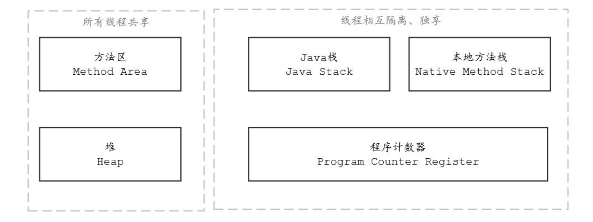
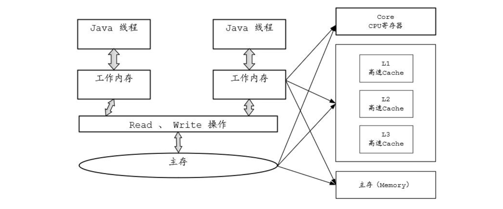

## 基础知识

### CPU 物理缓存结构

由于CPU的运算速度比主存（物理内存）的存取速度快很多，为了提高处理速度，现代CPU不直接和主存进行通信， 而是在CPU和主存之间设计了多层的高速Cache （高速缓存） ， 越靠近CPU的缓存越快，容量也越小。

### 并发编程的三大问题

由于需要尽可能释放CPU的能力，CPU上不断增加内核和缓存。内核也是越加越多，从之前的单核演变成8核、32核甚至更多。缓存也不止1层，可能是2层、3层甚至更多。随着CPU内核和缓存的增加，导致了并发编程的可见性和有序性问题。

原子性问题：所谓原子操作，就是“不可中断的一个或一系列操作”作。这种操作一旦开始，就一直运行到结束，中间不会有任何线程的切换。

可见性问题：一个线程对共享变量的修改， 另一个线程能够立刻可见， 我们称为该共享变量具备内存可见性。

> JMM规定，将所有的变量都存放在公共主内存中， 当线程使用变量时会把主存中的变量复制到自己的工作空间（或者叫作私有内存）中，线程对变量的读写操作，是自己工作内存中的变量副本。

有序性问题：是指程序执行的顺序按照代码的先后顺序执行。如果程序执行的顺序与代码的先后顺序不同，并导致了错误的结果，即发生了有序性问题。

### 硬件层的 MESI 协议原理

为了缓解内存与CPU的速度差问题， 现代计算机会在CPU上增加缓存， 每个CPU内核都只有自己的L1和L2高速缓存，CPU芯片上的CPU内核之间共享一个L3高速缓存。

每个CPU的处理过程为： 先将计算需要用到的数据缓存在CPU高速缓存中， 在CPU进行计算时，直接从高速缓存中读取数据并且在计算完成之后写入高速缓存。 在整个运算过程完成后， 再把高速缓存中的数据同步到主存。

由于每个线程可能会运行在不同的CPU内核中，因此每个线程拥有自己的高速缓存。同一份数据可能会被缓存到多个CPU内核中， 在不同CPU内核中运行的线程看到同一个变量的缓存值就会不一样，就会存在内存的可见性问题。


为了解决内存的可见性问题，CPU主要提供了两种解决办法：总线锁和缓存锁。

在多CPU的系统中，当其中一个CPU要对共享主存进行操作时，在总线上发出一个LOCK#信号， 这个信号使得其他处理器无法通过总线来访问共享内存中的数据， 总线锁定把CPU和内存之间的通信锁住了， 这使得锁定期间， 其他CPU不能操作其他主存地址的数据， 总线锁定的开销比较大，这种机制显然是不合适的。

总线锁的缺陷是：某一个CPU访问主存时，总线锁把CPU和主存的通信给锁住了，其他CPU不能操作其他内存地址的数据，使得效率低下，开销较大。


相比总线锁，缓存锁降低了锁的粒度。为了达到数据访问的一致，需要各个CPU在访问缓存时遵循一些协议，在存取数据时根据协议来操作，常见的协议有MSI、MESI、MOSI等。最常见的就是MESI协议。

就整体而言， 缓存一致性机制就是当某CPU对高速缓存中的数据进行操作之后， 通知其他CPU放弃存储在它们内部的缓存数据，或者从主内存中重新读取。

### 有序性与内存屏障

为了提高性能，编译器和CPU常常会对指令进行重排序。重排序主要分为两类：编译器重排序和CPU重排序。

1. 编译器重排序

编译器重排序指的是在代码编译的阶段进行指令重排，不改变程序执行结果的情况下，为了提升效率，编译器对指令进行乱序（Out-of-Order）的编译。

例如，在代码中，A操作需要获取其他资源而进入等待的状态，而A操作后面的代码跟其没有数据依赖关系，如果编译器一直等待A操作完成再往下执行的话，效率要慢得多，所以可以先编译后面的代码，这样的乱序可以提升编译速度。

编译器为什么要重排序（Re-Order）呢？它的目的为：与其等待阻塞指令（如等待缓存刷入）完成， 不如先去执行其他指令。 与CPU乱序执行相比， 编译器重排序能够完成更大范围、 效果更好的乱序优化。

2. CPU 重排序

流水线 （Pipeline） 和乱序执行（Out-of-Order Execution）是现代CPU基本都具有的特性。 机器指令在流水线中经历取指、译码、执行、访存、写回等操作。为了CPU的执行效率，流水线都是并行处理的，在不影响语义的情况下，处理器次序（Process Ordering，机器指令在CPU实际执行时的顺序）和程序次序（Program Ordering，程序代码的逻辑执行顺序）是允许不一致的，只要满足As-if-Serial规则即可。显然，这里的不影响语义依旧只能保证指令间的显式因果关系，无法保证隐式因果关系，即无法保证语义上不相关但是在程序逻辑上相关的操作序列按序执行。

CPU重排序包括两类：指令级重排序和内存系统重排序。

1）指令级重排序。在不影响程序执行结果的情况下，CPU内核采用了ILP（Instruction-Level Parallelism，指令级并行运算）技术来将多条指令重叠执行，主要是为了提升效率。如果指令之间不存在数据依赖性，处理器可以改变语句的对应机器指令的执行顺序，叫作指令级重排序。

2）内存系统重排序：对于现代的CPU来说，在CPU内核和主存之间都具备一个高速缓存，高速缓存的作用主要为减少CPU内核和主内存的交互（CPU内核的处理速度要快得多） ， 在CPU内核进行读操作时， 先从缓存读取， 如果缓存没有的话从主存读取； 同样， 对于写操作都是先写在缓存中，最后一次性写入主存。无论CPU读还是写，都会优先考虑高速缓存，主要为了减少跟主存交互时CPU内核的短暂卡顿，从而提升性能。但是，内存系统重排序可能会导致一个问题——数据不一致。

### As-if-Serial 规则

在单核CPU的场景下，当指令被重排序之后，如何保障运行的正确性呢？其实很简单，编译器和CPU都需要遵守As-if-Serial规则。

As-if-Serial规则的具体内容为：不管如何重排序，都必须保证代码在单线程下运行正确。为了遵守As-if-Serial规则， 编译器和CPU不会对存在数据依赖关系的操作进行重排序， 因为这种重排序会改变执行结果。但是，如果指令之间不存在数据依赖关系，这些指令可能被编译器和CPU重排序。

As-if-Serial规则只能保障单内核指令重排序之后的执行结果正确， 不能保障多内核以及跨CPU指令重排序之后的执行结果正确。

### 硬件层面的内存屏障

多核情况下，所有的CPU操作都会涉及缓存一致性协议（MESI协议）校验，该协议用于保障内存可见性。 但是， 缓存一致性协议仅仅保障内存弱可见（高速缓存失效）， 没有保障共享变量的强可见，而且缓存一致性协议更不能禁止CPU重排序，也就是不能确保跨CPU指令的有序执行。

如何保障跨CPU指令重排序之后的程序结果正确呢？需要用到内存屏障。

内存屏障又称内存栅栏，是让一个CPU高速缓存的内存状态对其他CPU内核可见的一项技术，也是一项保障跨CPU内核有序执行指令的技术。

硬件层常用的内存屏障分为三种：写屏障（Store Barrier）、读屏障（Load Barrier）、全屏障（Full Barrier）。

硬件层的内存屏障的作用：

- （1）阻止屏障两侧的指令重排序
- （2）强制让新数据写回主存，并且让高速缓存的数据失效

## Java内存模型详解

### 什么是 Java 内存模型

JMM最初由JSR-133 （Java Memory Model and Thread Specification） 文档描述， JMM定义了一组规则或规范，该规范定义了一个线程对共享变量的写入时，如何确保对另一个线程是可见的。实际上，JMM提供了合理的禁用缓存以及禁止重排序的方法，所以其核心的价值在于解决可见性和有序性。

JMM的另一大价值在于能屏蔽各种硬件和操作系统的访问差异，保证Java程序在各种平台下对内存的访问最终都是一致的。

Java内存模型规定所有的变量都是存储在主存中，JMM的主存类似于物理内存，但有区别，还能包含部分共享缓存。 每个Java线程都有自己的工作内存 （类似于CPU高速缓存， 但也有区别） 。

Java内存模型定义的两个概念：

1）主存：主要存储的是Java实例对象，所有线程创建的实例对象都存放在主存中，无论该实例对象是成员变量还是方法中的本地变量（也称局部变量），当然也包括了共享的类信息、常量、静态变量。由于是共享数据区域，因此多个线程对同一个变量进行访问可能会发现线程安全问题。

2） 工作内存： 主要存储当前方法的所有本地变量信息 （工作内存中存储着主存中的变量副本） ，每个线程只能访问自己的工作内存， 即线程中的本地变量对其他线程是不可见的， 即使两个线程执行的是同一段代码， 它们也会各自在自己的工作内存中创建属于当前线程的本地变量， 当然也包括了字节码行号指示器、相关Native方法的信息。注意，由于工作内存是每个线程的私有数据，线程间无法相互访问工作内存，因此存储在工作内存的数据不存在线程安全问题。

Java内存模型的规定如下：

1）所有变量存储在主存中。

2）每个线程都有自己的工作内存，且对变量的操作都是在工作内存中进行的。

3）不同线程之间无法直接访问彼此工作内存中的变量，要想访问只能通过主存来传递。

JMM将所有的变量都存放在公共主存中，当线程使用变量时，会把公共主存中的变量复制到自己的工作内存 （或者叫作私有内存） 中， 线程对变量的读写操作是自己的工作内存中的变量副本。

因此，JMM模型也需要解决代码重排序和缓存可见性问题。JMM提供了一套自己的方案去禁用缓存以及禁止重排序来解决这些可见性和有序性问题。JMM提供的方案包括大家都很熟悉的volatile、synchronized、 final等。 JMM定义了一些内存操作的抽象指令集， 然后将这些抽象指令包含到Java的volatile、

synchronized等关键字的语义中，并要求JVM在实现这些关键字时必须具备其包含的JMM抽象指令的能力。

### JMM 与 JMM 物理内存的区别

JMM属于语言级别的内存模型，它确保了在不同的编译器和不同的CPU平台上为Java程序员提供一致的内存可见性来保证指令并发执行的有序性。

以Java为例，一个i++方法编译成字节码后，在JVM中是分成了以下三个步骤运行的：

1）从主存中复制i的值并复制到CPU的工作内存中。

2）CPU读取工作内存中的值，然后执行i++操作，完成后刷新到工作内存。

3）将工作内存中的值更新到主存。

当多个线程同时访问该共享变量i时，每个线程都会将变量i复制到工作内存中进行修改，如果线程A读取变量i的值时，线程B正在修改i的值，问题就来了：线程B对变量i的修改对线程A而言就是不可见的。

这就是多线程并发访问共享变量所造成的结果不一致问题， 该问题属于JMM需要解决的问题。JMM属于概念和规范维度的模型，是一个参考性质的模型。JMM模型定义了一个指令集、个虚拟计算机架构和一个执行模型。具体的JVM实现需要遵循JMM的模型进行实现，它能够运行根据JMM模型指令集编写的代码，就像真机可以运行机器代码一样。

虽然JVM也是一个概念和规范维度的模型，但是大家常常将JVM理解为实体的、实现维度的虚拟机，通常情况下一般指HotSpot VM。

Java代码是要运行在虚拟机上的， 而虚拟机在执行Java程序的过程中会把所管理的内存划分为若干个不同的数据区域， 这些区域都有各自的用途。



Java虚拟机规范定义了JVM内存结构， JVM内存结构中各个区域有各自的功能。

这里简单介绍几个需要特别注意的JVM知识点：

1）JVM模型定义了Java虚拟机规范，但是不同的JVM虚拟机实现会各不相同，一般会遵守规范。

2）JVM模型定义中定义的方法区只是一种概念上的区域，并说明了其应该具有什么功能。但是并没有规定这个区域到底应该处于何处。 所以， 对于不同的JVM实现来说， 是有一定的自由度的。不同版本的方法区所处位置不同， 方法区并不是绝对意义上的物理区域。 在某些版本的JVM实现中，方法区其实是在堆中实现的。

3）运行时常量池用于存放编译期生成的各种字面量和符号应用。但是，Java语言并不要求常量只有在编译期才能产生。比如在运行期，String.intern也会把新的常量放入池中。

4）除了以上介绍的JVM运行时内存外，还有一块内存区域可供使用，那就是直接内存。Java虚拟机规范并没有定义这块内存区域， 所以它并不由JVM管理， 是利用本地方法库直接在堆外申请的内存区域。

5）堆和栈的数据划分也不是绝对的，如HotSpot的JIT会针对对象分配做相应的优化。

下面介绍JMM与硬件内存架构的关系。

对于硬件内存来说只有寄存器、缓存内存、主存的概念，并没有工作内存（线程私有数据区域）和主存（堆内存）之分，也就是说Java内存模型对内存的划分对硬件内存并没有任何影响，因为JMM只是一种抽象的概念，是一组规则，并不实际存在，无论是JMM工作内存的数据还是主存的数据， 对于计算机硬件来说都会存储在计算机主存中， 当然也有可能存储到CPU高速缓存或者寄存器中，因此总体上来说，Java内存模型和计算机硬件内存架构是相互交叉的关系，是一种抽象概念划分与真实物理硬件的交叉。

JMM与硬件内存架构的对应关系如图



### JMM 的 8 个操作

JMM定义了以下内存交互操作：

- **读（read）**：从主内存读取变量到工作内存。
- **写（write）**：从工作内存写入变量到主内存。
- **load**：将主内存中的变量加载到工作内存中。
- **store**：将工作内存中的变量存储到主内存中。
- **use**：使用工作内存中的变量。
- **assign**：赋值操作，将一个值赋给工作内存中的变量。
- **lock**：锁定一个变量，使其只能被当前线程访问。
- **unlock**：解锁一个变量，使其可以被其他线程访问。

如果要把一个变量从主存复制到工作内存，就要按顺序执行Read和Load操作；如果要把变量从工作内存同步回主存，就要按顺序执行Store和Write操作。

> JMM要求Read和Load、 Store和Write必须按顺序执行， 但不要求连续执行。 也就是说，Read和Load之间、Store和Write之间可插入其他指令。

以上JMM的8大操作规范定义相当严谨，也极为烦琐，JVM实现起来也非常复杂。Java设计团队大概也意识到了这个问题，新的JMM版本不断地对这些操作进行简化，比如将8个操作简化为Read、Write、Lock和Unlock四个操作。虽然进行了简化，但是JMM的基础设计并未改变。

### 可见性问题

Java内存模型是一种抽象的概念模型，用于定义多线程程序中变量的访问规则。它规定了线程之间的通信必须通过主内存来完成。每个线程都有自己的工作内存，工作内存中保存了该线程使用到的变量的副本。线程之间的变量传递需要通过主内存来进行，这可能会导致线程之间的可见性问题。

#### 产生原因

1. **CPU缓存机制**：现代计算机为了提高性能，通常会使用CPU缓存。CPU在读取主内存中的数据时，会将数据缓存到CPU缓存中。当多个线程运行在不同的CPU核心上时，每个线程可能会操作CPU缓存中的不同副本，导致线程之间的可见性问题。
2. **编译器优化**：编译器会对代码进行优化，如指令重排序等。这可能会导致代码的执行顺序与程序的逻辑顺序不一致，从而引发内存可见性问题。

#### 解决方法

1. **使用`volatile`关键字**：

   `volatile`关键字可以确保一个线程对变量的修改对其他线程是立即可见的。当写一个volatile变量时，JVM 把该线程对应的本地内存中的共享变量刷新到主内存中。当读一个volatile变量时，JVM 把该线程对应的本地内存设置为无效，直接从主内存读取共享变量。

   ```java
   public class VolatileExample {
       private volatile boolean flag = false;
   
       public void setFlag(boolean flag) {
           this.flag = flag;
       }
   
       public boolean getFlag() {
           return flag;
       }
   }
   ```

   在这个例子中，`flag`变量被声明为`volatile`，确保了多个线程对`flag`的读写操作具有可见性。

2. **使用`synchronized`关键字**：

   `synchronized`关键字可以**确保同一时间只有一个线程可以访问被保护的代码块或对象**。线程在获取锁时会从主内存中读取变量的最新值，释放锁时会将修改后的变量值写回主内存。

   ```java
   public class SynchronizedExample {
       private int value = 0;
   
       public synchronized void increment() {
           value++;
           // 其他线程需要获取锁才能访问value
       }
   }
   ```

   在这个例子中，`increment`方法被声明为`synchronized`，确保了线程之间的可见性。

3. **使用`Atomic`类**：

   Java提供了一系列的`Atomic`类，如`AtomicInteger`、`AtomicLong`等，这些类基于CAS（Compare-And-Swap）算法实现原子操作，同时也能保证内存可见性。

   ```java
   public class AtomicExample {
       private AtomicInteger count = new AtomicInteger(0);
   
       public void increment() {
           count.incrementAndGet();
       }
   
       public int getCount() {
           return count.get();
       }
   }
   ```

   在这个例子中，`count`变量的修改是原子的，并且具有可见性。

4. **使用`final`关键字**：

   当一个变量被声明为`final`时，它的值在初始化后就不能再被修改。JVM会确保`final`变量的写操作被缓存到主内存中，而读操作会直接从主内存中获取，从而保证`final`变量的值在所有线程中都是可见的。

   ```java
   public class FinalExample {
       private final int value;
   
       public FinalExample(int value) {
           this.value = value;
       }
   
       public int getValue() {
           return value;
       }
   }
   ```

   在这个例子中，`value`变量被声明为`final`，确保了它的值在所有线程中都是可见的。

5. **内存屏障**：

   内存屏障是一种用于控制指令执行顺序和内存可见性的硬件机制。在Java中，JMM通过内存屏障来防止指令重排序，并确保特定操作的可见性和有序性。常见的内存屏障类型包括：

   - **Load Barrier**：在加载操作之前插入的内存屏障，用于确保之前的所有内存操作都已完成。
   - **Store Barrier**：在存储操作之后插入的内存屏障，用于确保之后的所有内存操作都不可见，直到屏障之后。
   - **Load-Store Barrier**：同时控制加载和存储操作的内存屏障。

   例如，在`volatile`变量的写操作前后，JVM会插入内存屏障，以确保可见性和有序性。

### Happens-Before 规则

MM的内存屏障指令对Java工程师是透明的，是JMM对JVM实现的一种规范和要求。那么，作为Java工程师，如何确保自己设计和开发的Java代码不存在内存可见性问题或者有序性问题？

JMM定义了一套自己的规则：Happens-Before（先行发生）规则，并且确保只要两个Java语句之间必须存在Happens-Before关系， JMM尽量确保这两个Java语句之间的内存可见性和指令有序性。

Happens-Before规则的主要内容包括以下几个方面：

（1）程序顺序执行规则（as-if-serial规则）

在同一个线程中，有依赖关系的操作按照先后顺序，前一个操作必须先行发生于后面一个操作。换句话说，单个线程中的代码顺序不管怎么重排序，对于结果来说是不变的。

（2）volatile变量规则

对volatile（修饰的）变量的写操作必须先行发生于对volatile变量的读操作。

（3）传递性规则

如果A操作先行发生于B操作，而B操作又先行发生于C操作，那么A操作先行发生于C操作。

（4）监视锁规则（Monitor Lock Rule）

对一个锁的unlock操作先行发生于后面对同一个锁的lock操作，即无论在单线程还是多线程中， 同一个锁如果处于被锁定状态， 那么必须先对锁进行释放操作， 后面才能继续执行lock操作。

（5）start规则

对线程的start操作先行发生于这个线程内部的其他任何操作。具体来说，如果线程A执行B.start()启动线程B，那么线程A的B.start()操作先行发生于线程B中的任意操作。

（6）join规则

如果线程A执行了B.join()操作并成功返回，那么线程B中的任意操作先行发生于线程A所执行的ThreadB.join()操作。

### 有序性问题

#### 产生原因

在多线程编程中，Java 内存模型（JMM）中的有序性问题主要由以下原因导致：

- **指令重排序**：
  - 处理器优化：现代处理器为了提高性能，会采用指令流水线技术。为了更充分地利用指令流水线，处理器会对指令进行重排序，将不依赖的指令提前执行，或者将依赖的指令合并执行。
  - 编译器优化：编译器也会对代码进行优化，例如，将多个变量的读取或写入操作合并，或者改变代码的执行顺序，以提高程序的运行效率
- **内存系统的行为**：
  - 缓存数据不一致：不同缓存之间的数据同步需要时间，这可能导致线程看到的内存状态不一致。解决办法：
    - 通过在总线加LOCK#锁的方式。
    - 通过缓存一致性协议。最出名的就是Intel 的MESI协议，MESI协议保证了每个缓存中使用的共享变量的副本是一致的。MESI的核心的思想是：当CPU写数据时，如果发现操作的变量是共享变量，即在其他CPU中也存在该变量的副本，会发出信号通知其他CPU将该变量的缓存行置为无效状态，因此当其他CPU需要读取这个变量时，发现自己缓存中缓存该变量的缓存行是无效的，那么它就会从内存重新读取。
  - 存储器层次结构的非一致性：处理器可能采用不同的方式来访问内存，例如，有些处理器可能支持乱序执行，这可能导致内存操作的顺序与程序代码的顺序不一致
- Java 编译器的优化：
  - 存储器屏障：编译器在生成机器码时，会插入存储器屏障来防止某些类型的指令重排序。然而，过度的优化可能会导致存储器屏障被错误地移除或调整，从而引发有序性问题。
  - 线程调度的不确定性：操作系统可能会以不可预测的方式调度线程，这可能导致线程的执行顺序与程序代码的顺序不一致

#### 解决方法

JMM 通过以下机制来保证多线程环境下的有序性：

- **`volatile` 关键字**：`volatile` 关键字可以禁止指令重排序，确保操作的有序性。当一个线程写入 `volatile` 变量时，会立即将修改后的值写回主内存；当其他线程读取 `volatile` 变量时，会从主内存中读取最新的值。
- **`synchronized` 关键字**：`synchronized` 关键字不仅保证可见性和原子性，还保证有序性。线程在获取锁时会从主内存中读取变量的最新值，释放锁时会将修改后的变量值写回主内存。
- **`Atomic` 类**：`Atomic` 类基于 CAS（Compare-And-Swap）算法实现原子操作，同时也能保证操作的有序性。
- **内存屏障**：JMM 通过在指令序列中插入特定的内存屏障来防止指令重排序。常见的内存屏障包括读屏障和写屏障。
-  **Happens-Before 规则**：JMM 通过 Happens-Before 规则来定义操作之间的执行顺序，从而保证有序性。Happens-Before 规则包括：
  - **程序顺序规则**：一个线程中的每个操作，Happens-Before 该线程中的后续操作。
  - **监视器锁规则**：对一个监视器锁的解锁 Happens-Before 后面对该监视器锁的加锁。
  - **`volatile` 变量规则**：对一个 `volatile` 变量的写 Happens-Before 后面对该变量的读。

## volatile

### volatile 语义中的内存屏障

在Java代码中，volatile关键字的主要有两层语义：

- 不同线程对volatile变量的值具有内存可见性，即一个线程修改了某个volatile变量的值，该值对其他线程立即可见。

- 禁止进行指令重排序。

总之，volatile关键字除了保障内存可见性外，还能确保执行的有序性。volatile语义中的有序性是通过内存屏障指令来确保的。 为了实现volatile关键字语义的有序性， JVM编译器在生成字节码时，会在指令序列中插入内存屏障来禁止特定类型的CPU重排序。

JMM建议JVM采取保守策略对重排序进行严格禁止，下面是基于保守策略的volatile操作的内存屏障插入策略：

- 在每个volatile写操作的前面插入一个StoreStore屏障。

- 在每个volatile写操作的后面插入一个StoreLoad屏障。

- 在每个volatile读操作的后面插入一个LoadLoad屏障。

- 在每个volatile读操作的后面插入一个LoadStore屏障。


StoreStore屏障可以保证：

① 前面的写入不会重排的后面；

② 前面的写指令完成之后，高速缓存数据刷入主存；

③ 后面的写操作不会重排到前面。

所以，在volatile写之前，其前面的所有普通写操作已经对任意CPU可见了，并且volatile写操作不会被重排到屏障前面。

StoreLoad屏障可以保证：

① 前面的写入不会重排的后面；

② 前面的写指令完成之后，高速缓存数据刷入主存；

③ 让高速缓存中的数据失效，重新从主存加载数据，保障各内核的高速缓存数据的一致性；

④ 后面的读操作不会重排到前面。所以，在volatile写完成之后，缓存中的已经刷新成最新数据，后面所有CPU的读操作都可见了。


LoadLoad屏障可以保证：

1）前面的读操作不会被排到后面。

2）让高速缓存中的数据失效，重新从主存加载数据。

3）后面读操作不会被排到前面。

在volatile读之后，高速缓存中的数据是重新从主存加载的，并且是最新数据；另外，volatile读操作不会被重排到屏障后面，后面的读操作也不会排到前面。

LoadStore屏障可以保证：

1）前面的读操作不会被排到后面。

2）让高速缓存中的数据失效，重新从主存加载数据。

3）后面写操作不会被排到前面。

在volatile读之后，高速缓存中的数据是重新从主存加载的，并且是最新数据；另外，volatile读操作不会被重排到屏障后面，后面的写（load）操作也不会排到前面。


以上JMM建议的对volatile写和volatile读的内存屏障插入策略，是针对任意CPU平台的，所以非常保守。

由于不同的CPU有不同“松紧度”的CPU内存模型，只要不改变volatile读写操作的内存语义，不同JVM编译器可以根据具体情况省略不必要的JMM屏障。以X86 CPU为例，该平台的JVM实现仅仅在volatile写操作后面插入一个StoreLoad屏障，其他的JMM屏障都会被省略。由于StoreLoad屏障的开销大，因此在X86 CPU中，volatile写操作比volatile读操作的开销会大很多。

### 对 volatile 变量的写入进行性能优化

由于对一个volatile变量的每一次读写，JVM都会插入一系列的内存屏障，这就意味着对一个volatile变量每一次的写入操作，性能是比较低的。

由于保障volatile可见性的内存屏障性能开销比较大，尤其StoreLoad屏障更是如此，为了维护内核缓存的强一致性，此屏障可畏不惜代价。

如果不是每一次对volatile变量的读写都需要保障其内存可见性，或者说，仅仅是某次特定的volatile读写需要保障可见性，那么，有什么措施可以对volatile进行性能优化吗？

答案是：有两个策略。

1）对于普通变量，使用Unsafe.putXXXVolatile()或者Unsafe.getXXXVolatile()，保障单次操作的内存可见性，或者有序性。

2）对于volatile修饰的变量，如果写入时不需要保障立即可见，或者说不需要保障不同内核高速缓存之间的强一致，则能以Unsafe.putOrderXXX()方法写入，保障写入操作的有序性即可。这种做法是很多著名中间件（比如Netty、JCTools等）常用的提升性能的方案。

### volatile 不具备原子性

volatile能保证数据的可见性，但volatile不能完全保证数据的原子性，对于volatile类型的变量进行复合操作（如++）其仍存在线程不安全的问题。

对于关键字volatile修饰的内存可见变量而言，具有两个重要的语义：

1）使用volatile修饰的变量在变量值发生改变时，会立刻同步到主存，并使其他线程的变量副本失效。

2）禁止指令重排序：用volatile修饰的变量在硬件层面上会通过在指令前后加入内存屏障来实现，编译器级别是通过下面的规则实现的。


虽然volatile修饰的变量可以强制刷新内存，但是其并不具备原子性。

对于复合操作，volatile变量无法保障其原子性，如果要保证复合操作的原子性，需要使用锁。并且，在高并发场景下，volatile变量一定需要使用Java的显式锁结合使用。