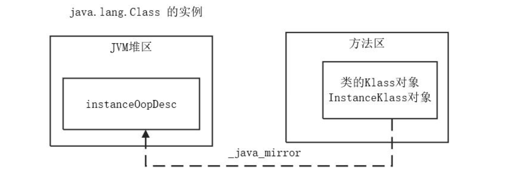
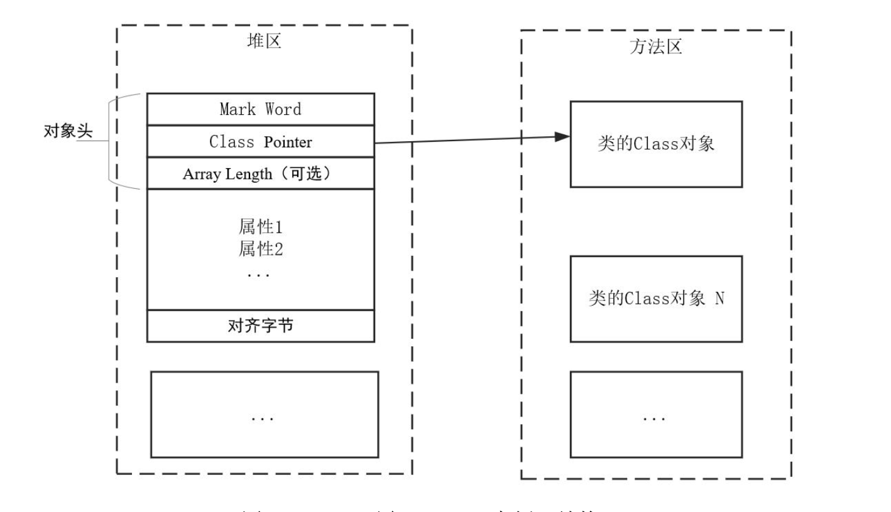
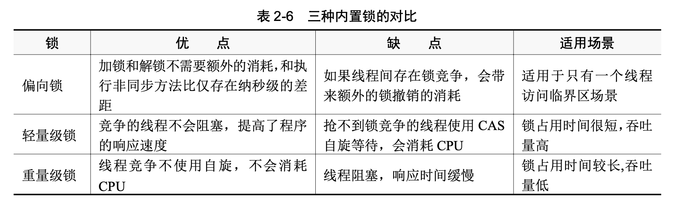

## Java 内置锁

### Java 对象结构

每当在Java代码中创建一个对象时， JVM会创建一个instanceOopDesc实例来表示这个对象， 此对象实例存放在堆区。

HotSpot为每一个已加载的Java类创建一个InstanceKlass对象，用来在JVM层表示Java元数据对象，此对象实例存放在方法区。但是这个InstanceKlass对象就是给JVM内部用的，并不直接暴露给Java层。



Java对象（Object实例）结构包括三部分：对象头、对象体和对齐字节。

（1）对象头

对象头包括三个字段，第一个字段叫作Mark Word（标记字），用于存储自身运行时的数据例如GC标志位、哈希码、锁状态等信息。

第二个字段叫作Class Pointer（类对象指针） ，用于存放此对象的元数据（InstanceKlass）的地址。虚拟机通过此指针可以确定这个对象是哪个类的实例。

第三个字段叫作Array Length（数组长度）。如果对象是一个Java数组，那么此字段必须有，用于记录数组长度的数据；如果对象不是一个Java数组，那么此字段不存在，所以这是一个可选字段。



（2）对象体

对象体包含了对象的实例变量（成员变量），用于成员属性值，包括父类的成员属性值。这部分内存按4字节对齐。

（3）对齐字节

对齐字节也叫作填充对齐， 其作用是用来保证Java对象在所占内存字节数为8的倍数 （8N bytes） 。HotSpot VM的内存管理要求对象起始地址必须是8字节的整数倍。对象头本身是8的倍数，当对象的实例变量数据不是8的倍数，需要填充数据来保证8字节的对齐。

接下来，对Object实例结构中几个重要的字段的作用做一下简要说明：

1）Mark Word（标记字）字段主要用来表示对象的线程锁状态，另外还可以用来配合GC、存放该对象的hashCode。

2） Class Pointer （类对象指针） 字段是一个指向方法区中类元数据信息的指针， 意味着该对象可随时知道自己是哪个Class的实例。

3）Array Length（数组长度）字段也占用32位（在32位JVM中）的字节，这是可选的，只有当本对象是一个数组对象时才会有这个部分。

4）对象体用于保存对象属性值，是对象的主体部分，占用的内存空间大小取决于对象的属性数量和类型。

5）对齐字节并不是必然存在的，也没有特别的含义，它仅仅起着占位符的作用。当对象实例数据部分没有对齐（8字节的整数倍）时，就需要通过对齐填充来补全。


Mark Word、Class Pointer、Array Length等字段的长度都与JVM的位数有关。Mark Word的长度为JVM的一个Word （字） 大小， 也就是说32位JVM的Mark Word为32位， 64位JVM为64位。 ClassPointer（类对象指针）字段的长度也为JVM的一个Word大小，即32位的JVM为32位，64位的JVM为64位。

所以，在32位JVM虚拟机中，Mark Word和Class Pointer这两部分都是32位的；在64位JVM虚拟机中，Mark Word和Class Pointer这两部分都是64位的。

对于对象指针而言，如果JVM中对象数量过多，使用64位的指针将浪费大量内存，通过简单统 计 ， 64 位 的 JVM 将 会 比 32 位 的 JVM 多 耗 费 50% 的 内 存 。 为 了 节 约 内 存 可 以 使 用 选 项+UseCompressedOops开启指针压缩。 选项UseCompressedOops中的Oop部分为Ordinary object pointer

（普通对象指针）的缩写。

如果开启UseCompressedOops选项，以下类型的指针将从64位压缩至32位：

- Class对象的属性指针（即静态变量）。

- Object对象的属性指针（即成员变量）。

- 普通对象数组的元素指针。

当然， 也不是所有的指针都会压缩，一些特殊类型的指针不会压缩， 比如指向PermGen （永久代）的Class对象指针（JDK 8中指向元空间的Class对象指针）、本地变量、堆栈元素、入参、返回值和NULL指针等。

> 在堆内存小于32GB的情况下，64位虚拟机的UseCompressedOops选项是默认开启的，该选项表示开启Oop对象的指针压缩，会将原来64位的Oop对象指针压缩为32位。

如果对象是一个数组，那么对象头还需要有额外的空间用于存储数组的长度（Array Length字段）。Array Length字段的长度也随着JVM架构的不同而不同：在32位的JVM上，长度为32位；在64位JVM上，长度为64位。64位JVM如果开启了OOP对象的指针压缩，Array Length字段的长度也将由64位压缩至32位。

#### Mark Word 的结构信息

Java内置锁的涉及很多重要信息，这些都存放在对象结构中，并且存放于对象头的Mark Word字段中。Mark Word的位长度为JVM的一个Word大小，也就是说32位JVM的Mark Word为32位，64位JVM的Mark Word为64位。Mark Word的位长度不会受到OOP对象指针压缩选项的影响。Java内置锁的状态总共有4种，级别由低到高依次为：无锁、偏向锁、轻量级锁和重量级锁。

其实在JDK 1.6之前，Java内置锁还是一个重量级锁，是一个效率比较低下的锁，在JDK 1.6之后，JVM为了提高锁的获取与释放效率，对synchronized的实现进行了优化，引入了偏向锁、轻量级锁的实现，从此以后Java内置锁的状态就有了4种（无锁、偏向锁、轻量级锁和重量级锁），并且4种状态会随着竞争的情况逐渐升级， 而且是不可逆的过程， 即不可降级， 也就是说只能进行锁升级 （从低级别到高级别）。

OpenJDK提供的JOL（Java Object Layout）包是一个非常好的工具，可以帮我们在运行时计算某个对象的大小。

JOL是分析JVM中对象的结构布局的工具，该工具大量使用了Unsafe、JVMTI来解码内部布局情况，其分析结果相对比较精准的。要使用JOL工具，先引入Maven的依赖坐标：

```java
<!--Java Object Layout -->
<dependency>
  <groupId>org.openjdk.jol</groupId>
  <artifactId>jol-core</artifactId>
  <version>0.11</version>
</dependency>
```

如果Java代码没有重写Object.hashCode()方法，那么 默 认 通 过 Native 方 式 调 用 os::random() 方 法 产 生 哈 希 码 ， Java 代 码 也 可 以 调 用

System.identityHashCode(obj)为对象产生哈希码。对象一旦生成了哈希码， JVM会将其记录在对象头的Mark Word中。 当然， 只有调用未重写的

Object.hashCode()方法，或者调用System.IdentityHashCode(obj)方法时，其值才被记录到Mark Word中。如果调用的是重写的hashCode()方法，也不会记录到Mark Word中。

对象一旦生成了哈希码，它就无法进入偏向锁状态。也就是说，只要一个对象已经计算过哈希码， 它就无法进入偏向锁状态； 当一个对象当前正处于偏向锁状态， 并且需要计算其哈希码的话，它的偏向锁会被撤销，并且锁会膨胀为重量级锁。

#### 无锁、偏向锁、轻量级锁和重量级锁

在JDK 1.6版本之前，所有的Java内置锁都是重量级锁。重量级锁会造成CPU在用户态和核心态之间频繁切换， 所以代价高、 效率低。 JDK 1.6版本为了减少获得锁和释放锁所带来的性能消耗，引入了 “偏向锁” 和 “轻量级锁” 实现。 所以， 在JDK 1.6版本里内置锁一共有4种状态： 无锁状态、偏向锁状态、 轻量级锁状态和重量级锁状态， 这些状态随着竞争情况逐渐升级。 内置锁可以升级但不能降级， 意味着偏向锁升级成轻量级锁后不能降级成偏向锁。 这种能升级却不能降级的策略， 其目的是为了提高获得锁和释放锁的效率。


1. **无锁状态**

Java对象刚创建时还没有任何线程来竞争， 说明该对象处于无锁状态 （无线程竞争它）


2. **偏向锁状态**

偏向锁是指一段同步代码一直被同一个线程所访问，那么该线程会自动获取锁，降低获取锁的代价。 如果内置锁处于偏向状态， 当有一个线程来竞争锁时， 先用偏向锁， 表示内置锁偏爱这个线程， 这个线程要执行该锁关联的同步代码时， 不需要再做任何检查和切换。 偏向锁在竞争不激烈的情况下效率非常高。

偏向锁状态的Mark Word会记录内置锁自己偏爱的线程ID， 内置锁会将该线程当作自己的熟人。

3. **轻量级锁状态**

当有两个线程开始竞争这个锁对象时，情况发生变化了，不再是偏向（独占）锁了，锁会升级为轻量级锁，两个线程公平竞争，哪个线程先占有锁对象，锁对象的Mark Word就指向哪个线程的栈帧中的锁记录。

当锁处于偏向锁又被另一个线程所企图抢占时，偏向锁就会升级为轻量级锁。企图抢占的线程会通过自旋的形式尝试获取锁，不会阻塞抢锁线程，以便提高性能。

**自旋原理**非常简单，如果持有锁的线程能在很短时间内释放锁资源，那么那些等待竞争锁的线程就不需要做内核态和用户态之间的切换进入阻塞挂起状态， 它们只需要等一等 （自旋） ， 等持有锁的线程释放锁后即可立即获取锁，这样就避免用户线程和内核切换的消耗。

但是，线程自旋是需要消耗 CPU的，如果一直获取不到锁，那线程也不能一直占用CPU自旋做无用功，所以需要设定一个自旋等待的最大时间。JVM对于自旋周期的选择，JDK 1.6之后引入了适应性自旋锁， 适应性自旋锁意味着自旋的时间不是固定的， 而是由前一次在同一个锁上的自旋时间以及锁的拥有者的状态来决定的。 线程如果自旋成功了， 下次自旋的次数就会更多， 如果自旋失败了，自旋的次数就会减少。

如果持有锁的线程执行的时间超过自旋等待的最大时间仍没有释放锁，就会导致其他争用锁的线程在最大等待时间内还是获取不到锁， 自旋不会一直持续下去， 这时争用线程会停止自旋进入阻塞状态，该锁膨胀为重量级锁。

4. **重量级锁状态**

重量级锁会让其他申请的线程之间进入阻塞，性能降低。重量级锁也就叫同步锁，这个锁对象Mark Word再次发生变化，会指向一个监视器对象，该监视器对象用集合的形式来登记和管理排队的线程。

### 偏向锁的原理与实战

#### 偏向锁的核心原理

在实际场景中，如果一个同步块（或方法）没有多个线程竞争，而且总是由同一个线程多次重入获取锁， 如果每次还有阻塞线程， 唤醒CPU从用户态转核心态， 那么对于CPU是一种资源的浪费，为了解决这类问题，就引入了偏向锁的概念。

偏向锁的核心原理是：如果不存在线程竞争的一个线程获得了锁，那么锁就进入偏向状态，此 时 Mark Word的 结 构变 为 偏 向 锁结 构 ， 锁 对象 的 锁 标 志位 （ lock） 被 改为 01， 偏 向标 志 位（biased_lock）被改为1，然后线程的ID记录在锁对象的Mark Word中（使用CAS操作完成）。以后该线程获取锁的时候判断一下线程ID和标志位， 就可以直接进入同步块， 连CAS操作都不需要， 这样就省去了大量有关锁申请的操作，从而也就提升了程序的性能。

偏向锁的核心思想是， 如果一个线程获得了锁， 那么锁就进入偏向模式， 此时Mark Word的结构也变为偏向锁结构。 当这个线程再次请求锁时， 无需再作任何同步操作， 即获取锁的过程， 这样就省去了大量有关锁申请的操作，从而也就提升了程序的性能。经过研究发现，在大多数情况下，锁不仅不存在多线程竞争， 而且总是由同一线程多次获得锁， 因此， 在大多数情况下偏向锁是能提升性能的。

> 从JDK 1.6开始，虽然JVM默认开启偏向锁，但是默认延时4秒开启。也就是说，程序刚启动创建的对象是不会开启偏向锁的，4秒后创建的对象才会开启偏向锁的。

偏向锁的主要作用是消除无竞争情况下的系统底层的同步操作，进一步提升程序性能，所以在没有锁竞争的场合， 偏向锁有很好的优化效果。 但是，一旦有第二个线程需要竞争锁， 那么偏向模式立即结束，进入轻量级锁的状态。

假如在大部分情况同步块是没有竞争的，那么可以通过偏向来提高性能。即在无竞争时，之前获得锁的线程再次获得锁时会判断偏向锁的线程ID是否指向自己，如果是，那么该线程将不用再次获得锁， 直接就可以进入同步块； 如果未指向当前线程， 当前线程会采用CAS操作将Mark Word中线程ID设置为当前线程ID，如果CAS操作成功，那么获取偏向锁成功，去执行同步代码块，如果CAS操作失败， 那么表示有竞争， 抢锁线程被挂起， 撤销占锁线程的偏向锁， 然后将偏向锁膨胀为轻量级锁。

偏向锁的缺点：如果锁对象时常被多条线程竞争，偏向锁就是多余的，并且其撤销的过程会带来一些性能开销。


偏向锁的加锁过程为： 新线程只需要判断内置锁对象的Mark Word中的线程ID是不是自己的ID，如果是就直接使用这个锁， 而不用作CAS交换； 如果不是， 比如在第一次获得此锁时内置锁的线程ID为空，就使用CAS交换，新线程将自己的线程ID交换到内置锁的Mark Word中，如果交换成功，就加锁成功。

每执行一轮抢占，JVM内部都会比较内置锁的偏向线程ID与当前线程ID，如果匹配，就表明当前线程已经获得了偏向锁，当前线程可以快速进入临界区。所以，偏向锁的效率是非常高的。 总之， 偏向锁是针对一个线程而言的， 线程获得锁之后就不会再有解锁等操作了，这样可以省略很多开销。

虽然抢锁的线程已经结束， 但是ObjectLock实例的对象结构仍然记录了其之前的偏向线程ID，其锁状态还是偏向锁状态101。

#### 偏向锁的膨胀和撤销

假如有多个线程来竞争偏向锁，此对象锁已经有所偏向，其他的线程发现偏向锁并不是偏向自己，就说明存在了竞争，尝试撤销偏向锁（很可能引入安全点），然后膨胀到轻量级锁。

撤销偏向锁的条件：

1）多个线程竞争偏向锁。

2）调用偏向锁对象obj.的obj.hashCode()方法或者System.identityHashCode()方法计算对象的哈希码之后，偏向锁将被撤销。

为什么计算对象的哈希码时会撤销对象的偏向锁呢？因为偏向锁没有存储Mark Word备份信息的地方。换句话说，因为对于一个对象其哈希码只会生成一次并保存在Mark Word中，偏向锁对象的Mark Word已经保存了线程ID， 没有地方再保存哈希码时， 所以只能撤销偏向锁， 将Mark Word用于存放对象的哈希码。

偏向锁撤销的开销花费还是挺大的，其大概的过程如下：

1）JVM需要等待一个全局安全点（global safe point），当JVM到达全局安全点后，所有的用户线程都是暂停的，当然，此时持有偏向锁的用户线程也被暂停了。

2）遍历线程的栈帧，检查是否存在锁记录。如果存在锁记录，就需要清空锁记录，使其变成无锁状态，并修复锁记录指向的Mark Word，清除其线程ID。

3）将当前锁升级（或碰撞）成轻量级锁。少数场景直接升级为重量级锁。

4）唤醒当前线程。

所以，如果某些临界区存在两个及两个以上的线程竞争，那么偏向锁反而会降低性能。在这种情况下，可以在启动JVM时就把偏向锁的默认功能关闭。


**偏向锁的膨胀：**

如果偏向锁被占据，一旦有第二个线程争抢这个对象，因为偏向锁不会主动释放，所以第二个线程可以看到内置锁偏向状态， 这时表明在这个对象锁上已经存在竞争了。 JVM检查原来持有该对象锁的占有线程是否依然存活， 如果挂了， 就可以将对象变为无锁状态， 然后进行重新偏向， 偏向为抢锁线程。

如果JVM检查到原来的线程依然存活，就表明原来的线程还在使用偏执锁，发生锁竞争，撤销原来的偏向锁，将偏向锁膨胀（INFLATING）为轻量级锁。

经验表明，其实大部分情况下进入一个同步代码块的线程都会是同一个线程。这也是为什么JDK会引入偏向锁出现的原因。 所以， 总体来说， 使用偏向锁带来的好处还是大于偏向锁撤销和膨胀的所带来的代价。

**全局安全点原理和偏向锁撤销的性能问题**

有哪些场景需要让JVM进入到全局安全点呢？主要的场景如下：

- 垃圾回收。

- 偏向锁解除（Biased lock revocation）。

- 由于代码优化所引起的指令重排。

- 类重新定义（Class redefinition），如hot swap热部署、AOP的代码植入。

- Dump一个或者全部线程（threadDump）。

- Dump堆（heapDump）。

**偏向锁的撤销操作需要依赖JVM的全局安全点，从而会带来STW停顿**。如果偏向锁撤销操作发生频繁，会招来频繁的STW，从而导致严重的性能问题。

所以，**对于高并发应用来说，一般建议关闭偏向锁**。具体的方式：可以在启动命令中加上以下JVM参数：

-XX:-UseBiasedLocking

关闭偏向锁之后，Java内置锁默认会进入轻量级锁状态。


### 轻量级锁的原理与实战

引入轻量级锁的主要目的是在多线程竞争不激烈的情况下，**通过CAS机制竞争锁减少重量级锁产生的性能损耗**。 重量级锁使用了操作系统底层的互斥锁（Mutex Lock） ， 会导致线程在用户态和核心态之间频繁切换，从而带来较大的性能损耗。

轻量锁存在的目的是尽可能不用动用操作系统层面的互斥锁，因为其性能会比较差。线程的阻塞和唤醒需要CPU从用户态转为核心态，频繁地阻塞和唤醒对CPU来说是一件负担很重的工作。同时我们可以发现， 很多对象锁的锁定状态只会持续很短的一段时间， 例如整数的自加操作， 在很短的时间内阻塞并唤醒线程显然不值得， 为此引入了轻量级锁。 轻量级锁是一种自旋锁， 因为JVM本身就是一个应用，所以希望在应用层面上通过自旋解决线程同步问题。

轻量级锁的执行过程：在抢锁线程进入临界区之前，如果内置锁（临界区的同步对象）没有被锁定， JVM首先将在抢锁线程的栈帧中建立一个锁记录 （Lock Record） ， 用于存储对象目前Mark Word的拷贝。

轻量级锁主要有两种：普通自旋锁和自适应自旋锁。

1。普通自旋锁

所谓普通自旋锁，就是指当有线程来竞争锁时，抢锁线程会在原地循环等待，而不是被阻塞，直到那个占有锁的线程释放锁之后，这个抢锁线程才可以获得锁。

默认情况下，自旋的次数为10次，用户可以通过-XX:PreBlockSpin选项来进行更改。

2. 自适应自旋锁

所谓自适应自旋锁，就是等待线程空循环的自旋次数并非是固定的，而是会动态地根据实际情况来改变自旋等待的次数， 自旋次数由前一次在同一个锁上的自旋时间及锁的拥有者的状态来决定。

> JDK 1.6的轻量级锁使用的是普通自旋锁，且需要使用-XX:+UseSpinning选项手工开启。
>
> JDK1.7后， 轻量级锁使用自适应自旋锁， JVM启动时自动开启， 且自旋时间由JVM自动控制。

轻量级锁也被称为非阻塞同步、乐观锁，因为这个过程并没有把线程阻塞挂起，而是让线程空循环等待。

轻量级锁的问题在哪里呢？虽然大部分临界区代码的执行时间都是很短的，但是也会存在执行得很慢的临界区代码。 临界区代码执行耗时较长， 在其执行期间其他线程都在原地自旋等待， 会空消耗CPU。 因此， 如果竞争这个同步锁的线程很多， 就会有多个线程在原地等待继续空循环消耗CPU（空自旋），这会带来很大的性能损耗。

轻量级锁本意是为了减少多线程进入操作系统底层的互斥锁（Mutex Lock）的概率，并不是要替代操作系统互斥锁。 所以， 在争用激烈的场景下， 轻量级锁会膨胀为基于操作系统内核互斥锁实现的重量级锁。

### 重量级锁的原理与实战

在JVM中， 每个对象都关联一个监视器， 这里的对象包含了Object实例和Class实例。 监视器是一个同步工具， 相当于一个许可证， 拿到许可证的线程即可以进入临界区进行操作， 没有拿到则需要阻塞等待。 重量级锁通过监视器的方式保障了任何时间只允许一个线程通过受到监视器保护的临界区代码。

由于JVM轻量级锁使用CAS进行自旋抢锁，这些CAS操作都处于用户态下，进程不存在用户态和内核态之间的运行切换，因此JVM轻量级锁开销较小。而JVM重量级锁使用了Linux内核态下的互斥锁（Mutex），这是重量级锁开销很大的原因。

### 偏向锁、轻量级锁与重量级锁的对比

总结一下synchronized的执行过程，大致如下：

1）线程抢锁时，JVM首先检测内置锁对象Mark Word中biased_lock（偏向锁标识）是否设置成1，lock（锁标志位）是否为01，如果都满足，确认内置锁对象为可偏向状态。

2）在内置锁对象确认为可偏向状态之后，JVM检查Mark Word中线程ID是否为抢锁线程ID，如果是，就表示抢锁线程处于偏向锁状态，抢锁线程快速获得锁，开始执行临界区代码。

3）如果Mark Word中线程ID并未指向抢锁线程，就通过CAS操作竞争锁。如果竞争成功，就将Mark Word中线程ID设置为抢锁线程，偏向标志位设置为1，锁标志位设置为01，然后执行临界区代码，此时内置锁对象处于偏向锁状态。

4）如果CAS操作竞争失败，就说明发生了竞争，撤销偏向锁，进而升级为轻量级锁。

5）JVM使用CAS将锁对象的Mark Word替换为抢锁线程的锁记录指针，如果成功，抢锁线程就获得锁。 如果替换失败， 就表示其他线程竞争锁， JVM尝试使用CAS自旋替换抢锁线程的锁记录指针，如果自旋成功（抢锁成功），那么锁对象依然处于轻量级锁状态。

6）如果JVM的CAS替换锁记录指针自旋失败，轻量级锁膨胀为重量级锁，后面等待锁的线程也要进入阻塞状态。

总体来说，偏向锁是在没有发生锁争用的情况下使用；一旦有了第二个线程的争用锁，偏向锁就会升级为轻量级锁； 如果锁争用很激烈， 轻量级锁的CAS自旋到达阈值后， 轻量级锁就会升级为重量级锁。



### 线程间通信

线程是操作系统调度的最小单位，有自己的栈空间，可以按照既定的代码逐步执行，但是如果每个线程间都孤立地运行，就会造资源浪费。

所以在现实中，如果需要多个线程按照指定的规则共同完成一件任务，那么这些线程之间就需要互相协调，这个过程被称为线程的通信。


线程的通信可以被定义为：当多个线程共同操作共享的资源时，线程间通过某种方式互相告知自己的状态，以避免无效的资源争夺。

线程间线程通信的方式可以有很多种：等待－通知、共享内存、管道流。每种方式有不同的方法来实现，这里首先介绍的是等待－通知的通信方式。

“等待－通知” 通信方式是Java中使用普遍的线程间通信方式， 其经典的案例就是 “生产者－消费者”模式。


## JUC 显示锁

与Java内置锁不同，JUC显式锁提供了一种非常灵活的、使用纯Java语言基本的锁，这种锁的使用非常灵活，可以进行无条件的、可轮询的、定时的、可中断的锁获取和释放操作。由于JUC锁的加锁和解锁的方法都是通过Java API显式进行的，所以也叫显式锁。


使用Java内置锁时，不需要通过Java代码显式地对同步对象的监视器进行抢占和释放，这些工作由JVM底层完成，而且任何一个Java对象都能作为一个内置锁使用，所以，Java的对象锁使用起来非常方便。但是，Java内置锁的功能相对单一，不具备一些比较高级的锁功能，比如：

1）限时抢锁：在抢锁时设置超时时长，如果超时还未获得锁就放弃，不至于无限等下去。

2） 可中断抢锁： 在抢锁时， 外部线程给抢锁线程发出一个中断信号， 就能唤起等待锁的线程，并终止抢占过程。

3）多个等待队列：为锁维持多个等待队列，以便提高锁的效率。比如在生产者－消费者模式实现中， 生产者和消费者共用一把锁， 该锁上维持两个等待队列， 即一个生产者队列和一个消费者队列。

除了以上功能问题之外，Java对象锁还存在性能问题。在竞争稍微激烈的情况下，Java对象锁会膨胀为重量级锁 （基于操作系统的Mutex Lock实现） ， 而重量级锁的线程阻塞和唤醒操作需要进程在内核态和用户态之间来回切换， 导致其性能非常低。 所以， 迫切需要提供一种新的锁来提升争用激烈场景下锁的性能。

Java显式锁就是为了解决这些Java对象锁的功能问题、 性能问题而生的。 JDK 5版本引入了Lock接口，Lock是Java代码级别的锁。为了与Java对象锁相区分，Lock接口被称为显式锁接口，其对象实例则被称为显式锁对象。

### 显式锁 Lock 接口

JDK 5版本引入了java.util.concurrent并发包，简称为JUC包，里面提供了各种高并发工具类，通过此JUC工具包可以在Java代码中实现功能非常强大的多线程并发操作。所以，Java显式锁也被称为JUC显式锁。

Lock接口位于java.util.concurrent.locks包中，是JUC显式锁的一个抽象JUC包中提供了一系列的显式锁实现类 （如ReentrantLock） ， 当然也允许应用程序提供自定义的锁实现类。

与synchronized关键字不同，显式锁不再作为Java内置特性来实现，而是作为Java语言可编程特性来实现。 这就为多种不同功能的锁实现留下了空间， 各种锁实现可能有不同的调度算法、 性能特性或者锁定语义。

从Lock提供的接口方法可以看出，显式锁至少比Java内置锁多了以下优势：

（1）可中断获取锁

使用synchronized关键字获取锁的时候，如果线程没有获取到被阻塞，阻塞期间该线程是不响应中断信号（interrupt）的；而使用Lock.lockInterruptibly()方法获取锁时，如果线程被中断，线程将抛出中断异常。

（2）可非阻塞获取锁

使用synchronized关键字获取锁时， 如果没有成功获取， 线程只有被阻塞； 而使用Lock.tryLock()方法获取锁时，如果没有获取成功，线程也不会被阻塞，而是直接返回false。

（3）可限时抢锁

使用Lock.tryLock(long time, TimeUnit unit)方法，显式锁可以设置限定抢占锁的超时时间。而在使用synchronized关键字获取锁时，如果不能抢到锁，线程只能无限制阻塞。

除了以上能通过Lock接口直接观察出来的三点优势之外，显式锁还有不少其他的优势。

### 可重入锁 ReentrantLock

ReentrantLock是JUC包提供的显式锁的一个基础实现类， ReentrantLock类实现了Lock接口， 它拥有与synchronized相同的并发性和内存语义，但是拥有了限时抢占、可中断抢占等一些高级锁特性。此外，ReentrantLock基于内置的抽象队列同步器（Abstract Queued Synchronized，AQS）实现，在争用激烈场景下，能表现出表内置锁更佳的性能。

ReentrantLock是一个可重入的独占（或互斥）锁，其中两个修饰词的含义为：

1）可重入的含义：表示该锁能够支持一个线程对资源的重复加锁，也就是说，一个线程可以多次进入同一个锁所同步的临界区代码块。 比如， 同一线程在外层函数获得锁后， 在内层函数能再次获取该锁，甚至多次抢占到同一把锁。

2）独占的含义：在同一时刻只能有一个线程获取到锁，而其他获取锁的线程只能等待，只有拥有锁的线程释放了锁后，其他的线程才能够获取锁。

分离变与不变是软件设计的一个基本原则。


通常情况下，大家会使用lock()方法进行阻塞式的锁抢占，其模板代码如下：

```java
//创建所对象，SomeLock为Lock的某个实现类，如ReentrantLock
Lock lock = new SomeLock();
lock.lock(); //step1：抢占锁

try {
	//step2：抢锁成功，执行临界区代码
} finally {
	lock.unlock(); //step3：释放锁

}
```

调用tryLock()方法非阻塞抢占锁：

```java
//创建所对象，SomeLock为Lock的某个实现类，如ReentrantLock
Lock lock = new SomeLock();
if (lock.tryLock()) { //step1：尝试抢占锁
  try {
    //step2：抢锁成功，执行临界区代码
  } finally {
  	lock.unlock(); //step3：释放锁
  }
}
else{
	//step4：抢锁失败，执行后备动作
}
```

调用tryLock(long time, TimeUnit unit)方法限时抢锁，其大致的代码模板如下：

```java
//创建所对象，SomeLock为Lock的某个实现类，如ReentrantLock
Lock lock = new SomeLock();
//抢锁时阻塞一段时间，如1秒
if (lock.tryLock(1, TimeUnit.SECONDS)) { //step1：限时阻塞抢占
  try {
  	//step2：抢锁成功，执行临界区代码
  } finally {
  	lock.unlock(); //step3：释放锁
  }
}
else{
	//限时抢锁失败，执行后备动作
}
```

对lock()、tryLock()、tryLock(long time, TimeUnit unit)这三个方法的总结如下：

1）lock()方法用于阻塞抢锁，抢不到锁时线程会一直阻塞。

2）tryLock()方法用于尝试抢锁，该方法有返回值，如果成功则返回true，如果失败（即锁已被其他线程获取） 则返回false。 此方法无论如何都会立即返回， 在抢不到锁时， 线程不会像使用lock()方法那样一直被阻塞。

3）tryLock(long time, TimeUnit unit)方法和tryLock()方法是类似的，只不过这个方法在抢不到锁时会阻塞一段时间。如果在阻塞期间获取到锁立即返回true，超时则返回false。

### 基于显式锁进行“等待－通知”方式的线程间通信

在前面介绍Java的线程间通信机制时，基于Java内置锁实现一种简单的“等待－通知”方式的线程间通信：通过Object对象的wait、notify两类方法作为开关信号，用来完成通知方线程和等待方线程之间的通信。

与Object对象的wait()、notify()两类方法类似，基于Lock显式锁JUC也为大家提供了一个用于线程间进行“等待－通知”方式通信的接口——java.util.concurrent.locks.Condition。

await（系列）方法对应于Object.wait()方法，signal()方法对应于Object.notify()方法，signalAll()方法对应于Object.notifyAll()方法。

### LockSupport

LockSupport是JUC提供的一线程阻塞与唤醒的工具类，该工具类可以让线程在任意位置阻塞和唤醒，其所有的方法都是静态方法。

LockSupport的方法主要有两类：park和unpark。park英文意思为停车，如果把Thread看成一辆车的话，park()方法就是让车停下，其作用是将调用park()的当前线程阻塞；而unpark()方法就是让车启动，然后跑起来，其作用是将指定线程Thread唤醒。


从功能上说， LockSupport.park()与Thread.sleep()方法类似， 都是让线程阻塞， 二者的区别如下：

1）Thread.sleep()没法从外部唤醒，只能自己醒过来；而被LockSupport.park()方法阻塞的线程可以通过调用LockSupport.unpark()方法去唤醒。

2） Thread.sleep()方法声明了InterruptedException中断异常， 这是一个受检异常， 调用者需要捕获这个异常或者再抛出；而使用LockSupport.park()方法时不需要捕获中断异常。

3）被LockSupport.park()方法、Thread.sleep()方法所阻塞的线程有一个特点，当被阻塞线程的Thread.interrupt()方法调用时，被阻塞线程都会响应线程的中断信号，唤醒线程的执行。不同的是，二者对中断信号的响应方式不同：LockSupport.park()方法不会抛出InterruptedException异常，仅仅设置了线程的中断标志；而Thread.sleep()方法还会抛出InterruptedException异常。

4） 与Thread.sleep()相比，调用LockSupport.park()能更精准、更加灵活地阻塞、唤醒指定线程。

5）Thread.sleep()本身就是一个原生（native）方法；LockSupport.park()并不是一个原生方法，只是调用了一个Unsafe类的原生方法（名字也叫park）去实现。

6） LockSupport.park()方法还允许设置一个Blocker对象， 主要用来供监视工具或诊断工具确定线程受阻塞的原因。

> 通过Thread.sleep()方法进入阻塞的线程不会释放持有的锁， 因此在持有锁的时候调用该方法需要谨慎。 那么通过LockSupport.park()方法进入阻塞的线程， 会不会释放所持有的锁呢？当然也不会。

从功能上说，LockSupport.park()与Object.wait()方法也类似，都是让线程阻塞，二者的区别如下：

1） Object.wait()方法需要在synchronized块中执行， 而LockSupport.park()可以在任意地方执行。

2） 当被阻塞线程中断时， Object.wait()方法抛出了中断异常， 调用者需要捕获或者再抛出； 当被阻塞线程中断时，LockSupport.park()不会抛出异常，调用时不需要处理中断异常。

### 显式锁的分类

显式锁有很多种，从不同的角度来看，显式锁大概有以下几种分类：可重入锁与不可重入锁、悲观锁和乐观锁、公平锁和非公平锁、共享锁和独占锁、可中断锁和不可中断锁。

1. 可重入锁与不可重入锁

从同一个线程是否可以重复占有同一个锁对象的角度来分，显式锁可以分为可重入锁与不可重入锁。

可重入锁也被称为递归锁， 指的是一个线程可以多次抢占同一个锁。 例如， 线程A在进入外层函数抢占了一个Lock显式锁之后， 当线程A继续进入内层函数时， 如果遇到有抢占同一个Lock显式锁的代码，线程A依然可以抢到该Lock显式锁。

不可重入锁与可重入锁相反， 指的是一个线程只能抢占一次同一个锁。 例如， 线程A在进入外层函数抢占了一个Lock显式锁之后，当线程A继续进入内层函数时，如果遇到有抢占同一个Lock显式锁的代码，线程A不可以抢到该Lock显式锁。除非线程A提前释放了该Lock显式锁，才能第二次抢占该锁。

JUC的ReentrantLock类是可重入锁的一个标准实现类。

2. 悲观锁和乐观锁

从线程进入临界区前是否锁住同步资源的角度来分，显式锁可以分为悲观锁和乐观锁。悲观锁就是悲观思想，每次去入临界区操作数据的时候都认为别的线程会修改，所以线程每次在读写数据时都会上锁， 锁住同步资源， 这样其他线程需要读写这个数据时就会阻塞，一直等到拿到锁。总体来说，悲观锁适用于写多读少的场景，遇到高并发写的可能性高。

Java的Synchronized重量级锁是一种悲观锁。

乐观锁是一种乐观思想，每次去拿数据的时候都认为别的线程不会修改，所以不会上锁，但是在更新的时候会判断一下在此期间别人有没有去更新这个数据，采取在写时先读出当前版本号，然后加锁操作 （比较跟上一次的版本号， 如果一样就更新） ， 如果失败就要重复读-比较-写的操作。总体来说，乐观锁适用于读多写少的场景，遇到高并发写的可能性低。

Java中的乐观锁基本都是通过CAS自旋操作实现的。 CAS是一种更新原子操作， 比较当前值跟传入值是否一样，是则更新，不是则失败。在争用激烈的场景下，CAS自旋会出现大量的空自旋，会导致乐观锁性能大大降低。

Java的Synchronized轻量级锁是一种乐观锁。另外，JUC中基于抽象队列同步器（AQS）实现的显式锁（如ReentrantLock）都是乐观锁。

> 既然在争用激烈的场景下乐观锁的性能非常低， 那么为什么JUC的显式锁都是乐观锁呢？根本的原因是，JUC的显式锁都是基于AQS实现的，而AQS通过对队列的使用很大程度上减少了锁的争用，极大地减少了空的CAS自旋。所以，即使在争用激烈场景下，基于AQS的JUC乐观锁也能表现出比悲观锁更佳的性能。

3. 公平锁和非公平锁

公平锁是指不同的线程抢占锁的机会是公平的、平等的，从抢占时间上来说，先对锁进行抢占的线程一定被先满足，抢锁成功的次序体现为FIFO（先进先出）顺序。简单来说，公平锁就是保障了各个线程获取锁都是按照顺序来的，先到的线程先获取锁。

使用公平锁，比如线程A、B、C、D依次去获取锁，线程A首先获取到了锁，然后它处理完成释放锁之后，会唤醒下一个线程B去获取锁。后续不断重复前面的过程，线程C、D依次获取锁。

非公平锁是指不同的线程抢占锁的机会是非公平的、不平等的，从抢占时间上来说，先对锁进行抢占的线程不一定被先满足，抢锁成功的次序不会体现为FIFO（先进先出）顺序。

使用公平锁，比如线程A、B、C、D依次去获取锁, 假如此时持有锁的是线程A，然后线程B、C、 D尝试获取锁， 就会进入一个等待队列。 当线程A释放掉锁之后， 会唤醒下一个线程B去获取锁。

在唤醒线程B的这个过程中， 如果有别的线程E尝试去请求锁， 那么线程E是可以先获取到的， 这就是插队。为什么线程E可以插队呢？因为CPU唤醒线程B需要进行线程的上下文切换，这个操作需要一定的时间，线程E可能与线程A、B不在同一个CPU内核上执行，而是在其他的内核上执行，所以不需要进行线程的上下文切换。在线程A释放锁和线程B被唤醒的这段时间，锁是空闲的，其他内核上的线程E此时就能趁机获取非公平锁，这样做的目的主要是利用锁的空档期，提高其利用效率。

默认情况下，ReentrantLock实例是非公平锁，但是，如果在实例构造时传入了参数true，所得到的锁就是公平锁。另外，ReentrantLock的tryLock()方法是一个特例，一旦有线程释放了锁，正在tryLock的线程就能优先取到锁，即使已经有其他线程在等待队列中。

4. 可中断锁和不可中断锁

什么是可中断锁？如果某一线程A正占有锁在执行临界区代码，另一线程B正在阻塞式抢占锁，可能由于等待时间过长，线程B不想等待了，想先处理其他事情，我们可以让它中断自己的阻塞等待，这种就是可中断锁。

什么是不可中断锁？一旦这个锁被其他线程占有，如果自己还想抢占，自己只能选择等待或者阻塞， 直到别的线程释放这个锁， 如果别的线程永远不释放锁， 那么自己只能永远等下去， 并且没有办法终止等待或阻塞。

简单来说，在抢锁过程中能通过某些方法去终止抢占过程，这就是可中断锁，否则就是不可中断锁。

Java的synchronized内置锁就是一个不可中断锁， 而JUC的显式锁 （如ReentrantLock） 是一个可中断锁。

5. 独占锁和共享锁

独占锁指的是每次只有一个线程能持有的锁。独占锁是一种悲观保守的加锁策略，它不必要地限制了读/读竞争，如果某个只读线程获取锁，那么其他的读线程都只能等待，这种情况下就限制了读操作的并发性，因为读操作并不会影响数据的一致性。

JUC的ReentrantLock类是一个标准的独占锁实现类。共享锁允许多个线程同时获取锁，容许线程并发进入临界区。与独占锁不同，共享锁是一种乐观锁，它放宽了加锁策略，并不限制读/读竞争，允许多个执行读操作的线程同时访问共享资源。

JUC的ReentrantReadWriteLock（读写锁）类是一个共享锁实现类。使用该读写锁时，读操作可以有很多线程一起读， 但是写操作只能有一个线程去写， 而且在写入的时候， 别的线程也不能进行读的操作。

用ReentrantLock锁替代ReentrantReadWriteLock锁虽然可以保证线程安全，但是也会浪费一部分资源，因为多个读操作并没有线程安全问题，所以在读的地方使用读锁，在写的地方使用写锁，可以提高程序执行效率。

### 悲观锁和乐观锁

Java的synchronized是悲观锁， 悲观锁可以确保无论哪个线程持有锁， 都能独占式访问临界区。虽然悲观锁的逻辑非常简单，但是存在不少问题。

#### 悲观锁存在的问题

悲观锁总是假设会发生最坏的情况，每次线程去读取数据时，也会上锁。这样其他线程在读取数据时就会被阻塞，直到它拿到锁。传统的关系型数据库用到了很多悲观锁，比如行锁、表锁、读锁、写锁等。

悲观锁机制存在以下问题：

1）在多线程竞争下，加锁、释放锁会导致比较多的上下文切换和调度延时，引起性能问题。

2）一个线程持有锁后，会导致其他所有抢占此锁的线程挂起。

3）如果一个优先级高的线程等待一个优先级低的线程释放锁，就会导致线程的优先级倒置，从而引发性能风险。

解决以上悲观锁的这些问题的有效方式是使用乐观锁去替代悲观锁。 乐观锁其实是一种思想。在使用乐观锁时， 每次线程去读取数据时都认为其他线程不会修改， 所以不会上锁， 仅仅在更新时会判断一下其他线程有没有去更新这个数据。 数据库操作中的带版本号数据更新、 JUC包的原子类都使用了乐观锁的方式提高性能。

#### 通过 CAS 实现乐观锁

乐观锁的操作主要就是两个步骤：

1）第一步：冲突检测。

2）第二步：数据更新。

乐观锁的一种比较典型的就是CAS原子操作， JUC强大的高并发性能是建立在CAS原子之上的。CAS操作中包含三个操作数：需要操作的内存位置（V）、进行比较的预期原值（A）和拟写入的新值 （B） 。 如果内存位置V的值与预期原值A相匹配， 那么处理器会自动将该位置值更新为新值B；否则CPU不做任何操作。

CAS操作可以非常清晰地分为两个步骤：

1）检测位置V的值是否为A。

2）如果是，将位置V更新为B值；否则不要更改该位置。CAS的两个操作步骤其实与乐观锁操作的两个步骤是一致的， 都是在冲突检测后进行数据更新。

实际上，如果需要完成数据的最终更新，仅仅进行一次CAS操作是不够的，一般情况下，需要进行自旋操作，即不断地循环重试CAS操作直到成功，这也叫CAS自旋。

通过CAS自旋，在不使用锁的情况下实现多线程之间的变量同步，也就是说，在没有线程被阻塞的情况下实现变量的同步，这叫作“非阻塞同步”（Non-Blocking Synchronization），或者说“无锁同步”。使用基于CAS自旋的乐观锁进行同步控制，属于无锁编程（Lock Free）的一种实践。

#### 不可重入的自旋锁

自旋锁（SpinLock）的基本含义为：当一个线程在获取锁的时候，如果锁已经被其他线程获取，调用者就一直在那里循环检查该锁是否已经被释放，一直到获取到锁才会退出循环。

CAS自旋锁的实现原理为：抢锁线程不断进行CAS自旋操作去更新锁的owner（拥有者），如果更新成功，表明已经抢锁成功，退出抢锁方法。如果锁已经被其他线程获取（也就是owner为其他线程），调用者就一直在那里循环进行owner的CAS更新操作，一直到成功才会退出循环。

```java
public class SpinLock implements Lock{
  /**当前锁的拥有者
  * 使用Thread 作为同步状态
  */
  private AtomicReference<Thread> owner = new AtomicReference<>();
  /**
  * 抢占锁
  */
  @Override
  public void lock(){
    Thread t = Thread.currentThread();
    //自旋
    while (!owner.compareAndSet(null, t)){
      // DO nothing
      Thread.yield();//让出当前剩余的CPU时间片
    }
  }
  
  /**
  * 释放锁
  */
  @Override
  public void unlock(){
    Thread t = Thread.currentThread();
    //只有拥有者才能释放锁
    if (t == owner.get()){
      // 设置拥有者为空，这里不需要 compareAndSet操作
      // 因为已经通过owner做过线程检查
      owner.set(null);
    }
  }
  // 省略其他代码
}
```


#### 可重入的自旋锁

自旋锁的特点：线程获取锁的时候，如果锁被其他线程持有，当前线程将循环等待，直到获取到锁。线程抢锁期间状态不会改变，一直是运行状态（RUNNABLE），在操作系统层面线程处于用户态。

自旋锁的问题：在争用激烈的场景下，如果某个线程持有锁的时间太长，就会导致其他空自旋的线程耗尽CPU资源。 另外， 如果大量的线程进行空自旋， 还可能导致硬件层面的“总线风暴”。

```java
public class ReentrantSpinLock implements Lock{
  /**当前锁的拥有者
  * 使用拥有者Thread作为同步状态，而不是使用一个简单的整数作为同步状态
  */
  private AtomicReference<Thread> owner = new AtomicReference<>();
  /**
  * 记录一个线程重复获取锁的次数
  * 此变量为同一个线程在操作，没有必要加上volatile保障可见性和有序性
  */
  private int count = 0;
  
  /**
  * 抢占锁
  */
  @Override
  public void lock(){
    Thread t = Thread.currentThread();
    // 如果是重入，增加重入次数后返回
    if (t == owner.get()){
      ++count;
      return;
    }
    //自旋
    while (owner.compareAndSet(null, t)){
      // DO nothing
      Thread.yield(); //让出当前剩余的CPU时间片
    }
  }
  
  /**
  * 释放锁
  */
  @Override
  public void unlock(){
    Thread t = Thread.currentThread();
    //只有拥有者才能释放锁
    if (t == owner.get()){
      if (count > 0){
        // 如果重入的次数大于0，减少重入次数后返回
        --count;
      } else{
        // 设置拥有者为空
        //这里不需要compareAndSet，因为已经通过owner做过线程检查
        owner.set(null);
      }
    }
  }
  // 省略其他代码
}
```

#### CAS 可能导致“总线风暴”

sun.misc.Unsafe类的compareAndSwapInt() 底层会根据当前CPU的类型是否为多核CPU来决定是否为cmpxchg指令添加lock前缀。

如果程序是在多核CPU上运行，就为cmpxchg指令加上lock前缀（lock cmpxchg）。 反之，如果程序是在单核CPU上运行，就省略lock前缀，因为单核CPU不需要lock前缀提供的内存屏障效果。

由于使用lock前缀指令的Java操作（包括CAS、volatile）恰恰会产生缓存一致性流量，当有很多线程都同时执行lock前缀指令操作时，在SMP架构的CPU平台上必然会导致总线风暴。

前面讲到， 在争用激烈场景下， Java轻量级锁会快速膨胀为重量级锁， 其本质上一是为了减少CAS空自旋，二是为了避免同一时间大量CAS操作所导致的总线风暴。

那么， JUC基于CAS实现的轻量级锁如何避免总线风暴呢？答案是： 使用队列对抢锁线性进行排队，最大程度上减少了CAS操作数量。

#### CLH 自旋锁

CLH锁其实就是一种是基于队列（具体为单向链表）排队的自旋锁，由于是Craig、Landin和Hagersten三人一起发明的，因此被命名为CLH锁，也叫CLH队列锁。

简单的CLH锁可以基于单向链表实现，申请加锁的线程首先会通过CAS操作在单向链表的尾部增加一个节点， 之后该线程只需要在其前驱节点上进行普通自旋， 等待前驱节点释放锁即可。 由于CLH锁只有在节点入队时进行一下CAS的操作，在节点在加入队列之后，抢锁线程不需要进行CAS自旋， 只需普通自旋即可。 因此， 在争用激烈的场景下， CLH锁能大大减少的CAS操作的数量，以避免CPU的总线风暴。

> JUC中显式锁基于AQS抽象队列同步器， 而AQS是CLH锁的一个变种

### 公平锁与非公平锁

synchronized内置锁是一种非公平锁，默认情况下ReentrantLock锁也是非公平锁。

什么是非公平锁呢？非公平锁是指多个线程获取锁的顺序并不一定是其申请锁的顺序，有可能后申请的线程比先申请的线程优先获取锁，抢锁成功的次序不一定体现为FIFO（先进先出）顺序。 非公平锁的优点在于吞吐量比公平锁大， 其缺点是有可能会导致线程优先级反转或者线程饥饿现象。

什么是公平锁呢？公平锁是指多个线程按照申请锁的顺序来获取锁，抢锁成功的次序体现为FIFO（先进先出）顺序。虽然ReentrantLock锁默认是非公平锁，但可以通过构造器指定该锁为公平锁。

### 可中断锁与不可中断锁

可中断锁是指抢占过程是可以被中断的锁， JUC的显式锁 （如ReentrantLock） 是一个可中断锁。不可中断锁是指抢占过程是不可以被中断的锁，如Java的synchronized内置锁就是一个不可中断锁。

在JUC的显式锁Lock接口中，有以下两个方法可以用于可中断抢占：

（1）lockInterruptibly()

可中断抢占锁，抢占过程中会处理Thread.interrupt()中断信号，如果线程被中断，则会终止抢占并抛出InterruptedException异常。

（2）tryLock(long timeout, TimeUnit unit)

阻塞式“限时抢占”（在timeout时间内）锁抢占过程中会处理Thread.interrupt()中断信号，如果线程被中断，就会终止抢占并抛出InterruptedException异常。


死锁是指两个或以上线程因抢占锁而造成的互相等待的现象。多个线程通过AB-BA模式抢占两个锁是造成多线程死锁的比较普遍的原因。 AB-BA模式的死锁具体表现为： 线程X先后按照先后次序去抢占锁A与锁B， 线程Y先后按照先后次序去抢占锁B与锁A； 当线程X抢到锁A去抢占锁B时，发现已经被其他线程拿走，然而线程Y拿到锁B后去抢占A锁时，发现已经被其他线程拿走；于是线程X等待其他线程释放锁B，线程Y等待其他线程释放锁A，两个线程互相等待从而造成死锁。

JDK 8中包含的ThreadMXBean接口提供了多种监视线程的方法，其中包括了两个死锁监测的方法，具体如下：

（1）findDeadlockedThreads

用于检测由于抢占JUC显式锁、Java内置锁所引起死锁的线程。

（2）findMonitorDeadlockedThreads

仅仅用于检测由于抢占Java内置锁所引起死锁的线程。


如果是可中断抢占锁（如使用lockInterruptibly()方法等），就可以在监测到死锁发生之后，使用Thread.interrupt()去中断死锁线程，不让死锁线程一直等下去。


### 独占锁与共享锁

在访问共享资源之前对进行加锁操作，在访问完成之后进行解锁操作。按照是否“允许在同一时刻被多个线程持有”来区分，锁可以分为独占锁与共享锁。


独占锁也叫排他锁、互斥锁、独享锁，是指锁在同一时刻只能被一个线程锁所持有。一个线程加锁后， 任何其他试图再次加锁的线程会被阻塞， 直到持有锁线程解锁。 通俗来说， 就是共享资源某一时刻只能有一个线程访问，其余线程阻塞等待。

如果是公平地独占锁，在持有锁线程解锁时，如果有一个以上的线程在阻塞等待，那么最先抢锁的线程被唤醒变为就绪状态去执行加锁操作，其他的线程仍然阻塞等待。Java中Synchronized内置锁和ReentrantLock显式锁都是独占锁。


共享锁就是在同一时刻允许多个线程持有的锁。当然，获得共享锁的线程只能读取临界区数据，不能修改临界区的数据。

JUC中的共享锁包括Semaphore（信号量）、ReadLock（读写锁）中的读锁、CountDownLatch倒数闩。

Semaphore可以用来控制在同一时刻访问共享资源的线程数量， 通过协调各个线程以保证共享资源的合理使用。Semaphore维护了一组虚拟许可，其数量可以通过构造器的参数指定。线程在访问共享资源前必须使用Semaphore的acquire()方法获得许可， 如果许可数量为0， 该线程就一直阻塞。线程访问完成资源后，必须使用Semaphore的release()方法释放许可。更形象的说法是：Semaphore是一个是许可管理器。


CountDownLatch 是 一 个 常 用 的 共 享 锁 ， 其 功 能 相 当 于 一 个 多 线 程 环 境 下 的 倒 数 门 闩 。

CountDownLatch可以指定一个计数值，在并发环境下由线程进行减1操作，当计数值变为0之后，被await方法阻塞的线程将会唤醒。通过CountDownLatch可以实现线程间的计数同步。


### 读写锁

读写锁的内部包含了两把锁：

一把是为读（操作）锁，是一种共享锁；另一把写（操作）锁，是一种独占锁。 在没有写锁的时候， 读锁可以被多个线程同时持有。 写锁是排他性的： 如果写锁被

一个线程持有， 其他的线程不能再持有写锁， 抢占写锁会阻塞； 进一步来说， 如果写锁被一个线程持有，其他的线程不能再持有读锁，抢占读锁也会阻塞。

读写锁的读写操作之间的互斥原则具体如下：

- 读操作、读操作能共存，是相容的。

- 读操作、写操作不能共存，是互斥的。

- 写操作、写操作不能共存，是互斥的。

与单一的互斥锁相比，组合起来的读写锁允许对于共享数据进行更大程度的并发操作。虽然每次只能有一个写线程，但是同时可以有多个线程并发地读数据。读写锁适用于读多写少的并发情况。


通过ReentrantReadWriteLock类能获取其读锁和写锁，其读锁是可以多线程共享的共享锁，而其写锁是排他锁， 在被占时候不允许其他线程再抢占操作。 然而其读锁和写锁之间是有关系的： 同一时刻不允许读锁和写锁同时被抢占，二者之间是互斥的。


锁升级是指读锁升级为写锁，锁降级指的是写锁降级为读锁。在ReentrantReadWriteLock读写锁中，只支持写锁降级为读锁，而不支持读锁升级为写锁。


ReentrantReadWriteLock不支持读锁的升级，主要是避免死锁，例如两个线程A和B都占了读锁并且都需要升级成写锁，A升级要求B释放读锁，B升级要求A释放读锁，二者就会由于互相等待形成死锁。

总结起来，与ReentrantLock相比，ReentrantReadWriteLock更适合于读多写少的场景，可以提高并发读的效率；而ReentrantLock更适合于读写比例相差不大或写比读多的场景。


StampedLock （印戳锁） 是对ReentrantReadWriteLock读写锁的一种改进， 主要的改进为： 在没有写只有读的场景下， StampedLock支持不用加读锁而是直接进行读操作， 最大程度提升读的效率，只有在发生过写操作之后，再加读锁才能进行读操作。

StampedLock的三种模式如下：

1）悲观读锁：与ReadWriteLock的读锁类似，多个线程可以同时获取悲观读锁，悲观读锁是一个共享锁。

2）乐观读：相当于直接操作数据，不加任何锁，连读锁都不要。

3）写锁：与ReadWriteLock的写锁类似，写锁和悲观读锁是互斥的；虽然写锁与乐观读不会互斥，但是在数据被更新之后，之前通过乐观读所获得的数据已经变成了脏数据。
