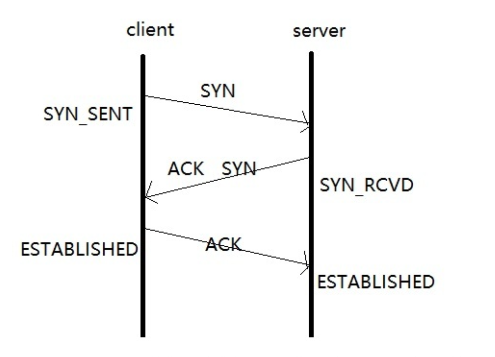
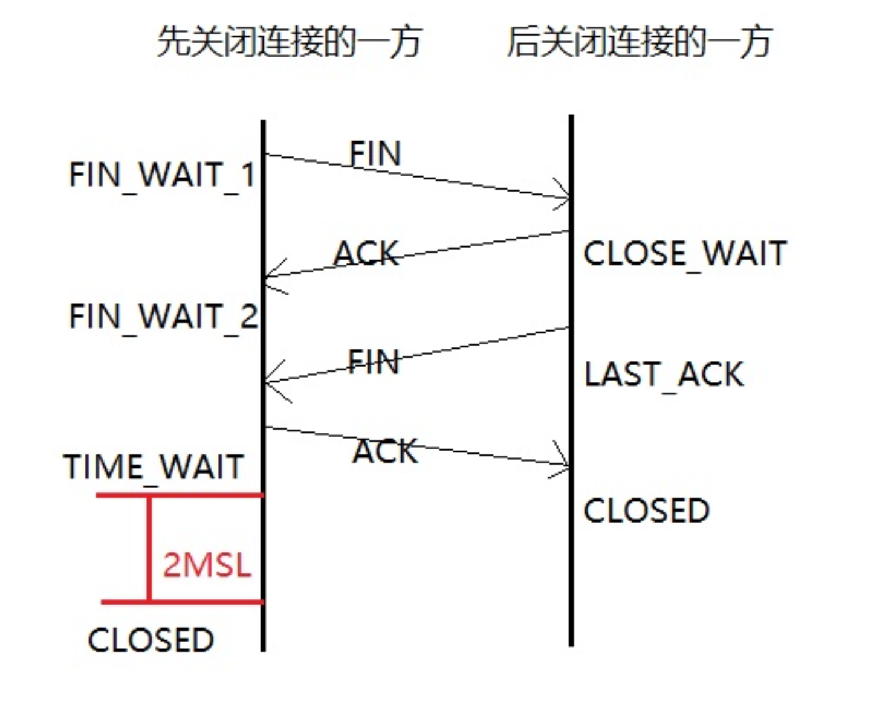

## UDP 协议

UDP（User Data Protocol，用户数据报协议），是与 TCP 相对应的协议。它是面向非连接的协议，它不与对方建立连接，而是直接就把数据包发送过去。


**UDP 主要特点**

- UDP 是无连接的。

- UDP 使用尽最大努力交付，即不保证可靠交付，因此主机不需要维持复杂的链接状态（这里面有许多参数）。

- UDP 是面向报文的。

- UDP 没有拥塞控制，因此网络出现拥塞不会使源主机的发送速率降低。


### UDP 和 TCP 的特点与区别

TCP 的特点

- **可靠性**：TCP 是可靠的数据传输协议，确保数据完整地从发送端传输到接收端。它通过确认机制、超时重传和流量控制等机制来保证数据的可靠传输。
- **面向连接**：在数据传输之前，TCP 需要建立连接。连接建立的过程包括三次握手，确保双方都准备好进行数据传输。
- **字节流**：TCP 将数据视为字节流，不保留数据的边界。接收端需要根据应用层协议来解析数据。
- **顺序传输**：TCP 保证数据按照发送的顺序到达接收端。每个数据包都有一个序列号，接收端可以根据序列号重新组装数据。
- **流量控制**：TCP 使用滑动窗口机制来控制数据的发送速度，确保发送端不会发送过快，导致接收端无法处理。
- **拥塞控制**：TCP 通过算法机制来管理网络拥塞。它能够检测网络拥塞并调整发送速度，以防止数据包丢失和网络拥塞加剧。

UDP 的特点

- **不可靠**：UDP 是不可靠的数据传输协议，不保证数据的可靠传输。它不提供确认机制、超时重传和流量控制等机制，数据可能会丢失或乱序到达。
- **无连接**：UDP 是无连接的协议，数据可以立即发送。发送端不需要事先建立连接，可以直接向接收端发送数据。
- **数据报**：UDP 将数据视为独立的数据报，每个数据报都有自己的目的地址和端口号。接收端根据这些信息来处理数据。
- **数据边界保留**：UDP 保留数据的边界，接收端可以获取完整的数据报。
- **无流量控制**：UDP 不执行流量控制，发送端可以以任意速度发送数据，可能导致接收端无法处理。
- **无拥塞控制**：UDP 不执行拥塞控制，发送端不会根据网络拥塞情况调整发送速度。

TCP 与 UDP 的主要区别

- **可靠性**：
  - TCP：可靠的数据传输，通过确认机制、超时重传和流量控制等机制确保数据完整传输。
  - UDP：不可靠的数据传输，不保证数据的可靠传输。
- **面向连接性**：
  - TCP：面向连接，需要建立连接才能进行数据传输。
  - UDP：无连接，数据可以立即发送。
- **数据传输方式**：
  - TCP：字节流，不保留数据边界。
  - UDP：数据报，保留数据边界。
- **连接过程**：
  - TCP：需要三次握手建立连接，四次挥手关闭连接。
  - UDP：不需要建立连接，数据可以直接发送。
- **报头开销**：
  - TCP：报头开销较大，包含更多控制信息。
  - UDP：报头开销较小，只包含少量控制信息。
- **拥塞控制**：
  - TCP：执行拥塞控制。
  - UDP：不执行拥塞控制。
- **应用场景**：
  - TCP：适用于需要可靠数据传输的场景。
  - UDP：适用于对实时性要求较高、对数据可靠性要求较低的场景。

## TCP协议

### 网络的七层结构及其作用

自上而下是：

- 应用层（数据）：应用层是用户与网络的接口，提供了各种网络应用服务。例如，Web浏览器、电子邮件客户端、FTP客户端等都是应用层的应用程序。它们通过应用层协议（如**HTTP、SMTP、FTP**）与网络通信。

- 表示层（数据）：表示层负责数据的格式转换、加密和解密等。它处理数据的表示形式，如将数据从一种格式转换为另一种格式，或者对数据进行加密以确保安全传输。

- 会话层（数据）：会话层负责建立、管理和终止会话。它控制两个节点之间的会话，确保数据的有序传输。例如，登录数据库服务器需要建立一个会话连接。

- 传输层（段）：传输层提供端到端的通信服务，确保数据的可靠传输。在**TCP**协议中，传输层负责分段和重组数据，建立和维护连接。传输层通过端口号区分不同的应用程序，如HTTP服务使用80端口。TCP 、UDP。
  - **设备**：传输层的相关技术包括但不限于**负载均衡器**，但它本身不是一个物理设备，而是通过**软件实现的协议**。

- 网络层（包）：网络层负责将数据从源地址传输到目的地址，提供路径选择和寻址服务。在IP协议中，网络层的设备根据IP地址选择路径。IP地址是逻辑地址，可以跨多个网络寻址。
  - **设备**：路由器是网络层的关键设备。路由器根据路由表决定数据包的转发路径。

- 数据链路层（帧）：将物理层传输的比特流组织成帧，并负责链路访问和差错控制。它在两个相邻节点之间传输数据帧，以“帧”为单位处理数据。
  - **设备**：数据链路层的设备包括交换机和网桥。在以太网中，以太帧有目标MAC地址、源MAC地址、类型等字段。在发送方，链路层将IP包封装成以太帧；在接收方，链路层从以太帧中提取IP包。

- 物理层（比特流）：负责通过物理介质传输比特流（0和1）。它定义了网络设备的机械、电气和功能特性，如电缆、接头、电压等。例如，RJ45接头的引脚定义（引脚1发送，引脚2接收等）就是物理层的定义内容。
  - **设备**：物理层的设备包括电缆、集线器、中继器等。

### TCP协议

TCP/IP协议按照层次分为以下四层。应用层、传输层、网络层、数据链路层。

TCP（Transmission Control Protocol，传输控制协议）是面向连接的协议，也就是说，在收发数据前，必须和对方建立可靠的连接。一个TCP连接必须要经过三次“对话”才能建立起来，其中的过程非常复杂

### TCP三次握手

**步骤一：第一次握手**

1. **客户端发起请求**：
   - 客户端发起请求，向服务器发送一个 `SYN` 数据包，其中包含一个随机生成的初始序列号 `ISN`。
2. **进入状态**：
   - 客户端进入 `SYN-SENT` 状态，等待服务器的响应。

**步骤二：第二次握手**

1. **服务器回应**：
   - 服务器接收到客户端的 `SYN` 数据包后，会生成一个确认序列号 `ACK`，这个确认序列号是客户端初始序列号 `ISN + 1`。
2. **服务器生成序列号**：
   - 服务器同时生成一个自己的初始序列号 `J`。
3. **发送数据包**：
   - 服务器向客户端发送一个带有 `SYN` 和 `ACK` 标志的数据包，确认收到客户端的请求。
4. **状态变化**：
   - 此时，服务器处于 `SYN-RCVD` 状态。

**步骤三：第三次握手**

1. **客户端确认**：
   - 客户端收到服务器的 `SYN+ACK` 数据包后，再次发送一个 `ACK` 数据包，确认收到来自服务器的请求。
   - 该 `ACK` 数据包的确认号是服务器的初始序列号 `J + 1`。
2. **状态变化**：
   - 客户端和服务器都进入 `ESTABLISHED` 状态，握手过程完成，表示 TCP 连接已经建立。

总结

- **第一次握手**：客户端向服务器发送建立连接的请求。
- **第二次握手**：服务器确认请求，同时返回自己的序列号。
- **第三次握手**：客户端确认服务器的序列号，连接建立完成。



### 为什么 TCP 连接需要三次握手？

TCP 连接需要三次握手，主要是为了确保双方在建立连接时都能够准确同步并确认对方的存在和状态。以下是为什么两次握手不够的原因：

1. **无法区分重复请求**

- 如果只有两次握手，客户端发送一个 `SYN` 请求后，服务器发送一个 `ACK` 响应。但如果这个 `ACK` 响应返回到客户端时，客户端网络出现故障，或者客户端没有收到响应，客户端会重新发送 `SYN` 请求。如果服务器没有一个机制来确认客户端确实已经接收到它的响应，就会导致无法区分哪些是重复的请求，从而可能建立重复的连接。

2. **无法确认双方都准备好**

- 三次握手可以确保双方都准备好进行通信。第一次握手（客户端发送 `SYN`）表示客户端想要建立连接，第二次握手（服务器发送 `SYN+ACK`）表示服务器同意建立连接并且已经准备好接收数据，第三次握手（客户端发送 `ACK`）表示客户端确认了服务器的响应并且也准备好发送数据。如果只有两次握手，服务器无法确认客户端是否已经准备好接收数据，从而可能导致数据丢失或混乱。

3. **避免旧连接的干扰**

- 网络中可能存在延迟的数据包，这可能导致旧的连接请求在新连接建立时被误认为是新的请求。通过三次握手，可以确保双方都使用最新的序列号和确认号，从而避免旧连接的干扰。

4. **确保数据传输的可靠性**

- TCP 是一个面向连接的协议，旨在提供可靠的数据传输。三次握手是 TCP 可靠性的一部分，它可以确保在连接建立之前，双方都已经同步了初始序列号和其他重要参数，从而为后续的数据传输提供了一个可靠的通信通道。

5. **序列号协商**

- 在三次握手中，双方可以协商和确认初始序列号。这些序列号用于确保数据包的顺序和完整性。如果只有两次握手，序列号的协商可能无法正确完成，从而导致数据传输的混乱。


### TCP三次握手过程中有哪些不安全性？

1. **SYN Flood 攻击**

- **原理**：攻击者伪造大量虚假IP地址，向服务器发送大量的SYN包，但不发送ACK包来完成连接建立。这导致服务器的半连接队列满，无法接受新的连接请求，最终导致服务不可用或崩溃。
- **防御措施**：
  - **使用SYN Cookie技术**：服务器在第二次握手时不会为第一次握手的SYN创建半开连接，而是生成一个cookie一起发送给客户端，只有客户端在第三次握手发送ACK报文并且验证cookie成功服务器才会创建TCP连接，分配资源。
  - **调整半连接队列的大小**：通过设置`net.ipv4.tcp_max_syn_backlog`参数来增加半连接队列的大小。
  - **限制同一IP地址的连接数量**：通过设置`net.ipv4.tcp_syncookies`参数来启用SYN Cookie功能。
  - **使用防火墙和IDS/IPS系统**：在网络边界处使用防火墙和入侵检测/防御系统来识别和过滤异常流量。

2. **会话劫持**

- **原理**：攻击者窃取TCP连接的会话信息，在建立连接的过程中介入并获得数据传输的权限。
- **防御措施**：
  - **使用加密通信机制**：如TLS（Transport Layer Security）协议等，确保通信的安全性。
  - **加强身份认证**：使用强身份认证机制，防止攻击者冒充合法用户。

3. **TCP连接劫持**

- **原理**：攻击者在连接建立过程中，通过伪造或篡改数据包来控制连接。
- **防御措施**：
  - **使用安全协议**：如TLS协议，确保数据传输的安全性和完整性。
  - **加强数据包验证**：对数据包进行严格验证，确保其来源和内容的合法性。

4. **消息丢失**

- **原理**：在握手过程中，消息可能因网络延迟或丢包而丢失，导致连接建立失败。
- **防御措施**：
  - **重传机制**：SYN和FIN报文段有最大重传次数，达到最大重传次数后对端若仍无响应则直接进入CLOSED状态。
  - **调整超时时间**：根据网络环境调整超时时间，确保在网络环境不稳定或延迟较高的情况下仍能够成功建立连接。

5. **中间人攻击**

- **原理**：攻击者在客户端和服务器之间拦截和篡改数据包，从而获取敏感信息或篡改数据。
- **防御措施**：
  - **使用加密通信**：如TLS协议，确保数据传输的安全性和完整性。
  - **加强身份认证**：使用强身份认证机制，防止攻击者冒充合法用户。

6. **源IP地址伪造**

- **原理**：攻击者伪造源IP地址，发送大量的SYN包，导致服务器无法正确识别客户端。
- **防御措施**：
  - **使用源认证**：通过发送SYN报文探测源地址是否真实存在。
  - **限制连接速率**：通过设置`net.ipv4.tcp_syn_retries`参数来限制连接重传次数。

7. **ACK Flood 攻击**

- **原理**：攻击者向服务器发送大量的ACK报文，服务器忙于回复这些凭空出现的第三次握手报文，导致资源耗尽，无法响应正常的请求。
- **防御措施**：
  - **会话检查**：通过检查会话来确定ACK报文的真实性。
  - **使用抗DDoS设备**：抗DDoS设备对ACK报文进行会话检查，支持基本和严格两种模式。


### 什么是 TCP 四次挥手？

四次挥手，简单来说，就是：

发送方：我要和你断开连接！

接收方：好的，断吧。

接收方：我也要和你断开连接！

发送方：好的，断吧。


TCP 四次挥手是 TCP 协议中用于终止连接的一个过程，具体如下：

**第一次挥手**

- **客户端发送 FIN**：客户端完成数据发送后，向服务器发送一个FIN（Finish）包，表示不再发送数据，但仍然可以接收数据。此时，客户端进入 FIN-WAIT-1 状态。

**第二次挥手**

- **服务器接收 FIN 并发送 ACK**：服务器收到客户端的 FIN 后，会发送一个 ACK 包作为确认，同时记录客户端的 FIN 序列号。此时，服务器进入 CLOSE-WAIT 状态，而客户端进入 FIN-WAIT-2 状态。

**第三次挥手**

- **服务器发送 FIN**：如果服务器也完成了数据发送，它会向客户端发送一个 FIN 包，表示不再发送数据。此时，服务器进入 LAST-ACK 状态。

**第四次挥手**

- **客户端接收 FIN 并发送 ACK**：客户端收到服务器的 FIN 后，会发送一个 ACK 包作为确认。此时，客户端进入 TIME-WAIT 状态，服务器进入 CLOSED 状态。客户端会在等待一段时间后，确认服务器已收到 ACK，然后关闭连接进入 CLOSED 状态。

**总结**

TCP 四次挥手确保了连接的优雅终止，让双方都能确认对方已经完成数据发送并准备好关闭连接，避免了数据丢失和连接状态的不一致。



**为什么要有TIME_WAIT状态？**

TIME_WAIT状态存在有两个原因。

一、可靠终止TCP连接。如果最后一个ACK报文因为网络原因被丢弃，此时server因为没有收到ACK而超时重传FIN报文，处于TIME_WAIT状态的client可以继续对FIN报文做回复，向server发送ACK报文。

二、保证让迟来的TCP报文段有足够的时间被识别和丢弃。连接结束了，网络中的延迟报文也应该被丢弃掉，以免影响立刻建立的新连接。

### TCP粘包、拆包及解决办法

一、什么是TCP粘包和拆包

**TCP粘包**是指在TCP传输过程中，发送方将多个数据包合并成一个大的数据包发送，接收方在接收时无法区分每个数据包的边界，导致数据包粘连在一起。例如，发送方发送了两个数据包“Hello”和“World”，但由于网络延迟或缓冲区大小的原因，这两个数据包被合并成一个数据包“HelloWorld”发送到接收方，接收方在读取时就会出现粘包问题。

**TCP拆包**是指在TCP传输过程中，发送方将一个大的数据包拆分成多个小的数据包发送，接收方在接收时需要将这些小的数据包重新组装成一个完整的数据包。例如，发送方发送了一个很长的字符串，但由于网络阻塞等原因，发送方将该字符串拆分成多个小的数据包发送，接收方在接收时需要将这些小的数据包重新组装成一个完整的字符串。

二、为什么会产生TCP粘包和拆包

TCP是一个面向连接的、可靠的、基于字节流的传输层通信协议。它并不保证消息的边界，因此在传输过程中可能会出现粘包和拆包的现象。具体原因如下：

1. **TCP缓冲区**：TCP在传输数据时，会将数据放入缓冲区中，当缓冲区满时，会将数据发送出去。如果发送方发送的数据量较小，可能会被合并成一个大的数据包发送，导致粘包。
2. **网络延迟**：网络延迟可能导致数据包在传输过程中被合并或拆分，从而导致粘包和拆包。
3. **应用层协议**：应用层协议没有明确的消息边界，导致接收方无法准确区分每个数据包的边界。

三、解决TCP粘包和拆包的方法

1. **固定数据大小**：发送方在发送数据时，每个数据包都固定长度，如果数据长度不足，则通过补充空格的方式补全到指定长度。接收方按照固定的长度读取数据，从而避免粘包和拆包的问题。
2. **自定义请求协议**：将消息分为头部和消息体，在头部中保存有当前整个消息的长度，只有在读取到足够长度的消息之后才算是读到了一个完整的消息。
3. **特殊字符结尾**：在每个数据包的末尾添加一个特殊的字符，如`\n`，接收方根据这个特殊字符来识别数据包的边界。
4. **禁止Nagle算法**：Nagle算法会导致TCP缓存中存在小的数据包，当多个数据包同时到达时就会出现粘包问题。可以设置`TCP_NODELAY`选项禁用Nagle算法，即每个输出数据报只要有数据都立刻就发出去，反之则等待到缓存区满或超时才发送
5. **基于应用层协议**：使用现有的应用层协议（如HTTP、Protobuf、JSON-RPC等）来处理消息边界，通常这些协议已经定义了自己的消息格式和解析方式

## HTTP 协议

### 在浏览器地址栏输入一个 URL 后回车，背后发生了什么？

1. **DNS 解析**

- **目的**：将域名解析为 IP 地址。
- **过程**：
  1. 浏览器首先检查本地缓存（包括 DNS 缓存和 Hosts 文件），看是否有该域名对应的 IP 地址。
  2. 如果没有，浏览器会向本地 DNS 服务器发送 DNS 查询请求。
  3. 本地 DNS 服务器会递归查询或迭代查询其他 DNS 服务器，直到找到目标域名对应的 IP 地址。
  4. DNS 服务器将解析结果返回给浏览器，浏览器会将该 IP 地址缓存一段时间，以便下次快速访问。

2. **建立 TCP 连接**

- **目的**：与目标服务器建立可靠的网络连接。
- **过程**：
  1. 浏览器使用解析得到的 IP 地址，通过 TCP 协议向目标服务器发起连接请求（SYN 包）。
  2. 服务器收到请求后，会回复一个 SYN-ACK 包，表示同意建立连接。
  3. 浏览器再发送一个 ACK 包，确认连接建立。至此，TCP 三次握手完成，连接建立成功。

3. **发送 HTTP 请求**

- **目的**：向服务器请求指定的资源。
- **过程**：
  1. 浏览器通过已建立的 TCP 连接，向服务器发送 HTTP 请求。请求中包含请求方法（如 GET、POST）、请求头（如 Host、User-Agent、Accept 等）和请求体（对于 POST 请求）。
  2. 请求方法：通常使用 GET 方法获取资源，使用 POST 方法提交数据。
  3. 请求头：包含客户端信息、请求内容类型等。
  4. 请求体：对于 POST 请求，包含要提交的数据。

4. **服务器处理请求**

- **目的**：服务器根据请求内容，处理并返回响应。
- **过程**：
  1. 服务器接收到 HTTP 请求后，根据请求方法和 URL，确定要处理的资源或服务。
  2. 服务器可能需要查询数据库、调用后端服务或执行其他业务逻辑来处理请求。
  3. 服务器将处理结果封装成 HTTP 响应，包含状态码（如 200 表示成功，404 表示未找到等）、响应头（如 Content-Type、Content-Length 等）和响应体（如 HTML 页面、JSON 数据等）。

5. **接收 HTTP 响应**

- **目的**：浏览器接收服务器返回的响应，并进行处理。
- **过程**：
  1. 浏览器通过 TCP 连接接收服务器返回的 HTTP 响应。
  2. 浏览器解析 HTTP 响应，根据状态码判断请求是否成功。
  3. 如果请求成功，浏览器会根据响应头中的 Content-Type 等信息，对响应体进行相应的处理。例如，如果是 HTML 页面，浏览器会解析并渲染页面；如果是 JSON 数据，浏览器可能会将其解析为 JavaScript 对象。

6. **渲染页面**

- **目的**：将接收到的资源展示给用户。
- **过程**：
  1. 如果响应是 HTML 页面，浏览器会解析 HTML 文档，构建 DOM 树。
  2. 浏览器会根据 CSS 样式和 JavaScript 脚本，对页面进行渲染和交互处理。
  3. 如果页面中包含其他资源（如图片、CSS 文件、JavaScript 文件等），浏览器会根据这些资源的 URL，再次发起 HTTP 请求获取并加载它们。

7. **关闭连接**

- **目的**：释放网络资源。
- **过程**：
  1. 浏览器和服务器完成数据传输后，会根据 HTTP 协议的 Keep-Alive 机制决定是否关闭连接。
  2. 如果连接需要关闭，浏览器和服务器会通过 TCP 四次挥手过程，关闭连接。

### 生产Nginx现大量TIME-WAIT 的原因是什么？

1. **短连接导致的 TIME-WAIT**

- **原因**：Nginx 与后端服务器之间使用的是 HTTP 短连接（HTTP/1.0 或 HTTP/1.1 未启用 Keep-Alive）。每次请求完成后，连接会被主动关闭，导致大量 TIME-WAIT 状态的连接。

- **解决方案**：

  - **启用 HTTP Keep-Alive**：在 Nginx 配置中启用 `proxy_http_version 1.1;` 和 `proxy_set_header Connection "";`，以启用 HTTP/1.1 的 Keep-Alive 功能，减少连接的建立和关闭次数。

    ```nginx
    location / {
        proxy_pass http://backend;
        proxy_http_version 1.1;
        proxy_set_header Connection "";
    }
    ```

  - **配置 Upstream Keep-Alive**：在 Nginx 的 upstream 模块中配置 `keepalive` 参数，设置可复用的 TCP 连接的空闲数量的最大值，以减少连接的创建和销毁。

    ```nginx
    upstream backend {
        server backend_server:80;
        keepalive 50;
    }
    ```

2. **高并发请求导致的 TIME-WAIT**

- **原因**：在高并发场景下，Nginx 与后端服务器之间的连接频繁建立和关闭，导致 TIME-WAIT 状态的连接数量迅速增加。

- **解决方案**：

  - **增加 Keep-Alive 请求次数**：调整 Nginx 的 `keepalive_requests` 参数，增加每个 Keep-Alive 连接可以处理的请求数量，减少连接的关闭频率。

    ```nginx
    http {
        keepalive_requests 1000;
    }
    ```

  - **优化后端服务器配置**：确保后端服务器也支持 HTTP Keep-Alive，并配置合理的超时时间，避免连接过早关闭。

3. **后端服务器主动关闭连接**

- **原因**：后端服务器在处理完请求后主动关闭连接，导致 Nginx 作为客户端进入 TIME-WAIT 状态。
- **解决方案**：
  - **检查后端服务器配置**：确保后端服务器未禁用 HTTP Keep-Alive，并配置合理的超时时间。
  - **调整后端服务器超时时间**：增加后端服务器的超时时间，避免连接过早关闭。

4. **网络问题导致的连接超时**

- **原因**：网络延迟或不稳定导致连接超时，Nginx 会主动关闭连接，进入 TIME-WAIT 状态。
- **解决方案**：
  - **优化网络环境**：检查网络设备和线路，确保网络稳定。
  - **调整超时时间**：增加 Nginx 和后端服务器的超时时间，避免因网络波动导致连接过早关闭。

5. **客户端连接超时**

- **原因**：客户端在请求完成后未及时关闭连接，导致 Nginx 与后端服务器之间的连接保持时间过长，最终进入 TIME-WAIT 状态。

- **解决方案**：

  - **设置客户端超时时间**：在 Nginx 中设置 `client_body_timeout` 和 `client_header_timeout` 参数，确保客户端在规定时间内完成请求。

    ```nginx
    http {
        client_body_timeout 60;
        client_header_timeout 60;
    }
    ```

6. **系统参数配置不当**

- **原因**：系统参数如 `tcp_fin_timeout` 设置过长，导致 TIME-WAIT 状态的连接保持时间过长。

- **解决方案**：

  - **调整系统参数**：修改 `/proc/sys/net/ipv4/tcp_fin_timeout` 文件，将 TIME-WAIT 状态的持续时间缩短。

    ```bash
    echo 30 > /proc/sys/net/ipv4/tcp_fin_timeout
    ```

  - **优化 TCP 参数**：调整 `net.ipv4.tcp_tw_reuse` 和 `net.ipv4.tcp_tw_recycle` 参数，启用 TIME-WAIT 状态连接的重用和快速回收。

    ```bash
    sysctl -w net.ipv4.tcp_tw_reuse=1
    sysctl -w net.ipv4.tcp_tw_recycle=1
    ```

### Http与Https的区别

HTTP 的URL 以http:// 开头，而HTTPS 的URL 以https:// 开头

HTTP 是不安全的，而 HTTPS 是安全的

HTTP 标准端口是80 ，而 HTTPS 的标准端口是443

在OSI 网络模型中，HTTP工作于应用层，而HTTPS 的安全传输机制工作在传输层

HTTP 无法加密，而HTTPS 对传输的数据进行加密

HTTP无需证书，而HTTPS 需要CA机构颁发的SSL证书

### HTTP优化方案

一、协议升级

- **升级到HTTP/2或HTTP/3**：HTTP/2引入了多路复用、头部压缩等特性，显著减少了连接建立时间和数据传输量。HTTP/3则进一步基于QUIC协议，提供了更好的连接恢复机制和更低的延迟。升级Web服务器以支持HTTP/2或HTTP/3，并正确配置。启用ALPN（Application-Layer Protocol Negotiation）以加快TLS握手过程中的协议选择。

二、内容分发网络（CDN）

- **使用CDN**：通过在全球多个地理位置部署缓存节点，CDN可以缩短用户与资源之间的物理距离，从而加速内容交付。选择合适的CDN服务提供商，如Cloudflare、Akamai等。配置静态资源缓存，将图片、CSS、JavaScript等静态文件托管到CDN上。设置智能路由，根据用户的地理位置自动选择最近的节点进行内容分发。

三、资源优化

- **合并与压缩文件**：在Web开发中，合并CSS和JavaScript文件是减少HTTP请求数量的有效方法。使用工具如Webpack、Gulp等，将多个CSS和JavaScript文件合并成一个文件。对于图片，使用CSS Sprites技术将多个小图片合并成一张大图，利用CSS的`background-position`属性来显示不同的图标。
- **图片优化**：对网站中的图片进行格式转换和压缩，将部分JPEG格式的图片转换为WebP格式，利用其更好的压缩比来减小文件大小。通过服务器端的脚本，根据浏览器的支持情况，动态地为用户提供WebP或JPEG格式的图片。实施图片懒加载和响应式图片技术，为图片添加`loading="lazy"`属性，实现图片懒加载。对于响应式图片，利用`<picture>`标签，根据不同设备的屏幕尺寸和分辨率，提供合适大小的图片资源。

四、缓存策略

- **浏览器缓存**：通过设置合适的HTTP头字段来控制缓存。对于静态资源，如CSS、JavaScript和图片文件，设置`Cache-Control`头字段为`max-age=31536000`（一年），确保这些资源在浏览器中长时间缓存。对于动态变化的资源，如商品库存信息，设置为`no-cache`，确保每次请求都能获取最新数据。
- **服务端缓存**：在服务端，引入Redis作为缓存中间件，将热门商品信息、用户会话信息等缓存起来。通过合理设置缓存过期时间和缓存预热机制，提高缓存命中率，减少数据库的访问压力。

五、请求优化

- **减少或避免重定向**：重定向会增加中间多余请求开销，应尽量减少或避免不必要的重定向。
- **通过不同域请求资源**：一个域下并行下载资源的数目有限，并行数量一般为4-6个。通过使用多个域来请求资源，可以增加并行下载数量，提高加载速度。
- **避免404**：404请求会造成网络请求处理时间较长，占用带宽从而影响其他资源的请求。应确保所有请求的资源都存在，避免404错误。
- **避免img标签等src链接为空**：空的src链接会增加无效请求，应确保img标签等的src链接有效。

六、内容加载与缓存配置

- **优化请求顺序**：优化请求的顺序可以确保关键资源优先加载。在页面加载过程中，应优先加载对用户交互和页面渲染至关重要的资源，如CSS、关键JS脚本等。对于非关键资源，可以采用异步加载或延迟加载的方式，避免阻塞页面渲染。
- **浏览器预取与预加载**：提前告知浏览器即将需要的资源，以便它可以在后台预先获取这些资源，减少实际使用时的等待时间。使用`<link rel="dns-prefetch">`提前解析外部域名，使用`<link rel="preload">`提示浏览器尽早加载重要的资源，使用`<link rel="prerender">`使浏览器在后台开始渲染指定页面。

七、后端处理优化

- **减少后端处理时间**：服务器响应的延迟可能由资源分布、后端逻辑或数据库查询导致。优化数据库查询，使用索引或分布式数据库，减少后端处理时间。
- **启用HTTP/2或HTTP/3协议**：利用多路复用减少连接延迟。

八、用户端优化

- **实现关键资源的优先加载**：通过`rel="preload"`提前加载关键CSS和JS。
- **压缩图片文件**：使用WebP格式替换png等格式图片，减少资源体积。


### GET方法与POST方法的区别

| 方面         | GET方法                                                      | POST方法                                                     |
| :----------- | :----------------------------------------------------------- | :----------------------------------------------------------- |
| **语义**     | 用于从服务器获取资源。                                       | 用于向服务器提交数据，通常用于更改服务器上的资源。           |
| **参数传递** | 通过URL传递参数，参数显示在URL中。                           | 通过请求体（body）传递参数，参数不显示在URL中。              |
| **安全性**   | 不安全，因为参数暴露在URL中，容易被记录和共享。              | 相对安全，参数不在URL中显示，减少了敏感信息被泄露的风险。    |
| **缓存**     | 可以被浏览器和服务端缓存，适合用于获取静态资源。             | 不会被缓存，在每次请求时都会重新发送数据。                   |
| **幂等性**   | 是幂等的，多次相同的GET请求应该返回相同的结果，不会对服务器状态造成影响。 | 不是幂等的，多次相同的POST请求可能会导致数据重复插入或其他副作用。 |
| **限制**     | URL长度有限制（通常为2048个字符），不能传递大量数据。        | 无明显限制，可以传递大量数据。                               |
| **默认行为** | 是大多数浏览器表单的默认方法，适用于简单的数据查询。         | 适用于复杂的数据提交和文件上传。                             |

### Session和cookie的区别

1. **存储位置**

- **Cookie**: 存储在客户端（用户的浏览器中）。服务器发送 Cookie 到客户端后，浏览器会将其保存到本地磁盘，直到过期或被删除。
- **Session**: 存储在服务器端。服务器生成一个唯一标识符（Session ID），并将其存储在内存或数据库中，同时将 Session ID 通过 Cookie 或 URL 传递给客户端。

2. **安全性**

- **Cookie**: 安全性较低。由于 Cookie 存储在客户端，可能会被用户篡改或被黑客窃取。如果 Cookie 中包含敏感信息（如用户认证信息），容易引发安全问题。
- **Session**: 安全性较高。Session 数据存储在服务器端，只有 Session ID 通过网络传输，降低了敏感数据泄露的风险。

3. **数据量**

- **Cookie**: 数据量有限。大多数浏览器对单个 Cookie 的大小限制为 4KB 左右，并且同一域名下的 Cookie 总数通常不能超过 20 个。
- **Session**: 数据量相对较大。服务器端存储 Session 数据，理论上可以存储更多数据，但实际存储的数据量取决于服务器的内存和存储配置。

4. **生命周期**

- **Cookie**: 生命周期可以是会话级（关闭浏览器后失效）或持久级（在指定的时间后失效）。通过设置 `Set-Cookie` 的 `Expires` 或 `Max-Age` 参数来控制。
- **Session**: 生命周期通常与浏览器会话相关联。默认情况下，当用户关闭浏览器时，Session 会失效。服务器也可以通过配置设置 Session 的超时时长。

5. **数据控制**

- **Cookie**: 客户端可以修改或删除 Cookie，因此不能完全信任从 Cookie 中读取的数据。
- **Session**: 服务器端完全控制 Session 数据，可以更安全地管理用户会话。

6. **使用场景**

- **Cookie**: 适用于存储一些非敏感的用户偏好设置（如主题颜色、语言等）和简单的会话信息（如是否登录）。
- **Session**: 适用于需要更安全地存储用户会话信息的场景，如购物车、用户认证等。

7. **依赖性**

- **Cookie**: 不依赖于服务器端的资源，所有数据都存储在客户端。
- **Session**: 依赖于服务器端的资源（如内存、数据库等），会增加服务器的负担。

### HTTP 与 TCP 的区别

1. **定义**

- **HTTP (Hyper Text Transfer Protocol)**：超文本传输协议，是一种在浏览器与Web服务器之间传送超文本的传送协议。
- **TCP (Transmission Control Protocol)**：传输控制协议，是基于连接的协议，用于在网络中传输数据。

2. **作用**

- **HTTP**：用于在浏览器和Web服务器之间进行通信，主要负责请求和响应消息的传输。
- **TCP**：为IP协议提供错误恢复和流量控制，是网络模型中运输层协议，并对上层协议（如HTTP）进行支持。

3. **工作方式**

- **HTTP**：通过请求-响应的方式进行通信。浏览器发送HTTP请求到服务器，服务器处理请求并返回HTTP响应。
- **TCP**：通过建立连接进行数据传输。在传输数据之前，必须先建立一个可靠的连接，数据以数据流的形式传输，并通过序列号和确认号来保证数据的可靠传输。

4. **安全性**

- **HTTP**：是明文传输，容易被窃听。通常会使用 HTTPS（HTTP Secure）来加密传输。
- **TCP**：本身不提供加密功能，但在数据传输的安全性方面，TCP通过三次握手和四次挥手等机制确保了连接的可靠性和数据的完整性。

5. **应用范围**

- **HTTP**：主要用于Web应用，包括网页浏览、图片、视频等资源的传输。
- **TCP**：广泛应用于各种网络通信场景，包括文件传输、电子邮件、远程登录等。

6. **特性**

- **HTTP**：
  - **无状态**：每个请求都是独立的，服务器不会保留客户端的状态信息。
  - **明文传输**：默认情况下，数据以明文形式传输，可以被中间设备读取和修改。
- **TCP**：
  - **面向连接**：在数据传输之前需要建立连接。
  - **可靠传输**：通过确认和重传机制确保数据的可靠传输。
  - **流式传输**：数据以流的形式传输，没有消息边界。

## IO模型

### nio和 bio 、aio的区别

BIO（Blocking I/O）

- **定义**：同步阻塞 I/O 模型，是传统 Java I/O 编程模型。
- **工作原理**：服务器端为每个客户端连接创建一个独立的线程来处理请求，线程在 I/O 操作时会阻塞，直到操作完成。
- **优缺点**：
  - **优点**：实现简单，代码直观易懂。
  - **缺点**：在高并发场景下，由于每个连接都需要一个线程，线程的创建和切换会消耗大量资源，导致性能瓶颈。

**NIO（Non-blocking I/O）**

- **定义**：同步非阻塞 I/O 模型，是 Java 1.4 引入的 New I/O。
- **工作原理**：基于通道（Channel）和缓冲区（Buffer），使用选择器（Selector）来管理多个 Channel，实现异步 I/O 操作，一个线程可以同时处理多个连接。
- **优缺点**：
  - **优点**：适合高并发场景，资源利用率高。
  - **缺点**：实现相对复杂，需要手动处理事件循环和回调，开发者需自己处理线程管理。

**AIO（Asynchronous I/O）**

- **定义**：异步非阻塞 I/O 模型， Java 7 引入的 Asynchronous I/O 。
- **工作原理**：基于事件驱动和回调机制，真正的异步 I/O 。操作发起后不会阻塞线程，可在后台等待 I/O 完成，完成后通知线程处理。
- **优缺点**：
  - **优点**：无需轮询，直接唤醒线程处理事件，效率高。
  - **缺点**：目前支持的操作系统有限，且异步编程模型较难理解，代码复杂。