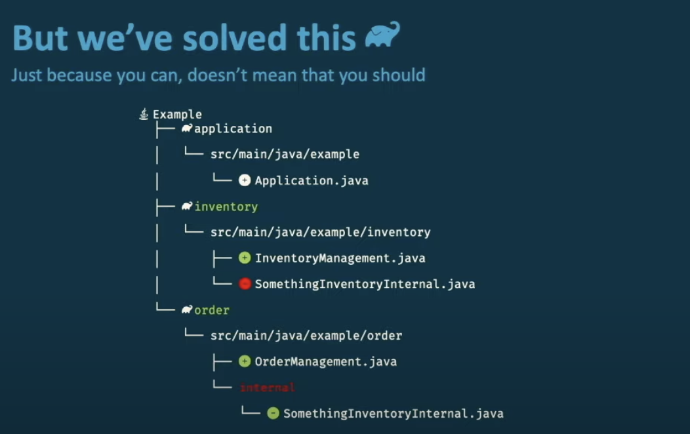
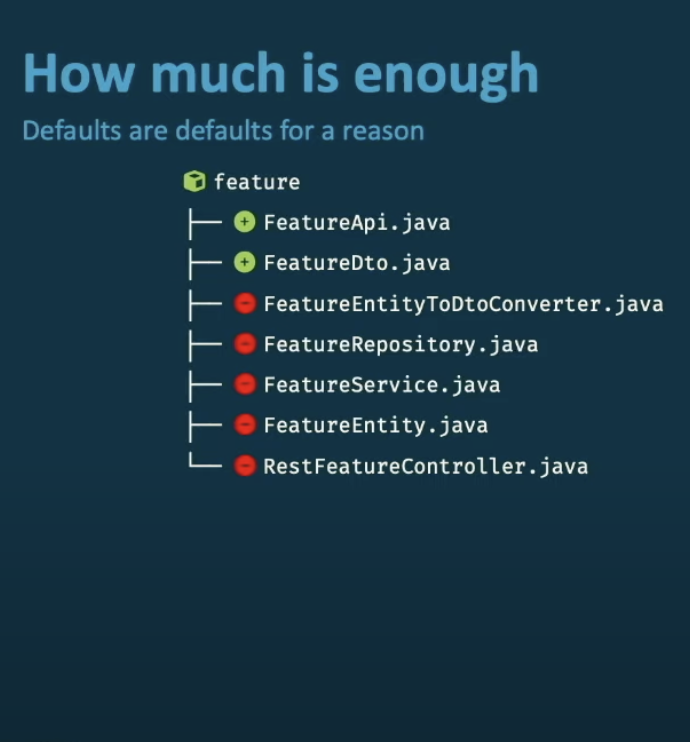
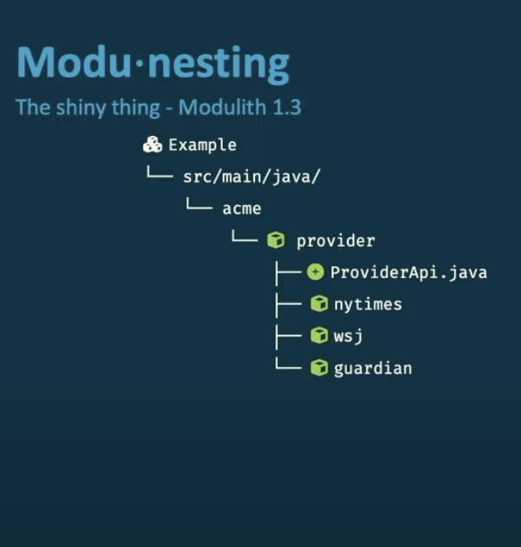

## 架构发展历程

参考 [1.软件架构编年史(译)](https://www.jianshu.com/p/b477b2cc6cfa)，架构发展经历以下几个阶段：

- **过程式/函数式编程**
- **MVC 模式(Model-View-Controller)**
- **面向对象编程**
- **CORBA**
- **Message Bus**
- **EBI 架构**(Entity-Boundary-Interactor) 
- **面向方面编程**
- **Web Services**
- **ESB**
- **DDD**
- **MVVM 模式**
- **端口和适配器架构**，即六边形架构
- **洋葱架构**
- **微服务**
- **DCI 架构**(Data-Context-Interaction)
- **整洁架构**
- **C4 模型**

## 分层架构


## 单体架构和微服务

> https://www.youtube.com/watch?v=430YOyMNjhs&t=565s


单体架构：应用打包多个边界上下文到一个部署单元。所有应用代码被部署并*运行在单一节点的单一进程中*。

- 容易重构
- 容易测试整个系统
- 除非明确管理，否则可能会降级
- 更难测试单个限界上下文

微服务：上下文的有界上下文定义了部署构件的边界。某些部分甚至被部署为单独的进程。

- 有界上下文交互是远程的

- 测试单个模块

- 难以重构上下文边界

- 很难对整个系统进行测试

## 包和命名空间

**包内聚原则**

- **REP** – [重用发布等价原则](http://docs.google.com/a/cleancoder.com/viewer?a=v&pid=explorer&chrome=true&srcid=0BwhCYaYDn8EgOGM2ZGFhNmYtNmE4ZS00OGY5LWFkZTYtMjE0ZGNjODQ0MjEx&hl=en)
   *重用的粒度等价于发布的粒度*
- **CCP** – [共同封闭原则](http://docs.google.com/a/cleancoder.com/viewer?a=v&pid=explorer&chrome=true&srcid=0BwhCYaYDn8EgOGM2ZGFhNmYtNmE4ZS00OGY5LWFkZTYtMjE0ZGNjODQ0MjEx&hl=en)
   *一起被修改的类应该放在一个包里*
- **CRP** – [共同重用原则](http://docs.google.com/a/cleancoder.com/viewer?a=v&pid=explorer&chrome=true&srcid=0BwhCYaYDn8EgOGM2ZGFhNmYtNmE4ZS00OGY5LWFkZTYtMjE0ZGNjODQ0MjEx&hl=en)
   *一起被重用的类应该放在一个包里*

**包耦合原则**

- **ADP** – [无环依赖原则](http://docs.google.com/a/cleancoder.com/viewer?a=v&pid=explorer&chrome=true&srcid=0BwhCYaYDn8EgOGM2ZGFhNmYtNmE4ZS00OGY5LWFkZTYtMjE0ZGNjODQ0MjEx&hl=en)
   *包的依赖图中不能出现循环*
- **SDP** – [稳定依赖原则](http://docs.google.com/a/cleancoder.com/viewer?a=v&pid=explorer&chrome=true&srcid=0BwhCYaYDn8EgZjI3OTU4ZTAtYmM4Mi00MWMyLTgxN2YtMzk5YTY1NTViNTBh&hl=en)
   *依赖应该朝着稳定的方向前进*
- **SAP** – [稳定抽象原则](http://docs.google.com/a/cleancoder.com/viewer?a=v&pid=explorer&chrome=true&srcid=0BwhCYaYDn8EgZjI3OTU4ZTAtYmM4Mi00MWMyLTgxN2YtMzk5YTY1NTViNTBh&hl=en)
   *抽象的级别越高，稳定性就越高*

包的分层：

- 按照层打包
- 按照功能打包

## Spring Modulith

>  https://www.youtube.com/watch?v=hLa0SOVN6xQ&t=138s











基础概念：

1、**应用程序模块**

在 Spring Boot 应用程序中，应用程序模块是一个功能单元，是一个包，它由以下部分组成：

- 向 Spring Bean 实例实现的其他模块和模块发布的应用程序事件公开的 API，通常称为*提供的接口*。
- 不应被其他模块访问的内部实现组件。
- 对其他模块以 Spring bean 依赖项、侦听的应用程序事件和公开的配置属性的形式公开的 API 的引用，通常称为*必需接口*。

应用程序的*主包*是主应用程序类（@SpringBootApplicatio）所在的包，默认情况下，主包的每个直接子包都被视为*一个应用程序模块包*。

2、**简单的应用程序模块**：不包含任何子包，该包下可以有 public、private 的类。

3、**高级应用程序模块**：包含子包的应用程序模块。子包中的 internal 包为内部子包，其中的代码不得从其他模块引用。

4、**嵌套应用程序模块**：在高级应用模块的子包中可以包含子包，并在 package-info.java 中添加 @ApplicationModule 注解。

- 嵌套模块中的代码可以被父包或者兄弟模块访问
- *嵌套*模块中的任何代码都可以访问父模块中的代码，甚至是内部代码
- 嵌套模块中的代码也可以访问顶级应用程序模块公开的类型

5、**开放应用模块**：@ApplicationModule 标准的模块默认是封闭的，只能访问其他模块的公开类型。可以在该注解上添加 type = Type.OPEN 将其变为开放的。

```java
@org.springframework.modulith.ApplicationModule(
  type = Type.OPEN
)
package example.inventory;
```

6、**显式应用程序模块依赖关系**：模块可以选择使用`@ApplicationModule`软件包上的注释来声明其允许的依赖项

```java
@org.springframework.modulith.ApplicationModule(
  allowedDependencies = "order"
)
package example.inventory;
```

7、**命名接口**：可以给子包添加命名接口，让后允许其他模块访问

```java
@org.springframework.modulith.NamedInterface("spi")
package example.order.spi;

@org.springframework.modulith.ApplicationModule(
  allowedDependencies = "order :: spi"
)
package example.inventory;

// or
@org.springframework.modulith.ApplicationModule(
  allowedDependencies = "order :: *"
)
package example.inventory;
```

**自定义模块检测**:

- 在启动类上使用 @Modulithic 注解的 additionalPackages 属性，添加其他包作为根应用程序包
- 使用配置：`spring.modulith.detection-strategy=explicitly-annotated`，仅考虑使用了注解的包
- 使用自定义的策略：`spring.modulith.detection-strategy=example.CustomApplicationModuleDetectionStrategy`
- 通过 spring.factories 文件：`org.springframework.modulith.core.ApplicationModuleSourceFactory=example.CustomApplicationModuleSourceFactory`


spring modulith 示例代码：

- https://github.com/odrotbohm/arch-evident-spring
- https://github.com/odrotbohm/spring-modulith-deep-dive/
- https://github.com/vicziani/jtechlog-spring-modulith

## 参考

### Software Architecture

- [The Software Architecture Chronicles](https://herbertograca.com/2017/07/03/the-software-architecture-chronicles/)
- [Hexagonal architecture by Alistair Cockburn](https://alistair.cockburn.us/hexagonal-architecture/)
- [Hexagonal Architecture - What Is It? Why Should You Use It?](https://www.happycoders.eu/software-craftsmanship/hexagonal-architecture/)
- [Hexagonal Architecture with Spring Boot](https://www.happycoders.eu/software-craftsmanship/hexagonal-architecture-spring-boot/)
- [Layered Architecture](https://herbertograca.com/2017/08/03/layered-architecture/)
- [The Clean Architecture by Uncle Bob](https://blog.cleancoder.com/uncle-bob/2012/08/13/the-clean-architecture.html)
- [Everything You Need to Know About Hexagonal Architecture: Kernel, Ports, Adapters](https://scalastic.io/en/hexagonal-architecture/)
- [Get Your Hands Dirty on Clean Architecture](https://www.amazon.in/Your-Hands-Dirty-Clean-Architecture/dp/180512837X/)
- [Overengineering in Onion/Hexagonal Architectures](https://victorrentea.ro/blog/overengineering-in-onion-hexagonal-architectures/)
- [CQRS Pattern With Spring Boot](https://www.vinsguru.com/cqrs-pattern/)
- [CQRS pitfalls and patterns](https://www.youtube.com/watch?v=Lw04HRF8ies)
- [Greg Young — A Decade of DDD, CQRS, Event Sourcing](https://www.youtube.com/watch?v=LDW0QWie21s)
- [Modular Monoliths • Simon Brown](https://www.youtube.com/watch?v=5OjqD-ow8GE)
- [Five things every developer should know about software architecture by Simon Brown](https://www.youtube.com/watch?v=jzp0PGVegHA)
- [Package by Layer vs Feature](https://phauer.com/2020/package-by-feature/)

### Domain Driven Design

- [Domain-Driven Design: Tackling Complexity in the Heart of Software](https://www.amazon.in/Domain-Driven-Design-Tackling-Complexity-Software/dp/0321125215)
- [Implementing Domain-Driven Design](https://www.amazon.in/Implementing-Domain-Driven-Design-Vaughn-Vernon/dp/0321834577)
- [Domain-Driven Design: Everything You Always Wanted to Know About it, But Were Afraid to Ask](https://medium.com/ssense-tech/domain-driven-design-everything-you-always-wanted-to-know-about-it-but-were-afraid-to-ask-a85e7b74497a)
- [DDD Part 1: Strategic Domain-Driven Design](https://vaadin.com/blog/ddd-part-1-strategic-domain-driven-design)
- [Domain-Driven Design Crew](https://github.com/ddd-crew)

### Documenting Architecture

- [Architectural Decision Records (ADRs)](https://adr.github.io/)
- [The C4 model for visualising software architecture](https://c4model.com/)

### Enforcing Coding & Architecture Guidelines

- Coding Standards and Bug Pattern Detectors
  - [CheckStyle](https://checkstyle.sourceforge.io/)
  - [PMD](https://pmd.github.io/), [SpotBugs](https://spotbugs.github.io/)
  - [ErrorProne](https://github.com/google/error-prone)
  - [SonarQube](https://www.sonarsource.com/products/sonarqube/)
- [ArchUnit](https://www.archunit.org/) - Enforce architecture guidelines as tests
- [Spring Modulith](https://spring.io/projects/spring-modulith) - Enforce modularity in Modular Monoliths

### Reference Implementations

- [Spring-Boot application based on hexagonal architecture and DDD](https://github.com/hirannor/springboot-hexagonal-ddd)
- [Hexagonal Architecture (Kotlin)](https://github.com/jesperancinha/favourite-lyrics-app)
- [Modular Monolith Java application with DDD](https://github.com/anton-liauchuk/educational-platform)
- [Spring RealWorld Conduit API](https://github.com/sivaprasadreddy/spring-realworld-conduit-api)
- [Event-driven architecture (Transactional outbox, Inbox, and Saga patterns)](https://github.com/rkudryashov/event-driven-architecture)
- [Spring Boot Hexagonal Architecture](https://github.com/naspredam/rest-spring-boot-hexagonal-architecture)
- [Clean Architecture in Spring](https://github.com/spember/spring-shoestore)
- [Modular Monolith Applications with Spring Modulith and Domain Driven Design](https://github.com/xsreality/spring-modulith-with-ddd)
- [CQRS with Event Sourcing](https://github.com/asc-lab/java-cqrs-intro)
- [Spring Boot Microservices Application](https://github.com/sivaprasadreddy/spring-boot-microservices-course)
- [Spring Boot using Spring Modulith](https://github.com/sivaprasadreddy/sivalabs-youtube-code-samples/tree/main/spring-boot-modulith-demo)