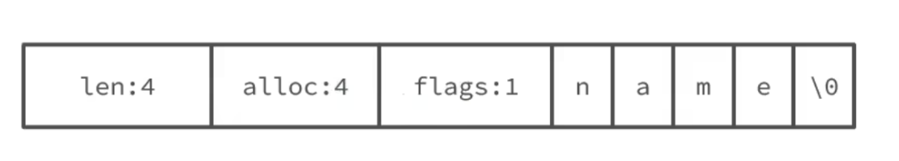

## 特性


## 原理

1. 内存数据库
   - 高性能读写。数据存储在内存中，访问速度极快，适用于高频次的读写操作。
     - 内存数据结构化存储，避免了磁盘I/O延迟。
     - 使用哈希表、跳表等高效数据结构提升查找效率。
   - 数据持久化机制。
2. 单线程模型，避免了线程切换和竞态产⽣的消耗
   - I/O 多路复用。使用epoll、kqueue等高效的I/O多路复用技术处理大量并发连接。
     - 能够同时监听多个客户端请求并按序处理。
     - 避免了传统多线程模型中的锁竞争问题。
   - 非阻塞网络通信。所有网络通信均采用非阻塞模式，确保单线程高吞吐量。
     - 请求与响应处理分离，避免长时间操作阻塞主线程。
     - 异步任务通过事件驱动实现。

3. 数据同步
   - 主从复制。主节点将数据变化同步给从节点，保证数据一致性。
     - 支持全量复制和增量复制两种方式。
     - 从节点可以作为备份或负载均衡使用。
   - 增量复制与全量复制。
     - 全量复制：初次建立主从关系时，主节点将所有数据发送给从节点。
     - 增量复制：主节点记录操作命令日志，从节点断线重连后仅同步缺失部分。

> 面试题：单机的Redis可以⽀撑每秒⼗万的并发，原因在于：
>
> 1. 完全基于内存操作
>    1. Redis6.0的多线程是⽤多线程来处理数据的读写和协议解析，但是Redis执⾏命令还 是单线程的 。
> 2. 使⽤单线程
>    - **无锁竞争**：核心命令处理采用单线程，避免了多线程上下文切换和锁竞争的开销。
>    - **顺序原子性**：所有操作按顺序原子执行，天然保证线程安全。
>    - **现代CPU单核性能**：单线程可充分利用现代CPU单核性能（3GHz CPU单核每秒可处理3亿条指令）。
> 3. 基于⾮阻塞的IO多路复⽤机制
>    - **epoll/kqueue**：基于操作系统的多路复用机制，单线程可管理数万连接。
>    - **事件驱动**：仅处理活跃连接的事件，避免无效轮询（相比select/poll效率提升显著）。
> 4. 高效数据结构与协议
>    - **优化数据结构**：SDS（动态字符串）、跳跃表、压缩列表等结构实现O(1)/O(logN)时间复杂度。
>    - **二进制安全RESP协议**：简单协议解析仅需线性扫描，无复杂语法解析开销。
> 5. 持久化优化
>    - **异步写入**：RDB快照和AOF重写由子进程执行，主进程无阻塞。
>    - **AOF追加写**：采用追加写入模式（顺序写速度可达400MB/s以上）。
> 6. 系统级优化
>    - **大页内存**：启用透明大页（THP）减少内存管理开销。
>    - **绑核与中断优化**：通过CPU绑核（taskset）和网络中断亲和性（irqbalance）提升缓存命中率。


## 数据结构

### String

- 基本介绍：最基本的简直逗结构，支持字符串、整数、浮点数，最大容量 512MB
- 内部实现：int 和 SDS（简单动态字符串）
- 常用指令：SET、GET、INCR、MSEt、SETNX
- 应用场景：
  - 缓存数据：存储用户登录状态、token、配置信息
  - 计数器：访问次数、点赞、转发、库存数量
  - 限速

我们都知道Redis中保存的Key是字符串，value往往是字符串或者字符串的集合。可⻅字符串是Redis中最常⽤的⼀种数据结构。

```c
//c语⾔，声明字符串
char* s ="hello"
//本质是字符数组： {'h'，'e'，'l', 'l', 'o'，'\0'}
```

不过Redis没有直接使⽤C语⾔中的字符串，因为C语⾔字符串存在很多问题：

- 获取字符串⻓度的需要通过运算
- ⾮⼆进制安全
- 不可修改

Redis构建了⼀种新的字符串结构，称为简单动态字符串 (Simple Dynamic String)SDS。例如，我们执⾏命令：

```bash
127.0.0.1:6379> set name hi
```

那么Redis将在底层创建两个SDS，其中⼀个是包含name的SDS，另⼀个是包含hi的SDS。
字符串name的sds结构如下：



字符串hi的sds结构如下：


假如我们要给SDS追加⼀段字符串,Amy，这⾥⾸先会申请新内存空间：

- 如果新字符串⼩于1M，则新空间为扩展后字符串⻓度的两倍+1；
- 如果新字符串⼤于1M，则新空间为扩展后字符串⻓度+1M+1。称为内存预分配。

### List

- 基本介绍：列表类型，⽤来存储多个有序的字符串。按照插入顺序，可以从头部或者尾部向 list 列表添加元素
- 内部实现：3.2 版本之前使用双向链表或压缩列表。3.2 版本之后，只有 **qucklist** 实现
- 常用命令：LPUSH、LPOP、RPUSH、RPOP、BLPOP、BROP
- 应用场景：
  - 消息队列：生产者通过 LPUSH 添加消息，消防者通过 BRPOP 获取消息
  - 动态列表：存储用户最新动态，通过 LTRIM 控制列表长度
  - 秒杀场景：将秒杀成功的用户写入 list

### Set

- 基本介绍：一个无序并且唯一的集合类型，可以取交集、并集、差集
- 内部实现：由哈希表或者整数集合实现
- 常用命令：SADD、SREM、SCARD
- 应用场景：用户签到、点赞、网站访问统计、抽奖、共同关注、好友推荐等等

### ZSet

- 基本介绍：有序集合，比 Set 类型多了一个排序书写 score，score 可以重复。支持范围查询。
- 内部实现：跳表或者压缩列表。在 7.0 之后，**listpack** 替代了压缩列表
- 常用命令：ZADD、ZREM、ZCARD、ZSCORE、ZRANGE、ZREVRANGE
- 应用场景：排行榜、时间线等

### Hash

- 基本介绍：Hash 是一个键值对集合。
- 内部实现：由压缩列表或哈希表实现。在 Redis 7.0 中，压缩表数据结构已经废弃，交由 **listpack** 来实现了。
- 常用命令：HSET、HGET、HMSET、HGETALL、HDEL
- 应用场景：
  - 缓存对象：存储用户信息、对象信息

### BitMap

- 基本介绍：使用二进制位表示状态，占用极小存储空间
- 内部实现：
- 常用命令：SETBIT、GETBIT、BITCOUNT
- 应用场景：统计海量在线用户数量等

### HyperLogLog

- 基本介绍：用于高性能的基数（去重）统计功能，优点是只需要使用 12k 的空间就能统计 2^64 的数据，但它的缺点是存在 0.81% 的误差。
- 内部实现：
- 常用命令：pfadd、pfcount、pfmerge
- 应用场景：统计在线用户数、签到功能等

## 持久化

Redis 持久化拥有以下三种方式：

- **快照方式**（RDB, Redis DataBase）将某一个时刻的内存数据，以二进制的方式写入磁盘；
- **文件追加方式**（AOF, Append Only File），记录所有的操作命令，并以文本的形式追加到文件中；
- **混合持久化方式**，Redis 4.0 之后新增的方式，混合持久化是结合了 RDB 和 AOF 的优点，在写入的时候，先把当前的数据以 RDB 的形式写入文件的开头，再将后续的操作命令以 AOF 的格式存入文件，这样既能保证 Redis 重启时的速度，又能减低数据丢失的风险。

### RDB

RDB（快照）。定期将内存中的数据保存到磁盘上，生成RDB文件。

RDB 的持久化触发方式有两类：
- 手动触发：
  - save命令：
    - 在客户端中执行 `save` 命令，就会触发 Redis 的持久化，但同时也是使 Redis 处于阻塞状态，直到 RDB 持久化完成，才会响应其他客户端发来的命令，所以**在生产环境一定要慎用**。
  - bgsave命令：
    - `bgsave` 会 fork() 一个子进程来执行持久化，整个过程中只有在 fork() 子进程时有短暂的阻塞，当子进程被创建之后，Redis 的主进程就可以响应其他客户端的请求了。
- 自动触发：
  - save m n：在 m 秒内，如果有 n 个键发生改变，则自动触发持久化。
  - flushall：当 Redis 执行了 `flushall` 命令之后，则会触发自动持久化，把 RDB 文件清空
  - 主从同步触发：在 Redis 主从复制中，当从节点执行全量复制操作时，主节点会执行 `bgsave` 命令，并将 RDB 文件发送给从节点，该过程会自动触发 Redis 持久化。

优点：
- RDB 的内容为二进制的数据，占用内存更小，更紧凑，更适合做为备份文件；
- RDB 对灾难恢复非常有用，它是一个紧凑的文件，可以更快的传输到远程服务器进行 Redis 服务恢复；
- RDB 可以更大程度的提高 Redis 的运行速度，因为每次持久化时 Redis 主进程都会 fork() 一个子进程，进行数据持久化到磁盘，Redis 主进程并不会执行磁盘 I/O 等操作；
- 与 AOF 格式的文件相比，RDB 文件可以更快的重启。

缺点：
- 因为 RDB 只能保存某个时间间隔的数据，如果中途 Redis 服务被意外终止了，则会丢失一段时间内的 Redis 数据；
- RDB 需要经常 fork() 才能使用子进程将其持久化在磁盘上。如果数据集很大，fork() 可能很耗时，并且如果数据集很大且 CPU 性能不佳，则可能导致 Redis 停止为客户端服务几毫秒甚至一秒钟。

### AOF

AOF 把 Redis 每个键值对操作都记录到文件（appendonly.aof）中。。

**1、持久化查询和设置**

```bash
config get appendonly
```

**2、开启 AOF 持久化**

Redis 默认是关闭 AOF 持久化的，想要开启 AOF 持久化，有以下两种方式：

- 通过命令行的方式；

  ```bash
  config set appendonly yes
  ```

- 通过修改配置文件的方式（redis.conf）：在配置文件中设置 `appendonly yes` 即可。

**3、AOF 的触发条件**

分为两种：自动触发和手动触发。

- 自动触发

  - 条件：

    - 满足 AOF 设置的策略触发
    - 满足 AOF 重写触发

  - AOF 持久化策略，分为以下三种：

    - always：每条 Redis 操作命令都会写入磁盘，最多丢失一条数据；

    - everysec：每秒钟写入一次磁盘，最多丢失一秒的数据；

    - no：不设置写入磁盘的规则，根据当前操作系统来决定何时写入磁盘，Linux 默认 30s 写入一次数据至磁盘。

      ```bash
      # 开启每秒写入一次的持久化策略
      appendfsync everysec
      ```

- 手动触发:

  - 在客户端执行 `bgrewriteaof` 命令

**4、AOF 文件重写**

AOF 是通过记录 Redis 的执行命令来持久化（保存）数据的，所以随着时间的流逝 AOF 文件会越来越多，这样不仅增加了服务器的存储压力，也会造成 Redis 重启速度变慢，为了解决这个问题 Redis 提供了 AOF 重写的功能。

1）什么是 AOF 重写？

AOF 重写指的是它会直接读取 Redis 服务器当前的状态，并压缩保存为 AOF 文件。例如，我们增加了一个计数器，并对它做了 99 次修改，如果不做 AOF 重写的话，那么持久化文件中就会有 100 条记录执行命令的信息，而 AOF 重写之后，之后记录一条此计数器最终的结果信息，这样就去除了所有的无效信息。

2）AOF 重写实现

触发 AOF 文件重写，要满足两个条件，这两个条件也是配置在 Redis 配置文件中的，它们分别：

- auto-aof-rewrite-min-size：允许 AOF 重写的最小文件容量，默认是 64mb 。
- auto-aof-rewrite-percentage：AOF 文件重写的大小比例，默认值是 100，表示 100%，也就是只有当前 AOF 文件，比最后一次（上次）的 AOF 文件大一倍时，才会启动 AOF 文件重写。

3）AOF 重写流程

AOF 文件重写是生成一个全新的文件，并把当前数据的最少操作命令保存到新文件上，当把所有的数据都保存至新文件之后，Redis 会交换两个文件，并把最新的持久化操作命令追加到新文件上。

5、优缺点

优点

- AOF 持久化保存的数据更加完整，AOF 提供了三种保存策略：每次操作保存、每秒钟保存一次、跟随系统的持久化策略保存，其中每秒保存一次，从数据的安全性和性能两方面考虑是一个不错的选择，也是 AOF 默认的策略，即使发生了意外情况，最多只会丢失 1s 钟的数据；
- AOF 采用的是命令追加的写入方式，所以不会出现文件损坏的问题，即使由于某些意外原因，导致了最后操作的持久化数据写入了一半，也可以通过 redis-check-aof 工具轻松的修复；
- AOF 持久化文件，非常容易理解和解析，它是把所有 Redis 键值操作命令，以文件的方式存入了磁盘。即使不小心使用 `flushall` 命令删除了所有键值信息，只要使用 AOF 文件，删除最后的 `flushall` 命令，重启 Redis 即可恢复之前误删的数据。

缺点

- 对于相同的数据集来说，AOF 文件要大于 RDB 文件；
- 在 Redis 负载比较高的情况下，RDB 比 AOF 性能更好；
- RDB 使用快照的形式来持久化整个 Redis 数据，而 AOF 只是将每次执行的命令追加到 AOF 文件中，因此从理论上说，RDB 比 AOF 更健壮。

### 混合持久化

RDB 和 AOF 持久化各有利弊，RDB 可能会导致一定时间内的数据丢失，而 AOF 由于文件较大则会影响 Redis 的启动速度，为了能同时使用 RDB 和 AOF 各种的优点，Redis 4.0 之后新增了混合持久化的方式。

在开启混合持久化的情况下，AOF 重写时会把 Redis 的持久化数据，以 RDB 的格式写入到 AOF 文件的开头，之后的数据再以 AOF 的格式化追加的文件的末尾。

**1、混合持久化的加载流程**

混合持久化的加载流程如下：

1. 判断是否开启 AOF 持久化，开启继续执行后续流程，未开启执行加载 RDB 文件的流程；
2. 判断 appendonly.aof 文件是否存在，文件存在则执行后续流程；
3. 判断 AOF 文件开头是 RDB 的格式, 先加载 RDB 内容再加载剩余的 AOF 内容；
4. 判断 AOF 文件开头不是 RDB 的格式，直接以 AOF 格式加载整个文件。

2、优缺点

优点：

- 混合持久化结合了 RDB 和 AOF 持久化的优点，开头为 RDB 的格式，使得 Redis 可以更快的启动，同时结合 AOF 的优点，有减低了大量数据丢失的风险。

缺点：

- AOF 文件中添加了 RDB 格式的内容，使得 AOF 文件的可读性变得很差；
- 兼容性差，如果开启混合持久化，那么此混合持久化 AOF 文件，就不能用在 Redis 4.0 之前版本了。

## 高可用

### 主从复制

主从复制， 是指将⼀台 Redis 服务器的数据，复制到其他的 Redis 服务器。前者称为主节点(master)，后者称为从节点(slave)，且数据的复制是单向的 ，只能由主节点到从节点 。Redis 主从复制⽀持主从同步和从从同步两种 ，后者是 Redis 后续版本新增的功能，以减轻主节点的同步负担。

主从复制主要的作⽤?

- 数据冗余： 主从复制实现了数据的热备份，是持久化之外的⼀种数据冗 余⽅式。
- 故障恢复： 当主节点出现问题时，可以由从节点提供服务，实现快速的故障恢复 (实际上是⼀种服务的冗余)。
- 负载均衡： 在主从复制的基础上，配合读写分离，可以由主节点提供写服务 ，由从节点提供读服务 （即写 Redis 数据时应⽤连接主节点，读 Redis 数据时应⽤连接从节点 ），分担服务器负载 。尤其是在写少读多的场景下，通过多个从节点分担读负载，可以⼤⼤提⾼ Redis 服务器的并发量 。
- ⾼可⽤基⽯： 除了上述作⽤以外，主从复制还是哨兵和集群能够实施的基础，因此说主从复制是 Redis ⾼可⽤的基础。

Redis的复制拓扑结构可以⽀持单层或多层复制关系 ，根据拓扑复杂性可以分为以下三种：⼀主⼀从、⼀主多从、树状主从结构。

主从复制虽好 ，但也存在⼀些问题 ：

- ⼀旦主节点出现故障，需要⼿动将⼀个从节点晋升为主节点，同时需要修改应⽤⽅的主节点地址，还需要命令其他从节点去复制新的主节点，整个过程都需要⼈⼯⼲预。
- 主节点的写能⼒受到单机的限制。
- 主节点的存储能⼒受到单机的限制。

第⼀个问题是Redis的⾼可⽤问题 ，第⼆、三个问题属于Redis的分布式问题 。

### 哨兵模式

主从复制存在⼀个问题 ，没法完成⾃动故障转移。所以我们需要⼀个⽅案来完成⾃动故障转移， 它就是Redis Sentinel（哨兵） 。

Redis Sentinel ， 它由两部分组成，哨兵节点和数据节点 ：

- 哨兵节点： 哨兵系统由⼀个或多个哨兵节点组成，哨兵节点是特殊的 Redis 节点，不存储数据，对数据节点进⾏监控。
- 数据节点： 主节点和从节点都是数据节点；

**哨兵工作原理**：

哨兵的工作原理是这样的，首先每个 Sentinel 会以每秒钟 1 次的频率，向已知的主服务器、从服务器和以及其他 Sentinel 实例，发送一个 PING 命令。

如果最后一次有效回复 PING 命令的时间超过 down-after-milliseconds 所配置的值（默认 30s），那么这个实例会被 Sentinel 标记为主观下线。

如果一个主服务器被标记为主观下线，那么正在监视这个主服务器的所有 Sentinel 节点，要以每秒 1 次的频率确认主服务器的确进入了主观下线状态。

如果有足够数量（使用 `sentinel set master-name quorum n` 来修改 quorum 参数）的 Sentinel 在指定的时间范围内同意这一判断，那么这个主服务器被标记为客观下线。此时所有的 Sentinel 会按照规则协商自动选出新的主节点。

**主服务竞选规则：**

新主节点的竞选会排除不符合条件的从节点，然后剩余的从节点按照优先级来挑选。首先来说，存在以下条件的从节点会被排除：

1. 排除所有已经下线以及长时间没有回复心跳检测的疑似已下线从服务器；
2. 排除所有长时间没有与主服务器通信，数据状态过时的从服务器；
3. 排除所有优先级（replica-priority）为 0 的服务器。

符合条件的从节点竞选顺序：

1. 优先级最高的从节点将会作为新主节点；
2. 优先级相等则判断复制偏移量，偏移量最大的从节点获胜；
3. 如果以上两个条件都相同，选择 Redis 运行时随机生成 ID 最小那个为新的主服务器。

如果之前的旧主节点恢复上线，会作为从节点运行在主从服务器模式中。

### 集群模式

Redis Cluster 是 Redis 3.0 版本推出的 Redis 集群方案，它将数据分布在不同的服务区上，以此来降低系统对单主节点的依赖，并且可以大大的提高 Redis 服务的读写性能。

Redis 将所有的数据分为 16384 个 slots（槽），每个节点负责其中的一部分槽位，当有 Redis 客户端连接集群时，会得到一份集群的槽位配置信息，这样它就可以直接把请求命令发送给对应的节点进行处理。

Redis Cluster 是无代理模式去中心化的运行模式，客户端发送的绝大数命令会直接交给相关节点执行，这样大部分情况请求命令无需转发，或仅转发一次的情况下就能完成请求与响应，所以集群单个节点的性能与单机 Redis 服务器的性能是非常接近的，因此在理论情况下，当水平扩展一倍的主节点就相当于请求处理的性能也提高了一倍，所以 Redis Cluster 的性能是非常高的。

**槽位定位算法：**

Redis 集群总共的槽位数是 16384 个，每一个主节点负责维护一部分槽以及槽所映射的键值数据，Redis 集群默认会对要存储的 key 值使用 CRC16 算法进行 hash 得到一个整数值，然后用这个整数值对 16384 进行取模来得到具体槽位，公式为：

> slot = CRC16(key) % 16383

**故障发现**

故障发现里面有两个重要的概念：疑似下线（PFAIL-Possibly Fail）和确定下线（Fail）。

集群中的健康监测是通过定期向集群中的其他节点发送 PING 信息来确认的，如果发送 PING 消息的节点在规定时间内，没有收到返回的 PONG 消息，那么对方节点就会被标记为疑似下线。

一个节点发现某个节点疑似下线，它会将这条信息向整个集群广播，其它节点就会收到这个消息，并且通过 PING 的方式监测某节点是否真的下线了。如果一个节点收到某个节点疑似下线的数量超过集群数量的一半以上，就可以标记该节点为确定下线状态，然后向整个集群广播，强迫其它节点也接收该节点已经下线的事实，并立即对该失联节点进行主从切换。

这就是疑似下线和确认下线的概念，这个概念和哨兵模式里面的主观下线和客观下线的概念比较类似。

**故障转移**

当一个节点被集群标识为确认下线之后就可以执行故障转移了，故障转移的执行流程如下：

1. 从下线的主节点的所有从节点中，选择一个从节点（选择的方法详见下面“新主节点选举原则”部分）；
2. 从节点会执行 SLAVEOF NO ONE 命令，关闭这个从节点的复制功能，并从从节点转变回主节点，原来同步所得的数据集不会被丢弃；
3. 新的主节点会撤销所有对已下线主节点的槽指派，并将这些槽全部指派给自己；
4. 新的主节点向集群广播一条 PONG 消息，这条 PONG 消息是让集群中的其他节点知道此节点已经由从节点变成了主节点，并且这个主节点已经接管了原本由已下线节点负责处理的槽位信息；
5. 新的主节点开始处理相关的命令请求，此故障转移过程完成。

**新主节点选举原则**

新主节点选举的方法是这样的：

1. 集群的纪元（epoch）是一个自增计数器，初始值为0；
2. 而每个主节点都有一次投票的机会，主节点会把这一票投给第一个要求投票的从节点；
3. 当从节点发现自己正在复制的主节点确认下线之后，就会向集群广播一条消息，要求所有有投票权的主节点给此从节点投票；
4. 如果有投票权的主节点还没有给其他人投票的情况下，它会向第一个要求投票的从节点发送一条消息，表示把这一票投给这个从节点；
5. 当从节点收到投票数量大于集群数量的半数以上时，这个从节点就会当选为新的主节点。

到这里整个新主节点的选择就完成了。

## 缓存设计

### 缓存雪崩、穿透、击穿

缓存雪崩：指在短时间内，有大量缓存同时过期，导致大量的请求直接查询数据库，从而对数据库造成了巨大的压力，严重情况下可能会导致数据库宕机的情况。

- 解决办法：
  - 分散过期时间：为每个 Key 添加随机值（如基础过期时间 + 随机 1-5 分钟）
  - 集群高可用：使用 Redis Cluster 或主从复制（Sentinel），避免单点故障
  - 持久化与快速恢复：启用 RDB/AOF 持久化，故障后快速重建缓存。
  - 限流降级：使用熔断器限制数据库访问流量。
  - 多级缓存：结合本地缓存（Caffeine）和分布式缓存（Redis），减少穿透风险

缓存穿透：频繁查询数据库和缓存都没有的数据。因为数据库查询无数据，出于容错考虑，不会将结果保存到缓存中，因此每次请求都会去查询数据库。

- 解决办法：
  - **缓存空对象**：对不存在的数据缓存空值，并设置短过期时间（如 5 分钟）
  - **布隆过滤器**：前置过滤器拦截非法请求，判断数据是否存在。
  - **请求校验**：拦截非法参数（如非数字ID、越界值）。

缓存击穿：某个**热点 Key 突然失效**，导致高并发请求直接冲击数据库。

- 解决办法：

  - **互斥锁**：仅允许一个线程重建缓存，其他线程等待。

  - **逻辑过期**：缓存永不过期，但存储逻辑过期时间，异步更新数据。

  - **热点数据永不过期**：不设置 TTL，通过定时任务或更新事件主动刷新缓存。

    

## 运维

### 慢查询

Redis 慢查询重要的配置项有以下两个：

- slowlog-log-slower-than：用于设置慢查询的评定时间，也就是说超过此配置项的命令，将会被当成慢操作记录在慢查询日志中，它执行单位是微秒（1 秒等于 1000000 微秒）；
- slowlog-max-len：用来配置慢查询日志的最大记录数。

```sql
slowlog get

slowlog get 2

slowlog len

slowlog reset
```

### 性能优化

使用以下手段，来提升 Redis 的运行速度：

1. 缩短键值对的存储长度；
2. 使用 lazy free（延迟删除）特性；
   1. lazyfree-lazy-eviction：表示当 Redis 运行内存超过 maxmeory 时，是否开启 lazy free 机制删除；
   2. lazyfree-lazy-expire：表示设置了过期时间的键值，当过期之后是否开启 lazy free 机制删除；
   3. lazyfree-lazy-server-del：有些指令在处理已存在的键时，会带有一个隐式的 del 键的操作，比如 rename 命令，当目标键已存在，Redis 会先删除目标键，如果这些目标键是一个 big key，就会造成阻塞删除的问题，此配置表示在这种场景中是否开启 lazy free 机制删除；
   4. slave-lazy-flush：针对 slave（从节点）进行全量数据同步，slave 在加载 master 的 RDB 文件前，会运行 flushall 来清理自己的数据，它表示此时是否开启 lazy free 机制删除。
3. 设置键值的过期时间；
4. 禁用耗时长的查询命令
   1. 禁止使用 keys 命令；
   2. 避免一次查询所有的成员，要使用 scan 命令进行分批的，游标式的遍历；
   3. 通过机制严格控制 Hash、Set、Sorted Set 等结构的数据大小；
   4. 将排序、并集、交集等操作放在客户端执行，以减少 Redis 服务器运行压力；
   5. 删除（del）一个大数据的时候，可能会需要很长时间，所以建议用异步删除的方式 unlink，它会启动一个新的线程来删除目标数据，而不阻塞 Redis 的主线程。
5. 使用 slowlog 优化耗时命令；
6. 使用 Pipeline 批量操作数据；
7. 避免大量数据同时失效；
8. 客户端使用优化；
9. 限制 Redis 内存大小；
10. 使用物理机而非虚拟机安装 Redis 服务；
11. 检查数据持久化策略：启用混合持久化的方式
12. 使用分布式架构来增加读写速度。
    1. 主从同步
    2. 哨兵模式
    3. Redis Cluster 集群
13. 缓存对象时，使用 hash 替换 json 字符串

## 应用

redis 的使用技巧：

- 限流时，只查询 mysql，不查询数据库
- 两个集群互为备份。需要考虑心跳检测、流量控制问题，不考虑数据同步。
  - 低配集群作为备份
  - 本地集群容错云服务
  - 跨云容错
  - 业务集群互为备份
- 双活架构。
- JSON 转成 Hash 进行存储。Redis 6 如何进行 json 操作
- zset 实现榜单 + 本地缓存
  - 定时任务计算全局的1000名，假设每个小时计算一次。那么即便有突发热点，那么最多一个小时就能看出来；
  - 将1000名定时写入到 Redis，**用 zset 实时维护**。写入的时候删除原有的key然后将1000名写入。这一步是为了尽可能保证榜单数据准确
  - 再起一个定时任务，每一分钟将redis中的前100名（也就是1000中的前100，有可能不是全局的前100）同步到所有节点的本地缓存上，这一步是为了访问效率
  - 从本地读取榜单数据

- zset 实现榜单 + 本地缓存，key 拆分

- Redis中优化大Hash结构、大 key

- 使用 List 来限流

  ```lua
  local key = KEYS[1]
  local limit = tonumber(ARGV[1])
  -- 假设 window 是毫秒表达的
  local window = tonumber(ARGV[2])
  -- 当前时间戳我们要求服务端传过来，因为本质上这个窗口描述的是服务端，
  -- 只是借助了 Redis 来实现，同样是毫秒表达
  local now = tonumber(ARGV[3])
  -- 窗口的最小时间，时间小于这个，就说明已经不在窗口内了
  local windowStart = now - window
  
  
  -- 获得 list 的长度
  local len = tonumber(redis.call('LLEN', key))
  -- 这是一个小优化，避免每个请求都触发淘汰
  if(len >= limit) then
      -- list 满了，现在要淘汰了
      local head = tonumber(redis.call('LPOP', key))
      while head <= windowStart do
          head = tonumber(redis.call('LPOP', key))
      end
      -- 说明当前的 head 还在窗口内，放回去
      redis.call('LPUSH', key, head)
      -- 看看淘汰不在窗口内请求之后，还有多少个
      -- 实际上你可以在 while 循环里面手动维护 len
      -- 我这里为了可读性就再次调用了 LLEN
      len = tonumber(redis.call('LLEN', key))
  end
  
  if(len < limit) then
      -- 插入这个请求的时间戳
      redis.call('RPUSH', key, now)
      redis.call('PEXPIRE', key, window)
      -- 允许
      return 1
  end
  -- 说明超过阈值了
  return 0
  ```


### 发布订阅实现消息队列

消息队列有两个重要的角色，一个是发送者，另一个就是订阅者，对应的命令如下：

- 发布消息：publish channel “message”
- 订阅消息：subscribe channel

Pattern Subscribe 主题订阅，这种方式可以使用 `*` 来匹配多个频道：

```bash
psubscribe pattern [pattern ...]
```

发布订阅模式存在以下两个缺点：

1. 无法持久化保存消息，如果 Redis 服务器宕机或重启，那么所有的消息将会丢失；
2. 发布订阅模式是“发后既忘”的工作模式，如果有订阅者离线重连之后不能消费之前的历史消息。

然而这些缺点在 Redis 5.0 添加了 Stream 类型之后会被彻底的解决。

除了以上缺点外，发布订阅模式还有另一个需要注意问题：当消费端有一定的消息积压时，也就是生产者发送的消息，消费者消费不过来时，如果超过 32M 或者是 60s 内持续保持在 8M 以上，消费端会被强行断开，这个参数是在配置文件中设置的，默认值是 `client-output-buffer-limit pubsub 32mb 8mb 60`。

### List 和 ZSet 实现消息队列

List 优点：

- 消息可以被持久化，借助 Redis 本身的持久化（AOF、RDB 或者是混合持久化），可以有效的保存数据；
- 消费者可以积压消息，不会因为客户端的消息过多而被强行断开。

List 缺点：

- 消息不能被重复消费，一个消息消费完就会被删除；

- 没有主题订阅的功能。

  

ZSet 优点：

- 支持消息持久化；
- 相比于 List 查询更方便，ZSet 可以利用 score 属性很方便的完成检索，而 List 则需要遍历整个元素才能检索到某个值。

ZSet 缺点：

- ZSet 不能存储相同元素的值，也就是如果有消息是重复的，那么只能插入一条信息在有序集合中；
- ZSet 是根据 score 值排序的，不能像 List 一样，按照插入顺序来排序；
- ZSet 没有向 List 的 brpop 那样的阻塞弹出的功能。

### Stream 消息队列

在 Redis 5.0 Stream 没出来之前，消息队列的实现方式都有着各自的缺陷，例如：

- 发布订阅模式 PubSub，不能持久化也就无法可靠的保存消息，并且对于离线重连的客户端不能读取历史消息的缺陷；
- 列表实现消息队列的方式不能重复消费，一个消息消费完就会被删除；
- 有序集合消息队列的实现方式不能存储相同 value 的消息，并且不能阻塞读取消息。

并且以上三种方式在实现消息队列时，只能存储单 value 值，也就是如果你要存储一个对象的情况下，必须先序列化成 JSON 字符串，在读取之后还要反序列化成对象才行，这也给用户的使用带来的不便，基于以上问题，Redis 5.0 便推出了 Stream 类型也是此版本最重要的功能，用于完美地实现消息队列，它借鉴了 Kafka 的设计思路，它支持消息的持久化和消息轨迹的消费，支持 ack 确认消息的模式，让消息队列更加的稳定和可靠。

Stream 既然是一个数据类型，那么和其他数据类型相似，它也有一些自己的操作方法，例如：

- xadd 添加消息；
- xlen 查询消息长度；
- xdel 根据消息 ID 删除消息；
- del 删除整个 Stream；
- xrange 读取区间消息
- xread 读取某个消息之后的消息。
- 消费群组：
  - xgroup：创建消费者群组
  - xreadgroup：读取消费者群组消息
  - xack：收到消费者群组消息，进行确认
  - xpending：查询未确认的消费队列
  - xinfo：查询消费者群组信息
  - xgroup delconsumer：删除消费者
  - xgroup destroy：删除消费组

### 延时队列

通过有序集合（ZSet）的方式来实现延迟消息队列的，ZSet 有一个 Score 属性可以用来存储延迟执行的时间。

### 定时任务

用 Keyspace Notifications（键空间通知）来实现定时任务。

开启键空间通知：

```bash
127.0.0.1:6379> config set notify-keyspace-events Ex
OK
```

notify-keyspace-events 更多配置项说明如下：

- K：键空间通知，所有通知以 `__keyspace@<db>__` 为前缀
- E：键事件通知，所有通知以 `__keyevent@<db>__` 为前缀
- g：DEL、EXPIRE、RENAME 等类型无关的通用命令的通知
- $：字符串命令的通知
- l：列表命令的通知
- s：集合命令的通知
- h：哈希命令的通知
- z：有序集合命令的通知
- x：过期事件，每当有过期键被删除时发送
- e：驱逐（evict）事件，每当有键因为 maxmemory 政策而被删除时发送
- A：参数 g$lshzxe 的别名

要实现定时任务需要使用 Pub/Sub 订阅者和发布者的功能，使用订阅者订阅元素的过期事件，然后再执行固定的任务。

### 事务

事务为多个命令提供一次性按顺序执行的机制，与 Redis 事务相关的命令有以下五个：

- multi：开启事务
- exec：执行事务
- discard：丢弃事务
- watch：为事务提供乐观锁实现
- unwatch：取消监控（取消事务中的乐观锁）

正常情况下 Redis 事务分为三个阶段：开启事务、命令入列、执行事务。Redis 事务并不支持运行时错误的事务回滚，但在某些入列错误，如 `set key` 或者是 `watch` 监控项被修改时，提供整个事务回滚的功能。

### 管道

### 分布式锁

redis 实现：

- setnx + expire
  - 存在问题：死锁、锁被误删、不可重入、锁无法续期
- setnx px + 线程 ID
  - 存在问题：不可重入、锁无法续期
- lua
- Redisson + Redlock

### 布隆过滤器

在 Redis 中不能直接使用布隆过滤器，但我们可以通过 Redis 4.0 版本之后提供的 modules（扩展模块）的方式引入。

```bash
# 方式一：编译方式
git clone https://github.com/RedisLabsModules/redisbloom.git
cd redisbloom
make # 编译redisbloom

./src/redis-server redis.conf --loadmodule ./src/modules/RedisBloom-master/redisbloom.so

# 方式二：Docker 方式
docker run -d -p6379:6379 redislabs/rebloom
```

布隆过滤器的命令不是很多，主要包含以下几个：

1. bf.add：添加元素
2. bf.exists：判断某个元素是否存在
3. bf.madd：添加多个元素
4. bf.mexists：判断多个元素是否存在
5. bf.reserve：**设置布隆过滤器的准确率**


## 参考

黑马程序员 Redis 入门到实战教程 官方的文档 《Redis 入门指南（第 2 版）》 《Redis 使用手册》 【尚硅谷】Redis 6 入门到精通 Redis 开发与运维 《Redis 实战》 《Redis 设计与实现》 极客时间《Redis 源码剖析与实战》 说透 Redis 7