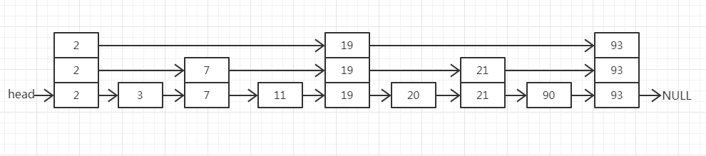

## 特点

单机Redis之所以能支撑每秒十万甚至更高的并发量，得益于其**内存存储架构**、**高效的事件驱动模型**、**单线程设计**以及**优化的网络协议**。以下是具体原因：

1. 内存存储（核心优势）

- **直接内存操作**：Redis数据完全存储在内存中，读写操作无需磁盘I/O，避免了传统数据库的磁盘寻道和机械延迟。
- **数据结构优化**：Redis内置高效数据结构（如哈希表、跳表、压缩列表），时间复杂度为O(1)或O(logN)，确保极快的命令执行速度。

2. 单线程事件驱动模型

- **单线程设计**：Redis采用单线程处理命令（6.0后引入多线程I/O优化，但命令执行仍单线程），避免多线程上下文切换和锁竞争开销。
- **I/O多路复用**：基于`epoll`（Linux）或`kqueue`（BSD）实现非阻塞I/O，单线程可高效管理数万连接。
  1. 通过事件循环（Event Loop）监听所有客户端连接。
  2. 将就绪的请求放入队列。
  3. 单线程顺序执行命令，保证原子性。

3. 优化的网络协议与序列化

- **RESP协议**：Redis使用简单的文本协议（RESP），格式精简，解析速度快，减少网络传输和解析开销。
- **Pipeline支持**：客户端可批量发送多个命令，减少网络往返次数（RTT），显著提升吞吐量。

4. 持久化策略的权衡

- **异步持久化**：默认的RDB快照和AOF日志通过子进程或后台线程执行，主线程不阻塞。
  - **RDB**：定时生成内存快照，适合备份和恢复。
  - **AOF**：记录写命令，通过`appendfsync everysec`平衡性能与数据安全。
- **关闭持久化**：若允许数据丢失，关闭持久化可达到最大性能（仅作为缓存时适用）。

5. 系统与网络优化

- **TCP参数调优**：
  - 提升`somaxconn`（最大连接队列）和`tcp_max_syn_backlog`（SYN队列长度）。
  - 启用`tcp_tw_reuse`快速回收TIME_WAIT连接。
- **内存分配器**：使用`jemalloc`替代默认的`glibc malloc`，减少内存碎片。
- **多实例部署**：单机启动多个Redis实例，绑定不同CPU核心（需禁用NUMA），充分利用多核资源。

## 数据结构

### 1.String（字符串）

支持字符串、整数、浮点数，最大容量 512MB。

**内部实现**

- **底层结构**：`SDS`（Simple Dynamic String，动态字符串），预分配冗余空间减少内存分配次数。
- **编码方式**：
  - `int`：存储整数值时直接使用整数编码。
  - `embstr`：短字符串（≤44字节）直接嵌入对象头，减少内存碎片。
  - `raw`：长字符串使用独立分配的内存空间。

**常用命令**

```
SET key value         # 设置值
GET key               # 获取值
INCR key              # 自增1（原子操作）
DECRBY key decrement  # 自减指定值
APPEND key value      # 追加字符串
STRLEN key            # 获取字符串长度
MSET key1 val1 key2 val2 # 批量设置
MGET key1 key2        # 批量获取
```

**使用场景**

- **缓存**：存储用户会话、页面内容等。
- **计数器**：统计点击量、库存数量（利用原子性操作）。
- **分布式锁**：通过 `SET key value NX EX` 实现互斥锁。
- **短时效数据**：结合 `EXPIRE` 设置过期时间（如验证码）。

### 2.List（列表）

列表类型，⽤来存储多个有序的字符串。按照插入顺序，可以从头部或者尾部向 list 列表添加元素

**内部实现**

- **底层结构**：
  - **Redis 3.2 之前**：元素较少时用 `ziplist`（压缩列表），元素多时转为 `linkedlist`（双向链表）。
  - **Redis 3.2+**：统一使用 `quicklist`（快速列表，由多个 `ziplist` 节点组成的双向链表）。

**常用命令**

```
LPUSH key value1 [value2]  # 左端插入元素
RPUSH key value1 [value2]  # 右端插入元素
LPOP key                   # 左端弹出元素
RPOP key                   # 右端弹出元素
LRANGE key start end       # 获取指定范围元素
LLEN key                   # 获取列表长度
LINDEX key index           # 获取指定索引元素
BLPOP key timeout          # 阻塞式左端弹出
```

**使用场景**

- **消息队列**：`LPUSH` + `BRPOP` 实现生产者-消费者模型。
- **最新消息列表**：固定长度的 `LPUSH` + `LTRIM` 保持最新 N 条数据。
- **分页查询**：`LRANGE` 分页获取历史记录。

### 3.Hash（哈希）

**内部实现**

- **底层结构**：
  - 字段较少时用 `ziplist`（键值对连续存储）。
  - 字段较多时转为 `hashtable`（哈希表，类似 Java 的 HashMap）。
  - 在 Redis 7.0 中，压缩表数据结构已经废弃，交由 **listpack** 来实现了。

**常用命令**

```
HSET key field value    # 设置字段值
HGET key field         # 获取字段值
HMSET key field1 val1 field2 val2  # 批量设置字段
HMGET key field1 field2 # 批量获取字段
HGETALL key            # 获取所有字段和值
HDEL key field         # 删除字段
HINCRBY key field increment # 字段值自增
```

**使用场景**

- **对象存储**：存储用户信息（如 `user:1000` 包含 `name`, `age` 等字段）。
- **购物车**：用户ID为键，商品ID为字段，数量为值。
- **配置管理**：存储系统配置项，支持部分更新。

### 4.Set（集合）

一个无序并且唯一的集合类型，可以取交集、并集、差集

**内部实现**

- **底层结构**：
  - 元素全为整数且数量较少时用 `intset`（整数集合）。
  - 其他情况使用 `hashtable`（哈希表，值为 `NULL`）。

**常用命令**

```
SADD key member1 [member2]  # 添加元素
SREM key member            # 删除元素
SMEMBERS key               # 获取所有元素
SISMEMBER key member       # 判断元素是否存在
SINTER key1 key2           # 求交集
SUNION key1 key2           # 求并集
SCARD key                  # 获取元素数量
SPOP key [count]           # 随机弹出元素
```

**使用场景**

- **标签系统**：存储用户兴趣标签（如 `user:1000:tags`）。
- **共同好友**：`SINTER` 计算两个用户的好友交集。
- **唯一计数器**：记录独立IP访问量（自动去重）。

### 5.Sorted Set（有序集合）

有序集合，比 Set 类型多了一个排序书写 score，score 可以重复。支持范围查询。

**内部实现**

- **底层结构**：
  - 元素较少时用 `ziplist`（按分值排序存储）。
  - 元素较多时用 `skiplist`（跳表） + `dict`（哈希表），跳表支持快速范围查询，哈希表支持 O(1) 分值查找。
  - 在 7.0 之后，**listpack** 替代了压缩列表

**常用命令**

```
ZADD key score1 member1 [score2 member2] # 添加元素
ZRANGE key start end [WITHSCORES]  # 按升序获取范围元素
ZREVRANGE key start end [WITHSCORES] # 按降序获取范围元素
ZRANK key member                  # 获取元素升序排名
ZSCORE key member                 # 获取元素分值
ZINCRBY key increment member      # 增加元素分值
ZREM key member                   # 删除元素
ZCOUNT key min max                # 统计分值区间元素数量
```

**使用场景**

- **排行榜**：实时更新游戏玩家得分排名（如 `ZREVRANGE` 获取 Top 10）。
- **延迟队列**：分值设为执行时间戳，定时任务轮询 `ZRANGEBYSCORE`。
- **范围查询**：存储商品价格区间，快速筛选指定价格商品。

### 6.其他数据结构

1. Bitmaps（位图）

- **本质**：基于 String 的位操作。
- **命令**：`SETBIT`, `GETBIT`, `BITCOUNT`, `BITOP`。
- **场景**：用户签到统计、布隆过滤器。

2. HyperLogLog（基数统计）

- **本质**：概率算法，用于估算不重复元素数量。优点是只需要使用 12k 的空间就能统计 2^64 的数据，但它的缺点是存在 0.81% 的误差。
- **命令**：`PFADD`, `PFCOUNT`, `PFMERGE`。
- **场景**：统计 UV（独立访客数）。

3. Streams（流）

- **本质**：日志型数据结构，支持多消费者组。
- **命令**：`XADD`, `XREAD`, `XGROUP`。
- **场景**：消息队列（替代 Kafka 等中间件的轻量级方案）。

### 底层实现

#### SDS

底层使用结构体，用于替代 C 语言原生的字符数组（`char[]`）。

```c
struct sdshdr {
    uint8_t len;       // 当前字符串长度（已使用的字节数）
    uint8_t alloc;     // 分配的总容量（不包括头部和结尾的 '\0'）
    unsigned char flags; // 类型标志（标识不同的 SDS 类型，如 sdshdr5、sdshdr8 等）
    char buf[];        // 实际存储字符的柔性数组（兼容 C 字符串）
};
```

**特点：**

- **高效的长度获取**：保存了字符串的长度，时间复杂度为 **O(1)**。
- **安全的扩容机制**：修改前会检查剩余空间，不足时自动扩容，避免溢出。
- **内存优化**
  - **预分配**：当新长度小于 `1MB` 时，分配 `2 * len` 的空间；超过 `1MB` 时，每次多分配 `1MB`。
  - **惰性释放**：缩短字符串时不立即释放内存，减少碎片，后续可能复用空间。
  - **类型压缩：**
- **二进制安全**：可安全存储任意二进制数据。

**SDS 与 C 字符串对比**

| **特性**        | **C 字符串**        | **SDS**                       |
| :-------------- | :------------------ | :---------------------------- |
| **长度计算**    | O(n)                | O(1)                          |
| **缓冲区安全**  | 易溢出              | 自动扩容，避免溢出            |
| **内存分配**    | 每次修改需重分配    | 预分配 + 惰性释放，减少重分配 |
| **二进制安全**  | 不支持（依赖 `\0`） | 支持                          |
| **兼容 C 函数** | 是                  | 是（`buf` 末尾添加 `\0`）     |

#### ziplist

**ziplist（压缩列表）** 是一种高效紧凑的线性数据结构，用于存储小型列表、哈希表（Hash）和有序集合（ZSet）等数据。其设计核心是**通过连续内存布局和变长编码，最大化减少内存碎片和指针开销**，适合存储小规模元素。

ziplist 由 **连续的内存块** 组成，其整体结构如下：

```
<zlbytes> <zltail> <zllen> <entry1> <entry2> ... <entryN> <zlend>
```

每个 entry 由 `prevlen`**（前驱节点长度）**、`encoding`（**编码类型）** 和 `content`**（实际数据）** 三部分组成。

**核心优势**：

- **连续内存布局**：无指针开销，减少内存碎片。
- **变长编码**：根据数据大小动态调整存储空间（如小整数用1字节存储）。
- **顺序访问**：利用连续内存特性，遍历时可通过地址偏移快速定位。
- **适合小数据**：当元素数量少且长度较小时，内存占用显著低于链表或哈希表。

**ziplist 的局限性**：

**1. 修改效率低**

- **连锁更新**：插入或删除元素时，可能导致后续多个 entry 的 `prevlen` 字段需要重新分配空间（例如前驱 entry 长度从253字节变为254字节）。
- **全量重分配**：插入元素时若空间不足，需重新分配内存并拷贝全部数据。

**2. 查询复杂度高**

- **随机访问**：需要遍历 entry 链表，时间复杂度为 **O(n)**。
- **长度限制**：`zllen` 字段仅能记录最大 `65535` 个 entry，超出后需遍历计数。

**ziplist 与其他结构的对比**

| **特性**          | **ziplist**            | **hashtable**          | **linkedlist**              |
| :---------------- | :--------------------- | :--------------------- | :-------------------------- |
| **内存效率**      | 极高（紧凑无指针）     | 低（指针和哈希表开销） | 低（指针开销）              |
| **插入/删除性能** | 低（可能触发连锁更新） | 高（平均 O(1)）        | 高（仅指针操作）            |
| **遍历性能**      | 高（内存连续）         | 低（需遍历哈希桶）     | 低（内存不连续）            |
| **适用场景**      | 小规模数据             | 大规模数据             | 已废弃（由 Quicklist 替代） |

#### Quicklist

双向链表，每个节点指向一个 `ziplist`。每个 `ziplist` 内部连续存储多个列表元素，通过 `entry` 紧凑排列 ，减少指针和内存碎片。

- **动态压缩**：支持对中间节点进行 LZF 压缩（通过 `list-compress-depth` 配置），进一步节省内存。

- **平衡的分段策略**：单个 `ziplist` 大小受控（通过 `list-max-ziplist-size` 配置），避免过长 `ziplist` 导致插入/删除性能下降。
- **局部修改高效**：在 `ziplist` 内部进行元素增删时，仅需调整局部数据，无需像链表一样频繁修改指针。
- **节点分裂**：当插入元素导致 `ziplist` 超过阈值时，分裂为两个节点。
- **节点合并**：当删除元素导致相邻 `ziplist` 过小时，合并节点以减少内存碎片。

通过 Redis 配置文件（`redis.conf`）调整 Quicklist 的行为：

| **参数**                | **默认值** | **说明**                                                     |
| :---------------------- | :--------- | ------------------------------------------------------------ |
| `list-max-ziplist-size` | `-2`       | 单个 `ziplist` 最大容量： `-2`：每个 ziplist 不超过 8KB（推荐）； `-1`：每个 ziplist 不超过 4KB ；正数：直接指定元素个数 |
| `list-compress-depth`   | `0`        | 压缩深度： `0`：不压缩 ； `1`：压缩首尾各 1 个节点外的所有节点； `n`：压缩首尾各 n 个节点外的所有节点 |

**Quicklist 与其他结构的对比**

| **结构**       | **内存效率**   | **插入/删除性能** | **遍历性能**     | **适用场景**               |
| :------------- | :------------- | :---------------- | :--------------- | :------------------------- |
| **Quicklist**  | 高             | 高（局部调整）    | 高               | 大多数列表场景             |
| **Ziplist**    | 极高           | 低（全量重分配）  | 高               | 小规模列表（元素少且固定） |
| **Linkedlist** | 低（指针开销） | 高（仅指针操作）  | 低（内存不连续） | 已废弃，不推荐使用         |

**Quicklist 的应用场景**

| 使用场景 | 实现方式                                                     | 优势                                       |
| -------- | ------------------------------------------------------------ | ------------------------------------------ |
| 消息队列 | 通过 `LPUSH`/`BRPOP` 操作实现生产者-消费者模型               | Quicklist 的分段策略确保高并发下的稳定性能 |
| 最新列表 | `LPUSH` + `LTRIM` 维护固定长度的最新记录（如最近 1000 条新闻） | `ziplist` 的紧凑存储减少内存占用           |
| 分页查询 | 使用 `LRANGE` 分页获取历史数据                               | Quicklist 的连续内存布局提升遍历效率       |

**总结**：

- **Quicklist 的设计目标**：在内存效率和操作性能之间找到最佳平衡，替代早期 `ziplist` 和 `linkedlist` 的不足。
- **核心优势**：
  1. 通过分段 `ziplist` 减少内存碎片。
  2. 动态分裂与合并提升增删效率。
  3. 支持压缩中间节点以节省内存。
- **最佳实践**：
  - 根据业务负载调整 `list-max-ziplist-size` 和 `list-compress-depth`。
  - 避免存储过大的单个元素（如超过 1KB），防止 `ziplist` 性能下降。

#### Hashtable

一种散列表结构，用于存储大量的键值对。它通过哈希函数将键映射到表中的位置，支持高效的查找、插入和删除操作。

**内部实现：**

- **dictEntry**：哈希表节点，存储一个键值对。
- **dictht**：哈希表，管理一个哈希表的所有桶。
- **dict**：控制渐进式 rehash 和多表协作。

- **哈希冲突与链地址法**：当多个键被映射到同一个桶时，会发生哈希冲突。Redis 使用链地址法来解决哈希冲突，即在桶中存储一个链表，将冲突的键值对添加到链表中。

- **渐进式 rehash**：
  - **触发条件**：当哈希表的负载因子（`used/size`）超过阈值（默认 5）时，启动渐进式 rehash。

**特点**

- **高效操作**：支持高效的查找、插入和删除操作，时间复杂度为 **O(1)**。
- **动态调整**：通过渐进式 rehash，能够动态调整哈希表的大小，以适应数据量的变化。
- **内存管理**：占用更多的内存空间，相比 ziplist 消耗更多内存，但在数据量较大时能够高效地管理内存空间。

**使用场景**

- **存储大量元素**：当 Redis 的 Hash 数据类型存储的元素较多且每个元素的值较大时，Redis 会使用 Hashtable 作为底层实现。
- **高效访问**：适用于需要快速查找、插入和删除操作的场景。
- **复杂数据结构**：当存储的数据结构较为复杂，包含多个字段和值时，Hashtable 能够提供更好的性能。

**适用范围**

- **数据量较大**：Hashtable 适合存储元素个数较多（通常超过 512 个）且每个元素的值较大（通常超过 64 字节）的数据。
- **内存敏感场景**：在内存资源充足的情况下，Hashtable 是一个理想的选择，因为它能够提供高效的访问性能。

#### Intset

底层使用 Set 实现，用于存储整数集合。它是一个有序的整数集合，能够高效地存储和操作整数。

**特点：**

- **紧凑存储**：根据元素的实际大小动态调整每个整数的存储空间，支持 16 位、32 位和 64 位整数。
- **有序性**：intset 内部是有序的，插入新元素时会自动维护元素的顺序。
- **无重复元素**：保证集合中没有重复元素，符合 Set 的语义要求。
- **内存高效**：由于 intset 是一个紧凑的数组，它减少了内存碎片，并且不需要额外的指针开销

**使用场景：**

- **小规模整数集合**：当 Set 中的元素数量较少且全部为整数时，Redis 会使用 intset 来存储这些元素。
- **频繁的查找操作**：由于 intset 是有序的，查找操作可以通过二分查找来实现，时间复杂度为 O(log n)，特别适合需要频繁查找的场景

**适用范围：**

- **数据量较小**：intset 适合存储元素个数较少（通常小于 512 个）且每个元素的值较小（通常小于 64 字节）的数据。
- **内存敏感场景**：在内存资源有限的环境中，intset 是一个理想的选择，因为它能够显著减少内存占用

#### skiplist

**基本概念**

- **定义**：跳表是一种基于链表的概率型数据结构，通过创建多个层次的链表来加快搜索速度。每个节点不仅有指向下一节点的指针，还可能有指向更高层次节点的指针，从而实现快速跳跃。
- **用途**：在 Redis 中，跳表主要用于实现 Sorted Set 数据类型，支持高效的范围查询、排名排序和成员查找。

**内部实现**



- **层级结构**：跳表包含多个层级，每个层级都是一个有序链表。底层链表包含所有元素，而上层链表的元素是下层链表的一个子集。
- **节点插入与删除**：插入操作通过随机确定节点的层级，并在相应层级的链表中更新指针。删除操作则根据节点的层级更新指针。

**特点**

- **高效查找**：跳表的查找、插入和删除操作的时间复杂度均为 O(log n)，与二叉搜索树类似。
- **实现简单**：相比平衡树，跳表的实现更简单，且性能接近。
- **动态调整**：跳表通过随机化算法动态调整节点的层级，避免了复杂的平衡操作。
- **内存占用**：由于多层链表的存在，跳表相对占用较多存储空间。

**使用场景**

- **Sorted Set**：Redis 的 Sorted Set 数据类型使用跳表来存储元素，支持高效的范围查询和排名操作。
- **范围查询**：跳表特别适合需要频繁进行范围查询的场景

总结：

| 数据结构    | 基本介绍                                                | 内部实现                                        | 使用场景                         |
| :---------- | :------------------------------------------------------ | :---------------------------------------------- | :------------------------------- |
| String      | 基本键值对结构，可存储文本、数字或二进制数据，最大512MB | SDS简单动态字符串                               | 缓存、计数器、分布式锁、限速控制 |
| Hash        | 键值对集合，适合存储对象属性                            | ziplist、hashtable                              | 用户信息存储、购物车、配置管理   |
| List        | 有序、可重复元素的集合，支持双向操作                    | ziplist、linkedlist、quicklist（Redis 3.2之后） | 消息队列、最新动态、分页查询     |
| Set         | 无序、唯一元素的集合，支持交并差集操作                  | intset、hashtable                               | 标签系统、好友关系、去重统计     |
| Sorted Set  | 元素按分数排序，唯一且可范围查询                        | SkipList                                        | 排行榜、延迟队列、范围查询       |
| Bitmap      | 通过位操作存储布尔值，节省空间                          | 位数组                                          | 签到打卡、特征标记               |
| HyperLogLog | 极低内存估算大规模去重计数，误差约0.81%                 | 近似去重算法                                    | UV统计                           |
| Geo         | 基于Sorted Set实现地理位置查询                          | Sorted Set + GEOHash                            | 附近的人、地理位置查询           |
| Stream      | 持久化消息队列，支持消费者组                            | 消息队列结构                                    | 事件溯源、异步任务               |

## 线程模型

### **Redis 的线程模型演进**

- **Redis 4.0 之前**：**纯单线程模型**，所有操作（包括网络 I/O、命令执行、持久化）均由主线程处理。
- **Redis 4.0+**：引入 **Background I/O Threads（BIO 线程）**，处理阻塞式后台任务（如文件关闭、AOF 刷盘、惰性删除）。
- **Redis 6.0+**：新增 **I/O 多线程**（网络读写并行化），但**命令执行仍为单线程**。

### **后台线程的类型及作用**

#### 1. **BIO 线程（Background I/O Threads）**

- **职责**：处理阻塞式后台任务，避免主线程阻塞。

- **实现**：主线程将任务提交到队列，BIO 线程从队列中取出任务执行。

- **线程安全**：仅处理无竞态的任务（如文件关闭、AOF 刷盘、惰性删除），不涉及数据操作。

- **任务类型**：

  | **任务类型**              | **描述**                                                     |
  | :------------------------ | :----------------------------------------------------------- |
  | **关闭文件描述符**        | 异步关闭 AOF/RDB 文件句柄，避免 `close()` 阻塞主线程。       |
  | **AOF 刷盘（fsync）**     | 将 AOF 缓冲区数据刷盘（若配置为 `appendfsync everysec`）。   |
  | **惰性删除（Lazy Free）** | 异步释放大 Key 内存（如 `UNLINK` 命令、`flushdb async` 等）。 |

- **配置参数**：

  ```bash
  # Redis 配置文件（redis.conf）
  lazyfree-lazy-eviction no    # 内存满时是否异步淘汰 Key
  lazyfree-lazy-expire no      # 过期 Key 是否异步删除
  lazyfree-lazy-server-del no  # 执行 DEL 命令时是否异步删除
  ```

- **性能调优**：若频繁触发惰性删除或 AOF 刷盘，可适当增加线程数（需修改源码）。

#### 2. **I/O 多线程（Redis 6.0+）**

- **职责**：**并行化网络 I/O 的读写**（命令执行仍由主线程处理）。

- 实现：

  - **主线程**：监听客户端连接，接收请求并解析命令（`read()`）。
    - 单线程顺序执行命令，保证原子性。
  - **I/O 多线程**：并行处理已解析命令的**网络响应写入**（`write()`）。

- **线程安全**：仅并行化网络读写，命令执行仍由主线程串行处理，无锁竞争。

- **适用场景**：高并发场景下，减少网络 I/O 延迟对吞吐量的影响。

- **配置参数**：

  ```bash
  # Redis 配置文件（redis.conf）
  io-threads 4          # 启用 4 个 I/O 线程（默认禁用）
  io-threads-do-reads no # 是否启用读线程（通常与写线程共用）
  ```

- **性能调优**：建议设置为 CPU 核数的 50%~70%（如 4 核 CPU 配置 2~3 线程）。

**监控命令**：

```bash
INFO stats         # 查看 lazyfree 相关统计（如 lazyfree_pending_objects）
LATENCY DOCTOR    # 分析阻塞事件是否与后台线程相关
```

#### **总结**

| **线程类型**   | **作用**                  | **是否影响数据一致性**   |
| :------------- | :------------------------ | :----------------------- |
| **BIO 线程**   | 处理阻塞式 I/O 和内存回收 | 否（任务不涉及数据操作） |
| **I/O 多线程** | 加速网络读写              | 否（命令执行仍为单线程） |

**设计原则**：

- **主线程**：保证命令执行的原子性和简单性。
- **后台线程**：仅处理非关键路径的阻塞操作，避免影响主线程性能。

**使用建议**：

- 高并发场景启用 I/O 多线程（Redis 6.0+）。
- 大 Key 删除使用 `UNLINK` 替代 `DEL`，避免主线程阻塞。
- 监控 `lazyfree_pending_objects`，防止异步任务堆积。

## 持久化

Redis 的持久化是其保证数据可靠性的核心机制，通过将内存数据定期或实时写入磁盘，防止服务器宕机时数据丢失。Redis 提供了 **RDB（快照）** 和 **AOF（日志追加）** 两种持久化方式，并支持 **混合持久化（RDB+AOF）**。

**持久化方案对比**

| **特性**       | **RDB**                      | **AOF**                  | **混合持久化**               |
| :------------- | :--------------------------- | :----------------------- | :--------------------------- |
| **数据安全性** | 低（依赖快照频率）           | 高（可配置至秒级）       | 高                           |
| **恢复速度**   | 快                           | 慢                       | 快（RDB快照 + AOF增量）      |
| **文件体积**   | 小                           | 大（需重写优化）         | 中等                         |
| **性能影响**   | 快照生成时占用资源           | 高频写入时可能影响吞吐量 | 介于两者之间                 |
| **适用场景**   | 允许分钟级数据丢失的缓存场景 | 对数据安全性要求高的场景 | 综合场景（推荐生产环境使用） |

## 高可用

### 主从复制

主从复制， 是指将⼀台 Redis 服务器的数据，复制到其他的 Redis 服务器。前者称为主节点(master)，后者称为从节点(slave)，且数据的复制是单向的 ，只能由主节点到从节点 。Redis 主从复制⽀持主从同步和从从同步两种 ，后者是 Redis 后续版本新增的功能，以减轻主节点的同步负担。

主从复制主要的作⽤?

- 数据冗余： 主从复制实现了数据的热备份，是持久化之外的⼀种数据冗余⽅式。
- 故障恢复： 当主节点出现问题时，可以由从节点提供服务，实现快速的故障恢复 (实际上是⼀种服务的冗余)。
- 负载均衡： 在主从复制的基础上，配合读写分离，可以由主节点提供写服务 ，由从节点提供读服务 （即写 Redis 数据时应⽤连接主节点，读 Redis 数据时应⽤连接从节点 ），分担服务器负载 。尤其是在写少读多的场景下，通过多个从节点分担读负载，可以⼤⼤提⾼ Redis 服务器的并发量 。
- ⾼可⽤基⽯： 除了上述作⽤以外，主从复制还是哨兵和集群能够实施的基础，因此说主从复制是 Redis ⾼可⽤的基础。

Redis的复制拓扑结构可以⽀持单层或多层复制关系 ，根据拓扑复杂性可以分为以下三种：⼀主⼀从、⼀主多从、树状主从结构。

主从复制虽好 ，但也存在⼀些问题 ：

- ⼀旦主节点出现故障，需要⼿动将⼀个从节点晋升为主节点，同时需要修改应⽤⽅的主节点地址，还需要命令其他从节点去复制新的主节点，整个过程都需要⼈⼯⼲预。
- 主节点的写能⼒受到单机的限制，主节点的存储能⼒受到单机的限制。

第⼀个问题是Redis的⾼可⽤问题 ，第⼆、三个问题属于Redis的分布式问题 。

### 哨兵模式

主从复制存在⼀个问题 ，没法完成⾃动故障转移。所以我们需要⼀个⽅案来完成⾃动故障转移， 它就是Redis Sentinel（哨兵） 。

Redis Sentinel ， 它由两部分组成，哨兵节点和数据节点 ：

- 哨兵节点： 哨兵系统由⼀个或多个哨兵节点组成，哨兵节点是特殊的 Redis 节点，不存储数据，对数据节点进⾏监控。
- 数据节点： 主节点和从节点都是数据节点；

**哨兵工作原理**：

哨兵的工作原理是这样的，首先每个 Sentinel 会以每秒钟 1 次的频率，向已知的主服务器、从服务器和以及其他 Sentinel 实例，发送一个 PING 命令。

如果最后一次有效回复 PING 命令的时间超过 down-after-milliseconds 所配置的值（默认 30s），那么这个实例会被 Sentinel 标记为主观下线。

如果一个主服务器被标记为主观下线，那么正在监视这个主服务器的所有 Sentinel 节点，要以每秒 1 次的频率确认主服务器的确进入了主观下线状态。

如果有足够数量（使用 `sentinel set master-name quorum n` 来修改 quorum 参数）的 Sentinel 在指定的时间范围内同意这一判断，那么这个主服务器被标记为客观下线。此时所有的 Sentinel 会按照规则协商自动选出新的主节点。

**主服务竞选规则：**

新主节点的竞选会排除不符合条件的从节点，然后剩余的从节点按照优先级来挑选。首先来说，存在以下条件的从节点会被排除：

1. 排除所有已经下线以及长时间没有回复心跳检测的疑似已下线从服务器；
2. 排除所有长时间没有与主服务器通信，数据状态过时的从服务器；
3. 排除所有优先级（replica-priority）为 0 的服务器。

符合条件的从节点竞选顺序：

1. 优先级最高的从节点将会作为新主节点；
2. 优先级相等则判断复制偏移量，偏移量最大的从节点获胜；
3. 如果以上两个条件都相同，选择 Redis 运行时随机生成 ID 最小那个为新的主服务器。

如果之前的旧主节点恢复上线，会作为从节点运行在主从服务器模式中。

### 集群模式

Redis Cluster 是 Redis 3.0 版本推出的 Redis 集群方案，它将数据分布在不同的服务区上，以此来降低系统对单主节点的依赖，并且可以大大的提高 Redis 服务的读写性能。

Redis 将所有的数据分为 16384 个 slots（槽），每个节点负责其中的一部分槽位，当有 Redis 客户端连接集群时，会得到一份集群的槽位配置信息，这样它就可以直接把请求命令发送给对应的节点进行处理。

Redis Cluster 是无代理模式去中心化的运行模式，客户端发送的绝大数命令会直接交给相关节点执行，这样大部分情况请求命令无需转发，或仅转发一次的情况下就能完成请求与响应，所以集群单个节点的性能与单机 Redis 服务器的性能是非常接近的，因此在理论情况下，当水平扩展一倍的主节点就相当于请求处理的性能也提高了一倍，所以 Redis Cluster 的性能是非常高的。

**槽位定位算法：**

Redis 集群总共的槽位数是 16384 个，每一个主节点负责维护一部分槽以及槽所映射的键值数据，Redis 集群默认会对要存储的 key 值使用 CRC16 算法进行 hash 得到一个整数值，然后用这个整数值对 16384 进行取模来得到具体槽位，公式为：

> slot = CRC16(key) % 16383

**故障发现**

故障发现里面有两个重要的概念：疑似下线和确定下线。

集群中的健康监测是通过定期向集群中的其他节点发送 PING 信息来确认的，如果发送 PING 消息的节点在规定时间内，没有收到返回的 PONG 消息，那么对方节点就会被标记为疑似下线。

一个节点发现某个节点疑似下线，它会将这条信息向整个集群广播，其它节点就会收到这个消息，并且通过 PING 的方式监测某节点是否真的下线了。如果一个节点收到某个节点疑似下线的数量超过集群数量的一半以上，就可以标记该节点为确定下线状态，然后向整个集群广播，强迫其它节点也接收该节点已经下线的事实，并立即对该失联节点进行主从切换。

这就是疑似下线和确认下线的概念，这个概念和哨兵模式里面的主观下线和客观下线的概念比较类似。

**故障转移**

当一个节点被集群标识为确认下线之后就可以执行故障转移了，故障转移的执行流程如下：

1. 从下线的主节点的所有从节点中，选择一个从节点；
2. 从节点会执行 SLAVEOF NO ONE 命令，关闭这个从节点的复制功能，并从从节点转变回主节点，原来同步所得的数据集不会被丢弃；
3. 新的主节点会撤销所有对已下线主节点的槽指派，并将这些槽全部指派给自己；
4. 新的主节点向集群广播一条 PONG 消息，这条 PONG 消息是让集群中的其他节点知道此节点已经由从节点变成了主节点，并且这个主节点已经接管了原本由已下线节点负责处理的槽位信息；
5. 新的主节点开始处理相关的命令请求，此故障转移过程完成。

**新主节点选举原则**

新主节点选举的方法是这样的：

1. 集群的纪元（epoch）是一个自增计数器，初始值为0；
2. 而每个主节点都有一次投票的机会，主节点会把这一票投给第一个要求投票的从节点；
3. 当从节点发现自己正在复制的主节点确认下线之后，就会向集群广播一条消息，要求所有有投票权的主节点给此从节点投票；
4. 如果有投票权的主节点还没有给其他人投票的情况下，它会向第一个要求投票的从节点发送一条消息，表示把这一票投给这个从节点；
5. 当从节点收到投票数量大于集群数量的半数以上时，这个从节点就会当选为新的主节点。

到这里整个新主节点的选择就完成了。

## 缓存设计

### 缓存雪崩、穿透、击穿

**缓存雪崩**：指在短时间内，有大量缓存同时过期，导致大量的请求直接查询数据库，从而对数据库造成了巨大的压力，严重情况下可能会导致数据库宕机的情况。

- 解决办法：
  - 分散过期时间：为每个 Key 添加随机值（如基础过期时间 + 随机 1-5 分钟）
  - 集群高可用：使用 Redis Cluster 或主从复制（Sentinel），避免单点故障
  - 持久化与快速恢复：启用 RDB/AOF 持久化，故障后快速重建缓存。
  - 限流降级：使用熔断器限制数据库访问流量。
  - 多级缓存：结合本地缓存（Caffeine）和分布式缓存（Redis），减少穿透风险

**缓存穿透**：频繁查询数据库和缓存都没有的数据。因为数据库查询无数据，出于容错考虑，不会将结果保存到缓存中，因此每次请求都会去查询数据库。

- 解决办法：
  - **缓存空对象**：对不存在的数据缓存空值，并设置短过期时间（如 5 分钟）
  - **布隆过滤器**：前置过滤器拦截非法请求，判断数据是否存在。
  - **请求校验**：拦截非法参数（如非数字ID、越界值）。

**缓存击穿**：某个**热点 Key 突然失效**，导致高并发请求直接冲击数据库。

- 解决办法：

  - **互斥锁**：仅允许一个线程重建缓存，其他线程等待。

  - **逻辑过期**：缓存永不过期，但存储逻辑过期时间，异步更新数据。

  - **热点数据永不过期**：不设置 TTL，通过定时任务或更新事件主动刷新缓存。

    

## 运维

### 慢查询

Redis 慢查询重要的配置项有以下两个：

- slowlog-log-slower-than：用于设置慢查询的评定时间，也就是说超过此配置项的命令，将会被当成慢操作记录在慢查询日志中，它执行单位是微秒（1 秒等于 1000000 微秒）；
- slowlog-max-len：用来配置慢查询日志的最大记录数。

```sql
slowlog get

slowlog get 2

slowlog len

slowlog reset
```

### 性能优化

使用以下手段，来提升 Redis 的运行速度：

1. 缩短键值对的存储长度；

2. 缓存对象时，使用 hash 替换 json 字符串

3. 使用 lazy free（延迟删除）特性；
   1. lazyfree-lazy-eviction：表示当 Redis 运行内存超过 maxmeory 时，是否开启 lazy free 机制删除；
   2. lazyfree-lazy-expire：表示设置了过期时间的键值，当过期之后是否开启 lazy free 机制删除；
   3. lazyfree-lazy-server-del：有些指令在处理已存在的键时，会带有一个隐式的 del 键的操作，比如 rename 命令，当目标键已存在，Redis 会先删除目标键，如果这些目标键是一个 big key，就会造成阻塞删除的问题，此配置表示在这种场景中是否开启 lazy free 机制删除；
   4. slave-lazy-flush：针对 slave（从节点）进行全量数据同步，slave 在加载 master 的 RDB 文件前，会运行 flushall 来清理自己的数据，它表示此时是否开启 lazy free 机制删除。

4. 设置键值的过期时间；

5. 禁用耗时长的查询命令
   1. 禁止使用 keys 命令；
   2. 避免一次查询所有的成员，要使用 scan 命令进行分批的，游标式的遍历；
   3. 通过机制严格控制 Hash、Set、Sorted Set 等结构的数据大小；
   4. 将排序、并集、交集等操作放在客户端执行，以减少 Redis 服务器运行压力；
   5. 删除（del）一个大数据的时候，可能会需要很长时间，所以建议用异步删除的方式 unlink，它会启动一个新的线程来删除目标数据，而不阻塞 Redis 的主线程。

6. 使用 slowlog 优化耗时命令；

7. 使用 Pipeline 批量操作数据；

8. 避免大量数据同时失效；

9. 客户端使用优化；

10. 限制 Redis 内存大小；

11. 使用物理机而非虚拟机安装 Redis 服务；

12. 检查数据持久化策略：启用混合持久化的方式

13. 使用分布式架构来增加读写速度。

    

## 应用

redis 的使用技巧：

- 限流时，只查询 mysql，不查询数据库
- 两个集群互为备份。需要考虑心跳检测、流量控制问题，不考虑数据同步。
  - 低配集群作为备份
  - 本地集群容错云服务
  - 跨云容错
  - 业务集群互为备份
- 双活架构。
- JSON 转成 Hash 进行存储。Redis 6 如何进行 json 操作
- zset 实现榜单 + 本地缓存
  - 定时任务计算全局的1000名，假设每个小时计算一次。那么即便有突发热点，那么最多一个小时就能看出来；
  - 将1000名定时写入到 Redis，**用 zset 实时维护**。写入的时候删除原有的key然后将1000名写入。这一步是为了尽可能保证榜单数据准确
  - 再起一个定时任务，每一分钟将redis中的前100名（也就是1000中的前100，有可能不是全局的前100）同步到所有节点的本地缓存上，这一步是为了访问效率
  - 从本地读取榜单数据

- zset 实现榜单 + 本地缓存，key 拆分

- Redis中优化大Hash结构、大 key

- 使用 List 来限流

  ```lua
  local key = KEYS[1]
  local limit = tonumber(ARGV[1])
  -- 假设 window 是毫秒表达的
  local window = tonumber(ARGV[2])
  -- 当前时间戳我们要求服务端传过来，因为本质上这个窗口描述的是服务端，
  -- 只是借助了 Redis 来实现，同样是毫秒表达
  local now = tonumber(ARGV[3])
  -- 窗口的最小时间，时间小于这个，就说明已经不在窗口内了
  local windowStart = now - window
  
  
  -- 获得 list 的长度
  local len = tonumber(redis.call('LLEN', key))
  -- 这是一个小优化，避免每个请求都触发淘汰
  if(len >= limit) then
      -- list 满了，现在要淘汰了
      local head = tonumber(redis.call('LPOP', key))
      while head <= windowStart do
          head = tonumber(redis.call('LPOP', key))
      end
      -- 说明当前的 head 还在窗口内，放回去
      redis.call('LPUSH', key, head)
      -- 看看淘汰不在窗口内请求之后，还有多少个
      -- 实际上你可以在 while 循环里面手动维护 len
      -- 我这里为了可读性就再次调用了 LLEN
      len = tonumber(redis.call('LLEN', key))
  end
  
  if(len < limit) then
      -- 插入这个请求的时间戳
      redis.call('RPUSH', key, now)
      redis.call('PEXPIRE', key, window)
      -- 允许
      return 1
  end
  -- 说明超过阈值了
  return 0
  ```

### 实现发布订阅

Redis 实现发布订阅主要有以下几种方案，每种方案各有其特点和适用场景：

#### **1. 原生 PUB/SUB 模式**

**实现方式**

- **核心命令**：
  - `PUBLISH channel message`：向指定频道发布消息。
  - `SUBSCRIBE channel1 [channel2]`：订阅一个或多个频道。
  - `PSUBSCRIBE pattern`：订阅匹配模式的频道（如 `news.*`）。
  - `UNSUBSCRIBE`/`PUNSUBSCRIBE`：取消订阅。

**特点**

- **实时性**：消息即时推送。
- **轻量级**：无需额外数据结构，适合简单场景。

**缺点：**

- 无持久化，如果出现网络断开、Redis宕机、消息堆积时，消息可能丢失
  - 当消费端有一定的消息积压时，如果超过 32M 或者是 60s 内持续保持在 8M 以上，消费端会被强行断开，默认值是 `client-output-buffer-limit pubsub 32mb 8mb 60`。
- 无法回溯历史消息，仅支持“即发即弃”
- 没有ACK机制

**适用场景**

- 实时通知（如聊天室、游戏状态广播）。
- 临时性事件传递（无需消息持久化）。

**示例**

```
# 发布者
PUBLISH news.sports "Liverpool wins!"

# 订阅者
SUBSCRIBE news.sports
```

#### **2. Redis Streams**

**实现方式**

- **核心命令**：
  - `XADD stream-name * field1 value1`：添加消息到流。
  - `XREAD [COUNT n] [BLOCK ms] STREAMS stream-name $`：阻塞读取新消息。
  - `XGROUP CREATE stream group-name $`：创建消费者组。
  - `XREADGROUP GROUP group-name consumer-name [COUNT n] STREAMS stream >`：消费者组读取消息。

**特点**

- **消息持久化**：消息存储在流中，支持历史回溯。
- **消费者组**：支持多消费者负载均衡，消息可被多个组独立消费。
- **ACK 机制**：通过 `XACK` 确认消息处理，避免重复消费。

**适用场景**

- 消息队列（替代 Kafka/RabbitMQ 的轻量级方案）。
- 需要可靠性和消息重放的场景（如订单处理、日志收集）。

**示例**

```
# 发布消息
XADD orders * user_id 1001 product "Book"

# 创建消费者组
XGROUP CREATE orders order-group $

# 消费者读取消息
XREADGROUP GROUP order-group consumer1 COUNT 1 STREAMS orders >
```

#### **3. List  + 阻塞操作**

**实现方式**

- **核心命令**：
  - `LPUSH/RPUSH key value`：向列表左/右侧插入消息。
  - `BRPOP/BLPOP key timeout`：阻塞式弹出消息（支持多个列表监听）。
  - `LLEN/LRANGE`：查看队列长度或历史消息。

**特点**

- **简单队列**：基于列表实现 FIFO 或优先级队列。
- **阻塞等待**：客户端可挂起等待新消息，减少轮询开销。
- **消息持久化**：消息存储在列表中，但需手动管理消费进度。

缺点：

- 没有消息多播功能
- 没有ACK机制
- 无法重复消费

**适用场景**

- 简单的任务队列（如邮件发送、异步任务）。
- 轻量级多消费者协作（需自行实现负载均衡）。

**示例**

```
# 生产者
LPUSH task-queue "process_data"

# 消费者（阻塞等待）
BRPOP task-queue 0
```

#### 4. Sorted Set

**实现原理**

- **命令**：`ZADD`（发布消息）、`ZRANGEBYSCORE`（按时间/优先级拉取）。
- **特点**：
  - **消息排序**：按分值（如时间戳）有序存储。
  - **持久化与条件查询**：支持按范围拉取历史消息。
- 缺点：
  - 不支持阻塞式获取消息
  - 不允许重复消费
  - 不支持分组
- **适用场景**：
  - 优先级队列（高优先级任务优先消费）。
  - 时间序列消息（如新闻按发布时间排序）。

**示例**

```
# 发布消息（时间戳为 score）
ZADD channel:news 1630000000 "News 1"

# 消费者拉取新消息（score > 上次消费时间）
ZRANGEBYSCORE channel:news (1630000000 +INF WITHSCORES
```

#### 5.**键空间通知**

**实现方式**

- **核心机制**：通过订阅 Redis 的键事件（如 `SET`、`DEL`、`EXPIRE`）实现被动通知。

- **配置**：

  ```
  # redis.conf
  notify-keyspace-events "Ex"  # 启用键过期事件通知
  ```

- **订阅命令**：

  ```
  PSUBSCRIBE __keyevent@0__:expired  # 订阅所有数据库的键过期事件
  ```

**特点**

- **被动触发**：基于键操作自动发送通知，无需显式发布。
- **低延迟**：适合监控特定数据变化（如缓存失效）。

**适用场景**

- 缓存失效监听（如会话过期、限流计数器重置）。
- 数据变更审计（记录键的修改日志）。

**示例**

```
# 客户端订阅过期事件
PSUBSCRIBE __keyevent@*__:expired

# 当键 session:123 过期时，客户端收到消息：
# "pmessage", "__keyevent@*__:expired", "__keyevent@0__:expired", "session:123"
```

#### **6. 第三方扩展**

**实现方式**

- **Redis Module**：通过扩展模块（如 **RedisGears**、**RedisTimeSeries**）实现高级发布订阅逻辑。
- **示例模块**：
  - **Redis Streams**：本身就是 Redis 5.0+ 的内置模块。
  - **Redis Pub/Sub with Persistence**：通过模块扩展支持持久化。

**特点**

- **灵活性**：可定制消息路由、过滤、持久化等逻辑。
- **复杂性**：需额外开发和维护成本。

**适用场景**

- 特殊需求（如消息过滤、复杂路由规则）。
- 企业级消息中间件集成。

#### **方案对比**

| **方案**            | **实时性** | **持久化** | **多消费者**    | **历史回溯** | **可靠性**     | **适用场景**               |
| :------------------ | :--------- | :--------- | :-------------- | :----------- | :------------- | :------------------------- |
| **PUB/SUB**         | ✔️          | ❌          | 广播模式        | ❌            | 低，可能丢消息 | 实时推送 + 简单场景        |
| **Streams**         | ✔️          | ✔️          | ✔️（消费者组）   | ✔️            | 高             | 可靠消息队列 + 消费者组    |
| **List + 阻塞操作** | ❌（轮询）  | ✔️          | ❌（需自行实现） | ✔️            | 中             | 轻量级任务队列             |
| **键空间通知**      | ✔️          | ❌          | 广播模式        | ❌            | 中             | 缓存失效监听、数据变更监控 |
| **Sorted Set**      | ❌（轮询）  | ✔️          | ❌（需自行实现） | ✔️            | 中             | 消息排序/优先级            |
| **第三方扩展**      | ✔️          | ✔️          | ✔️               | ✔️            | 高             | 特殊需求、企业级集成       |

**最佳实践**：

- 优先使用 **Streams** 满足大多数生产级需求（支持持久化和消费者组）。
- 避免在 **PUB/SUB** 中传递大量数据（无背压机制易导致客户端阻塞）。
- 结合 `Lua 脚本` 或 `Redis 事务` 确保操作的原子性。

### 延时队列

通过有序集合（ZSet）的方式来实现延迟消息队列的，ZSet 有一个 Score 属性可以用来存储延迟执行的时间。

### 定时任务

用 Keyspace Notifications（键空间通知）来实现定时任务。

开启键空间通知：

```bash
127.0.0.1:6379> config set notify-keyspace-events Ex
OK
```

notify-keyspace-events 更多配置项说明如下：

- K：键空间通知，所有通知以 `__keyspace@<db>__` 为前缀
- E：键事件通知，所有通知以 `__keyevent@<db>__` 为前缀
- g：DEL、EXPIRE、RENAME 等类型无关的通用命令的通知
- $：字符串命令的通知
- l：列表命令的通知
- s：集合命令的通知
- h：哈希命令的通知
- z：有序集合命令的通知
- x：过期事件，每当有过期键被删除时发送
- e：驱逐（evict）事件，每当有键因为 maxmemory 政策而被删除时发送
- A：参数 g$lshzxe 的别名

要实现定时任务需要使用 Pub/Sub 订阅者和发布者的功能，使用订阅者订阅元素的过期事件，然后再执行固定的任务。

### 事务

- Redis 事务的原子性是通过 Redis 的单线程执行和乐观锁来保证的。
  - 事务的执行是通过将多个命令按顺序放入事务队列中。在事务执行期间，Redis 会确保其他客户端提交的命令不会被插入到当前事务中，从而保证事务的原子性。
  - `WATCH` 命令用于实现乐观锁，监视一个或多个键。如果在事务执行前这些键被修改，事务将不会执行，从而保证数据的一致性

- 事务不支持嵌套
- 事务支持回滚
  - 不支持运行时错误的事务回滚。如果事务中的某个命令执行失败，Redis 不会回滚事务，而是继续执行后续命令。因此，需要在事务中进行适当的错误检查和处理。
  - 当事务执行过程中发生错误或者通过客户端显式地调用 `DISCARD` 命令时，Redis 将会回滚事务中的所有命令

事务为多个命令提供一次性按顺序执行的机制，与 Redis 事务相关的命令有以下五个：

- multi：开启事务
- exec：执行事务
- discard：丢弃事务
- watch：为事务提供乐观锁实现
- unwatch：取消监控（取消事务中的乐观锁）

操作流程

1. **开启事务**：使用 `MULTI` 命令开启事务，之后的命令会放入事务队列中。
2. **命令入队**：在事务开启后，发送的命令不会立即执行，而是被放入事务队列中，每个命令入队后返回 `QUEUED`。
3. **执行事务**：使用 `EXEC` 命令执行事务队列中的所有命令，按照命令入队的顺序依次执行，并返回每个命令的执行结果。
4. **取消事务**：使用 `DISCARD` 命令取消当前事务，并清空事务队列。

### 管道

### 分布式锁

redis 实现：

- setnx + expire
  - 存在问题：死锁、锁被误删、不可重入、锁无法续期
- setnx px + 线程 ID
  - 存在问题：锁无法续期
- lua 脚本
  - 存在问题：

- Redisson + Redlock + Redis 集群（至少 5 个 Master 节点）
  - 存在问题：
    - Redlock 问题：依赖系统时钟；客户端无法感知锁失效
    - 如果数据一致性要求比较严格，那么建议用 Zookeeper 实现分布式锁


### 布隆过滤器

在 Redis 中不能直接使用布隆过滤器，但我们可以通过 Redis 4.0 版本之后提供的 modules（扩展模块）的方式引入。

```bash
# 方式一：编译方式
git clone https://github.com/RedisLabsModules/redisbloom.git
cd redisbloom
make # 编译redisbloom

./src/redis-server redis.conf --loadmodule ./src/modules/RedisBloom-master/redisbloom.so

# 方式二：Docker 方式
docker run -d -p6379:6379 redislabs/rebloom
```

布隆过滤器的命令不是很多，主要包含以下几个：

1. bf.add：添加元素
2. bf.exists：判断某个元素是否存在
3. bf.madd：添加多个元素
4. bf.mexists：判断多个元素是否存在
5. bf.reserve：**设置布隆过滤器的准确率**


## 参考

黑马程序员 Redis 入门到实战教程 官方的文档 《Redis 入门指南（第 2 版）》 《Redis 使用手册》 【尚硅谷】Redis 6 入门到精通 Redis 开发与运维 《Redis 实战》 《Redis 设计与实现》 极客时间《Redis 源码剖析与实战》 说透 Redis 7