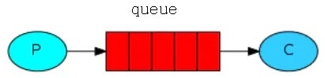
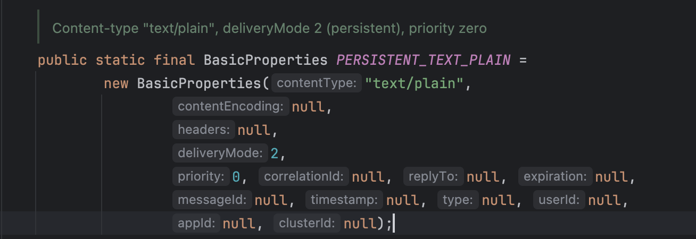
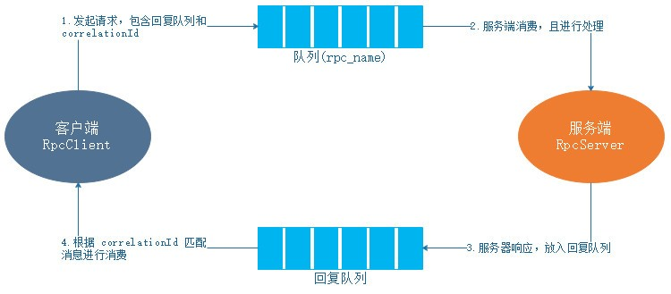

## RabbitMQ 简介

RabbitMQ 是实现了高级消息队列协议（AMQP, Advanced Message Queuing Protocol）的开源消息代理软件（亦称面向消息的中间件）。RabbitMQ 服务器是用 Erlang 语言编写的。

Rabbit 科技有限公司开发了 RabbitMQ，并提供对其的支持。起初，Rabbit 科技是 LSHIFT 和 CohesiveFT 在2007 年成立的合资企业，2010年4月被 VMware 旗下的 SpringSource 收购。RabbitMQ 在2013年5月成为 GoPivotal 的一部分。

### 特性 

RabbitMQ 最初起源于金融系统，用于在分布式系统中存储转发消息，在易用性、扩展性、高可用性等方面表现不俗。具体特点包括：

- 可靠性（Reliability）。

RabbitMQ 使用一些机制来保证可靠性，如持久化、传输确认、发布确认。

- 灵活的路由（Flexible Routing）

在消息进入队列之前，通过 Exchange 来路由消息的。对于典型的路由功能，RabbitMQ 已经提供了一些内置的 Exchange 来实现。针对更复杂的路由功能，可以将多个 Exchange 绑定在一起，也通过插件机制实现自己的 Exchange 。

- 消息集群（Clustering）

多个 RabbitMQ 服务器可以组成一个集群，形成一个逻辑 Broker 。

- 高可用（Highly Available Queues）

队列可以在集群中的机器上进行镜像，使得在部分节点出问题的情况下队列仍然可用。

- 多种协议（Multi-protocol）

RabbitMQ 支持多种消息队列协议，比如 STOMP、MQTT 等等。

- 多语言客户端（Many Clients）

RabbitMQ 几乎支持所有常用语言，比如 Java、.NET、Ruby 等等。

- 管理界面（Management UI）

RabbitMQ 提供了一个易用的用户界面，使得用户可以监控和管理消息 Broker 的许多方面。

- 跟踪机制（Tracing）

如果消息异常，RabbitMQ 提供了消息跟踪机制，使用者可以找出发生了什么。

- 插件机制（Plugin System）

RabbitMQ 提供了许多插件，来从多方面进行扩展，也可以编写自己的插件。

### 为什么需要MQ？

在当前互联网爆发的时代，很多互联网应用程序时刻都将面对高并发问题。当应用程序在高并的发情况下，由于后端服务来不及同步处理，请求往往会发生堵塞，比如大量的：insert（插入）、update（更新）之类的请求同时到达数据库，直接导致无数的行锁、表锁，甚至最后请求会堆积很多，从而触发大量的 “too mang connnections” 错误。

因此，为了解决上面问题，很多互联网应用程序都引入了消息队列MQ。消息队列（MQ）可以异步处理请求，从而缓解系统的压力。MQ（message queue）是一种跨进程的通信机制，用于上下游传递消息。

MQ 的特点：

- 先进先出

不能先进先出，都不能说是队列了，消息队列的顺序在入队时基本已经确定，一般是不需要人工干预的。而且最重要的是，数据是只有一条数据在使用中，这也是mq在众多场景中被使用的原因。

- 发布订阅

发布订阅是一种很高效的处理方式，如果不发生阻塞，基本可以当做是同步操作。这种处理方式能非常有效的提升服务器利用率，这样的应用场景非常广泛。

- 持久化

持久化确保MQ的使用不只是一个部分场景的辅助工具，而是让MQ能像数据库一样存储核心的数据。

- 分布式

在现在大流量、大数据的使用场景下，只支持单体应用的服务器软件基本是无法使用的，支持分布式的部署，才能被广泛使用。而且，MQ的定位就是一个高性能的中间件。

应用场景：

- 应用解耦（异步）

系统之间进行数据交互时，在时效性和稳定性之间我们都要进行选择；基于线程的异步处理，能确保用户体验，但在极端情况下，可能会出现异常，影响系统的稳定性，而同步调用很多时候无法保证理想的性能，那么我们就可以用 MQ 来进行处理，上游系统将数据投递到 MQ，下游系统取 MQ 的数据进行消费，投递和消费可以用同步的方式处理，因为 MQ 接收数据的性能是非常高的，不会影响上游系统的性能，那么下游系统的及时率能保证吗？当然可以，不然就不会有下面的一个应用场景。

- 通知

发布订阅，下游系统一直在监听 MQ 的数据，如果 MQ 有数据，下游系统则会按照先进先出这样的规则，逐条进行消费，而上游系统只需要将数据存入 MQ 里，这样既降低了不同系统之间的耦合度，同时也确保了消息通知的及时性，而且也不影响上游系统的性能。

- 限流

上文有说了一个非常重要的特性，MQ 数据是只有一条数据在使用中。 在很多存在并发，而又对数据一致性要求高，而且对性能要求也高的场景，如何保证，那么MQ就能起这个作用了。不管多少流量进来，MQ都会让你遵守规则，排除处理，不会因为其他原因，导致并发的问题，而出现很多意想不到脏数据。

- 数据分发

MQ的发布订阅肯定不是只是简单的一对一，一个上游和一个下游的关系，MQ中间件基本都是支持一对多或者广播的模式，而且都可以根据规则选择分发的对象。这样上游的一份数据，众多下游系统中，可以根据规则选择是否接收这些数据，这样扩展性就很强了。

> 上文中的上游和下游，在MQ更多的是叫做生产者（producer）和消费者（consumer）

- 分布式事务

分布式事务是我们开发中一直尽量避免的一个技术点，但是，现在越来越多的系统是基于微服务架构开发，那么分布式事务成为必须要面对的难题，解决分布式事务有一个比较容易理解的方案，就是二次提交。基于MQ的特点，MQ作为二次提交的中间节点，负责存储请求数据，在失败的情况可以进行多次尝试，或者基于MQ中的队列数据进行回滚操作，是一个既能保证性能，又能保证业务一致性的方案，当然，这个方案的主要问题就是定制化较多，有一定的开发工作量。

### 什么是消息中间件？

消息（Message）是指在应用之间传递的数据。消息可以非常简单，比如只包含文本字符串、JSON字符串等等，但也可以非常复杂，如内嵌对象。

消息队列中间件（Message Queue Middleware，简称为 MQ）是指利用高效可靠的消息传递机制进行与平台无关的数据通信，并基于数据通信来进行分布式系统集成。

消息队列中间件，也可以称为消息队列或者消息中间件。消息中间件有两种传递模式：

- **点对点（P2P，Point-to-Point）模式**：该模式是基于队列的，消息生产者发送消息到队列，消息消费者从队列中接收消息，队列的存在使得消息的异步传输成为了可能。
- **发布/订阅（Pub/Sub）模式**：该模式定义了如何向一个内容节点发布和订阅消息，这里的内容节点称为主题（topic），主题可以认为是消息传递的中介，消息发布者将消息发布到某个主题，而消费订阅者则从主题中订阅消息。主题使得消息的订阅者与消息的发布者互相保持独立，不需要进行直接通信也可以保证消息的传递，发布/订阅模式在消息的一对多广播时采用。

目前开源的消息中间件有很多，比较主流的有：

- RabbitMQ：官网地址 [https://www.rabbitmq.com](https://www.rabbitmq.com/)
- Kafka：官网地址 [https://kafka.apache.org](https://kafka.apache.org/)
- ActiveMQ：官网地址 [https://activemq.apache.org](https://activemq.apache.org/) 
- RocketMQ：官网地址 [https://rocketmq.apache.org](https://rocketmq.apache.org/)

面向消息的中间件（简称为 MOM，Message Oriented Middleware）提供了以松散耦合的灵活方式集成应用程序的一种机制。消息中间件提供了基于存储和转发的应用程序之间的异步数据发送功能（即应用程序之间不需要直接通信，应用程序而是与作为中介的消息中间件通信）。

消息中间件适用于需要可靠的数据传送的分布式环境。采用消息中间件的系统中，不同的对象之间通过传递消息来触发对方的事件，以完成相应的操作。发送者将消息发送给消息服务器，消息服务器将消息通过一定的规则存放到若干个队列中，在合适的时候再讲消息发送给接收者。

### 安装 RabbitMQ

docker 安装：

```bash
docker run -it --rm --name rabbitmq -p 5672:5672 -p 15672:15672 rabbitmq:4.0-management
```

centos7 安装，参考 https://gist.github.com/fernandoaleman/fe34e83781f222dfd8533b36a52dddcc：

```bash
sudo yum -y install epel-release
sudo yum -y update

# Install Erlang
wget https://binaries2.erlang-solutions.com/centos/esl-erlang-27/esl-erlang_27.1.3_1~centos~7_x86_64.rpm
sudo rpm -Uvh esl-erlang_27.1.3_1~centos~7_x86_64.rpm
sudo yum -y install erlang socat logrotate

# Install RabbitMQ
wget https://github.com/rabbitmq/rabbitmq-server/releases/download/v4.0.6/rabbitmq-server-4.0.6-1.el8.noarch.rpm
sudo rpm --import https://www.rabbitmq.com/rabbitmq-signing-key-public.asc
sudo rpm -Uvh rabbitmq-server-4.0.6-1.el8.noarch.rpm
sudo systemctl start rabbitmq-server
sudo systemctl enable rabbitmq-server

# Firewall
sudo firewall-cmd --zone=public --permanent --add-port=4369/tcp
sudo firewall-cmd --zone=public --permanent --add-port=25672/tcp
sudo firewall-cmd --zone=public --permanent --add-port=5671-5672/tcp
sudo firewall-cmd --zone=public --permanent --add-port=15672/tcp
sudo firewall-cmd --zone=public --permanent --add-port=61613-61614/tcp
sudo firewall-cmd --zone=public --permanent --add-port=1883/tcp
sudo firewall-cmd --zone=public --permanent --add-port=8883/tcp

sudo firewall-cmd --reload

# Enable RabbitMQ Management Plugin
sudo rabbitmq-plugins enable rabbitmq_management
sudo rabbitmqctl delete_user guest
# admin/password
sudo rabbitmqctl add_user admin password 
sudo rabbitmqctl set_user_tags admin administrator
sudo rabbitmqctl set_permissions -p / admin ".*" ".*" ".*"

# (Optional) Configure HTTPS for RabbitMQ Management Web UI
/etc/rabbitmq/rabbitmq.conf

management.listener.port = 15672
management.listener.ssl  = true
management.listener.ssl_opts.cacertfile = /path/to/cacertfile.pem
management.listener.ssl_opts.certfile   = /path/to/certfile.pem
management.listener.ssl_opts.keyfile    = /path/to/keyfile.pem

# (Optional) Uninstall
sudo yum -y remove erlang socat logrotate rabbitmq-server
```

### RabbitMQ 基本概念

所有 MQ 产品抽象模型都如下图：



上图中，拥有三个角色，分别如下：

- 生产者（Producer）：创建消息，然后将创建的消息放入到队列中；
- 队列（Queue）：一个用来存放生产者创建的消息的容器；
- 消费者（Consumer）：订阅一个/多个队列，从队列中获取消息且消费消息；

**MQ流程：**消费者（consumer）订阅某个队列。生产者（producer）创建消息，然后发布到队列（queue）中，最后将消息发送到监听的消费者。

RabbitMQ 是 AMQP 协议的一个开源实现，所以在 AMQP 中存在的基本概念，在 RabbitMQ 中依然存在。下面将逐一介绍：


## RabbitMQ 基础篇

### RabbitMQ示例“Hello World”

发送：

```java
public class Send {
    /**
     * 队列名称
     */
    private final static String QUEUE_NAME = "hello";

    public static void main(String[] argv) throws Exception {
        //建立与RabbitMQ消息服务器的连接
        ConnectionFactory factory = new ConnectionFactory();
        factory.setHost("127.0.0.1"); // 连接到本地服务器
        factory.setPort(AMQP.PROTOCOL.PORT); // 5672
        Connection connection = factory.newConnection();

        Channel channel = connection.createChannel();

        /**
         * 发送消息，我们必须声明我们发送到哪里的队列。然后，我们能发布消息到这个队列中；
         *
         * 声明一个队列
         * channel.queueDeclare(queue, durable, exclusive, autoDelete, arguments);
         * queue - 队列名称
         * durable - 如果为true则声明一个持久化队列
         * exclusive - 如果为true则声明一个独占队列
         * autoDelete - 如果为true则声明一个自动删除队列
         * arguments - 队列其他属性
         */
        channel.queueDeclare(QUEUE_NAME, false, false, false, null);

        /**
         * 发布一个消息
         * basicPublish(exchange, routingKey, props, body)
         * exchange -
         * routingKey - 路由的关键字
         * props - 其他消息属性，路由报头等等
         * body - 主体消息
         */
        String message = "Hello World!";
        channel.basicPublish("", QUEUE_NAME, null, message.getBytes());
        System.out.println("[x] Sent '" + message + "'");

        channel.close();
        connection.close();
    }
}
```

生产者发送消息的主要步骤如下：

- 创建连接
- 创建信道
- 声明队列
- 发送消息
- 关闭连接，释放资源

接收：

```java
/**
 * 从Queue中接收消息（消费消息）
 */
public class Receive {
    /**
     * 队列名称
     */
    private final static String QUEUE_NAME = "hello";

    public static void main(String[] args) throws Exception {
        ConnectionFactory factory = new ConnectionFactory();
        factory.setHost("127.0.0.1"); // 连接到本地服务器
        factory.setPort(AMQP.PROTOCOL.PORT); // 5672
        Connection connection = factory.newConnection();

        Channel channel = connection.createChannel();

        /**
         * 发送消息，我们必须声明我们发送到哪里的队列。然后，我们能发布消息到这个队列中；
         *
         * 声明一个队列
         * channel.queueDeclare(queue, durable, exclusive, autoDelete, arguments);
         * queue      - 队列名称
         * durable    - 如果为true则声明一个持久化队列
         * exclusive  - 如果为true则声明一个独占队列
         * autoDelete - 如果为true则声明一个自动删除队列
         * arguments  - 队列其他属性
         */
        channel.queueDeclare(QUEUE_NAME, false, false, false, null);

        System.out.println("[*] Waiting for messages. To exit press CTRL+C");

        /**
         * 消费一个消息
         * basicConsume(queue, autoAck, callback)
         * queue - 队列名称
         * autoAck - 是否自动确认
         * callback - 消费对象的接口
         */
        channel.basicConsume(QUEUE_NAME, true, new DefaultConsumer(channel) {
            @Override
            public void handleDelivery(String consumerTag, Envelope envelope,
                                       AMQP.BasicProperties properties, byte[] body)
                    throws IOException {
                String message = new String(body, "UTF-8");
                System.out.println("[x] Received '" + message + "'");
            }
        });
    }
}
```

列出队列：

```bash
$ rabbitmqctl list_queues
Timeout: 60.0 seconds ...
Listing queues for vhost / ...
name	messages
hello	1
```

### 交换器

交换器支持四种交换类型，不同的类型有着不同的路由策略。

1. Direct

direct 类型的交换器路由规则很简单，它会把消息路由到那些绑定键（BindingKey）和路由键（RoutingKey）完全匹配的队列中。

2. Fanout

它会把所有发送到该交换器的消息路由到所有绑定到该交换器上的队列中。

3. Topic

direct 类型的交换器路由规则是队列和消息的绑定键和路由键完全匹配，则将消息路由到该队列。但是这种严格的匹配方式在很多情况下并不能满足实际业务需要。

而 topic 类型的交换器对 direct 类型进行了扩展，路由规则为：判断队列和消息的绑定键和路由键是否匹配（这里做模糊匹配），这里为匹配定义了如下规则：

- 路由键（RoutingKey）和绑定键（BindingKey）是一个由点号（.）分割的字符串。
- 绑定键（BindingKey）中可以存在两种特殊字符串，用于做模糊匹配：
  - *（星号）：用于匹配一个单词，例如：`www.hxstrive.com `将匹配 `*.hxstrive.com`；`www.hxstrive.com` 也将匹配 `*.hxstrive.*`
  - \#（井号）：用于匹配零个或多个单词，例如：`#.hxstrive.com` 可以匹配` www.hxstrive.com`、`h1.demo.hxstrive.com`

4. Headers

headers 类型的交换器不依赖路由键的匹配规则来路有消息，而是根据发送消息内容中的消息头属性进行匹配。在绑定队列和交换器指定一组键值对。当发送消息到交换器时，RabbitMQ 会获取该消息的消息头，将消息头与绑定队列和交换器指定键值对进行匹配。如果匹配，则消息会路由到该队列。否则，不会路由到该队列。

在绑定队列和交换器时，可以在绑定键中指定一个特殊的键“x-match”来设置 RabbitMQ 的 headers 类型交换器匹配规则。x-match 可取值如下：

- **all：**完全匹配，如果消息头与绑定队列和交换器指定键值对完全匹配，则将消息路由到该队列。否则，不路由到该队列。
- **any：**部分匹配，如果消息头与绑定队列和交换器指定键值对任意一个匹配，则将消息路由到该队列。如果全部都不匹配，不路由到该队列。

在绑定队列和交换器时，怎样通过 java 代码指定 x-match 呢？代码如下：

```java
String queueName = channel.queueDeclare().getQueue();
// 绑定的header关键字
Map<String,Object> headers = new HashMap<String,Object>();
headers.put("x-match", "any"); // 设置匹配方式
headers.put("level", "error");
headers.put("package", "com.hxstrive");
channel.queueBind(queueName, EXCHANGE_NAME, "", headers);
```

不管是生产者还是消费者在发送/消费消息前，均需要声明一个交换器（如果已经存在，则不需要声明）。在 RabbitMQ 的 java 客户端中，可以通过 channel.exchangeDeclare() 方法去声明交换器。exchangeDeclare() 方法被重载：

```java
Exchange.DeclareOk exchangeDeclare(String exchange, String type) throws IOException;
Exchange.DeclareOk exchangeDeclare(String exchange, String type, boolean durable) throws IOException;
Exchange.DeclareOk exchangeDeclare(String exchange, String type, boolean durable, boolean autoDelete,
                                   Map<String, Object> arguments) throws IOException;
Exchange.DeclareOk exchangeDeclare(String exchange,
                                          String type,
                                          boolean durable,
                                          boolean autoDelete,
                                          boolean internal,
                                          Map<String, Object> arguments) throws IOException;
```

参数说明：

- exchange：交换器的名称
- type：交换的类型，取值 fanout、direct、topic、heades
- durable：设置是否持久化。如果设置为true，开启持久化功能。持久化可以将交换器信息存储到磁盘，重启 RabbitMQ 服务该交换器信息不会丢失。
- autoDelete：设置是否自动删除。如果设置为 true，表示启用自动删除功能。自动删除的前提是至少有一个队列或者交换器与这个交换器绑定，之后所有与这个交换器绑定的队列或者交换器都与此解绑，则触发自动删除。
- internal：设置是否是内置的。如果设置为true，表示是内置的交换器，客户端程序无法直接发送消息到内置交换器中，只能通过交换器路由到内置交换器。
- arguments：其他一些结构化参数，比如：alternate-exchange等

除了上面四个 exchangeDeclare() 方法外，RabbitMQ Java 客户端还定义了一个 exchangeDeclareNoWait() 方法。它的定义如下：

```java
void exchangeDeclareNoWait(String exchange,
                           String type,
                           boolean durable,
                           boolean autoDelete,
                           boolean internal,
                           Map<String, Object> arguments) throws IOException;
```

这个 exchangeDeclareNoWait() 比 exchangeDeclare() 多设置了一个 nowait 参数（参数设置在 arguments 中），这个 nowait 参数指的是 AMQP 中 Exchange.Declare 命令的参数，意思是不需要服务器返回。注意这个方法的返回值是 void ，而普通的 exchangeDeclare() 方法的返回值是 Exchange.DeclareOk，意思是在客户端声明了一个交换器之后，需要等待服务器的返回（服务器会返回 Exchange.Declare-Ok 这个 AMQP 命令）。

删除交换器的方法定义如下：

```java
Exchange.DeleteOk exchangeDelete(String exchange) throws IOException;
Exchange.DeleteOk exchangeDelete(String exchange , boolean ifUnused) throws  IOException; 
void exchangeDeleteNoWait(String exchange , boolean ifUnused) throws  IOException;
```

参数说明：

- exchange：表示交换器的名称
- ifUnused：用来设置是否在交换器没有被使用的情况下删除交换器。如果 isUnused 设置为 true，则只有在此交换器没有被使用的情况下才会被删除：如果设置 false ，则无论如何这个交换器都要被删除。

交换器与交换器绑定的方法定义如下：

```java
Exchange.BindOk exchangeBind(String destination , String source, String  routingKey) throws IOException;
Exchange.BindOk exchangeBind(String destination , String source, String  routingKey, Map<String , Object> arguments) throws IOException ; 
void exchangeBindNoWait(String destination, String source , String routingKey,  Map<String, Object> arguments) throws IOException
```

参数说明：

- destination：交换器的名称
- source：交换器的名称
- routingKey：路由键
- arguments：其他一些结构化参数，比如：alternate-exchange等

### 队列

队列是一种特殊的线性表，特殊之处在于它只允许在表的前端（front）进行删除操作，而在表的后端（rear）进行插入操作，和栈一样，队列是一种操作受限制的线性表。进行插入操作的端称为队尾，进行删除操作的端称为队头。队列中没有元素时，称为空队列。

队列的数据元素又称为队列元素。在队列中插入一个队列元素称为入队，从队列中删除一个队列元素称为出队。因为队列只允许在一端插入，在另一端删除，所以只有最早进入队列的元素才能最先从队列中删除，故队列又称为先进先出（FIFO—first in first out）线性表。

在 RabbitMQ 中，队列（Queue）是它的内部对象，用于存储消息。生产者将消息发送给交换器（Exchange）后，交换器根据路由规则将消息路由到合适的队列中。

> 注意，RabbitMQ 中消息都只能存储在队列中。RabbitMQ 的生产者生产消息最终将投递到队列中，消费者可以从队列中获取消息并消费。

多个消费者可以订阅同一个队列，这时队列中的消息会被**平均分摊给多个消费者进行消费**，而不是每个消费者都收到所有的消息并消费。

在 RabbitMQ Java 客户端中，可以通过信道 Channel 的 channel.queueDeclare() 方法声明一个队列。方法定义如下：

```java
Queue.DeclareOk queueDeclare() throws IOException;
Queue.DeclareOk queueDeclare(String queue, boolean durable , boolean exclusive,  boolean autoDelete , Map<String, Object> arguments) throws IOException;
```

不带任何参数的 queueDeclare() 方法默认创建一个由 RabbitMQ 命名的（类似这种 amq.gen-xxx 名称，这种队列称为匿名队列）、排他的、自动删除的、非持久化的队列。

方法参数说明如下：

- queue：队列的名称
- durable：设置队列是否持久化。如果设置为true，则队列为持久化队列。队列信息将持久化到磁盘，重启 RabbitMQ 服务可以保证不丢失队列信息。
- exclusive：设置队列是否排他。如果设置为true，则队列为排他队列。如果一个队列被声明为排他队列，该队列仅对首次声明它的连接（Connection）可见，并在连接断开是自动删除。注意，排他队列是基于连接（ Connection ）可见的，同 一个连接的不同信道（ Channel) 是可以同时访问同一连接创建的排他队列；“首次”是指如果一个连接己经声明了排他队列，其他连接是不允许建立同名的排他队列，这个与普通队列不同；即使该队列是持久化的，一旦连接关闭或者客户端退出，该排他队列都会被自动删除，这种队列适用于一个客户端同时发送和读取消息的应用场景。
- autoDelete：设置队列是否自动删除。如果设置为 true，则设置队列为自动删除。自动删除的前提是：至少有一个消费者连接到这个队列，之后所有与这个队列连接的消费者都断开时，才会自动删除该队列。
- arguments ：设置队列的其他一些参数，如：x-message-ttl、x-expires、x-max-length 等。

> 注意：生产者和消费者都能够使用 queueDeclare() 来声明一个队列，但是如果消费者在同一个信道上订阅了另一个队列，就无法再声明队列了。必须先取消订阅，然后将信道直为“传输”模式，之后才能声明队列。

删除队列使用信道的 queueDelete() 方法，定义如下：

```java
Queue.DeleteOk queueDelete(String queue) throws IOException;
Queue.DeleteOk queueDelete(String queue , boolean ifUnused, boolean ifEmpty )  throws IOException;
void queueDeleteNoWait(String queue, boolean ifUnused, boolean ifEmpty)  throws IOException ;
```

参数说明：

- queue：表示队列名称
- ifUnused：如果 isUnused 设置为 true，则只有在此交换器没有被使用的情况下才会被删除：
- ifEmpty：设置为true表示在队列为空的情况下才能删除

将队列和交换器绑定的方法如下：

```java
Queue.BindOk queueBind(String queue, String exchange , String routingKey) throws IOException;
Queue.BindOk queueBind(String queue, String exchange , String routingKey,  Map<String , Object> arguments) throws IOException;
void queueBindNoWait(String queue, String exchange, String routingKey ,  Map<String, Object> arguments) throws IOException ;
```

参数说明：

- queue：表示队列名称
- exchange：表示交换器名称
- routingKey：用来绑定队列和交换器的绑定键
- argument：定义绑定的一些参数

不仅可以将队列和交换器绑定起来，也可以将已经被绑定的队列和交换器进行解绑。方法定义如下：

```java
Queue.UnbindOk queueUnbind (String queue, String exchange , String routingKey)  throws IOException; 
Queue.UnbindOk queueUnbind (String queue, String exchange , String routingKey ,  Map<String , Object> arguments) throws IOException;
```

参数说明：

- queue：表示队列名称
- exchange：表示交换器名称
- routingKey：用来绑定队列和交换器的绑定键
- argument：定义绑定的一些参数

**何时创建队列？**

RabbitMQ 的消息被存储在队列中，交换器的使用并不消耗太多服务器资源，主要资源消耗在队列。如果要衡量 RabbitMQ 当前的 QPS（Queries-per-second，即每秒查询率，是对一个特定的服务器在规定时间内所处理流量多少的衡量标准）只需要看队列即可。在实际业务中，需要对创建的队列的流量、内存占用有一个清晰的认知，预估其平均值和峰值，以便在固定的服务器资源下合理分配资源。

按照 RabbitMQ 官方建，生产者和消费者都应该尝试创建队列。但不是所有情况都如此，如果业务本身架构设计之初已经预估了队列的使用情况，则完全可以在业务上线之前手动创建队列（通过 RabbitMQ 管理页面、RabbitMQ 命令行）。

**提前手动创建队列有一个好处，可以确保交换器和队列之间正确的绑定。避免由于认为因素、代码缺陷等，导致交换器和队列没有绑定好，最终消息被丢失。**与此同时，预估好队列的使用情况非常重要，如果在程序运行后期中，服务器资源不可用。可以根据实际情况对当前服务器资源进行扩展，将相应的队列迁移到其他服务器。

至于是使用**预先分配**队列还是**动态创建**队列，需要从业务逻辑本身考虑。

### 发送消息

信道的 basicPublish() 方法用来发送一个消息到 RabbitMQ 服务。它有三个重载方法，定义如下： 

```java
void basicPublish(String exchange, String routingKey, BasicProperties props, byte[] body) throws IOException;
 
void basicPublish(String exchange, String routingKey, boolean mandatory, BasicProperties props, byte[] body) throws IOException;
 
void basicPublish(String exchange, String routingKey, boolean mandatory, boolean immediate, BasicProperties props, byte[] body) throws IOException;
```

参数说明：

- **exchange：**交换器的名称，指明消息需要发送到哪个交换器中。如果设置为空字符串，则消息会被发送到 RabbitMQ 默认的交换器中。
- **routingKey：**路由键，交换器根据路由键将消息存储到相应的队列之中
- **props：**消息的基本属性集，其包含 14 个属性成员，分别有 contentType、contentEncoding、headers(Map<String,Object>)、deliveryMode、priority、correlationId、 replyTo、expiration、messageId、timestamp、type、userId、appId、clusterId。
- **byte[] body：**消息体（ payload ），真正需要发送的消息
- **mandatory：**如果将 mandatory 参数设为 true 时，交换器无法根据自身的类型和路由键找到一个符合条件的队列，那么 RabbitMQ 会调用 Basic.Return 命令将消息返回给生产者。当 mandatory 参数设置为 false 时，交换器无法根据自身的类型和路由键找到一个符合条件的队列，则消息直接被丢弃。
- **immediate：**当 immediate 参数设为 true 时，如果交换器在将消息路由到队列时发现队列上并不存在任何消费者，那么这条消息将不会存入队列中。当与路由键匹配的所有队列都没有消费者时，该消息会通过 Basic .Return 返回至生产者。

如果要发送一个消息，可以使用 Channel（信道）类的 basicPublish() 方法，例如：发送一条内容为“Hello World!”的消息，代码如下：

```java
channel.exchangeDeclare(Receive.EXCHANGE_NAME, "topic");

byte[] msg = "hello wrold".getBytes();
channel.basicPublish(Receive.EXCHANGE_NAME, "www.hxstrive.com", null, msg);
```

为了更好地控制发送，可以使用 mandatory 这个参数，或者可以发送一些特定属性的消息：

```java
// 发送消息
boolean mandatory = true;
byte[] msg = "hello wrold".getBytes();
channel.basicPublish(Receive.EXCHANGE_NAME, "www.hxstrive.com",
        mandatory, MessageProperties.PERSISTENT_TEXT_PLAIN, msg);
```

上面代码发送了一条消息，这条消息的投递模式（delivery mode）设置为2，即消息会被持久化到服务器磁盘中。同时，这条消息的优先级（priority）设置为0，content-type 为“text/plain”。MessageProperties.PERSISTENT_TEXT_PLAIN 定义如下：



当然，你也可以自己设定消息属性，代码如下：

```java
byte[] msg = "hello wrold".getBytes();
channel.basicPublish(Receive.EXCHANGE_NAME, "www.hxstrive.com",
      new AMQP.BasicProperties.Builder()
            .contentType("text/plain")
            .deliveryMode(2)
            .priority(1)
            // 仅当创建连接的用户名和这里指定的 userId 一致时，才能将消息发送出去
            .userId("guest")
            .build(), msg);
```

也可以发送一条带有 headers 的消息，代码如下：

```java
byte[] msg = "hello wrold".getBytes();
Map<String, Object> headers = new HashMap<String, Object>();
headers.put("location", "here");
headers.put("time", "today");
channel.basicPublish(Receive.EXCHANGE_NAME, "www.hxstrive.com",
      new AMQP.BasicProperties.Builder()
            .headers(headers)
            .build(), msg);
```

还可以发送一条带有过期时间（expiration）的消息：

```java
channel.basicPublish(Receive.EXCHANGE_NAME, "www.hxstrive.com", 
    new AMQP.BasicProperties.Builder() 
        .expiration("6000")
        .build(),
    messageBodyBytes) ;
```

在消费时，声明一个超时队列

```java
  // 声明队列，设置队列上所有的消息的有效期，单位为毫秒
  Map<String, Object> arguments = new HashMap<String , Object>();
  // 5秒钟
  arguments.put("x-message-ttl", 5000);

  String queueName = "queue-" + getClass().getSimpleName();
  channel.queueDeclare(queueName, false, false, false, arguments);
```

### 消费消息

RabbitMQ 的消费分两种模式：

- **推模式（Push）：**该模式采用 Basic.Consume 命令进行消费；
- **拉模式（Pull）：**该模式采用 Basic.Get 命令进行消费；

#### 推模式

推模式指有 RabbitMQ Broker 服务主动将消息推送给客户端，触发客户端实现的回调方法（Consumer 接口实现类）。

在推模式中，可以通过持续订阅某个队列的方式来从队列中消费消息。

接收消息一般通过实现 Consumer 接口或者继承 DefaultConsumer 类来实现。Consumer 接口定义如下：

```java
public interface Consumer {
    // 当消费者通过调用任何 Channel.basicConsume 方法注册时调用。
    void handleConsumeOk(String consumerTag);
     
    // 当调用 Channel.basicCancel 取消消费者时调用
    void handleCancelOk(String consumerTag);
 
    // 当消费者因调用 Channel.basicCancel 以外的原因而被取消时调用。
    // 例如，队列已被删除。 有关 Channel.basicCancel 导致的消费者取消通知，请参见 handleCancelOk。
    void handleCancel(String consumerTag) throws IOException;
 
    // 当信道或基础连接已关闭时调用
    void handleShutdownSignal(String consumerTag, ShutdownSignalException sig);
 
    // 当收到作为对 basic.recover 的回复的 basic.recover-ok 时调用。
    // 在调用此之前收到的所有尚未确认的消息将被重新传递。之后收到的所有消息都不会。
    void handleRecoverOk(String consumerTag);
 
    // 在收到此消费者的 basic.deliver 时调用。
    void handleDelivery(String consumerTag, Envelope envelope, AMQP.BasicProperties properties, byte[] body) throws IOException;
}
```

当调用与 Consumer 相关的 API 方法时，不同的订阅采用不同的消费者标签（consumerTag）来区分彼此，在同一个信道 Channel 中的消费者也需要通过唯一的消费者标签进行区分。

一个简单的消费者代码如下：

```java
// 创建连接
ConnectionFactory factory = new ConnectionFactory();
factory.setHost("127.0.0.1");
factory.setPort(5672);
Connection connection = factory.newConnection();
 
// 创建通道
Channel channel = connection.createChannel();
channel.exchangeDeclare(EXCHANGE_NAME, "topic");
 
// 绑定exchange与queue
String queueName = channel.queueDeclare().getQueue();
channel.queueBind(queueName, EXCHANGE_NAME, "*.hxstrive.com");
System.out.println("[Receive] Waiting Message...");
 
// 消费消息
channel.basicConsume(queueName, true, new DefaultConsumer(channel){
    @Override
    public void handleDelivery(String consumerTag, Envelope envelope,
            AMQP.BasicProperties properties, byte[] body) throws IOException {
        System.out.println("[Receive] Receive Message :: " + new String(body));
    }
});
```

上面代码中，basiceConsume() 方法将 autoAck 设置为 true，实现消息自动确认。当然，我们也可以将 autoAck 设置为 false，通过手动确认消息，代码如下：

```java
// 创建连接
ConnectionFactory factory = new ConnectionFactory();
factory.setHost("127.0.0.1");
factory.setPort(5672);
Connection connection = factory.newConnection();
 
// 创建通道
final Channel channel = connection.createChannel();
channel.exchangeDeclare(EXCHANGE_NAME, "topic");
 
// 绑定exchange与queue
String queueName = channel.queueDeclare().getQueue();
channel.queueBind(queueName, EXCHANGE_NAME, "*.hxstrive.com");
System.out.println("[Receive] Waiting Message...");
 
// 消费消息
channel.basicConsume(queueName, false, new DefaultConsumer(channel){
   @Override
   public void handleDelivery(String consumerTag, Envelope envelope,
         AMQP.BasicProperties properties, byte[] body) throws IOException {
      System.out.println("[Receive] Receive Message :: " + new String(body));
      System.out.println("routingKey = " + envelope.getRoutingKey());
      System.out.println("contentType = " + properties.getContentType());
 
      // 手动确认消息
      long deliveryTag = envelope.getDeliveryTag();
      channel.basicAck(deliveryTag, false);
   }
});
```

上面代码中显示的设置 autoAck 为 false，然后在 handleDelivery() 方法结尾处显示调用 channel.basicAck() 方法手动进行 ack 操作。对于每个消费者来说这个设置非常重要，可以防止消息不必要地丢失。

Channel 类中的 basicConsume() 方法有如下几种重载：

```java
String basicConsume(String queue, Consumer callback) throws IOException;
 
String basicConsume(String queue, boolean autoAck, Consumer callback) throws IOException;
 
String basicConsume(String queue, boolean autoAck, Map<String, Object> arguments, Consumer callback) throws IOException;
 
String basicConsume(String queue, boolean autoAck, String consumerTag, Consumer callback) throws IOException;
 
String basicConsume(String queue, boolean autoAck, String consumerTag, boolean noLocal, boolean exclusive, Map<String, Object> arguments, Consumer callback) throws IOException;
```

参数说明：

- **queue：**队列的名称
- **autoAck：**设置是否自动确认。建议设成 false ，即不自动确认，手动确认
- **consumerTag：**消费者标签，用来多个消费者之间进行区分
- **noLocal：**设置为 true 则表示不能将同一个 Connection（连接）中生产者发送的消息传送给这个 Connection 中的消费者
- **exclusive：**设置是否排它，true 表示排它
- **arguments：**设置消费者的其他参数
- **callback：**设置消费者的回调函数（必须实现 Consumer 接口）。用来处理 RabbitMQ 推送过来的消息，比如 DefaultConsumer 使用时需要客户端重写其中的 handleDelivery() 方法。

如果你要实现自己消费者回调类，建议直接集成 DefaultConsumer，而不是实现 Consumer 接口。继承 DefaultConsumer 类，我们一般情况下只需要重写 handleDelivery() 方法即可。如果实现 Consumer 接口，你将实现所有的方法，很是不方便。

当然，除了重写 handleDelivery() 接收消息外。你还可以重写 handleCancelOk() 和 handleCancel() 方法，这样消费端可以在取消订阅的时候触发（取消订阅使用 channel.basicCancel() 方法）。

> **线程安全问题**
>
> 消费者客户端同样也需要考虑线程安全的问题。消费者客户端的这些回调方法被分配到与 Channel 不同的线程池上，意味着消费者客户端可以安全地调用这些阻塞方法，比如：channel.queueDeclare()、channel.basicCancel() 等。
>
> 每个 Channel 都拥有自己独立的线程，最常用的做法是一个 Channel 对应一个消费者，消费者彼此之间没有任何关联，也就不存在线程安全问题。

#### 拉模式

拉模式指消费者主动从消息队列中获取消息，然后进行消费。拉取这个动作可以是一个定时任务，定时从消息队列中获取消息。

拉模式通过信道 Channel 的 basicGet() 方法实现，该方法可以单条地获取消息，其返回值是 GetResponse。

在信道 Channel 中仅仅定义了一个 basicGet() 方法，定义如下：

```java
GetResponse basicGet(String queue, boolean autoAck) throws IOException;
```

参数说明：

- **queue：**表示队列名称
- **autoAck：**表示是否自动确认。如果设置 autoAck 为 false，那么需要手动调用 channel.basicAck 来确认消息已被成功消费。

下面是拉模式的示例代码：

```java
// 创建连接
ConnectionFactory factory = new ConnectionFactory();
factory.setHost("127.0.0.1");
factory.setPort(5672);
Connection connection = factory.newConnection();
 
// 创建通道
final Channel channel = connection.createChannel();
channel.exchangeDeclare(EXCHANGE_NAME, "topic");
 
// 绑定exchange与queue
final String queueName = channel.queueDeclare().getQueue();
channel.queueBind(queueName, EXCHANGE_NAME, "*.hxstrive.com");
System.out.println("[Receive] Waiting Message...");
 
// 消费消息
while (true) {
    Thread.sleep(1000);
    System.out.println("[Receive] get message...");
 
    GetResponse response = channel.basicGet(queueName, true);
    if (null != response) {
        String body = new String(response.getBody());
        System.out.print("[Receive] Receive Message :: " + new String(body));
 
        Envelope envelope = response.getEnvelope();
        System.out.print(" routingKey = " + envelope.getRoutingKey());
 
        BasicProperties properties = response.getProps();
        System.out.print(" contentType = " + properties.getContentType());
        System.out.println();
    }
}
```

> **注意：**
>
> Basic.Consume 将信道（Channel）设置为接收模式，直到取消队列的订阅为止。在接收模式期间，RabbitMQ 会不断地推送消息给消费者，当然推送消息的个数还是会受到 Basic.Qos 的限制。如果只想从队列获得单条消息而不是持续订阅，建议使用 Basic.Get 进行消费。但是不能将 Basic.Get 放在一个循环里来代替 Basic.Consume，这样做会严重影响 RabbitMQ的性能。如果要实现高吞吐量，消费者理应使用 Basic.Consume 方法。

### 消息确认

RabbitMQ 为了保证消息从队列可靠地到达消费者，它提供了消息确认机制（Message Acknowledgement）。消费者在订阅队列时，可以指定 autoAck 参数，当 autoAck 设置为 false，RabbitMQ 会等待消费者手动地回复 ACK 确认信号，当收到 ACK 确认信号后才将消息从消息队列移除（实际上是先打上删除标记，之后再删除）。当 autoAck 等于 true 时，RabbitMQ 会自动把发送出去的消息设置为确认，然后从队列中删除，而不管消费者是否真正地消费到这个消息。

channel.basicConsume() 方法定义如下：

```java
String basicConsume(String queue, boolean autoAck, Consumer callback) throws IOException;
```

参数说明：

- **queue：**指待订阅队列的名称
- **autoAck：**指是否自动确认消息，true-自动确认、false-手动确认。
- **callback：**回调类，该类必须实现 Consumer 接口，推荐直接继承 DefaultConsumer 类。

 RabbitMQ 采用消息确认机制后，只要设置 autoAck 参数为 false，消费者就有足够的时间去处理消息，而不用担心处理消息过程中消费者进程宕掉后消息丢失问题。因为 RabbitMQ 会一直等待消息确认消息（Basic.Ack）。如果 RabbitMQ 一直没有收到消息确认信号，并且消费此消息的消费者已经断开连接，则 RabbitMQ 会将该消息重新放入到队列，等待投递给下一个消费者，当然也可能还是原来的那个消费者。

对 RabbitMQ 服务器而言，队列中的消息分成了两部分：

-  **第一部分：**等待投递给消费者的消息，待投递消息个数可以在 RabbitMQ 管理界面查看消息中的 “Ready” 状态；
-  **第二部分：**已经投递给消费者，但是还没有收到消息确认信号的消息；已投递待确认的消息个数可以在 RabbitMQ 管理界面查看消息中的 “Unacked” 状态。

也可以通过下面命令查看：

```bash
rabbitmqctl list_queues name messages_ready
```

### 拒绝消息

前面章节介绍了怎样进行消息确认（ack），如果我们在收到某条消息后，并不想消费这条消息，怎么办呢？

如果不做任何业务逻辑处理，直接进行消息确认，这会导致该条消息丢失，因为消息没有被真正的消费。

如果我们不进行消息确认，这会导致该条消息一直位于 RabbitMQ 服务的“已投递，待确认”区域，其他消费者也不能消费（直到当前消费者断开连接，消息可能会被重新投递给其他消费者消费），明显这也不合理。

难道 RabbitMQ 没有提供更好的处理方式吗？当然不是，RabbitMQ 在 2.0.0 版本开始引入了 Basic.Reject 命令，消费者可以调用与其对应的 channel.basicReject() 方法来告诉 RabbitMQ 拒绝这个消息。

Channel 类中的 basicReject() 方法定义如下：

```java
void basicReject(long deliveryTag, boolean requeue) throws IOException;
```

参数说明：

- **deliveryTag：**可以把他当做消息编号，它是一个64位的长整型值。
- **requeue：**是否将消息重新存入队列。如果设置为 true，则 RabbitMQ 会重新将这条消息存入队列，以便可以发送给下一个订阅者。如果设置为 false，则 RabbitMQ 立即会把消息从队列中删除，而不是把消息重新存入队列。

生产者发送一个消息，消费者消费该消息。消费者并没有进行真实消费，收到消息后对消息进行拒绝，且重新将消息放入队列。代码如下：

```java
// 创建连接
ConnectionFactory factory = new ConnectionFactory();
factory.setHost("127.0.0.1");
factory.setPort(5672);
Connection connection = factory.newConnection();
 
// 创建通道
final Channel channel = connection.createChannel();
channel.exchangeDeclare(EXCHANGE_NAME, "topic");
 
// 绑定exchange与queue
final String queueName = channel.queueDeclare().getQueue();
channel.queueBind(queueName, EXCHANGE_NAME, "*.hxstrive.com");
System.out.println("[Receive] Waiting Message...");
 
// 消费消息
channel.basicConsume(queueName, false, new DefaultConsumer(channel){
   @Override
   public void handleDelivery(String consumerTag, Envelope envelope,
         AMQP.BasicProperties properties, byte[] body) throws IOException {
      // 打印消息
      System.out.println("[Receive] message = " + new String(body));
 
      // 拒绝消息
      try {
         Thread.sleep(1000);
      } catch (Exception e) {}
      channel.basicReject(envelope.getDeliveryTag(), true);
   }
});
```

运行上面代码，控制台会每隔一秒打印“[Receive] message = ...”消息。

Basic.Reject 命令一次只能拒绝一条消息，如果想要批量拒绝消息，则可以使用 Basic.Nack 这个命令，该命令对应 channel.basicNack() 方法，定义如下：

```java
void basicNack(long deliveryTag, boolean multiple, boolean requeue) throws IOException;
```

参数说明：

- **deliveryTag：**可以把他当做消息编号，它是一个64位的长整型值。
- **multiple：**如果设置为 false，则表示拒绝编号为 deliveryTag 的这一条消息，这时候 basicNack() 和 basicReject() 方法一样；如果设置为 true，则表示拒绝 deliveryTag 编号之前所有未被当前消费者确认的消息。
- **requeue：**是否将消息重新存入队列。如果设置为 true，则 RabbitMQ 会重新将这条消息存入队列，以便可以发送给下一个订阅者。如果设置为 false，则 RabbitMQ 立即会把消息从队列中删除，而不是把消息重新存入队列。

生产者一次发送5条消息，消息格式为“hello word 序号”的消息。消费者消费到消息中包含序号 5 时，利用 channel.basicReject() 方法进行批量拒绝消息。代码如下：

```java
// 创建连接
ConnectionFactory factory = new ConnectionFactory();
factory.setHost("127.0.0.1");
factory.setPort(5672);
Connection connection = factory.newConnection();
 
// 创建通道
final Channel channel = connection.createChannel();
channel.exchangeDeclare(EXCHANGE_NAME, "topic");
 
// 绑定exchange与queue
final String queueName = channel.queueDeclare().getQueue();
channel.queueBind(queueName, EXCHANGE_NAME, "*.hxstrive.com");
System.out.println("[Receive] Waiting Message...");
 
// 消费消息
channel.basicConsume(queueName, false, new DefaultConsumer(channel){
   @Override
   public void handleDelivery(String consumerTag, Envelope envelope,
         AMQP.BasicProperties properties, byte[] body) throws IOException {
      // 打印消息
      String msg = new String(body);
      System.out.println("[Receive] message = " + msg);
      // 拒绝消息，不重新放入队列
      if(msg.contains("5")) {
         try {
            Thread.sleep(10000);
            // 批量拒绝前4个和当前消息
            // 通过 RabbitMQ 管理界面观察
            // Unacked 值为 5，等待 10 秒后 Unacked 为 0
            System.out.println("[Receive] call channel.basicNack()");
            channel.basicNack(envelope.getDeliveryTag(),
                  true, false);
         } catch (Exception e) {
            e.printStackTrace();
         }
      }
   }
});
```

> **注意：**
>
> 将 channel.basicReject() 或者 channel.basicNack() 中的 requeue 参数设置为 false，可以启用 “死信队列” 功能。死信队列，又可以称之为“延迟队列”、“延时队列”，也是 RabbitMQ 队列中的一种；顾名思义，指的是进入该队列中的消息会被延迟消费的队列，这种队列跟普通的队列相比，最大的差异在于消息一旦进入普通队列将会立即被消费处理，而延迟队列则是会过一定的时间再进行消费。死信队列可以通过检测被拒绝或者未送达的消息来追踪问题。

对于 requeue，AMQP 中还有一个命令 Basic.Recover 具备可重入队列的特性。它对应 channel.basicRecover() 方法，该方法用来请求 RabbitMQ 重新发送还未被确认的消息。方法定义如下：

```java
Basic.RecoverOk basicRecover() throws IOException;
Basic.RecoverOk basicRecover(boolean requeue) throws IOException;
```

参数说明：

- **requeue：**如果将 requeue 参数设置为 true，则未被确认的消息会被重新加入到队列中，且对于同一条消息可能被分配给其他消费者。如果将 requeue 参数设置为 false，那么同一条消息会被分配给与之前相同的消费者。默认情况下 requeue 参数为 true。

## RabbitMQ 进阶篇

### 消息何去何从

如果发送给 RabbitMQ 服务器的消息的路由键和某个绑定到交换器上的队列的绑定键匹配，则消息将会路由到该队列。如果发送给 RabbitMQ 服务器的消息的路由键和任何绑定键都不匹配，此时消息时如何处理的呢？

消息生产者在发送消息时使用 channel.basicPublish() 方法，方法定义如下：

```java
void basicPublish(String exchange, String routingKey, boolean mandatory, boolean immediate, BasicProperties props, byte[] body) throws IOException;
```

参数说明：

- **mandatory：**如果将 mandatory 参数设为 true 时，交换器无法根据自身的类型和路由键找到一个符合条件的队列，那么 RabbitMQ 会调用 Basic.Return 命令将消息返回给生产者。当 mandatory 参数设置为 false 时，交换器无法根据自身的类型和路由键找到一个符合条件的队列，则消息直接被丢弃。
- **immediate：**当 immediate 参数设为 true 时，如果交换器在将消息路由到队列时发现队列上并不存在任何消费者，那么这条消息将不会存入队列中。当与路由键匹配的所有队列都没有消费者时，该消息会通过 Basic .Return 返回至生产者。

其中，mandatory 和 immediate 参数它们都有当消息传递过程中不可到达目的地时将消息返回给消息生产者的功能。RabbitMQ 提供的备份交换器可以将未能被交换器路由的消息存储起来，而不用返回给客户端。

当 mandatory 参数设置为 true 时，交换器无法根据自身的交换器类型和路由键找到一个符合条件的队列时，那么 RabbitMQ 会调用 Basic.Return 命令将消息返回给生产者。当 mandatory 参数设置为 false 时，如果消息无法匹配到任何队列，则消息直接被丢弃。

那么生产者如何获取到没有被正确路由到合适队列的消息呢？可以通过调用 channel.addReturnListener() 方法来添加 ReturnListener 监听器实现。

该示例中的生产者发送一个消息，但是该生产者的交换器上面并没有绑定任何队列。通过 channel.addReturnListener() 添加监听器 ReturnListener 监听没有匹配队列的消息，代码如下：

```java
// 创建连接
ConnectionFactory factory = new ConnectionFactory();
factory.setHost("127.0.0.1");
factory.setPort(5672);
Connection connection = factory.newConnection();
 
// 创建通道
Channel channel = connection.createChannel();
channel.exchangeDeclare(EXCHANGE_NAME, "topic");
channel.addReturnListener(new ReturnListener() {
    public void handleReturn(int replyCode, String replyText, String exchange,
            String routingKey, AMQP.BasicProperties properties,
            byte[] body) throws IOException {
        System.out.println("<< " + new String(body));
    }
});
 
// 发送消息
System.out.println("[Send] Sending Message...");
byte[] msg = ("hello wrold " + System.currentTimeMillis()).getBytes();
channel.basicPublish(EXCHANGE_NAME, "www.hxstrive.com",
        true, MessageProperties.PERSISTENT_TEXT_PLAIN, msg);
System.out.println("[Send] msg = " + new String(msg));
Thread.sleep(Long.MAX_VALUE);
 
// 释放资源
channel.close();
connection.close();
```

当 immediate 参数设置为 true 时，如果交换器在将消息路由到队列时发现队列并没有被任何消费者订阅，那么这条消息将不会存入队列中。当与路由键匹配的所有队列都没有绑定消费者时，该消息会通过 Basic.Return 返回给生产者。

从 RabbitMQ 3.0 版本开始去掉了对 immediate 参数的支持，对此 RabbitMQ 官方的解释为：immediate 参数会影响镜像队列的性能，增加了代码复杂性，建议采用 TTL 和 DLX 的方法替代。

总结，mandatory 参数告诉服务器至少将该消息路由到一个队里中，否则将消息返回给生产者。immediate 参数告诉服务器，如果该消息关联的队列上有消费者，则立刻投递。如果所有匹配的队列上都没有消费者，则直接将消息返回给生产者，不用将消息存入队列等待消费者。

### 备份交换器

备份交换器（Alternate Exchange，简称：AE），也称之为“备胎交换器”。

生产者在发送消息（channel.basicPublish）的时候如果不设置 mandatory 参数，那么消息在未被路由（即没有匹配到任何队列）的情况下将会丢失。如果设置了 mandatory 参数，那么需要添加 ReturnListener 监听器的编程逻辑，生产者的代码将变得复杂。如果既不想复杂化生产者的编程逻辑，且又不想消息丢失，那么就可以使用备份交换器，这样可以将未被路由的消息存储在 RabbitMQ 中，在需要的时候再去处理这些消息。

怎样实现备份交换器呢？可以通过在声明交换器（调用 channel.exchangeDeclare 方法）的时候添加 alternate-exchange 参数来实现，也可以通过策略（ Policy）的方式实现。如果两者同时使用，则声明交换器时设置的优先级更高，会覆盖掉 Policy 的设置。

```java
// 创建连接工厂
ConnectionFactory factory = new ConnectionFactory();
factory.setHost("127.0.0.1");
factory.setPort(5672);
// 创建连接
Connection connection = factory.newConnection();
// 创建信道
Channel channel = connection.createChannel();
 
// 声明交换器
// 下面交换器用作备份交换器，该交换器的所有消息均路由到 unroutedQueue 队列
channel.exchangeDeclare("myAe","fanout",
        true , false, null) ;
channel.queueDeclare("unroutedQueue", true,
        false , false, null);
channel.queueBind("unroutedQueue","myAe","");
 
// 下面交换器通过 alternate-exchange 参数设置一个备份交换器
// 将交换器 myAe 设置为 normalExchange 的交换器
Map<String, Object> exchangeArgs = new HashMap<String, Object>();
exchangeArgs.put("alternate-exchange", "myAe");
channel.exchangeDeclare("normalExchange","direct",
        true, false, exchangeArgs);
channel.queueDeclare("normalQueue", true,
        false , false , null);
channel.queueBind("normalQueue", "normalExchange", "normalKey");
 
// 发送消息
System.out.println("[Sender] 开始发送消息...");
// 该消息将路由给 normalQueue 队列
channel.basicPublish("normalExchange", "normalKey",
        null, "hello message1".getBytes());
System.out.println("[Sender] 发送消息 “hello message1”");
 
// 该消息不能匹配任何队列，将发往备份交换器
channel.basicPublish("normalExchange", "www.hxstrive.com",
        null, "hello message2".getBytes());
System.out.println("[Sender] 发送消息 “hello message2”");
 
// 关闭连接
channel.close();
connection.close();
```

上面的代码中声明了两个交换器 normalExchange 和 myAe，分别绑定了 normalQueue 和 unroutedQueue 这两个队列，同时将 myAe 设置为 normalExchange 的备份交换器。

> **注意：**myAe 交换器将交换器类型设置为 fanout，这样可以将所有发往备份交换器的消息直接路由到绑定它上面的队列。

下面代码将发送一条消息到交换器，设置路由键为 normalKey。该路由键和 normalQueue 队列的绑定键匹配，因此将该消息路由给 normalQueue 队列。

```java
channel.basicPublish("normalExchange", "normalKey", null, "hello message1".getBytes());
System.out.println("[Sender] 发送消息 “hello message1”");
```

下面代码将再次发送一条信息到交换器，设置路由键为 www.hxstrive.com。与 normalQueue 队列的绑定键不匹配，因此该消息将被路由给备份交换器。

```java
channel.basicPublish("normalExchange", "www.hxstrive.com",  null, "hello message2".getBytes());
System.out.println("[Sender] 发送消息 “hello message2”");
```

同样，如果采用 Policy（策略）的方式来设置备份交换器，可以参考如下：

```bash
rabbitmqctl set_policy AE "^normalExchange$" '{"alternate-exchange":"myAe"}'
```

备份交换器其实和普通的交换器没有太大的区别，为了方便使用，建议设置为 fanout 类型，如若设置为 direct 或者 topic 的类型也没有什么问题。但是需要注意的是，消息被重新发送到备份交换器时的路由键和从生产者发出的路由键是一样的。

如果备份交换器的类型是 direct 并且有一个与其绑定的队列，假设绑定的路由键是 key1 当某条携带路由键为 key2 的消息被转发到这个备份交换器的时候，备份交换器没有匹配到合适的队列，则消息丢失。如果消息携带的路由键为 key1，则可以路由到队列中。

总结：

- 如果设置的备份交换器不存在，客户端和 RabbitMQ 服务端都不会有异常出现，此时消息会丢失。
- 如果备份交换器没有绑定任何队列，客户端和 RabbitMQ 服务端都不会有异常出现，此时消息会丢失。
- 如果备份交换器没有任何匹配的队列，客户端和 RabbitMQ 服务端都不会有异常出现，此时消息会丢失。
- 如果备份交换器和 mandatory 参数一起使用，那么 mandatory 参数无效。

### 过期时间

RabbitMQ 可以对消息和队列设置过期时间（TTL，全称 Time To Live）。目前有两种方法可以设置过期时间：

- 第一种方法是通过队列属性设置，队列中所有消息都有相同的过期时间。
- 第二种方法是对消息进行单独设置，每条消息的过期时间可以不同。

如果同时设置队列和消息的过期时间，则消息的过期时间以两者之间过期时间较小的那个数值为准。消息在队列的生存时间一旦超过设置的过期时间值，就成为“死信”（Dead Message），消费者将无法再收到该消息。

**方式一：通过消息属性**

如果需要为每条消息单独设置过期时间，则可以使用信道（Channel）的 channel.basicPublish() 方法，通过往 AMQP.BasicProperties 属性中添加 expiration 属性来实现（单位：毫秒）。代码如下：

```java
// 创建连接
ConnectionFactory factory = new ConnectionFactory();
factory.setHost("127.0.0.1");
factory.setPort(5672);
Connection connection = factory.newConnection();
 
// 创建信道
Channel channel = connection.createChannel();
 
// 声明交换器
System.out.println("[Sender] Send Message...");
channel.exchangeDeclare(EXCHANGE_NAME, "topic");
 
// 发送消息
AMQP.BasicProperties properties = new AMQP.BasicProperties.Builder()
        .deliveryMode(2) // 持久化消息
        .expiration("6000") // 设置过期时间为 6 秒
        .build();
 
channel.basicPublish(EXCHANGE_NAME, "www.hxstrive.com",
        properties, "ttl message".getBytes());
System.out.println("[Sender] message = “ttl message”");
 
// 关闭连接
channel.close();
connection.close();
```

**方法二：通过队列属性**

在声明队列的时候通过队列属性设置消息过期时间的方法是在 channel.queueDeclare() 方法中加入 x-message-ttl 参数实现，参数单位是毫秒。示例代码如下：

```java
// 创建连接
ConnectionFactory factory = new ConnectionFactory();
factory.setHost("127.0.0.1");
factory.setPort(5672);
Connection connection = factory.newConnection();
 
// 创建信道
Channel channel = connection.createChannel();
 
// 声明交换器
channel.exchangeDeclare(EXCHANGE_NAME, "topic");
 
// 声明队列
Map<String,Object> argss =new HashMap<String,Object>() ;
argss.put("x-message-ttl", 6000); // 设置过期时间为 6 秒
channel.queueDeclare(QUEUE_NAME, true, false, true, argss) ;
channel.queueBind(QUEUE_NAME, EXCHANGE_NAME, "*.hxstrive.com");
 
// 发送消息
System.out.println("[Sender] Send Message...");
channel.basicPublish(EXCHANGE_NAME, "www.hxstrive.com",
        null, "ttl message".getBytes());
System.out.println("[Sender] message = “ttl message”");
 
// 关闭连接
channel.close();
connection.close();
```

**设置队列TTL** 

队列的过期时间，可通过 channel.queueDeclare() 方法中的 x-expires 参数控制队列被自动删除前处于未使用状态的时间。未使用的意思是队列上没有任何的消费者，队列也没有被重新声明，并且在过期时间段内也未调用过 Basic.Get 命令。

设置队列里的过期时间可以应用于类似 RPC 方式的回复队列。在 RPC 中，许多队列会被创建出来，但是却是未被使用的。

RabbitMQ 会确保在过期时间到达后将队列删除，但是不能保证队列会被及时删除。在 RabbitMQ 重启后，持久化的队列的过期时间会被重新计算。

> 注意：x-expires 参数以毫秒为单位，不能设置为 0。如果将 x-expires 参数设置为 6000，则表示该队列如果在 6 秒钟之内未使用则会被删除。

```java
// 创建连接
ConnectionFactory factory = new ConnectionFactory();
factory.setHost("127.0.0.1");
factory.setPort(5672);
Connection connection = factory.newConnection();
 
// 创建信道
Channel channel = connection.createChannel();
 
// 声明交换器
channel.exchangeDeclare(EXCHANGE_NAME, "topic");
 
// 声明队列
Map<String,Object> argss =new HashMap<String,Object>() ;
argss.put("x-expires", 6000); // 设置过期时间为 6 秒
channel.queueDeclare(QUEUE_NAME, true, false, false, argss) ;
channel.queueBind(QUEUE_NAME, EXCHANGE_NAME, "*.hxstrive.com");
 
// 关闭连接
channel.close();
connection.close();
```

### 死信队列

RabbitMQ 中由于某些原因（如路由键和绑定键不匹配，或者交换器上面没有绑定队列等等）导致消息无法被正确的投递，为了确保消息不会被无故的丢弃，一般将其置于一个特殊的队列中，这个队列一般称之为死信队列。

如果消息在一个队列中变成死信（Dead Message）之后，它将被重新发送到另一个交换器中，该交换器称为死信交换器，绑定在死信交换器上的队列就称之为死信队列。

死信交换器的简称为 DLX（Dead-Letter-Exchange），也有人称它为死信邮箱。

消息变成死信有如下几种情况：

- 消息被拒绝（Basic.Reject/Basic.Nack），并且设置 requeue 参数为 false；
- 消息过期；
- 队列达到最大长度；

死信交换器也是一个正常的交换器，和一般的交换器没有区别，它能在任何的队列上被指定，实际上就是设置某个队列的属性。当这个队列中存在死信时 RabbitMQ 就会自动地将这个消息重新发布到设置的死信交换器，进而死信交换器将消息路由到绑定到它的队列（即死信队列）。我们可以监听这个队列中的消息、以进行相应的处理，这个特性与将消息的 TTL 设置为 0 配合使用可以弥补 immediate 参数的功能。

通过在队列声明方法 channel.queueDeclare() 中设置 x-dead-letter-exchange 参数来为当前队列添加死信交换器（DLX）。示例代码如下：

```java
public class ExchangeDlx1 {
    /** 死信交换器名称 */
    private final String exchangeDlxName = "exchange_" + getClass().getSimpleName() + "_DLX";
    /** 普通交换器名称 */
    private final String exchangeName = "exchange_" + getClass().getSimpleName();
    /** 死信队列名称 */
    private final String queueDlxName = "queue_" + getClass().getSimpleName() + "_DLX";
    /** 队列名称 */
    private final String queueName = "queue_" + getClass().getSimpleName();
 
    public static void main(String[] args) throws Exception {
        ExchangeDlx1 demo = new ExchangeDlx1();
        demo.consumer1();
        demo.consumer2();
        demo.sender();
    }
 
    /**
     * 生产者
     * @throws Exception
     */
    private void sender() throws Exception {
        // 创建连接
        ConnectionFactory factory = new ConnectionFactory();
        factory.setHost("127.0.0.1");
        factory.setPort(5672);
        Connection connection = factory.newConnection();
 
        // 创建信道
        Channel channel = connection.createChannel();
 
        // 声明死信交换器和死信队列
        channel.exchangeDeclare(exchangeDlxName, "fanout");
        channel.queueDeclare(queueDlxName, true, false, true, null);
        channel.queueBind(queueDlxName, exchangeDlxName, "");
 
        // 声明普通交换器和队列
        channel.exchangeDeclare(exchangeName, "topic");
        Map<String,Object> queueArgs = new HashMap<String, Object>();
        // 为队列设置死信交换器
        queueArgs.put("x-dead-letter-exchange", exchangeDlxName);
        channel.queueDeclare(queueName, true, false, false, queueArgs);
        channel.queueBind(queueName, exchangeName, "*.hxstrive.com");
 
        // 发送消息
        System.out.println("[Sender] Send Message...");
        for(int i = 0; i < Integer.MAX_VALUE; i++) {
            String message = "exchange DLX message " + i;
            // 消息将被消费
            channel.basicPublish(exchangeName, "www.hxstrive.com", null, message.getBytes());
            System.out.println("[Sender] message = '" + message + "'");
            Thread.sleep(3000);
        }
 
        // 关闭连接
        channel.close();
        connection.close();
    }
 
    /**
     * 消费消息，从普通队列消费消息，然后拒绝消息
     * @throws Exception
     */
    private void consumer1() throws Exception {
        // 创建连接
        ConnectionFactory factory = new ConnectionFactory();
        factory.setHost("127.0.0.1");
        factory.setPort(5672);
        Connection connection = factory.newConnection();
 
        // 创建信道
        final Channel channel = connection.createChannel();
 
        // 声明队列
        Map<String,Object> queueArgs = new HashMap<String, Object>();
        // 为队列设置死信交换器
        queueArgs.put("x-dead-letter-exchange", exchangeDlxName);
        channel.queueDeclare(queueName, true, false, false, queueArgs);
 
        // 消费消息
        System.out.println("[Consumer1] Waiting Message...");
        channel.basicConsume(queueName, false, new DefaultConsumer(channel){
            @Override
            public void handleDelivery(String consumerTag, Envelope envelope,
                    AMQP.BasicProperties properties, byte[] body) throws IOException {
                // 拒绝消息，且重新放入队列
                System.out.println("[Consumer1] Reject Message body = " + new String(body));
                channel.basicReject(envelope.getDeliveryTag(), false);
            }
        });
    }
 
    /**
     * 消费消息，从死信队列消费消息
     * @throws Exception
     */
    private void consumer2() throws Exception {
        // 创建连接
        ConnectionFactory factory = new ConnectionFactory();
        factory.setHost("127.0.0.1");
        factory.setPort(5672);
        Connection connection = factory.newConnection();
 
        // 创建信道
        final Channel channel = connection.createChannel();
 
        // 声明队列
        // 声明死信交换器和死信队列
        channel.exchangeDeclare(exchangeDlxName, "fanout");
        channel.queueDeclare(queueDlxName, true, false, true, null);
        channel.queueBind(queueDlxName, exchangeDlxName, "");
 
        // 消费消息
        System.out.println("[Consumer2] Waiting Message...");
        channel.basicConsume(queueDlxName, false, new DefaultConsumer(channel){
            @Override
            public void handleDelivery(String consumerTag, Envelope envelope,
                    AMQP.BasicProperties properties, byte[] body) throws IOException {
                // 拒绝消息，且重新放入队列
                System.out.println("[Consumer2] body = " + new String(body));
            }
        });
    }
}
```

上面创建了两个交换器 exchangeDlxName 和 exchangeName，分别绑定了两个队列 queueDlxName 和 queueName。

### 延迟队列

延迟队列顾名思义就是存放延迟消息的队列，所谓“延迟消息”是指消息被发送后，并不想让消费者立刻进行消费，而是需要等待指定的时间后，消费者才能够进行消费。

延迟队列的使用场景有很多，例如：

- 订单支付 —— 相信读者有过网上购物的习惯，当我们下了订单后，需要支付。而支付一般需要在30分钟（也可能是20分钟等）内完成支付。如果你没有在30分钟内完成支付，那么订单将变成无效的订单。此时，这个订单支付的时效功能就可以采用延迟队列来处理。
- 定时控制 —— 不知道读者是否玩过类似远程控制的设备，我们只需要在设备对应的APP/WEB应用中定义一个定时控制的指令，指定该指令在多少分钟后进行远程操作。例如：远程定时控制扫地机器人进行扫地、远程定时控制空调等等。这些远程控制的功能，也可以使用延迟队列来实现。

> 注意：在 AMQP 协议或者 RabbitMQ 中，并没有提供延迟队列的直接支持。但是，我们可以结合前面章节介绍的死信交换器（DLX）和过期时间（TTL）来模拟延迟队列的功能。

消息生产者发送一个带有 TTL（延迟时间）的消息到正常的交换器，且正常交换器绑定的队列没有被任何消费者订阅（也就不会被消费）。当时间慢慢过去，一旦时间超过我们为消息设置的 TTL 时间后，RabbitMQ 将会自动将过期的消息发送到队列指定的死信交换器，死信交换器将消息路由到死信队列。此时，如果有消费者订阅了死信队列，则这些消息将被消费者消费，就这样成功模拟了一个延迟队列。消息流转过程如下图：


```java
/**
 * 使用死信交换器 + TTL消息模拟延迟队列
 * @author hxstrive.com 2022/2/25
 */
public class ExchangeDlx2 {
    /** 死信交换器名称 */
    private final String exchangeDlxName = "exchange_" + getClass().getSimpleName() + "_DLX";
    /** 普通交换器名称 */
    private final String exchangeName = "exchange_" + getClass().getSimpleName();
    /** 死信队列名称 */
    private final String queueDlxName = "queue_" + getClass().getSimpleName() + "_DLX";
    /** 队列名称 */
    private final String queueName = "queue_" + getClass().getSimpleName();
 
    public static void main(String[] args) throws Exception {
        ExchangeDlx2 demo = new ExchangeDlx2();
        demo.consumer();
        demo.sender();
    }
 
    /**
     * 生产者
     * @throws Exception
     */
    private void sender() throws Exception {
        // 创建连接
        ConnectionFactory factory = new ConnectionFactory();
        factory.setHost("127.0.0.1");
        factory.setPort(5672);
        Connection connection = factory.newConnection();
 
        // 创建信道
        Channel channel = connection.createChannel();
 
        // 声明死信交换器和死信队列
        channel.exchangeDeclare(exchangeDlxName, "fanout");
        channel.queueDeclare(queueDlxName, true, false, true, null);
        channel.queueBind(queueDlxName, exchangeDlxName, "");
 
        // 声明普通交换器和队列
        channel.exchangeDeclare(exchangeName, "topic");
        Map<String,Object> queueArgs = new HashMap<String, Object>();
        // 为队列设置死信交换器
        queueArgs.put("x-dead-letter-exchange", exchangeDlxName);
        channel.queueDeclare(queueName, true, false, false, queueArgs);
        channel.queueBind(queueName, exchangeName, "*.hxstrive.com");
 
        // 发送带有TTL过期时间的消息
        System.out.println("[Sender] Send Message...");
        String message = "exchange DLX message";
        AMQP.BasicProperties properties = new AMQP.BasicProperties.Builder()
                .deliveryMode(2) // 持久化消息
                .expiration("10000") // 设置 TTL=10秒
                .build();
        channel.basicPublish(exchangeName, "www.hxstrive.com", properties, message.getBytes());
        System.out.println("[Sender] message = '" + message + "'");
 
        // 关闭连接
        channel.close();
        connection.close();
    }
 
    /**
     * 消费消息，从死信队列消费消息
     * @throws Exception
     */
    private void consumer() throws Exception {
        // 创建连接
        ConnectionFactory factory = new ConnectionFactory();
        factory.setHost("127.0.0.1");
        factory.setPort(5672);
        Connection connection = factory.newConnection();
 
        // 创建信道
        final Channel channel = connection.createChannel();
 
        // 声明队列
        // 声明死信交换器和死信队列
        channel.exchangeDeclare(exchangeDlxName, "fanout");
        channel.queueDeclare(queueDlxName, true, false, true, null);
        channel.queueBind(queueDlxName, exchangeDlxName, "");
 
        // 消费消息
        System.out.println("[Consumer] Waiting Message...");
        channel.basicConsume(queueDlxName, false, new DefaultConsumer(channel){
            @Override
            public void handleDelivery(String consumerTag, Envelope envelope,
                    AMQP.BasicProperties properties, byte[] body) throws IOException {
                System.out.println("[Consumer] body = " + new String(body));
            }
        });
    }
 
}
```

### 优先级队列

优先级（priority）是一种约定，通常约定优先级高的先做/先处理，优先级低的后做/后处理。

在生活中，优先级也无处不在，例如去银行办理业务的VIP通道、开车中的转弯让直行等等均是优先级体现。但是我们这里谈的是计算机中的优先级，优先级是计算机分时操作系统在处理多个作业程序时，决定各个作业程序接受系统资源的优先等级的参数，优先级高的作业能够分配更多的资源，如：CPU、内存等等。

优先级队列，顾名思义，具有高优先级的队列具有高的优先权，优先级高的消息具备优先被消费的特权。

在 RabbitMQ 中，可以通过设置队列的 x-max-priority 参数来实现。

```java
public class PriorityQueueDemo {
    /** 交换器名称 */
    private final String EXCHANGE_NAME = "exchange-" + PriorityQueueDemo.class.getSimpleName();
    /** 队列名称 */
    private final String QUEUE_NAME = "queue-" + PriorityQueueDemo.class.getSimpleName();
 
    public static void main(String[] args) throws Exception {
        PriorityQueueDemo demo = new PriorityQueueDemo();
        demo.sender();
    }
 
    /**
     * 生产者
     * @throws Exception
     */
    private void sender() throws Exception {
        // 创建连接
        ConnectionFactory factory = new ConnectionFactory();
        factory.setHost("127.0.0.1");
        factory.setPort(5672);
        Connection connection = factory.newConnection();
 
        // 创建信道
        Channel channel = connection.createChannel();
 
        // 声明交换器
        channel.exchangeDeclare(EXCHANGE_NAME, "topic");
 
        // 声明队列
        Map<String,Object> argss =new HashMap<String,Object>() ;
        // 设置队列的优先级为10
        argss.put("x-max-priority", 10);
        channel.queueDeclare(QUEUE_NAME, true, false, true, argss) ;
        channel.queueBind(QUEUE_NAME, EXCHANGE_NAME, "*.hxstrive.com");
 
        // 发送消息
        System.out.println("[Sender] Send Message...");
        for(int i = 0; i < 5; i++) {
            // 为每个消息设置随机优先级，优先级位于 0~10
            int priority = (int)(Math.random()*11);
            String message = "Priority Message priority=" + priority;
            // 设置消息的优先级
            AMQP.BasicProperties msgProps = new AMQP.BasicProperties.Builder()
                    .priority(priority).build();
            channel.basicPublish(EXCHANGE_NAME, "www.hxstrive.com",
                    msgProps, message.getBytes());
            System.out.println("[Sender] message = " + message);
        }
 
        // 启动消费者
        consumer();
 
        // 释放资源
        channel.close();
        connection.close();
    }
 
    /**
     * 消费者
     * @throws Exception
     */
    private void consumer() throws Exception {
        // 创建连接
        ConnectionFactory factory = new ConnectionFactory();
        factory.setHost("127.0.0.1");
        factory.setPort(5672);
        Connection connection = factory.newConnection();
 
        // 创建信道
        final Channel channel = connection.createChannel();
 
        // 声明交换器
        channel.exchangeDeclare(EXCHANGE_NAME, "topic");
 
        // 声明队列
        Map<String,Object> argss =new HashMap<String,Object>() ;
        // 设置队列的优先级为10
        argss.put("x-max-priority", 10);
        channel.queueDeclare(QUEUE_NAME, true, false, true, argss) ;
        channel.queueBind(QUEUE_NAME, EXCHANGE_NAME, "*.hxstrive.com");
 
        // 消费消息
        System.out.println("[Consumer] Waiting Message...");
        channel.basicConsume(QUEUE_NAME, false, new DefaultConsumer(channel){
            @Override
            public void handleDelivery(String consumerTag, Envelope envelope,
                    AMQP.BasicProperties properties, byte[] body) throws IOException {
                try {
                    // 模拟费时超过
                    System.out.println("[Consumer] message = " + new String(body));
                    Thread.sleep(1000);
 
                    // 手动发送ACK确认消息
                    channel.basicAck(envelope.getDeliveryTag(), false);
                } catch (Exception e) {
                    e.printStackTrace();
                }
            }
        });
    }
 
}
```

上面的代码中为每个消息设置了随机优先级，默认最低优先级为 0，最高优先级为队列设置的最大优先级（上面设置的为10）。优先级高的消息可以被优先消费，这个也是有前提的：如果在消费者的消费速度大于生产者的速度且 Broker 服务中没有消息堆积的情况下，对发送的消息设置优先级也就没有什么实际意义。因为生产者刚发送完一条消息就被消费者消费了，那么就相当于 Broker 服务中至多只有一条消息，对于单条消息来说优先级是没有什么意义的。

### 回复队列

在 RabbitMQ 中，回复队列主要用于接收 RPC 调用的响应消息。

RPC 是 Remote Procedure Call 的简称（即远程过程调用）。RPC 是一种通过网络请求远程计算机上的服务，而不需要了解网络的底层技术。

RPC 的主要作用是让构建分布式计算更容易，在提供强大的远程调用能力时不损失本地调用的语义简洁性（即调用远程方法或函数像调用本地方法或函数一样方便）。通俗点来说，假设有两台服务器 A 和 B，有一个应用部署在 A 服务器上，A 服务器上的应用想要调用 B 服务器上应用提供的服务（函数或方法），由于两台服务器上的应用在不同的服务器上，因此不能直接调用，需要通过网络来表达调用的语义和传输调用参数数据。

目前支持 RPC 的协议有很多，例如最早的 CORBA、Java RMI、Web Service RPC 风格、Hessian、Thrift 甚至还有 Restful API。

RabbitMQ 不仅可以当做消息（MQ）服务器，还能进行 RPC 调用，而且使用方法还很简单。客户端发送请求消息，服务端回复响应的消息。为了接收服务器响应的消息，我们需要在请求消息中指定一个回复队列。回复队列通过发送消息时的 replyTo 属性进行指定，关键代码如下：

```java
public class ReplyToQueueDemo {
    /** RPC队列名称 */
    private static final String RPC_QUEUE_NAME = "rpc_queue";
 
    public static void main(String[] args) throws Exception {
        ReplyToQueueDemo demo = new ReplyToQueueDemo();
        demo.new RpcServer();
        demo.new RpcClient().start().close();
    }
 
    /** RPC服务端 */
    class RpcServer {
        private Connection connection;
        private Channel channel;
 
        public RpcServer() throws Exception {
            // 创建连接
            ConnectionFactory factory = new ConnectionFactory();
            factory.setHost("127.0.0.1");
            factory.setPort(5672);
            connection = factory.newConnection();
 
            // 创建信道
            channel = connection.createChannel();
            channel.queueDeclare(RPC_QUEUE_NAME, false,
                    false, false, null) ;
            // 指该消费者在接收到队列里的消息但没有返回确认结果之前,队列不会将新的消息分发给该消费者。
            // 队列中没有被消费的消息不会被删除，还是存在于队列中
            channel.basicQos(1) ;
 
            System.out.println("[RpcServer] Awaiting RPC requests");
            channel.basicConsume(RPC_QUEUE_NAME, false, new DefaultConsumer(channel) {
                @Override
                public void handleDelivery(String consumerTag, Envelope envelope,
                        AMQP.BasicProperties properties, byte[] body) throws IOException {
                    String response = "";
                    try {
                        String message = new String(body, "UTF-8");
                        int n = Integer.parseInt(message);
                        System.out.println("[RpcServer] fib(" + message + ")");
                        // 计算斐波那契数列
                        response += fib(n);
                    } catch (RuntimeException e) {
                        System.out.println("[RpcServer] " + e.toString());
                    } finally {
                        // 回复消息属性
                        AMQP.BasicProperties replyProps = new AMQP.BasicProperties.Builder()
                                // 消息的唯一标识回传
                                .correlationId(properties.getCorrelationId())
                                .build();
                        // 将响应消息写入到回复队列，回复队列有客户端通过 replyTo 指定
                        channel.basicPublish("", properties.getReplyTo(),
                                replyProps, response.getBytes("UTF-8"));
                        // 手动确认消息
                        channel.basicAck(envelope.getDeliveryTag(), false);
                    }
                }
            });
        }
 
        /** 计算斐波那契额数列 */
        private int fib(int n) {
            if(n == 0) return 0;
            if(n == 1) return 1;
            return fib(n - 1) + (n - 2);
        }
    }
 
    /** RPC客户端 */
    class RpcClient {
        private Connection connection ;
        private Channel channel;
        private String replyQueueName;
        private QueueingConsumer consumer;
 
        public RpcClient() throws Exception {
            // 创建连接
            ConnectionFactory factory = new ConnectionFactory();
            factory.setHost("127.0.0.1");
            factory.setPort(5672);
            connection = factory.newConnection();
 
            // 创建信道
            channel = connection.createChannel();
            replyQueueName = channel.queueDeclare().getQueue();
 
            // 消费者
            consumer = new QueueingConsumer(channel) ;
            channel.basicConsume(replyQueueName, true, consumer);
        }
 
        /** 发起RPC调用 */
        public RpcClient start() throws Exception {
            System.out.println("[RpcClient] Requesting fib(30)");
            String response = callRpc("30");
            System.out.println("[RpcClient] Got '" + response + "'");
            return this;
        }
 
        /** 关闭连接 */
        public void close() throws Exception {
            channel.close();
            connection.close();
        }
 
        /** 发起RPC调用请求 */
        public String callRpc(String message) throws Exception {
            // 发送消息给RPC服务端
            String corrId = UUID.randomUUID().toString();
            AMQP.BasicProperties props = new AMQP.BasicProperties.Builder()
                    .correlationId(corrId)
                    .replyTo(replyQueueName)
                    .build();
            channel.basicPublish("", RPC_QUEUE_NAME, props, message.getBytes());
 
            // 等待接收服务端响应
            String response;
            while (true) {
                QueueingConsumer.Delivery delivery= consumer.nextDelivery();
                if(delivery.getProperties().getCorrelationId().equals(corrId)) {
                    response = new String(delivery.getBody());
                    break;
                }
            }
            return response;
        }
    }
 
}
```

该示例分别创建了一个生产者（RPC客户端）和一个消费者（RPC服务端），生产者向一个普通的队列发送一条消息（该消息需要设置一个回复队列，通过 replyTo() 进行设置，以及一个消息唯一标识符 correlationId），消费者订阅该队列。当消费者收到消息时，进行业务处理，业务处理完成后，将处理结果和收到消息的唯一标识符一并打包发送到回复队列（回复队列从收到消息的 replyTo 中获取），这条消息可以称为响应消息。然后，生产者从回复队列中接收响应消息，并根据消息唯一标识符进行处理。整个过程如下图：



> 注意：不要为每个 RPC 请求创建一个回复队列，因为这样非常低效。只需要为每一个客户端创建一个回复队列即可，同时，这也到这了一个新问题？如果你发送了4次RPC调用，那么收到的RPC响应消息分别对应那一次RPC调用呢！要解决这个问题就需要用到上面 correlationId（消息唯一标识符），通过这个就可以区分开每一个响应属于哪一个请求。

### 持久化

持久化（Persistence），即把数据（如内存中的对象）保存到可永久保存的存储设备中（如磁盘）。持久化的主要应用是将内存中的对象存储在数据库中，或者存储在磁盘文件中、XML数据文件中等等。

持久化是将程序数据在持久状态和瞬时状态间转换的机制。

持久化可以提高 RabbitMQ 的可靠性，以防止在异常情况（重启、关闭、宿机等）下的数据丢失。RabbitMQ 的持久化分为三个部分：交换器持久化、队列持久化和消息持久化

交换器的持久化是通过将声明交换器方法 exchangeDeclare() 中的 durable 参数置为 true 实现的，方法定义如下：

```java
Exchange.DeclareOk exchangeDeclare(String exchange, String type, boolean durable, boolean autoDelete, Map<String, Object> arguments) throws IOException;
```

上面方法中的 durable 参数就是用来设置交换器是否持久化。

如果设置为 true，则开启持久化功能，持久化可以将交换器信息存储到磁盘，重启 RabbitMQ 服务后交换器信息不会丢失。

如果设置为 false，则不开启持久化功能，那么在 RabbitMQ 服务重启之后，相关的交换器元数据会丢失，不过消息不会丢失。只是不能将新的消息发送到该交换器中了。如果需要长期使用的交换器，建议将其设置为持久化。

队列的持久化是通过将声明队列方法 queueDeclare() 中的 durable 参数置为 true 实现的，方法定义如下：

```java
Queue.DeclareOk queueDeclare(String queue, boolean durable , boolean exclusive,  boolean autoDelete , Map<String, Object> arguments) throws IOException;
```

上面方法中的 durable 参数就是用来设置队列是否持久化。

如果设置为 true，则队列开启持久化功能。此时，队列的持久化能保证其本身的元数据不会因异常情况而丢失，但是并不能保证内部所存储的消息不会丢失。

如果设置为 false，则队列不开启持久化功能。那么在 RabbitMQ 服务重启之后，队列相关的元数据会丢失，存储在队列中的消息也会丢失。

消息持久化可以通过将消息的投递模式 (BasicProperties 中的 deliveryMode 属性）设置为 2 即可实现消息的持久化。前面章节使用的 MessageProperties.PERSISTENT_TEXT_PLAIN 实际上就封装了这个属性，如下：

```java
/** Content-type "text/plain", deliveryMode 2 (persistent), priority zero */
public static final BasicProperties PERSISTENT_TEXT_PLAIN =
    new BasicProperties("text/plain",
                        null,
                        null,
                        2,
                        0, null, null, null,
                        null, null, null, null,
                        null, null);
```

同时将队列和消息设置为持久化，当重启 RabbitMQ 服务后，消息依旧存在。如果仅仅将队列设置为持久化，重启之后消息会丢失；如果仅仅将消息设置为持久化，重启之后队列消失，而且消息也丢失；

> 注意：可以将所有的消息都设直为持久化，但是这样会严重影响 RabbitMQ 的性能（随机）。因为写入磁盘的速度比写入内存的速度慢得不只一点点。对于可靠性不是那么高的消息可以不采用持久化处理以提高整体的吞吐量。在选择是否要将消息持久化时，需要在可靠性和吐吞量之间做一个权衡。

如果真的将交换器、队列、消息都设置了持久化之后就能百分之百保证数据不丢失了吗？答案是否定的。有如下情况可能会导致数据丢失：

- 如果在订阅消费队列时将 autoAck（自动队列）参数设置为 true ，那么当消费者接收到相关消息之后，还没来得及处理就宕机了，那么这条消息就丢失了。这种情况很好解决，将 autoAck 参数设置为 false ，并进行手动确认即可。

- 将持久化消息发送到 RabbitMQ 服务之后，还需要有一段时间（虽然很短，但是不可忽视〉才能存入磁盘之中。RabbitMQ 并不会为每条消息都进行同步存盘的处理，可能仅仅保存到操作系统缓存之中而不是物理磁盘之中。如果在这段时间内 RabbitMQ 服务节点发生了岩机、重启等异常情况，消息保存还没来得及落盘，那么这些消息将会丢失。

  那么，上面的问题怎么解决呢？这里可以引入 RabbitMQ 镜像队列机制，相当于配置了副本，如果主节点（master）在此特殊时间内挂掉，可以自动切换到从节点（slave），这样有效地保证了高可用性，除非整个集群都挂掉。虽然这样也不能完全保证 RabbitMQ 消息不丢失，但是**配置了镜像队列要比没有配置镜像队列的可靠性要高很多，在实际生产环境中的关键业务队列一般都会设置镜像队列。**

- 最后，还可以在发送端引入事务机制或者发送方确认机制来保证消息己经正确地发送并存储至 RabbitMQ 中，前提还要保证在调用 channel.basicPublish() 方法的时候交换器能够将消息正确路由到相应的队列之中。

### 生产者确认

在使用 RabbitMQ 的时候，可以通过队列和消息的持久化操作来解决因为服务器的崩溃而导致的消息丢失。除此之外，我们还会遇到一个问题，当消息的生产者将消息发送出去之后，消息到底有没有正确地被发送到 RabbitMq 服务器呢？如果不进行任何特殊配置，默认情况下发送消息的操作是不会返回任何信息给生产者的，也就是默认情况下生产者是不知道消息有没有正确发送给 RabbitMQ 服务器。如果在消息到达 RabbitMQ 服务器之前就己经丢失，持久化操作也解决不了消息丢失问题，因为消息根本没有到达服务器，何谈持久化？

RabbitMQ 针对上面问题，提供了两种解决方案：

（1）通过事务机制实现；

（2）通过发送方确认（Publisher Confirm）机制实现；

RabbitMQ Java 客户端中与事务机制相关的方法有三个：

- channel.txSelect() 用于将当前信道 Channel 设置为事务模式；
- channel.txCommit() 用于提交事务；
- channel.txRollback() 用于事务回滚；

我们在通过 channel.txSelect() 方法开启事务之后，我们就可以发布消息给 RabbitMQ 服务器了。如果事务提交成功，则消息一定会到达 RabbitMQ 服务器；如果在事务提交执行之前由于 RabbitMQ 异常崩溃或者其他原因抛出异常，这个时候我们便可以将其捕获，进而通过执行 channel.txRollback() 方法来实现事务回滚。

> 注意：这里的 RabbitMQ 中的事务机制与大多数数据库中的事务概念并不相同，需要注意区分。

**示例：**该示例定义了一个生产者和一个消费者，生产者使用事务机制的方式发送一条消息，然后由消费者进行消费。关键代码如下：

```java
try {
    // 开启事务
    channel.txSelect();
    // 发送消息
    String message = "transaction message";
    channel.basicPublish(EXCHANGE_NAME, "www.hxstrive.com",
            false, null, message.getBytes());
    System.out.println("[Send] Send message ‘" + message + "’");
    // 提交消息
    channel.txCommit();
} catch (Exception e) {
    e.printStackTrace();
    // 事务回滚
    channel.txRollback();
}

```

事务确实能够解决消息发送方和 RabbitMQ 之间消息确认的问题，只有消息成功被 RabbitMQ 接收，事务才能提交成功，否则便可在捕获异常之后进行事务回滚，与此同时可以进行消息重发。

但是使用事务机制会 “吸干” RabbitMQ 的性能，那么有没有更好的方法既能保证消息发送方确认消息已经正确送达，又能基本上不带来性能上的损失呢？从 AMQP 协议层面来看并没有更好的办法，但是 RabbitMQ 提供了一个改进方案，即发送方确认机制。

前面介绍了 RabbitMQ 可能会遇到的一个问题，即消息发送方（生产者〉并不知道消息是否真正地到达了 RabbitMQ 服务器。随后了解到在 AMQP 协议层面提供了事务机制来解决这个问题，但是采用事务机制实现会严重降低 RabbitMQ 的消息吞吐量，这里就引入了一种轻量级的方式 ———— 发送方确认（Publisher Confirm）机制

生产者将信道（Channel）设置成 confirm（确认）模式。一旦信道进入 confirm 模式，所有在该信道上面发布的消息都会被指派一个唯一的 ID（ID 从 1 开始）。一旦消息被投递到所有匹配的队列之后，RabbitMQ 会发送一个确认（Basic.Ack）给生产者（包含消息的唯一 ID），这就使得生产者知晓消息已经正确到达了目的地了。如果消息和队列是可持久化的，那么确认消息会在消息写入磁盘之后发出。RabbitMQ 回传给生产者的确认消息中的 deliveryTag 包含了确认消息的序号，此外 RabbitMQ 可以设置 channel.basicAck() 方法中的 multiple 参数，表示到这个序号之前的所有消息都己经得到了处理。

事务机制在一条消息发送之后会使发送端阻塞，以等待 RabbitMQ 的回应，之后才能继续发送下一条消息。相比之下，发送方确认机制最大的好处在于它是异步的，一旦发布一条消息，生产者应用程序就可以在等信道返回确认的同时继续发送下一条消息，当消息最终得到确认之后，生产者应用程序便可以通过回调方法来处理该确认消息，如果 RabbitMQ 因为自身内部错误导致消息丢失，就会发送一条 nack（Basic.Nack）命令，生产者应用程序同样可以在回调方法中处理该 nack 命令。

生产者通过调用 channel.confirmSelect() 方法（即 Confirm.Select 命令）将信道设置为 confirm 模式，之后 RabbitMQ 会返回 Confirm.Select-Ok 命令表示同意生产者将当前信道设置为 confirm 模式。所有被发送的后续消息都被 ack 或者 nack 次，不会出现一条消息既被 ack 又被 nack 情况，并且 RabbitMQ 并没有对消息被 confirm 的快慢做任何保证。

下面是确定机制的关键代码，如下：

```java
// 将信道置为 publisher confirm 模式
channel.confirmSelect();
// 发送消息
String message = "transaction message";
channel.basicPublish(EXCHANGE_NAME, "www.hxstrive.com",
        false, null, message.getBytes());
System.out.println("[Send] Send message ‘" + message + "’");
// 等待消息被确认
if(!channel.waitForConfirms()) {
    System.out.println("[Send] Send message failed.");
}
```

对于 channel.waitForConfirms() 而言，在 RabbitMQ 客户端中它有4个同类方法：

```java
boolean waitForConfirms() throws InterruptedException;
boolean waitForConfirms(long timeout) throws InterruptedException, TimeoutException;
```

参数说明：

- **timeout** 表示超时时间，一旦等待 RabbitMQ 回应超时就会抛出 java.util.concurrent.TimeoutException 的异常。

如果信道没有开启 publisher confirm 模式，则调用任何 waitForConfirms() 方法都会报出 java.lang.IllegalStateException 。对于没有参数的 waitForConfirms() 方法来说，其返回的条件是客户端收到了相应的 Basic.Ack/Basic.Nack 或者被中断。

```java
void waitForConfirmsOrDie() throws IOException, InterruptedException;
void waitForConfirmsOrDie(long timeout) throws IOException, InterruptedException, TimeoutException;
```

参数说明：

- **timeout** 表示超时时间，如果超时到期，则会引发 TimeoutException 异常。

两个 waitForConfirmsOrDie() 方法在接收到 RabbitMQ 服务器返回的 Basic.Nack 之后会抛出 java.io.IOException。

**注意事项**

上面介绍的事务机制和生产者确认机制两者是互斥的，不能共存。如果试图将已开启事务模式的信道（Channel）再设置为确认模式，RabbitMQ 会报错。如果试图将已开启发送者确认模式的信道（Channel）再次设直为事务模式，则 RabbitMQ 也会报错。

事务机制和发送方确认机制确保的是消息能够正确地发送至 RabbitMQ 服务器，这里的“发送至 RabbitMQ” 的含义是指消息被正确地发往至 RabbitMQ 的交换器，如果此交换器没有匹配的队列，那么消息也会丢失。所以在使用这两种机制的时候要确保所涉及的交换器能够有匹配的队列。

更进一步地讲，发送方要配合 mandatory 参数或者备份交换器一起使用来提高消息传输的可靠性。

生产者确认机制的优势在于并不一定需要同步确认。可以对使用方式进行改进，通常有如下两种：

- 批量确认方法

  批量确认指客户端程序需要定期或者定量（达到多少条），或者两者结合起来调用 channel.waitForConfirms() 方法来等待 RabbitMQ 的确认返回。相比于前面示例中的普通确认方式，批量确认极大地提升了确认效率。但是，如果当 RabbitMQ 服务器返回 Basic.Nack 或者超时时，客户端需要将这一批次的消息全部重发，这明显会带来大量的重复消息，并且当消息经常丢失时，批量确认的性能反而会降低。

  ```java
  /**
   * 验证 RabbitMQ 生产者确认，批量确认
   */
  public class SenderAckDemo3 {
      /** 交换器名称 */
      private final String EXCHANGE_NAME = "exchange-" + SenderAckDemo3.class.getSimpleName();
      /** 队列名称 */
      private final String QUEUE_NAME = "queue-" + SenderAckDemo3.class.getSimpleName();
      /** 缓存已发送的消息 */
      private static final Set<String> MESSAGE_LIST = new TreeSet<String>();
   
      public static void main(String[] args) throws Exception {
          SenderAckDemo3 demo = new SenderAckDemo3();
          demo.consumer();
          demo.sender();
      }
   
      private void sender() throws Exception {
          // 创建连接
          ConnectionFactory factory = new ConnectionFactory();
          factory.setHost("127.0.0.1");
          factory.setPort(5672);
          Connection connection = factory.newConnection();
   
          // 创建信道
          Channel channel = connection.createChannel();
          channel.basicQos(1);
   
          // 声明交换器
          channel.exchangeDeclare(EXCHANGE_NAME, "topic");
   
          // 声明队列
          channel.queueDeclare(QUEUE_NAME, true, false, false, null) ;
          channel.queueBind(QUEUE_NAME, EXCHANGE_NAME, "*.hxstrive.com");
   
          // 将信道置为 publisher confirm 模式
          channel.confirmSelect();
   
          // 发送消息
          for(int i = 0; i < 20; i++) {
              String message = "transaction message i=" + i;
              sendMessage(channel, message);
          }
   
          // 关闭连接
          channel.close();
          connection.close();
      }
   
      private void sendMessage(Channel channel, String message) throws Exception {
          channel.basicPublish(EXCHANGE_NAME, "www.hxstrive.com",
                  false, null, message.getBytes());
          System.out.println("[Send] Send message ‘" + message + "’");
          // 将消息添加到缓存
          MESSAGE_LIST.add(message);
   
          // 每20条消息确认一次
          if(MESSAGE_LIST.size() >= 5) {
              try {
                  // 故意抛出异常
                  if(Math.random() < 0.5f) {
                      System.out.println(1 / 0);
                  }
   
                  // 等待消息被确认
                  if (channel.waitForConfirms(2000)) {
                      // 将缓存中的消息清空
                      System.out.println("[Send] clear message");
                      MESSAGE_LIST.clear();
                  } else {
                      // 重新发送缓存中的消息
                      String[] msgs = MESSAGE_LIST.toArray(new String[]{});
                      MESSAGE_LIST.clear();
                      for(String msg : msgs) {
                          System.out.println("[Send] resend msg=" + msg);
                          sendMessage(channel, msg);
                      }
                  }
              } catch (Exception e) {
                  e.printStackTrace();
                  // 重新发送缓存中的消息
                  String[] msgs = MESSAGE_LIST.toArray(new String[]{});
                  MESSAGE_LIST.clear();
                  for(String msg : msgs) {
                      System.out.println("[Send] resend msg=" + msg + ", error=" + e.getMessage());
                      sendMessage(channel, msg);
                  }
              }
          }
      }
   
      private void consumer() throws Exception {
          ConnectionFactory factory = new ConnectionFactory();
          factory.setHost("127.0.0.1");
          factory.setPort(5672);
          Connection connection = factory.newConnection();
   
          // 创建信道
          final Channel channel = connection.createChannel();
          channel.basicQos(1);
   
          // 声明交换器
          channel.exchangeDeclare(EXCHANGE_NAME, "topic");
   
          // 声明队列
          channel.queueDeclare(QUEUE_NAME, true,false, false, null) ;
          channel.queueBind(QUEUE_NAME, EXCHANGE_NAME, "*.hxstrive.com");
   
          System.out.println("[Consumer] Waiting for a message....");
          channel.basicConsume(QUEUE_NAME, false, new DefaultConsumer(channel){
              @Override
              public void handleDelivery(String consumerTag, Envelope envelope,
                      AMQP.BasicProperties properties, byte[] body) throws IOException {
                  try {
                      System.out.println("[Consumer] body = " + new String(body));
                      Thread.sleep(100);
                      channel.basicAck(envelope.getDeliveryTag(), false);
                  } catch (Exception e) {
                      e.printStackTrace();
                  }
              }
          });
      }
  }
  ```

- 异步确认方法

  异步确认方法的编程实现最为复杂。客户端 Channel 接口中提供的 addConfirmListener() 方法可以添加 ConfirmListener 回调接口。ConfirmListener 接口包含两个方法：

  - handleAck(long deliveryTag, boolean multiple)：用来处理 RabbitMQ 回传的 Basic.ACK 命令
  - handleNack(long deliveryTag, boolean multiple)：用来处理 RabbitMQ 回传的 Basic.Nack 命令

  上面两个方法都含有一个参数 deliveryTag（用来标记消息的唯一有序序号）。我们需要为每一个信道维护一个“未确认”的消息序号集合，每发送一条消息，集合中的元素加1。每当调用 ConfirmListener 中的 handleAck 方法时，从“未确认”集合中删除相应的一条（即 multiple 设置为 false）或多条（即 multiple 设置为 true）记录。

  ```java
  /**
   * 验证 RabbitMQ 生产者确认，异步确认
   */
  public class SenderAckDemo4 {
      /** 交换器名称 */
      private final String EXCHANGE_NAME = "exchange-" + SenderAckDemo4.class.getSimpleName();
      /** 队列名称 */
      private final String QUEUE_NAME = "queue-" + SenderAckDemo4.class.getSimpleName();
      /** 缓存已发送的消息 */
      private static final SortedSet<Long> MESSAGE_LIST = new TreeSet<Long>();
   
      public static void main(String[] args) throws Exception {
          SenderAckDemo4 demo = new SenderAckDemo4();
          demo.consumer();
          demo.sender();
      }
   
      private void sender() throws Exception {
          ConnectionFactory factory = new ConnectionFactory();
          factory.setHost("127.0.0.1");
          factory.setPort(5672);
          Connection connection = factory.newConnection();
   
          // 创建信道
          Channel channel = connection.createChannel();
          channel.basicQos(1);
   
          // 声明交换器
          channel.exchangeDeclare(EXCHANGE_NAME, "topic");
   
          // 声明队列
          channel.queueDeclare(QUEUE_NAME, true, false, false, null) ;
          channel.queueBind(QUEUE_NAME, EXCHANGE_NAME, "*.hxstrive.com");
   
          // 添加监听器
          channel.addConfirmListener(new ConfirmListener() {
              // 处理 Basic.Ack 命令
              public void handleAck(long deliveryTag, boolean multiple) throws IOException {
                  System.out.println("ConfirmListener.handleAck deliveryTag=" +
                          deliveryTag + ", multiple=" + multiple);
                  if (multiple) {
                      // headSet() 方法将返回小于 deliveryTag - 1 的元素
                      MESSAGE_LIST.headSet(deliveryTag - 1).clear();
                  } else {
                      // 移除等于 deliveryTag 的元素
                      MESSAGE_LIST.remove(deliveryTag);
                  }
              }
   
              // 处理 Basic.Nack 命令
              public void handleNack(long deliveryTag, boolean multiple) throws IOException {
                  System.out.println("ConfirmListener.handleNack deliveryTag=" +
                          deliveryTag + ", multiple=" + multiple);
                  if (multiple) {
                      MESSAGE_LIST.headSet(deliveryTag - 1).clear();
                  } else {
                      MESSAGE_LIST.remove(deliveryTag);
                  }
              }
          });
   
          // 将信道置为 publisher confirm 模式
          channel.confirmSelect();
   
          // 发送消息
          for(int i = 0; i < 20; i++) {
              long publishSeqNo = channel.getNextPublishSeqNo();
              MESSAGE_LIST.add(publishSeqNo);
   
              String message = "transaction message i=" + i;
              channel.basicPublish(EXCHANGE_NAME, "www.hxstrive.com",
                      false, null, message.getBytes());
              System.out.println("[Send] Send message ‘" + message + "’");
          }
   
          // 关闭连接
          channel.close();
          connection.close();
      }
    
      private void consumer() throws Exception {
          // 创建连接
          ConnectionFactory factory = new ConnectionFactory();
          factory.setHost("127.0.0.1");
          factory.setPort(5672);
          Connection connection = factory.newConnection();
   
          // 创建信道
          final Channel channel = connection.createChannel();
          channel.basicQos(1);
   
          // 声明交换器
          channel.exchangeDeclare(EXCHANGE_NAME, "topic");
   
          // 声明队列
          channel.queueDeclare(QUEUE_NAME, true,
                  false, false, null) ;
          channel.queueBind(QUEUE_NAME, EXCHANGE_NAME, "*.hxstrive.com");
   
          // 消费消息
          System.out.println("[Consumer] Waiting for a message....");
          channel.basicConsume(QUEUE_NAME, false, new DefaultConsumer(channel){
              @Override
              public void handleDelivery(String consumerTag, Envelope envelope,
                      AMQP.BasicProperties properties, byte[] body) throws IOException {
                  try {
                      System.out.println("[Consumer] body = " + new String(body));
                      Thread.sleep(100);
                      channel.basicAck(envelope.getDeliveryTag(), false);
                  } catch (Exception e) {
                      e.printStackTrace();
                  }
              }
          });
      }
  }
  ```

  

### 消息分发

当 RabbitMQ 服务器的队列拥有多个消费者时，队列收到的消息将以轮询（round-robin）的方式分发给消费者。每条消息只会发送给消费者订阅列表里的一个消费者。这种方式非常适合扩展，而且它是专门为并发程序设计的。如果现在消费者负载非常高，消息根本处理不过来，只需要创建更多的消费者来消费处理消息即可。

在大部分的情况下，轮询分发消息能工作的很好，但是一些特定情况下还是存在着问题。默认情况下，如果有 n 个消费者，那么 RabbitMQ 服务器会将第 m 条消息分发给第 m%n（取余的方式）个消费者，RabbitMQ 服务器不管消费者是否消费并己经确认（Basic.Ack）了消息，到下一个轮训周期依然会发送消息给当前消费者。试想一下，如果某些消费者任务繁重，来不及消费那么多的消息，而某些其他消费者由于某些原因（比如业务逻辑简单、机器性能卓越等）很快地处理完了所分配到的消息，进而进程空闲，这样就会造成整体应用吞吐量的下降，即部分机器忙的不行，部分机器闲的不行，资源没有被最大程度使用。

那么该如何处理上面出现的问题呢？这就要用到channel.basicQos(int prefetchCount)方法，channel.basicQos() 方法允许限制信道上的消费者所能保持的最大未确认消息的数量。

例如消费者在订阅消费队列之前，消费端程序调用了 channel.basicQos(5)，之后订阅了某个队列进行消费。RabbitMQ 服务器会保存一个消费者的列表，每发送一条消息都会为对应的消费者计数，如果达到了所设定的上限（指通过 channel.basicQos 方法设置的值），那么 RabbitMQ 服务器就不会向这个消费者再发送任何消息。直到消费者确认了某条消息之后 RabbitMQ 服务器将相应的计数减一，之后消费者可以继续接收消息，直到再次到达计数上限。这种机制可以类比于 TCP/IP 中的 “滑动窗口”。

> **注意：**Basic.Qos 的使用对于拉模式的消费方式无效。

channel.basicQos() 有三种类型的重载方法，如下：

```java
void basicQos(int prefetchCount) throws IOException;
void basicQos(int prefetchCount, boolean global) throws IOException;
void basicQos(int prefetchSize, int prefetchCount, boolean global) throws IOException;
```

参数说明：

- **prefetchSize：**指定消费者所能接收未确认消息的总体大小的上限（单位：B）。如果将 prefetchSize 设置为 0，则表示没有上限。

- **prefetchCount：**指定该信道 Channel 上的消费者所能保持的最大未确认消息的数量。如果将 prefetchCount 设置为 0，则表示没有上限。

  ***注意：**对于一个信道来说，它可以同时消费多个队列，当设置了 prefetchCount 大于 1 时，这个信道需要和各个队列协调以确保发送的消息都没有超过所限定的 prefetchCount 的值，这样会降低 RabbitMQ 的性能，尤其是这些队列分散在集群中的多个 Broker 节点之中。*

- **global：**RabbitMQ 为了提升相关的性能（例如：同一个信道消费多个队列时，且 prefetchCount 参数大于 1），在 AMQP0-9-1 协议之上重新定义了 global 这个参数。取值如下：

  - **true：**在 AMQP0-9-1 协议中，当前通信链路（Connection）上所有的消费者都需要遵从 prefetchCount 参数的限定值；而 RabbitMQ 中，只需要信道（Channel）上所有的消费者都要遵从 prefetchCount 的限定值；
  - **false：**在 AMQP0-9-1 协议中，信道上所有的消费者都需要遵从 prefetchCount 参数的限定；而 RabbitMQ 中，信道上新的消费者才需要遵从 prefetchCount 参数的限定；

### 消息传输可靠性

当业务系统在接入 RabbitMQ 消息中间件时，首要考虑的问题是消息的可靠性传输，一般消息中间件的消息传输的可靠性分为三个层级：

- 最多一次（At Most Once）：消息可能会丢失，但绝不会重复传输
- 最少一次（At Least Once ）：消息绝不会丢失，但可能会重复传输
- 恰好一次（Exactly Once）：每条消息肯定会被传输一次且仅传输一次

> 注意：在 RabbitMQ 中，只支持其中的 “最多一次” 和 “最少一次”。

**最少一次（At Most Once）** 

实现 “最少一次” 需要考虑以下几个方面的内容：

（1）消费者在消费消息的同时需要将 autoAck 设置为 false，然后通过手动确认的方式去进行消费确认操作，以避免在消费端导致消息丢失。

（2）消息生产者需要开启事务机制或发送方确认机制（Publisher Confirm），以确保消息可以可靠地传输到 RabbitMQ 中。

（3）消息生产者需要配合使用 mandatory 参数或者备份交换器来确保消息能够从交换器路由到队列中，进而能够保存下来而不会被丢弃。

（4）消息和队列都需要进行持久化处理，以确保 RabbitMQ 服务器在遇到异常情况时不会造成消息丢失。

**最多一次（At Least Once ）**

即消息可能会丢失，但绝不会重复传输。“最多一次” 的方式就无须考虑事务机制、发送方确认机制、持久化处理、手动确认等等。生产者随意发送消息，消费者随意消费消息，不过这样很难确保消息不会丢失，这适合那些对消息丢失可以容忍的应用，例如：实时监测设备状态，即使丢失几个消息并不影响，因为很快会有新消息到来。

**恰好一次（Exactly Once）**

“恰好一次” 是 RabbitMQ 目前无法保障的。

考虑这样一种情况，消费者在消费完一条消息之后向 RabbitMQ 发送确认 Basic.Ack 命令，此时由于网络断开或者其他原因造成 RabbitMQ 并没有收到这个确认命令，那么 RabbitMQ 不会将此条消息标记删除。客户端在重新建立连接之后，消费者还是会消费到这条消息，这就造成了重复消费。

再考虑一种情况，生产者在使用发送方确认机制（Publisher Confirm）的时候，发送完一条消息等待 RabbitMQ 返回确认通知，此时网络断开，生产者捕获到异常情况，为了确保消息可靠性选择重新发送，这样 RabbitMQ 中就有两条同样的消息，在消费的时候，消费者就会重复消费。

那么 RabbitMQ 有没有去重的机制来保证 “恰好一次” 呢？答案是并没有，不仅是 RabbitMQ 没有，目前大多数主流的消息中间件都没有消息去重机制，也不保障 “恰好一次”。

去重处理一般是在业务客户端实现，比如引入 GUID（Globally Unique Identifier）的概念。针对 GUID ，如果从客户端的角度去 ，那么需要引入集中式缓存，必然会增加依赖复杂度，另外缓存的大小也难以界定。

## RabbitMQ 管理

### 虚拟主机

每一个 RabbitMQ 服务器都能创建虚拟的消息服务器，称之为虚拟主机（Virtual Host），简称为 vhost。

每一个 vhost 本质上是一个独立的小型 RabbitMQ 服务器，拥有自己独立的队列、交换器及绑定关系等，井且它拥有自己独立的权限。

vhost 就像是虚拟机与物理服务器一样，它们在各个实例间提供逻辑上的分离，为不同程序安全保密地运行数据，它既能将同一个 RabbitMQ 中的众多客户区分开，又可以避免队列和交换器等命名冲突。

vhost 之间是绝对隔离的，无法将 vhostl 中的交换器与 vhost2 中的队列进行绑定，这样既保证了安全性，又可以确保可移植性。如果在使用 RabbitMQ 达到一定规模的时候，建议用户对业务功能、场景进行归类区分，并为之分配独立的 vhost。

vhost 是 AMQP 概念的基础，客户端在连接的时候必须指定一个 vhost。RabbitMQ 默认创建的 vhost 为 “/”，如果不需要多个 vhost 或者对 vhost 的概念不是很理解，那么用这个默认的 vhost 也是非常合理的，使用默认的用户名 guest 和密码 guest 就可以访问它。但是为了安全和方便，建议重新建立一个新的用户来访问它。

```bash
rabbitmqctl add_vhost vhost1

rabbitmqctl list_vhosts

rabbitmqctl list_vhosts name tracing

rabbitmqctl delete_vhost vhost1
```

### 权限管理

在 AMQP 协议中并没有指定权限在 vhost 级别还是在服务器级别实现，实现方式由实现 AMQP 的应用自定义实现。

在 RabbitMQ 中，权限控制则是以 vhost 为单位。当创建一个用户时，用户通常会被指定一个或多个 vhost，并且用户只能访问被指定的 vhost 内的队列、交换器和绑定关系等等。因此，RabbitMQ 中的授权是指在 vhost 级别对用户进行授权。

RabbitMQ 中，使用 rabbitmqcl set_permissions 命令进行授权，命令格式：

```bash
rabbitmqcl set_permissions [-p vhost] user conf write read
```

参数含义如下：

- vhost：表示 vhost 名称，可以设置为默认值，即 vhost 为 “/”
- user：表示可以访问指定 vhost 的用户名
- conf：表示用于匹配用户在哪些资源上拥有可配置权限的正则表达式，可配置指的是队列和交换器的创建及删除之类的操作
- write：表示用于匹配用户在哪些资源上拥有可写（指发布消息）权限的正则表达式
- read：表示用于匹配用户在哪些资源上拥有可读（指消息有关的操作，如读取消息、清空队列等）权限的正则表达式

```bash
# 授予 hxstrive 用户可访虚拟主机 vhostl，并在所有资源上都具备可配置、可写及可读的权限。
rabbitmqctl set_permissions -p vhost1 hxstrive ".*" ".*" ".*"

# 授予 hxstrive 用户可访问虚拟主机 vhost1。且在以 “queue” 开头的资源上具备可配置权限，并在所有资源上拥有可写、可读的权限。
rabbitmqctl set_permissions -p vhost1 hxstrive "^queue.*" ".*" ".*"

# 清理 hxstrive 用户在 vhost1 上面的所有权限
rabbitmqctl clear_permissions -p vhost1 hxstrive

# 查看 vhost1 虚拟机的权限
rabbitmqctl list_permissions -p vhost1

# 查看 hxstrive 用户的所有权限
rabbitmqctl list_user_permissions hxstrive
```

### 用户管理

用户的角色分为五种类型：

- none：无任何角色。新创建的用户的角色默认为 none
- management：可以访问 We 管理页面
- policymaker：包含 management 的所有权限，并且可以管理策略（Policy）和参数（Parameter）
- monitoring：包含 management 的所有权限，并且可以看到所有连接、信道及节点相关的信息
- administrator：代表了最高的权限，类似 Linux 的 root 用户。包含 monitoring 的所有权限，并且可以管理用户、虚拟机、权限、策略、参数等

```bash
rabbitmqctl add_user demo abc123
rabbitmqctl delete_user demo
rabbitmqctl change_password demo 123456
rabbitmqctl clear_password demo
rabbitmqctl authenticate_user demo 123456
rabbitmqctl list_users
rabbitmqctl set_user_tags demo monitoring
rabbitmqctl set_user_tags demo policymaker -q
rabbitmqctl set_user_tags demo
rabbitmqctl set_user_tags demo policymaker,monitoring
```

### 查看状态

查看队列状态

```bash
rabbitmqctl list_queues [-p vhost] [--offline | --online | --local] [queueinfoitem ...]
```

参数说明：

- **--offline：**仅列出当前不可用的那些持久队列（更具体地说，它们的领导节点不可用）
- **--online：**用来列出当前可用的队列（它们的领导节点是可用的）
- **--local：**仅列出领导副本位于当前节点上的那些队列

queueinfoitem 参数用于指示哪些队列的信息项会包含在结果集中，结果集的列顺序将匹配参数的顺序。queueinfoitem 可以选值如下：

- **name：**队列名称
- **durable：**队列是否持久化
- **auto_delete：**队列是否自动删除
- **arguments：**队列的参数
- **policy：**应用到队列上的策略名称
- **pid：**队列关联的 Erlang 进程的 ID
- **owner_pid：**处理排他队列连接的 Erlang 进程 ID。如果此队列是非排他的，此值将为空。
- **exclusive：**队列是否是排他的
- **exclusive_consumer_pid：**订阅到此排他队列的消费者相关的信道关联的 Erlang 进程 ID。如果此队列是非排他的，此值将为空
- **exclusive_consumer_tag：**订阅到此排他队列的消费者的 consumerTag。如果此队列是非排他的，此值将为空。
- **messages_ready：**准备发送给客户端的消息个数
- **messages_unacknowledged：**发送给客户端但尚未应答的消息个数
- **messages：**准备发送给客户端和未应答消息的总和
- **messages_ready_ram：**驻留在内存中 messages_ready 的消息个数
- **messages_unacknowledged_ram：**驻留在内存中 messages_unacknowledged 的消息个数
- **messages_ram：**驻留在内存中的消息总数
- **messages_persistent：**队列中持久化消息的个数。对于非持久化队列来说总是 0。
- **messages_bytes：**队列中所有消息的大小总和。这里不包括消息属性或者任何其他开销。
- **messages_bytes_ready：**准备发送给客户端的消息的大小总和。
- **messages_bytes_unacknowledged：**发送给客户端但尚未应答的消息的大小总和。
- **messages_bytes_ram：**驻留在内存中的 messages_bytes。
- **messages_bytes_persistent：**队列中持久化的 messages_bytes
- **disk_reads：**从队列启动开始，己从磁盘中读取该队列的消息总次数。
- **disk_writes：**从队列启动开始，己向磁盘队列写消息的总次数。
- **consumer：**消费者数目。
- **consumer_utilisation：**队列中的消息能够立刻投递给消费者的比率，介于 0 和 1 之间。这个受网络拥塞或者 Basic.Qos 的影响而小于 1。
- **memory：**与队列相关的 Erlang 进程所消耗的内存字节数，包括栈、堆及内部结构
- **slave_pids：**如果队列是镜像的，列出所有 slave 镜像的 pid。
- **synchronised_slave_pids：**如果队列是镜像的，列出所有己经同步的 slave 镜像的 pid。
- **state：**队列状态。正常情况下是 running；如果队列正常同步数据可能会有 “{syncing, MsgCount}” 的状态；如果队列所在的节点掉线了，则队列显示状态为 down（此时大多数的 queueinfoitems 也将不可用）。

**查看交换器状态**

```bash
rabbitmqctl list_exchanges [-p vhost] [exchangeinfoitem ...]
```

如果没有指定 [-p vhost] 参数，将显示默认 vhost 中的交换器状态详情（默认 vhost 名为 “/”）。exchangeinfoitem 参数用于指示哪些信息项会包含在结果集中，结果集的列顺序将匹配参数的顺序。exchangeinfoitem 可选值如下：

- **name：**交换器的名称。
- **type：**交换器的类型，例如：direct、topic、headers、fanout
- **durable：**设置是否持久化。durable 设置为 true 表示持久化，反之是非持久化。持久化可以将交换器信息存储到磁盘，当服务器重启的时候不会丢失交换器相关的信息。
- **auto_delete：**设直是否自动删除。
- **internal：**是否是内置的。
- **arguments：**其他一些结构化参数，比如 alternate-exchange
- **policy：**应用到交换器上的策略名称。

**查看绑定关系**

```bash
rabbitmqctl list_bindings [-p vhost] [bindinginfoitem ...]
```

注意，如果没有指定 [-p vhost] 参数，将显示默认虚拟机中的绑定关系详情。bindinginfoitem 参数用于指示哪些信息项会包含在结果集中，结果集的列顺序将匹配参数的顺序。 bindinginfoitem 可选值如下：

- **source_name：**绑定中消息来源的名称。
- **source_kind：**绑定中消息来源的类别。
- **destination_name：**绑定中消息目的地的名称。
- **destination_kind：**绑定中消息目的地的种类。
- **routing_key：**绑定的路由键。
- **arguments：**绑定的参数。

**查看连接信息**

```bash
rabbitmqctl list_connections [connectioninfoitem...]
```

注意，connectioninfoitem 参数用于指示哪些信息项会包含在结果集中，结果集的列顺序将匹配参数的顺序。connectioninfoitem 可选值如下：

- **pid：**与连接相关的 Erlang 进程 ID
- **name：**连接的名称。
- **port：**服务器端口
- **host：**返回反向 DNS 获取的服务器主机名称，或者 IP 地址，或者未启用。
- **peer_port：**服务器对端端口。当一个客户端与服务器连接时，这个客户端的端口就是 peer_port。
- **peer_host：**返回反向 DNS 获取的对端主机名称，或者 IP 地址，或者未启用。
- **ssl：**是否启用 SSL
- **ssl_protocol：**SSL 协议，如 tlsvl
- **ssl_key_exchange:** SSL 密钥交换算法，如：rsa
- **ssl_cipher:** SSL 加密算法，如：aes_256_cbc
- **ssl_hash:** SSL 哈希算法，如：sha
- **peer_cert_subject：**对端的 SSL 安全证书的主题，基于 RFC4514 的形式
- **peer_cert_issuer：**对端 SSL 安全证书的发行者，基于 RFC4514 的形式
- **peer_cert_validity：**对端 SSL 安全证书的有效期。
- **state：**连接状态，包括 starting、tuning、opening、running、flow、blocking、blocked、closing 和 closed 这几种。
- **channels：**该连接中的信道个数。
- **protocol：**使用的 AMQP 协议的版本，当前是｛0,9,1｝或者｛0,8,0｝。注意，如果客户端请求的是 AMQP 0-9 的连接，RabbitMQ 也会将其视为 0-9-1。
- **auth_mechanism：**使用的 SASL 认证机制，如 PLAIN、AMQPLAIN、EXTERNAL、RABBIT-CR-DEMO 等
- **user：**与连接相关的用户名。
- **vhost：**与连接相关的 vhost 的名称。
- **timeout：**连接超时/协商的心跳间隔，单位为秒。
- **frame_max：**最大传输帧的大小，单位为 B
- **channel_max：**此连接上信道的最大数量。如果值 0，则表示无上限，但客户端一般会将 0 转变为 65535
- **client_properties：**在建立连接期间由客户端发送的信息属性。
- **recv_oct：**收到的字节数。
- **recv_cnt：**收到的数据包个数。
- **send_oct：**发送的字节数。
- **send_cnt：**发送的数据包个数。
- **send_pend：**发送队列大小。
- **connected_at：**连接建立的时间戳。

**查看信道状态**

```bash
rabbitmqctl [--node <node>] [--longnames] [--quiet] list_channels [--no-table-headers] [channelinfoitem...]
```

参数说明：

- **-?, --help：**显示命令的帮助信息
- **-n <node>, --node <node>：**连接到指定的节点 <node>
- **-l, --longnames：**使用长主机名
- **-t, --timeout <n>：**对于支持它的命令，以秒为单位的操作超时
- **-q, --quiet：**抑制提示性消息的输出
- **-s, --silent：**抑制提示性消息的输出和表格标题行
- **-p, --vhost：**对于作用域为虚拟主机的命令，要使用的虚拟主机
- **--formatter：**如果支持，则使用替代结果格式化程序：JSON、Pretty_TABLE、TABLE、CSV、Erlang 并非所有命令都支持所有(或任何)替代格式化程序。

其中，channelinfoitem 参数用于指示哪些信息项会包含在结果集中，结果集的列顺序将匹配参数的顺序。channelinfoitem 可选值如下：

- **pid：**与连接相关的 Erlang 进程 ID
- **connection：**信道所属连接的 Erlang 进程 ID
- **name：**信道的名称
- **number：**信道的序号
- **user：**与信道相关的用户名称
- **vhost：**与信道相关的虚拟机 vhost
- **transactional：**信道是否处于事务模式
- **confirm：**信道是否处于 publisher confirm 模式
- **consumer_count：**信道中的消费者的个数
- **messages_unacknowledged：**己投递但是还未被 ack 的消息个数
- **messages_uncommitted：**己接收但是还未提交事务的消息个数
- **acks_uncommitted：**己 ack 收到但是还未提交事务的消息个数
- **messages_unconfirmed：**己发送但是还未确认的消息个数。如果信道不处于 publisher confirm 模式下，则此值为 0
- **perfetch_count：**新消费者的 Qos 个数限制，0 表示无上限
- **global_prefetch_count：**整个信道的 Qos 个数限制，0 表示无上限

**查看消费者状态**

```
rabbitmqctl [--node <node>] [--longnames] [--quiet] list_consumers [--vhost <vhost>] [--no-table-headers] [<columninfoitem> ...] [--timeout <timeout>]
```

参数说明：

- **-?, --help：**显示命令的帮助信息
- **-n <node>, --node <node>：**连接到指定的节点 <node>
- **-l, --longnames：**使用长主机名
- **-t, --timeout <n>：**对于支持它的命令，以秒为单位的操作超时
- **-q, --quiet：**抑制提示性消息的输出
- **-s, --silent：**抑制提示性消息的输出和表格标题行
- **-p, --vhost：**对于作用域为虚拟主机的命令，要使用的虚拟主机
- **--formatter：**如果支持，则使用替代结果格式化程序：JSON、Pretty_TABLE、TABLE、CSV、Erlang 并非所有命令都支持所有(或任何)替代格式化程序。

其中，columninfoitem 参数用于指示哪些信息项会包含在结果集中，结果集的列顺序将匹配参数的顺序。channelinfoitem 可选值如下：

- **ack_required：**表示消费消息时，channel.basicConsume() 中是否自动提交，true 表示开启了自动提交，false 表示手动提交
- **active：**消费者是否活跃，即消费者是否可以从队列中获取消息。 当为队列启用单个活动消费者时，一次只有一个消费者处于活动状态。当队列禁用单个活动消费者时，消费者默认处于活动状态。 对于仲裁队列，消费者可能因为其所属节点被怀疑关闭而处于非活动状态。
- **activity_status：**活动状态
- **arguments：**信道参数
- **channel_pid：**信道的 Erlang 进程 ID
- **consumer_tag：**消费者的标签
- **prefetch_count：**服务器将传递的最大消息数，如果不受限制，则为0
- **queue_name：**队列名称

**查看 Broker 状态**

在 RabbitMQ 中，可以通过rabbitmqctl status查看 Broker 的状态，比如当前 Erlang 节点上运行的应用程序、RabbitMQ Erlang 的版本信息、操作系统名称、内存及文件描述等统计信息。

**RabbitMQ 节点健康检查** 

可以通过rabbitmqctl node_health_check命令对 RabbitMQ 节点进行健康检查，确认应用是否正常运行、list_queues 和 list_channels 是否能够正常返回等等。

**显示环境变量** 

可以通过rabbitmqctl environment命令显示每个运行程序环境中每个变量的名称和值。

**生成服务器报告** 

可以使用rabbitmqctl report命令为所有服务器状态生成一个服务器状态报告，并将输出重定向到一个文件。

**执行 Erlang 表达式**

在 RabbitMQ 中，可以通过rabbitmqctl eval命令执行任意 Erlang 表达式。

### HTTP API  接口

http://localhost:15672/api/index.html

## RabbitMQ 集群

### 为什么需要集群？

RabbitMQ 集群允许消费者和生产者在 RabbitMQ 单个节点崩惯的情况下继续运行，它可以通过添加更多的节点来线性地扩展消息通信的吞吐量。当失去一个 RabbitMQ 节点时，客户端能够重新连接到集群中的任何其他节点并继续生产或者消费。

在 RabbitMQ 单机版服务中，存在消息丢失的情况。为此，我们搭建了 RabbitMQ 集群，那么 RabbitMQ 集群就能够保证消息不丢失吗？

不能保证，**即使是 RabbitMQ 集群，也有可能丢失消息。**当集群中一个 RabbitMQ 节点崩溃时，该节点中的所有队列中的消息也会丢失。RabbitMQ 集群中的所有节点都会备份所有的元数据，元数据包含如下：

- **队列元数据：**包含队列名称及属性
- **交换器元数据：**包含交换器名称及属性
- **绑定关系元数据：**包含交换器与队列、交换器和交换器之间的绑定关系
- **vhost 虚拟机元数据：**包含虚拟机内部的队列、交换器和绑定提供命名空间及安全属性

RabbitMQ 基于存储空间和性能的考虑。在集群中创建队列时，只会在单个节点而不是在所有节点上创建队列的进程，并只队列的宿主节点包含完整的队列信息，如：队列元数据、队列的状态、队列中的消息。

其他非宿主节点只知道队列的元数据和指向该队列宿主节点的指针。因此当集群节点崩溃时，该节点的队列进程和关联的绑定都会消失。附加在那些队列上的消费者也会丢失其所订阅的信息，井且任何匹配该队列绑定信息的新消息也都会消失。


不同于队列那样拥有自己的进程，交换器其实只是一个名称和绑定列表。当消息发布到交换器时，实际上是由所连接的信道（Channel）将消息上的路由键同交换器的绑定列表进行比较，然后再路由消息。

当创建一个新的交换器时，RabbitMQ 所要做的就是将绑定列表添加到集群中的所有节点上。

这样，每个节点上的每条信道都可以访问到新的交换器了。


### 搭建 RabbitMQ 集群

### 镜像队列

## RabbitMQ 插件

1. Federation 插件

Federation 插件的设计目标是使 RabbitMQ 在没有搭建集群的情况下也能在 Broker 节点之间进行消息传递，该功能在很多场景下都非常有用。

Federation 插件可以让多个交换器或者多个队列进行 Federation。一个 Federation 交换器（Federation Exchange）或者一个 Federation 队列（Federation Queue）接收上游的消息，这里的上游是指位于其他 Broker 上的交换器或者队列。Federation 交换器能够将原本发送给上游交换器的消息路由到本地的某个队列中；Federation 队列则允许一个本地消费者接收到来自上游队列的消息。

2. Shovel 插件

Shovel 插件和 Federation 插件具备数据转发功能类似的能力，Shovel 能够可靠、持续地从一个 Broker 中的队列（源端）拉取数据并转发到另一个 Broker 中的交换器（目的端）。

