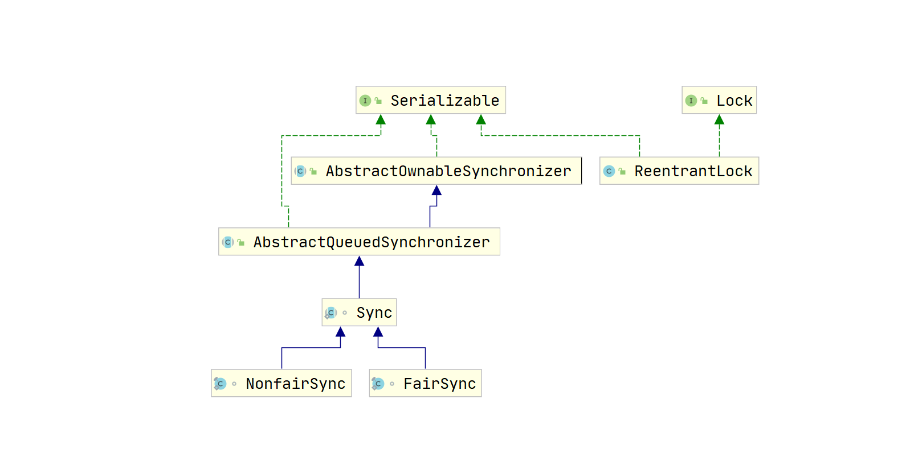

## CAS 与原子类

由于JVM的synchronized重量级锁涉及操作系统 （如Linux） 内核态下的互斥锁的使用， 其线程阻塞和唤醒都涉及进程在用户态和到内核态的频繁切换，导致重量级锁开销大、性能低。而JVM的synchronized轻量级锁使用CAS（Compare And Swap，比较并交换）进行自旋抢锁，CAS是CPU指令级的原子操作并处于用户态下，所以JVM轻量级锁开销较小。

### CAS 原理

JDK 5所增加的JUC （java.util.concurrent） 并发包对操作系统的底层CAS原子操作进行了封装，为上层Java程序提供了CAS操作的API。

#### Unsafe 类中的 CAS 方法

Unsafe是位于sun.misc包下的一个类，主要提供一些用于执行低级别、不安全的底层操作，如直接访问系统内存资源、自主管理内存资源等，Unsafe大量的方法都是原生（native）方法，基于C++语言实现，这些方法在提升Java运行效率、增强Java语言底层资源操作能力方面起到了很大的作用。

Unsafe类的全限定名为sun.misc.Unsafe，从名字中我们可以看出这个类对普通程序员来说是“危险”的，一般的应用开发都不会涉及此类，Java官方也不建议直接在应用程序中使用。

> 为什么此类取名为Unsafe呢？由于使用Unsafe类可以像C语言一样使用指针操作内存空间，这无疑增加了指针相关问题、内存泄漏问题的出现概率。总之，在程序中过度使用Unsafe类会使得程序出错的概率变大，使得安全的语言Java变得不再“安全”，因此对Unsafe的使用一定要慎重。

操作系统层面的CAS是一条CPU的原子指令 （cmpxchg指令） ， 正是由于该指令具备了原子性，因此使用CAS操作数据时不会造成数据不一致的问题，Unsafe提供的CAS方法直接通过native方式（封装C++代码）调用了底层的CPU指令cmpxchg。

#### 使用 CAS 进行无锁编程

CAS是一种无锁算法，该算法关键依赖两个值——期望值（就值）和新值，底层CPU利用原子操作判断内存原值与期望值是否相等，如果相等就给内存地址赋新值，否则不做任何操作。

使用CAS进行无锁编程的步骤大致如下：

1）获得字段的期望值（oldValue）。

2）计算出需要替换的新值（newValue）。

3） 通过CAS将新值 （newValue） 放在字段的内存地址上， 如果CAS失败就重复第1） 步到第2）步，直到CAS成功，这种重复俗称CAS自旋。

当并发修改的线程少， 冲突出现的机会少时， 自旋的次数也会很少， CAS性能会很高；当并发修改的线程多，冲突出现的机会多时，自旋的次数也会很多，CAS性能会大大降低。所以，提升CAS无锁编程效率的关键在于减少冲突的机会。

### JUC 原子类

JUC并发包中原子类都存放在java.util.concurrent.atomic类路径下

基础原子类（以AtomicInteger为例）主要通过CAS自旋+volatile相结合的方案实现，既保障了变量操作的线程安全性，又避免了synchronized重量级锁的高开销，使得Java程序的执行效率大为提升。

> CAS用于保障变量操作的原子性，volatile关键字用于保障变量的可见性，二者常常结合使用。

#### ABA 问题

什么是ABA问题？举一个例子来说明。 比如一个线程A从内存位置M中取出V1， 另一个线程B也取出V1。现在假设线程B进行了一些操作之后将M位置的数据V1变成了V2，然后又在一些操作之后将V2变成V1。之后，线程A进行CAS操作，但是线程A发现M位置的数据仍然是V1，最后线程A操作成功。尽管线程A的CAS操作成功，但是不代表这个过程是没有问题的，线程A操作的数据V1可能已经不是之前的V1，而是被线程B替换过的V1，这就是ABA问题。

很多乐观锁的实现版本都是使用版本号（Version）方式来解决ABA问题。乐观锁每次在执行数据的修改操作时都会带上一个版本号， 版本号和数据的版本号一致就可以执行修改操作并对版本号执行加1操作，否则执行失败。因为每次操作的版本号都会随之增加，所以不会出现ABA问题，因为版本号只会增加不会减少。

参考乐观锁的版本号，JDK提供了一个类似 AtomicStampedReference类来解决ABA问题。AtomicStampReference在CAS的基础上增加了一个Stamp（印戳或标记），使用这个印戳可以用来觉察数据是否发生变化，给数据带上了一种实效性的检验。

AtomicMarkableReference是AtomicStampedReference的简化版，不关心修改过几次，仅仅关心是否修改过。因此，其标记属性mark是boolean类型，而不是数字类型，标记属性mark仅记录值是否修改过。

AtomicMarkableReference适用于只要知道对象是否被修改过的场景，而不适用于对象被反复修改的场景。

### 提升高并发场景下 CAS 操作的性能

在争用激烈的场景下，会导致大量的CAS空自旋。比如，在大量的线程同时并发修改一个AtomicInteger时，可能有很多线程会不停地自旋，甚至有的线程会进入一个无限重复的循环中。大量的CAS空自旋会浪费大量的CPU资源，大大降低了程序的性能。

在高并发场景下如何提升CAS操作性能呢？可以使用LongAdder替代AtomicInteger。

Java 8提供一个新的类LongAdder，以空间换时间的方式提升高并发场景下CAS操作性能。

LongAdder核心思想就是热点分离，与ConcurrentHashMap的设计思想类似：将value值分离成一个数组，当多线程访问时，通过Hash算法将线程映射到数组的一个元素进行操作；而获取最终的value结果时，则将数组的元素求和。

最终， 通过LongAdder将内部操作对象从单个value值 “演变” 成一系列的数组元素， 从而减小了内部竞争的粒度。

AtomicLong使用内部变量value保存着实际的long值，所有的操作都是针对该value变量进行。也就是说， 在高并发环境下，value变量其实是一个热点，也就是N个线程竞争一个热点。重试线程越多，就意味着CAS的失败概率越高，从而进入恶性CAS空自旋状态。

LongAdder的基本思路就是分散热点， 将value值分散到一个数组中， 不同线程会命中到数组的不同槽（元素）中，各个线程只对自己槽中的那个值进行CAS操作。这样热点就被分散了，冲突的概率就小很多。

使用LongAdder，即使线程数再多也不担心，各个线程会分配到多个元素上去更新，增加元素个数就可以降低 value的“热度”，AtomicLong中的恶性CAS空自旋就解决了。

### CAS 在 JDK 中的广泛应用

CAS的优势主要有两点：

1）属于无锁编程，线程不存在阻塞和唤醒这些重量级的操作。

2）进程不存在用户态和内核态之间的运行切换，进程不需要承担频繁切换的开销。

CAS操作的弊端主要有以下4点。

（1）ABA问题

（2）只能保证一个共享变量之间的原子性操作

（3）无效CAS会带来开销问题

（4）在部分CPU平台上存在“总线风暴”问题

CAS操作和volatile一样也需要CPU进行通过MESI协议各个内核的“Cache一致性”，会通过CPU的BUS（总线）发送大量MESI协议相关的消息，产生“Cache一致性流量”。因为总线被设计为固定的 “通信能力”， 如果Cache一致性流量过大， 总线将成为瓶颈， 这就是所谓的 “总线风暴”。

提升CAS性能有效方式之一是以空间换时间，分散竞争热点。较为常见的方案为：

1）分散操作热点，使用LongAdder替代基础原子类AtomicLong，LongAdder将单个CAS热点（value值）分散到一个cells数组中。

2）使用队列削峰，将发生CAS争用的线程加入一个队列中排队，降低CAS争用的激烈程度。JUC中非常重要的基础类AQS（抽象队列同步器）就是这么做的。

提升CAS性能有效方式之二是使用线程本地变量，从根本上避免竞争。

## JUC

前面介绍的在争用激烈的场景下，使用基于CAS自旋实现的轻量级锁有两个大的问题：

1）CAS恶性空自旋会浪费大量的CPU资源。

2）在SMP架构的CPU上会导致“总线风暴”。

解决CAS恶性空自旋的有效方式之一是以空间换时间，较为常见的方案有两种：分散操作热点、使用队列削峰。JUC并发包使用的是队列削峰的方案解决CAS的性能问题，并提供了一个基于双向队列的削峰基类——抽象基础类AbstractQueuedSynchronizer（抽象同步器类，简称为AQS）。

### AQS实现原理

AQS（全称AbstractQueuedSynchronizer）即队列同步器。它是构建锁或者其他同步组件的基础框架（如ReentrantLock、ReentrantReadWriteLock、Semaphore等）。AQS是JUC并发包中的核心基础组件，其本身是一个抽象类。理论上还是利用管程实现的，在AQS中，有一个volatile修饰的state，获取锁的时候，会读写state的值，解锁的时候，也会读写state的值。所以AQS就拥有了volatile的happens-before规则。加锁与解锁的效果上与synchronized是相同的。

AQS是一个FIFO的双向队列，其内部通过节点head和tail记录队首和队尾元素，队列元素的类型为Node。

- Node中的thread变量用来存放进入AQS队列里面的线程，Node节点内部:
  - prev记录当前节点的前驱节点
  - next 记录当前节点的后继节点
- SHARED用来标记该线程是获取共享资源时被阻塞挂起后放入AQS队列的
- EXCLUSIVE用来标记线程是获取独占资源时被挂起后放入AQS队列的
  - waitStatus 记录当前线程等待状态，可以为①CANCELLED (线程被取消了)、②SIGNAL(线程需要被唤醒)、③CONDITION(线程在CONDITION条件队列里面等待)、④PROPAGATE(释放共享资源时需要通知其他节点);

在AQS中维持了一个单一的状态信息state，对于ReentrantLock的实现来说，state 可以用来表示当前线程获取锁的可重入次数；AQS继承自AbstractOwnableSynchronizer，其中的exclusiveOwnerThread变量表示当前共享资源的持有线程。

AQS是一个同步队列，内部使用一个FIFO的双向链表，管理线程同步时的所有被阻塞线程。双向链表这种数据结构，它的每个数据节点中都有两个指针，分别指向直接后继节点和直接前驱节点。所以，从双向链表中的任意一个节点开始，都可以很方便地访问它的前驱节点和后继节点。
我们看下面的AQS的数据结构，AQS有两个节点head，tail分别是头节点和尾节点指针，默认为null。AQS中的内部静态类Node为链表节点，AQS会在线程获取锁失败后，线程会被阻塞并被封装成Node加入到AQS队列中；当获取锁的线程释放锁后，会从AQS队列中的唤醒一个线程（节点）。

### ReentrantLock 源码

