# 第 8 章 高性能与可用性(2)
## 8.2　可用性

8.1 节从缓存的角度介绍了分布式系统的高性能，本节要讲可用性是分布式系统已经具备的性质。将应用或者服务分布式部署本身就是在保证系统的可用性，当某一个节点上的服务挂掉时，其他节点上的水平扩展服务仍旧会提供相同的服务，提高用户的使用体验。在高并发、大数据的应用场景中，分布式系统的可用性体现得尤为明显。可用性需要保证在遭遇高并发时，整个系统中的应用程序依旧保持可用，如果从服务可用、服务部分可用和服务完全不可用三方面来看待这个问题，那么分别对应的是请求限流、服务降级和服务熔断。请求限流是从流入系统的请求角度，看如何限制单位时间内的请求数，来保证系统的稳定性。服务降级是从服务的角度，定义服务等级并且针对服务等级实施降级策略。服务熔断是对无法正常提供服务的应用程序采取特定的干预措施，保证其不会影响到其他应用程序。下面展开介绍这三个问题。

### 8.2.1　请求限流

随着业务量的增加，常常会遇到高并发场景，即便是并发处理能力很强的架构，也会因此遇到瓶颈。为了保证业务系统能够正常运行，在请求量超出系统承受范围的时候，就需要对流入系统的请求进行限制了。保证现有系统正常运行就是限流的意义。

系统的流量通常通过 QPS 来衡量。QPS（Queries-per-second，每秒查询率）是衡量系统每秒能够处理多少查询次数的标准，其数值越大，表示系统能够处理的并发查询数越高。这个数值如果过高，就会影响系统的处理效率，特别是秒杀系统瞬间迎来高并发时，对系统是一个挑战。为了保证系统的平稳运行，需要对流量进行限制。由于流量从客户端出发，先流经接入层，再到应用服务器，最后到应用服务，会经历几个过程，因此每个层次都需要考虑限流的问题。下面将展开讲解限流算法、接入层限流、单点限流、集群限流几方面。

1. **限流算法**

   漏桶算法：有一个容量固定的桶，数据报按照固定的速度从中流出，但可以按照任意的速度流入桶中，如果数据报的量超过了桶的容量，那么再流入的数据报将会被丢弃。按照这个规则，需要设置限流的区域、桶的容量，以及是否延迟。这种算法的如图 8-21 所示。

   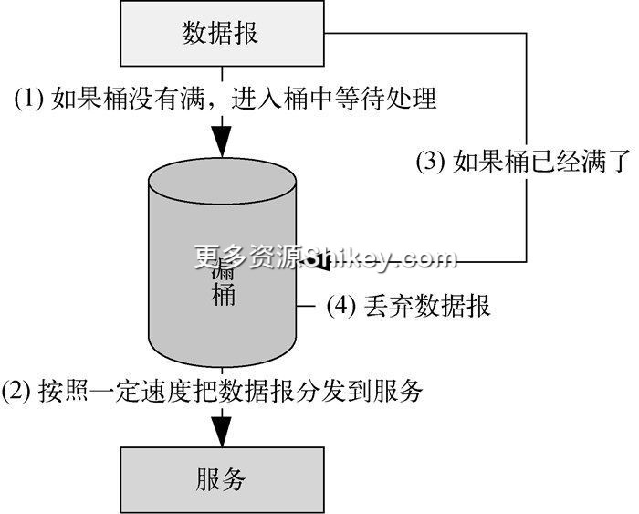

   **图 8-21　漏桶算法示意图**

   其中各步分别如下。

   (1) 数据报流入漏桶的时候，先判断桶是否满了。如果桶没有满，则进入桶中等待处理（桶中的数据会按照一定的速度被处理）。

   (2) 漏桶按照一定速度把数据报分发到各个目标服务。

   (3) 随着数据报不断加入，漏桶会被装满。

   (4) 如果漏桶被装满了，再流入的数据报就会被丢弃，那么请求这些数据的用户就会收到错误信息。

   令牌桶算法：这里也有一个容量固定的桶，并以固定的速度往这个桶里放置令牌，桶满之后，就无法再添加令牌。当数据报到来时，先从桶中取令牌，如果桶中有令牌，那么数据报就凭借令牌处理请求，处理完毕后，令牌销毁；如果桶中没有令牌，那么该请求将被拒绝。请求在发往令牌桶之前，需要经过过滤器（分类器），目的是对报文进行分类，例如某类报文可以直接发往应用服务器、某类报文需要经过令牌桶获取令牌以后才能发，又例如 VIP 请求可以直接发往服务器，无须经过令牌桶。令牌桶算法的示意图如图 8-22 所示。

   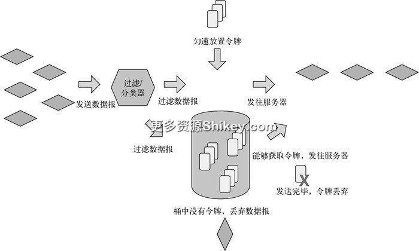

   **图 8-22　令牌桶算法示意图**

   漏桶算法能够限制数据报的传输速度，使数据报按照平滑的速度流入桶中，对突发流量不做额外处理；令牌桶算法通过放置令牌的方式限制数据报的流入速度，可以应对流量突然增大的情况，当请求流量增大时，可以加快放入令牌的速度，使两个速度相匹配。

   因此，漏桶算法和令牌桶算法最明显的区别在于对突发流量的处理，这方面令牌桶略占上风。

2. **接入层限流**

   限流算法只是实现限流功能的基础，具体限流操作的实践是多种多样的。Nginx 作为接入层，是应用服务与客户端之间的中介者，负责反向代理和负载均衡工作。接入层把客户端请求路由到不同的服务器上，这些服务器再分别响应请求。在这一层可以对整个系统进行限流操作，这里我们来看看 Nginx 是如何应用限流算法的。


   - **限制访问频率的 `ngx_http_limit_req_module` 模块**

     `ngx_http_limit_req_module` 模块的功能是根据每个客户端的 IP 地址，限制客户端每秒发出的请求数，并且定义一块内存空间作为缓冲区，将超过请求频率的客户端请求暂时缓存起来。

     下面来看看对应的参数定义，Nginx 配置文件如下：


     ```
     http{
         limit_req_zone $binary_remote_addr zone=limit:10m rate=2r/s;        ①
     }
     server {
         location / {
             limit_req zone=limit burst=5 nodelay;      ②
             proxy_pass http://192.168.1.1:8888
         }
     }
     ```


     从上述配置内容可以看出以下两点。

     ① `http` 中的 `limit_req_zone` 表示限制请求的区域，后面跟着的 `$binary_remote_addr` 表示发出请求的客户端 IP 地址。 `zone=limit` 用来定义一个名为 `limit` 的缓冲区，此缓冲区用于存放服务器无法即时处理的请求。 `10m` 的意思是缓冲区的大小是 10MB。在并发量高的情况下，大多数请求会由于没有得到响应而被放在这个缓冲区，可以考虑适当扩大其空间。对于 64 位系统来说，这里的 10MB 缓冲区可以存放约 16 万个 IP 地址。

     再后面的 `rate=2r/s` 表示每秒处理来自同一个 IP 地址 2 个请求。这里可以根据 IP 地址设计用户的请求频率， `rate` 配置的就是漏桶的流出速度。

     ② `location` 中的 `limit_req zone=limit`，对应第 ① 步中 `http` 里定义的缓冲区。 `burst=5` 用来配置如何处理超额请求，假设一秒内，有 7 个来自同一 IP 地址的请求，那么服务器只处理其中 1 个，另外有 5 个放在缓冲区中等待处理，这 5 个请求既不会被拒绝也不会被丢弃，还剩下 1 个请求则失败。配置的这个 `busrt` 就是桶的大小，如果配置为 `0`，表示桶中不会存放任何请求，请求以一定的速度漏出桶外；如果配置具体的值，那么当同时到达多个请求时，会暂存相应数量的请求。最后的 `nodelay` 表示超过 `rate` 配置的流出速度的请求不会被延迟处理。

   - **限制并发数的 `ngx_stream_limit_conn_module` 模块**

     与 `ngx_http_limit_req_module` 模块不同， `ngx_stream_limit_conn_module` 模块是通过控制资源的连接数来限制请求的。例如支持同一个 IP 地址与 Nginx 之间有 _n_ 个连接。

     下面来看看对应的参数定义：


     ```
     http{
         # 分别通过 IP 和 server 来限制同时连接的个数，在 zone 中配置缓存的大小
         limit_conn_zone $binary_remote_addr zone=perip:10m;       ①
         limit_conn_zone $server_name zone=perserver:10m;
     }
     server {
         location / {
             limit_conn perip 20;            ②
             limit_conn perserver 100;   ③
         }
     }
     ```


     从上述配置内容可以看出以下三点。

     ① `http` 中的 `limit_conn_zone` 表明限制请求的区域，后面跟着的 `$binary_remote_addr` 表示发出请求的客户端 IP 地址，这个定义和 `ngx_http_limit_req_module` 模块的配置是一样的。通过 `zone=perip:10m` 来指定缓冲区的大小。同理，下面的一条规则是通过 `server_name`，即服务器名字实现的限制，通过 `zone=perserver:10m` 来指定缓冲区的大小。

     ② `limit_conn perip 20` 对应的 `key` 是 `$binary_remote_addr`，表示限制单个 IP 地址同时最多能持有 20 个连接。

     ③ `limit_conn perserver 100` 对应的 `key` 是 `$server_name`，表示虚拟主机同时能够处理的并发连接总数。注意，只有当请求头被后端服务器处理后，这个连接才能参与计数。

     从 Nginx 的配置文件可以看出，两个模块的配置基本相似。下面总结一下。

     `ngx_http_limit_req_module` 模块限制了同一个 IP 地址在同一时间访的问频率。

     `ngx_stream_limit_conn_module` 模块限制了同一个 IP 地址在同一时间的连接总数。


3. **单点限流**

   Nginx 实现的是接入层限流，那到了应用层，针对单个应用服务又该如何实现限流呢？这些有很多最佳实践，例如 Sentinel、Guava 等工具都提供限流功能。思路和接入层一样，我们以 Sentinel 为例给大家介绍单点限流如何实现。Sentinel 是阿里巴巴开源的一套工具集，以流量为切入点，从流量控制、熔断降级、系统负载保护等多个维度保证服务的稳定性。这里我们着重介绍 Sentinel 的限流功能，内容分两个部分：规则定义和规则应用。

   先来看规则定义。


   - `Resource`：限流规则针对的资源名称，这个资源可以是某个服务、方法或者代码段。在 Sentinel 中，资源被抽象出来执行具体的限流操作，可以限流代码和服务。这种方式使得 Sentinel 屏蔽了复杂的逻辑，用户只需要为受保护的代码或者服务定义资源，然后定义规则就可以了，剩下的事情由 Sentinel 完成。并且资源和规则是解耦的，甚至可以在运行时动态修改规则。
   - `Grade`：限流类型。例如 QPS（ `FLOW_GRADE_QPS`）、线程数（ `FLOW_GRADE_THREAD`）。
   - `Count`：限流阈值。例如限流类型填写的是 `FLOW_GRADE_QPS`，那么这里填写 `20` 指的是 QPS 若为 20，就达到了阈值。
   - `LimitApp`：限流来源，指具体的服务或者方法，可以用逗号分割。取值为 `default` 的时候，表示所有调用请求都要参与限流统计。这里可以填写具体调用方，之后会针对这个具体的调用方进行限流。
   - `Strategy`：限流策略，是基于调用关系的流量控制策略。其包括三种限流模式， `STRATEGY_DIRECT` 对于所有调用者进行限流； `STRATEGY_RELATE` 表示关联流量限流，给两个资源设置关联关系后，可以避免两个资源之间的过度争抢； `STRATEGY_CHAIN` 表示根据链路入口限流，假设有两个不同的请求都调用了资源，可以指定其中一个请求进行限流，而对另一个不限流。
   - `ControlBehavior`：限流行为。 `CONTROL_BEHAVIOR_DEFAULT` 表示满足条件以后直接拒绝，例如 QPS 超过 20，就拒绝请求； `CONTROL_BEHAVIOR_WARM_UP` 表示排队等待，在流量突然增加的时候通过缓慢提高系统请求量的方式让请求通过，不至于因为流量瞬间猛增而压垮系统，也就是慢慢预热； `CONTROL_BEHAVIOR_RATE_LIMITER` 表示按照一定的速度让请求通过，类似漏桶算法。

把上面配置资源与规则的过程总结一下，结果如图 8-23 所示。

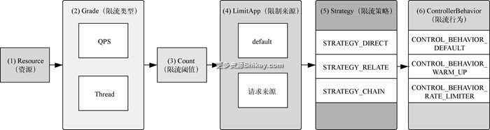

**图 8-23　单点限流的配置过程图**

下面的代码块通过 `initFlowRules` 方法设置限流规则：

```
private static void initFlowRules(){
    List<FlowRule> rules = new ArrayList<>();
    FlowRule rule = new FlowRule();
    rule.setResource("HiResource");       ①
    rule.setGrade(RuleConstant.FLOW_GRADE_QPS);   ②
    rule.setCount(20);     ③
    rule.setStrategy(STRATEGY_DIRECT);     ④
    rule.setControlBehavior(CONTROL_BEHAVIOR_DEFAULT)   ⑤
    rules.add(rule);
    FlowRuleManager.loadRules(rules);       ⑥
}
```

下面按照标号简要介绍上述代码的含义。

① 设置 `HiResource` 作为限流资源。

② 设置限流类型为 QPS。

③ 设定限流阈值为 20。

④ 设置限流策略 `Strategy` 为 `STRATEGY_DIRECT`。

⑤ 设置限流行为是 `CONTROL_BEHAVIOR_DEFAULT`。

⑥ 通过 `FlowRuleManager` 中的 `loadRules` 方法加载规则。

再来看规则应用，相关代码如下：

```
public static void main(String[] args) {
    initFlowRules();         ①
    while (true) {
        Entry entry = null;
        try {
            entry = SphU.entry("HiResource");    ②
            /*你的业务逻辑 - 开始*/
                System.out.println("hello world");
            /*你的业务逻辑 - 结束*/
        } catch (BlockException e1) {
            /*限流逻辑处理 - 开始*/
                System.out.println("block!");
            /*限流逻辑处理 - 结束*/
        } finally {
            if (entry != null) {
                entry.exit();
            }
        }
    }
}
```

下面按照标号简要介绍上述代码的含义。

① 调用业务逻辑之前先通过 `initFlowRules` 方法加载限流规则。

② 执行 `entry` 方法指定限流的资源 `HiResource`。在执行 `SphU.entry()` 后，会返回一个 `Entry`， `Entry` 表示一次资源操作。这段代码默认有一个上下文环境，也就是 `Context`，每个资源操作，即对 `Resource` 进行的 `entry`、 `exit` 操作，都必须对应一个 `Context`。如果程序中未指定 `Context`，就会创建 `name` 为 `sentinel_default_context` 的默认 `Context`。一旦满足了限流条件，便会进入 `try catch`，所做的限流处理就是对资源进行保护。注意这里的限流逻辑是通过 `try catch` 硬编码的方式实现的，还可以用注释等其他方式完成。

4. **集群限流**

   接入层限流和单点限流介绍完后，自然而然出现了一个问题。接入层和单点服务能否合作实现限流呢？例如接入层限制 QPS 为 100，单点服务有 10 个，就可以让每个服务分别限制 QPS 为 10；又或者让其中 5 个服务每个限制 QPS 为 12，另外 5 个每个限制 QPS 为 8。针对这种情况，我们就可以使用集群限流了。当然，集群限流可以通过接入层限流和单点限流相结合的方式完成。为了更加方便地执行集群限流，我们先介绍 Sentinel 的集群限流方案，当然使用 Nginx+Lua 的解决方案也可以搞定。由于各个服务节点是分散部署的，在实现单点限流的同时还要兼顾整体的流量，因此需要在独立于集群的地方开辟一个存储空间，让单点在进行流量限制的时候记录流过自身的流量，以便限制集群的整体流量。下面是 Sentinel 的集群限流方案，Sentinel 集群限流由两部分组成。


   - **token server**：集群流控服务端，用来存放限制整个集群的流量数，例如集群限流 100QPS，单点 1 限流 50QPS，单点 2 限流 50QPS。同时它还用来处理来自 token client 的请求，token client 每次处理请求之前都会找 token server 获取一个 token。token server 根据 token client 配置的限流 QPS 给它发放 token。当请求节点的请求数超过单点配置的请求数时，或者接入层传入集群的请求数超过集群中节点配置请求数之和时，token server 会拒绝发放 token。同样地，token client 每次处理完一个请求以后，都会归还 token。
   - **token client**：集群流控客户端，安装在单点应用上。每当有请求到达的时候，它就会主动向 token server 请求获取 token。拿到 token 以后才能处理请求，如果没拿到就拒绝处理请求。

由于 token server 是单点设计，因此一旦它挂掉，集群限流便会退化成单点限流模式。Sentinel 的集群限流方案如图 8-24 所示。

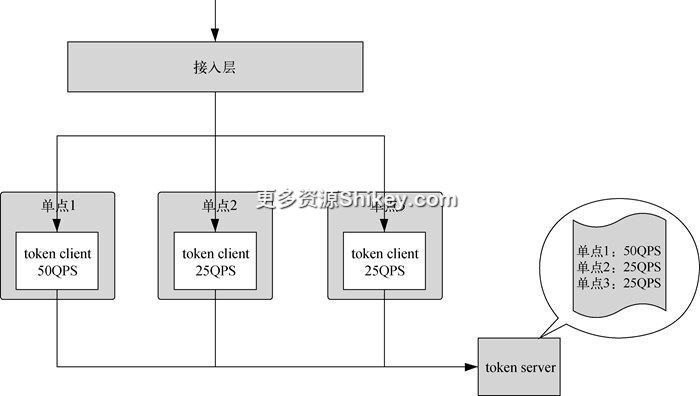

**图 8-24　Sentinel 的集群限流方案**

由图 8-24 能够看出，token server 负责配置整个集群和单点的限流情况。当接入层接收到客户端请求并交给单点进行处理的时候，单点先从 token server 上获取 token。如果不超过单点 QPS 和不超过集群 QPS 这两个条件都满足，token server 就会给单点发送 token，继而单点可以处理请求。否则 token server 不给单点发送 token，单点拒绝处理客户端请求。

在实现集群限流时，限流规则的定义会在第三方配置中心（例如 Consul、Redis、Spring Cloud Config、Nacos 等）实现。token client 和 token server 会主动注册到配置中心设置、拉取配置信息。

同时， `FlowRule` 添加了两个字段用于配置集群限流。

   - `clusterMode` 用于标识是否是集群限流配置。
   - `clusterConfig` 是与集群限流相关的配置项，其中 `flowId` 代表全局唯一的规则 ID，由集群限流管控端统一分配； `thresholdType` 代表阈值模式，可以设置单机均摊阈值和全局阈值； `fallbackToLocalWhenFail` 表示在 token client 连接失败或通信失败时，是否退化到本地的限流模式。

至此，请求限流的相关内容已经全部介绍完毕，这里做一个小小的总结。限流的目的是保护系统不会因为大流量的冲击而出现故障。对于限流的实践，基于的都是漏桶算法和令牌桶算法。接入层作为流量的入口，通过 Nginx 对客户端的请求频率和并发数进行限流。应用服务作为单点，也可以进行限流操作，具体通过 Sentinel 的限流规则定义和限流规则应用来实施。服务器集群限流的实现则需要依赖 Sentinel 的 token server 和 token client。

### 8.2.2　服务降级

请求限流可以提高系统对高并发请求的可用性，然而如何保证整个系统架构的可用性呢？众所周知，一个复杂的业务系统由大大小小多个应用服务组成，这些服务根据业务的重要性被分为核心服务和非核心服务。在面临高并发请求的时候，系统如何保证所有服务都正常运行是一个巨大的挑战。一旦请求量到达系统的承受极限，势必要放弃一些非核心服务，以保证核心服务的正常运行。系统这种弃卒保车的行为被称为服务降级。为了保证核心服务能够正常运行，选择暂停运行一些非核心服务，或者关闭非核心服务的部分功能、只返回部分数据等。考虑到整个系统的稳定性，需要对服务降级进行预判，也就是对有可能出现问题的地方设置降级方式。具体的方式就是开关机制，这个开关可以配置在本地文件中，也可以配置在 Redis、ZooKeeper 或者数据库中。鉴于分布式部署以及微服务的应用，开关的配置得到了广泛应用。接下来会依次介绍降级等级与分类、降级开关分类与设计、降级开关实现策略。

1. **降级等级与分类**

   如果把降级理解为应对系统异常的处理方式，那么具体的降级行动就是对异常做出的响应。在设计降级之前，我们需要对异常处理进行规划，针对不同的异常情况采取不同的降级等级。降级等级有以下几种。


   - **一般**：服务出现网络抖动，或者服务刚刚上线还没有预热的时候就遭遇了比较大的访问量。
   - **警告**：在一段时间内出现服务访问错误的情况，这种情况虽然会返回错误，但是不影响服务的整体运行，此时可以发出警告信息，运维人员会通过网络、系统、应用的参数分析如何对服务进行处理。这里可以设置一个出错率，例如 5%~10%。
   - **错误**：当服务的出错率增加，例如 20%~30%，或者在某一时间段出现大量超时问题的时候，就需要分析监控数据，查看是哪个服务或者数据库出现了瓶颈。这里需要人为干预，进行服务的暂停和切换。
   - **严重**：服务完全不可用。需要人为干预，进行服务的替换、自动导流，甚至服务器重启。

降级等级是告诉我们如何有针对性地处理不同情况下的系统异常，接下来降级分类是告诉我们在哪些地方需要考虑实施降级。

   - **页面降级**：如果某些页面出现了访问无效的问题，就需要对其进行降级处理。例如多人同时下单导致商品下单页面处于不可用的状态时，需要对此页面进行降级处理，可以返回一个“友好”的写着订单正在处理中的简单页面（可以把这个页面设置成一个完全静态的页面，然后放在 CDN 缓存中作为兜底页面）。又例如用户点击下单以后，服务没有响应，那么此时就需要将下单按钮设置为失效，不让用户再点击使用这个按钮，以免更多请求涌入服务器。
   - **读降级**：在高并发场景下，数据库会成为瓶颈，当数据库的响应时间变长时，可以不去读取数据库中的数据，转而读取缓存中的数据。当分布式缓存服务器的响应时间变长时，可以读取本地缓存中的数据。如果本地缓存都出现了问题，还可以读取 CDN 缓存中保存的兜底数据。总之，无论哪一层数据读取出现了问题，都不能给用户返回冷冰冰的错误代码，而是尽量返回用户可以理解的、与业务相关的数据。
   - **写降级**：在写入数据，在更新库存的时候，会出现数据库瓶颈。此时可以先在缓存中扣减库存，然后通过队列将数据同步到数据库中。

2. **降级开关分类与设计**

   降级能够保障系统正常运行，其实现手段就是开关机制。在日常的使用中，有两种降级开关，分别是自动降级开关和手动降级开关，它们分别应用在不同场景中。


   - **自动降级开关**

     系统在运行时根据运行状态或者条件自动触发降级开关，此类开关的降级等级并不高，都处在一般和警告级别。


     - **超时降级开关**：远程调用非核心服务时，如果服务响应过慢，就自动降级，先停止调用。例如在调用商品详情服务的时候，需要调用商品推荐服务或者商品评价服务，如果此时后两个服务出现调用超时的情况，就暂时停止调用，不返回相关信息，或者起用兜底数据做替代。这里需要根据超时的规则，配置好超时时间以及超时次数，只有达到条件才会触发降级开关。
     - **失败降级开关**：当服务调用一些不稳定的服务时，这些服务在某些时候会返回失败信息。例如付款的时候会调用第三方支付接口，如果调用不成功，通常会收到失败信息，系统便会再次调用。如果调用一定次数以后，依旧无法获得正确响应，就需要果断进行降级处理，甚至采用熔断机制。在关闭服务的时候，也需要发送通知，让运维团队介入调查。当然，如果失败一定次数之后，服务又恢复了，则需要关闭降级开关，让服务继续接受访问。
     - **故障降级开关**：故障表示对应的服务或者服务器已经无法正常工作。例如服务或者服务器挂掉了、完全不可用了，需要立即进行降级处理，此时果断使用兜底数据，或者由其他服务替代其工作。这种降级的等级比较高，需要人为参与才能解决问题。
     - **限流降级开关**：这类降级通常设置在接入层或者 API 网管上，负责不断监控流入系统的流量。在秒杀高峰到来的瞬间，流量会激增，对秒杀系统造成巨大的压力，此时就可以打开限流降级开关。针对整个系统，这个开关可以显示访问流量的进入量，或者指定一定流量的数据可以进入到系统，其他的流量则会被拒绝。单个服务能够处理的流量也是有限的，当此开关打开的时候，多出的流量会被拒绝。秒杀系统通常会使用限流机制作为保护，当达到限流阈值时，后续请求就自动被降级，例如将用户导流到排队页面，提示过会儿重试，或者直接告知用户没货了。

   - **手动开关降级**

     设计自动降级是为了减缓运维压力，让一些日常规则性的降级处理由降级规则决定，同时由于压力测试在之前就已经进行过，因此运维人员对系统的瓶颈心知肚明，可以根据系统的最大承载能力设计这个降级规则。除了自动开关降级，还有一些手动开关降级，会用在一些特殊场景中。例如即便系统暂时没有出现问题，也还是想降级某些服务。特别是秒杀将要开始的时候，可以大致预知访问量。此时，可以慢慢调整降级开关，把流量放进来，以预热系统。还有做灰度测试的时候，不清楚新业务会对系统造成什么影响，也可以先通过降级开关把业务指向新服务。如果出现问题，也可以通过开关把业务指向老服务，保持整个系统交付的稳定性。


3. **降级开关实现策略**

   无论是自动降级开关还是手动降级开关，都需要在代码中加入对应的开关。在单机模式下，通常将这个开关写到配置文件中，然后在代码中监控配置文件中对应值的改动。程序中原有的流程会受这个配置开关的影响，分别调用不同的服务或者数据。这种方式对于单机应用来说是实用的，但在分布式系统中，服务做了水平扩展，此时对配置的读取就不能通过本地配置文件来实现。一般来说，每个服务的配置信息可以存放到分布式的配置文件系统、数据库、Redis、ZooKeper 等地方，然后通过某种机制进行同步操作。分布式系统中还会有一个配置中心，对整个系统中的降级开关进行集中管理，并且提供 Web UI 界面便捷用户的操作。目前有一些开源方案可以选择，例如 ZooKeeper、Diamond、Etcd 3、Consul。降级开关在分布式系统中的实现方案如图 8-25 所示。

   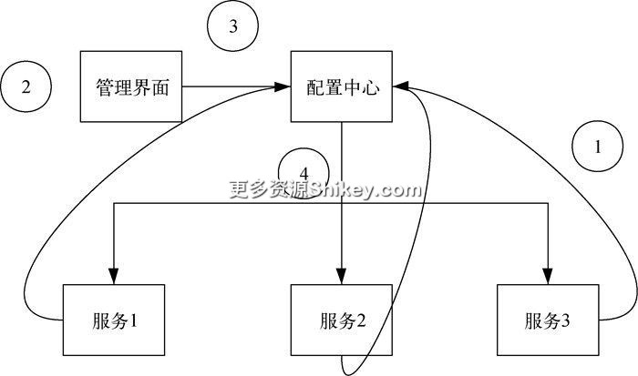

   **图 8-25　降级开关在分布式系统中的实现方案**

   图中上半部分是管理界面和配置中心，下半部分是三个服务。

   ① 分布式服务（1~3）启动的时候，从配置中心获取最新的配置信息，并把这些配置信息作为降级开关加载到服务中。

   ② 打开或者关闭降级开关，例如规则被触发（自动）、手动打开或者关闭降级开关（手动）。注意这里是通过管理界面触发的降级开关，也可以通过规则触发开关，总而言之是满足一定条件以后把开关打开或者关闭。无论哪种方式，都会把这个更改操作通知给配置中心。

   ③ 配置中心收到更改开关的信息。

   ④ 配置中心将开关的更改信息发送给各个在配置中心注册过的服务。服务收到这个信息以后，会改变自身内部的业务流程，实现降级开关对应的业务逻辑。

   需要注意的是，从配置中心获取降级开关信息的操作有很多种方式。这里列举两种。


   - **主动拉取配置**。服务会根据配置中心的地址信息，按照一定的时间周期主动到配置中心获取降级开关的更改信息。这种方式会对服务端的性能造成损耗，因为服务端需要不断地请求配置中心，检查降级开关的值，即使这个开关没有变化也要定期访问。
   - **发布订阅配置**。服务端会订阅配置中心对于降级开关的消息，配置中心接收到更改开关的命令时，就触发发布消息事件，服务端接收到消息后再从配置中心获取相应的信息。这种方式对服务端比较友好，使得服务端只在需要更新的时候去获取降级开关的信息即可。

这里我们以 Consul 作为配置中心，来看看作为服务来说是如何从配置中心获取配置信息的。通过 `startWatch` 方法实现定时获取 Consul 中定义的降级开关配置信息，该方法的代码如下：

```
pulic void startWatch() {
        final String system = "switchs";
        Consul consul = Consul.builder().withHostAndPort(HostAndPort.
            fromString("192.168.0.1:8588")).withConnectTimeoutMillis(1000).
            withReadTimeoutMillis(30 * 1000).
            withWriteTimeoutMillis(5000).build();    ①
        final KeyValueClient keyValueClient = consul.keyValueClient();    ②
        final AtomicBoolean needBreak = new AtomicBoolean(true);
        Thread watchThread = new Thread(() -> {           ③
            BigInteger index = BigInteger.ZERO;
            while (true) {
                Properties _properties = new Properties();
                try {
                    List<Value> values = keyValueClient.getValues(system,
                        QueryOptions.blockSeconds(30, index).build());     ④
                    for (Value value : values) {
                        _properties.put(value.getKey().substring(system.length()
                            + 1), value.getValueAsString());
                        logger.info("key:{}, value:{}",value.getKey().
                            substring(system.length() + 1),value.
                            getValueAsString().get());
                        index = index.max(BigInteger.valueOf(value.
                            getModifyIndex()));    ⑤
                    }
                    properties = _properties;            ⑥
                } catch (ConsulException e) {

                }
                if (needBreak.get()) {
                    break;
                }
            }
        });
        watchThread.run();
        needBreak.set(false);
        watchThread.setDaemon(true);
        watchThread.start();
    }
```

下面简要介绍上述代码的含义。

① 连接 Consul，需要指定 IP 地址和 Port，并设置连接超时时间、读超时时间和写超时时间。

② 通过 `KeyValueClient` 访问 Consul 中的 `Key`、 `Value` 信息。

③ 启动线程，用于定时访问 Consul。

④ 每隔三十秒从 Consul 里对应的 `Key` 中获取 `Value`。这里的 `index` 从 `0` 开始不断累加，直到获取到 `Key` 对应的所有的 `Value`。

⑤ 记录 `index` 的位置，以便下次获取值的时候从上次的最后获取位置继续获取。

⑥ 更新服务中的 `properties` 配置。

上面代码实现的就是主动拉取配置，服务端每隔一段时间就主动向 Consul 配置中心拉取降级开关的数据。

降级的目的是保证核心服务顺利执行，以及整个系统的稳定性，于是本节针对问题的严重程度对降级进行了分级，并且针对问题发生的不同位置对降级进行了分类。为了达到降级的目的，需要通过开关的方式控制服务行为，例如访问数据库还是缓存、在流量为多少的时候拒绝访问。于是针对不同的场景，对自动降级开关和手动降级开关进行了描述和定义。开发分布式系统时，为应对高并发的场景，需要通过配置中心来更改降级开关配置的信息，还通过 Consul 的例子展示如何具体实施降级开关信息的更改。

### 8.2.3　服务熔断

本节我们把视角从整个系统聚焦到单个服务商，一个复杂的分布式系统往往由无数个服务组成，各服务之间存在千丝万缕的联系。服务之间互为依赖、共同依存，必然免不了相互调用。一旦系统中有一个服务因为各种原因无法继续工作，那么依赖于这个服务的其他服务也有可能受阻，这种情况会导致其他服务的调用无法顺利完成。服务熔断机制就是在服务无法正常提供调用的时候，断开与其他服务的连接，以保证其他服务不受自己的影响。下面我们会讲到：服务不可用的现象和原因、应用隔离、熔断模式、熔断工作流、Hystrix 实现熔断。

1. **服务不可用的现象和原因**

   分布式系统中的服务都不是独立存在的，服务之间会相互调用。作为服务提供者的服务如果本身出现问题，是会拖垮其他服务调用者的。如图 8-26 所示，商品详情服务会调用商品描述服务、商品价格服务和评论服务。评论服务作为服务的提供者如果出现故障，导致无法提供服务，就会影响商品详情服务的调用。

   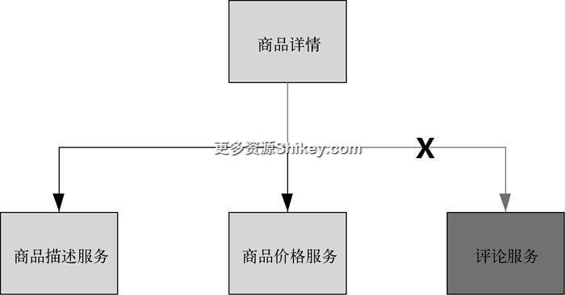

   **图 8-26　服务提供者出现问题，影响服务调用者**

   即便我们对秒杀系统中的部分核心服务进行了高可用处理，实现了水平扩展，核心服务还是可能由于一些非核心服务的故障而出问题。如图 8-27 所示，为了应对高并发，对商品详情服务进行了水平扩展，作为非核心服务的评论服务虽然访问量不大，但是一旦出现异常就会影响商品详情服务的业务。

   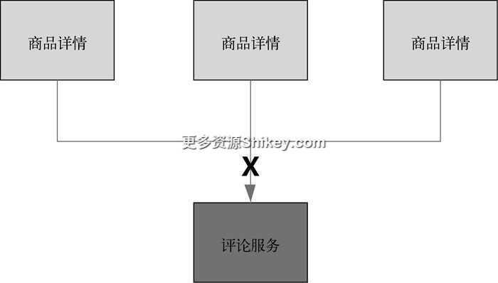

   **图 8-27　经过水平扩展之后的核心服务调用非核心服务**

   服务提供者无法正常提供工作的原因有多种。


   - **硬件故障**。部署服务的硬件服务器出现问题，导致服务调用者无法获得响应。
   - **缓存问题**。多数服务都会使用缓存，如果遇到缓存击穿、缓存雪崩、缓存穿透的情况，导致请求无法命中缓存，而从数据库中直接获取数据，就会造成响应缓慢。这样的缓慢会使服务调用者的大量请求处于等待状态，服务提供者一边要获取数据库的信息，一边还要处理服务调用者的请求，此时会导致服务不可用。
   - **重试流量**。无论是从用户请求还是服务请求的角度，如果请求以后没有得到响应，都会进行重试操作。好比用户在发现页面没有返回值时，不断刷新页面一样，服务调用者在没有得到服务提供者的响应时，也会启动重试机制。在高并发场景下，服务提供者如果没有及时响应调用者的请求，就会被重试流困扰。本来服务提供者对大流量的处理就捉襟见肘，现在迎来了重试的流量，更是变得雪上加霜。
   - **调用者资源耗尽**。如图 8-28 所示，服务调用者使用同步调用，而服务提供者又无法给予及时的响应，因此服务调用者这端会产生大量等待线程，这些线程会占用系统资源。一旦线程资源被耗尽，服务调用者就会进入不可用状态，以此类推，这种现象会影响整个调用链条的服务，这就是服务雪崩。

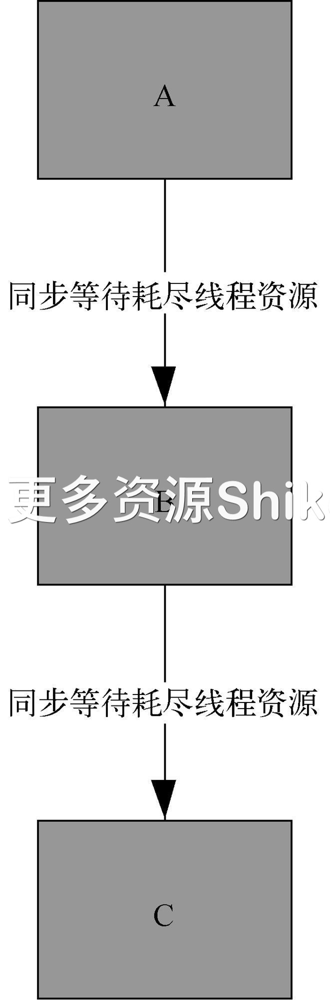

**图 8-28　同步等待耗尽线程资源**

2. **应用隔离（线程池隔离和信号量隔离）**

   针对上面提到的问题，是有多种解决方案的，例如前面讲过的缓存、限流。但是如果这些办法都想过，也都采用了，依然存在不可用的服务，该如何处理？我们的想法是假如有部分服务不可用了，绝不能让这些服务影响其他服务的正常运行，特别是那些核心服务。因此需要对不可用的服务和其他服务进行隔离，也就是应用隔离。这里推荐使用“舱壁隔离”模式，我们以 Spring Cloud 搭建 Hystrix 为例，来看看这种模式是如何实现的。先使用舱壁隔离模式实现线程池的隔离，它会为每个服务提供者分别创建一个独立的线程池，之后就算某个服务提供者出现延迟过高的情况，也只是影响自己的服务调用，而不会拖累其他服务。如图 8-29 所示，Hystrix 在商品详情服务和评论服务之间加入了线程池，这个线程池可以设置大小。当商品详情服务发起请求时，这些请求会通过线程池中的线程访问评论服务，每完成一次访问就释放一个线程。当评论服务无法立即响应时，请求会在线程池中等待处理。一旦线程池填满，后面的请求将被立即拒绝，不会继续等待，服务调用者会在第一时间获得反馈。这种设计不会让服务调用者进入无休止的等待，直到耗尽自身资源。

   

   **图 8-29　线程池隔离**

   线程池隔离支持同步和异步操作，由于请求线程和处理线程不是同一个，因此会出现线程上下文切换情况。Hystrix 中还有一种隔离方式是信号量隔离，其提供一个计数器来限制并发的线程数，这里的请求线程和处理线程是同一个，所以不存在线程的上下文切换。如图 8-30 所示，当多个商品详情服务并发调用评论服务时，每个请求都需要获得一个信号量后才能调用，这里由一个计数器来维护信号量的个数（默认是 10 个，可通过 `maxConcurrentRequests` 配置）。如果并发请求数大于信号量个数，那么多余的请求进入队列排队。如果多余的请求数量超出队列上限，则直接拒绝超过数量的那些请求。

   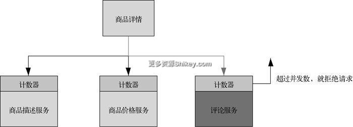

   **图 8-30　信号量隔离**

   有了线程池隔离和信号量隔离，就可以把不可用的服务和可用的服务分离开，这个思路正好和秒杀系统中的应用隔离不谋而合。

3. **熔断模式**

   得益于隔离，针对服务不可用，我们可以说是进可攻、退可守，如果服务不可用，便启动隔离机制，让它不要影响其他服务；如果服务可用，再重新开放，让其他服务访问。说白了就是如果你正常，就让你工作；如果你不正常，就让你与世隔绝。这个就是熔断模式要做的事情，它是在隔离的基础上执行具体的操作，或者可以理解为，以应用隔离为基础设置熔断开关。这个熔断开关好像服务之间调用的开关。如图 8-31 所示，熔断模式其实是在原来的应用隔离上加了一层开关，Hystrix 负责监控服务的健康状态，然后决定开关是打开、关闭还是半打开。当这个开关打开的时候，说明服务已经隔绝访问了，也就是已经被熔断了。

   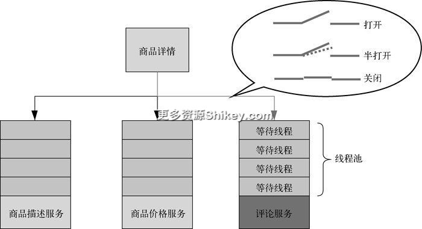

   **图 8-31　熔断模式**

   如图 8-32 所示，一起来看看熔断模式的状态变迁都经历哪几个步骤。

   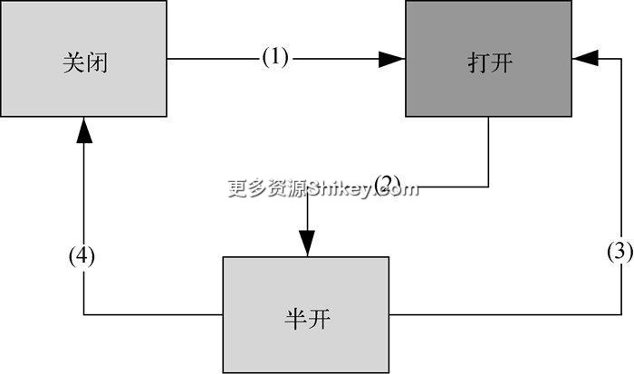

   **图 8-32　熔断模式的状态变迁**

   (1) 关闭 → 打开。在熔断模式下，熔断器开关默认是关闭的，并且会判断以下两个参数的值。


   - `requestVolumeThreshold`：熔断的最少请求数，默认值是 `10`。只有当一个统计窗口内处理的请求数量达到这个阈值时，才会判断是否进行熔断。也就是当一段统计时间内的请求数量达到 10 的时候，才会进行熔断与否的判断。
   - `errorThresholdPercentage`：熔断的阈值，默认值是 `50`。表示当一个统计窗口内有 50%的请求处理失败时，就会触发熔断。

当上面两个参数同时达到阈值时，触发熔断，将关闭的熔断器开关打开。

(2) 打开 → 半开。熔断器打开之后，可以通过 `sleepWindowInMiliseconds` 设置一个休眠期，默认值是 5 秒。在这 5 秒内，熔断器处于开启状态，也就是说这 5 秒内的服务请求都会被拒绝。5 秒到了，熔断器暂时进入半开状态，这个状态的意思是熔断器发送一个命令给服务提供者，尝试和它连接，看看是否可用了，此时依旧会检查第 1 步提到的两个参数。

(3) 半开 → 打开。如果在半开状态下，熔断器发送命令给服务提供者以后，仍然收到超时或者访问异常的响应信息，就会返回打开状态，等待 5 秒后再进入半开状态。

(4) 半开 → 关闭。在半开状态下，熔断器发送命令给服务提供者以后，发现服务访问正常，同时那两个阈值也没有都达到。就说明服务提供者能够正常工作，于是关闭（闭合）熔断器，允许流量正常流入。

4. **熔断工作流**

   这里我们来看看在 Hystrix 中，熔断模式是如何处理请求的。Hystrix 官网上有一张看起来比较复杂的流程图，我对其进行了优化，化简以后的流程图如图 8-33 所示。

   

   **图 8-33　熔断工作流**

   下面顺着步骤给大家讲解这个流程图。

   (1) 构建命令。构建一个 `HystrixCommand` 或 `HystrixObservableCommand` 对象（表示向服务提供者发送的请求），同时传递所有需要的参数。从命名方式就能知道，这里采用命令模式实现对服务调用操作的封装。命令模式把来自客户端的请求封装成一个对象，从而使不同请求参数化，实现了行为请求者与行为实现者的解耦。

   (2) 执行命令。Hystrix 中存在 4 种执行命令的方式，会在执行时根据 `Command` 对象以及具体情况从中选择。 `HystrixCommand` 对象实现了下面两种执行方式。


   - `execute()`：同步执行，调用程序所依赖的服务并返回结果对象，若发生错误，就抛出异常。
   - `queue()`：异步执行，返回一个 `Future` 对象，其中包含服务执行结束时要返回的结果对象。

`HystrixObservableCommand` 对象实现了另外两种执行方式。

   - `observe()`：返回 `Observable` 对象，代表操作的多个结果，这里返回的 `Observable` 对象是一个 `Hot Observable`，意思是无论是否有订阅者，都会发布事件。
   - `toObservable()`：同样会返回 `Observable` 对象，也代表操作的多个结果，不过这里的 `Observable` 对象是一个 `Cold Observable`。表示在没有订阅者时，不会发布事件，而是等待，直到发现订阅者。

(3) 缓存是否有效。在高并发情况下，服务提供者会被频繁调用，为了提高响应速度，Hystrix 通过命令的方式提供了缓存模式。 `HystrixCommand` 对象或 `HystrixObservableCommand` 对象可以重载 `getCacheKey()` 方法来开启请求缓存模式。开启以后，如果 Hystrix 命令命中缓存，就直接返回缓存中的数据，而不再去请求服务器。这里需要注意的是，读操作可以直接从缓存中获取数据，写操作则需要在更新服务器中数据以后同时更新缓存中的内容。

(4) 熔断器是否打开。由于熔断模式中的熔断器会根据服务提供者的具体情况，而打开、关闭或者半开。因此在客户端请求访问服务提供者的时候，需要判断其状态。如果是打开，则说明服务有异常，无法提供服务，此时进入降级处理阶段，直接拒绝请求或者返回兜底数据。如果是没有打开，说明服务运行正常，访问可以继续进行。

(5) 线程池/信号量是否已满。8.2.3.2 节曾提到，可以分别从线程池和信号量的角度对高并发请求进行限制，并且熔断器是放在应用隔离之前的。因此判断完熔断器是否打开后，就迎来了应用隔离，此时如果线程池和信号量都被占满了，则表示服务不可用，需要进行降级处理。

(6) 执行命令。如果前面 5 步都没有出现问题，说明服务是可用的，因此这里执行命令，可以返回服务提供者的信息。

(7) 命令执行是否出错/超时。命令执行如果出错，需要通过降级处理给服务调用者返回出错消息，并让其终止调用。如果命令执行没有问题，就向服务调用者返回正确信息。

(8) fallback 降级处理。针对第 (4)、(5)、(7) 步中出现的服务异常或者命令执行异常情况，这里统一使用 Hystrix 中的 fallback 进行降级处理，降级处理的方式有很多种。例如返回错误信息、返回服务不可用，或者使用兜底数据代替服务提供者返回的信息。

(9) 记录监控指标。这一步 Hystrix 会计算熔断器的健康度。第 (5)、(6)、(7) 步中出现的调用成功、失败、拒绝、超时等信息都会记录到这里。记录的信息就是监控指标，监控指标是决定打开或者关闭熔断器的依据。如果健康度不达标，就会对服务提供者进行熔断（打开熔断器）。恢复期（半开）过去后，如果服务提供者恢复了正常的健康度，就关闭开关，允许调用服务提供者，否则再次熔断（打开）。

5. **Hystrix —— 服务熔断的最佳实现**

   这里看看熔断流程中提到的 Hystrix 命令是如何执行请求操作的。相关代码如下：


   ```
   public class CommandHystrixDemo extends HystrixCommand<String> {    ①
       private final String name;
       protected CommandHystrixDemo(String name) {
           super(HystrixCommandGroupKey.Factory.asKey("GroupName"));      ②
           this.name = name;
       }
       @Override
       protected String run() throws Exception {
           //处理的业务逻辑    ③
           int a= 1/0;
           return "Hello" + name ;
       }

       @Override
       protected String getFallback() {         ④
           return "降级处理";
       }
       public static void main(String[] args) throws Exception{       ⑤
           CommandHystrixDemo commandHystrixDemo = new CommandHystrixDemo(
               "hystrix-demo");
           String s = commandHystrixDemo.execute();
           System.out.println(s);
           System.out.println("主函数" + Thread.currentThread().getName());
       }
   }
   ```


   下面顺着序号给大家讲解上述代码。

   ① 首先通过继承 `HystrixCommand` 类实现自己的 `Command` 类 —— `CommandHystrixDemo`。

   ② 通过 `HystrixCommandGroupKey.Factory` 中的 `asKey` 方法定义命令的组名。

   ③ 在重写的 `run` 方法中编写需要处理的业务逻辑。为了演示服务不可用的情况，这里使用 `int a=1/0;` 产生一个异常。 `run` 方法中如果产生异常，是会进入 `getFallBack` 方法中进行降级处理的。

   ④ `getFallBack` 方法直接返回降级处理这四个字。也可以直接返回错误码，把服务提供者不可用的消息告诉服务调用方。

   ⑤ 在 `main` 函数中，通过 `new CommandHystrixDemo` 传入命令组名，然后直接调用 `execute` 方法执行调用服务提供者的请求。这里使用的是同步调用的方法，当然也可以使用异步调用。

   8.2 节主要围绕着请求限流、服务降级和服务熔断三方面展开。请求限流是以流入系统的请求为出发点，通过限制流量保证系统的可用性。其中介绍了限流算法、接入层限流、单点限流和集群限流。服务降级是站在整个系统的角度，根据业务的重要性将服务分为核心服务和非核心服务，立足于保证核心服务的可用性，放弃部分非核心服务的功能。服务熔断关注的点要更细一些，主要关注那些被依赖的服务，当这些服务出现问题时，通过熔断的方式保证其他服务不受影响、正常工作。总体脉络是从流入系统的请求开始，到整个系统的可用性，再到单个服务可用性，是按照从外到内、从大到小的顺序进行描述的。


## 8.3　总结

本章的主旨是分布式系统的高性能和可用性，这两方面的内容实际在前面的章节中都有介绍，这里单独提炼为一章是为前面的内容做补充。本章的两大节内容已分别在节尾做了总结，这里不再赘述。